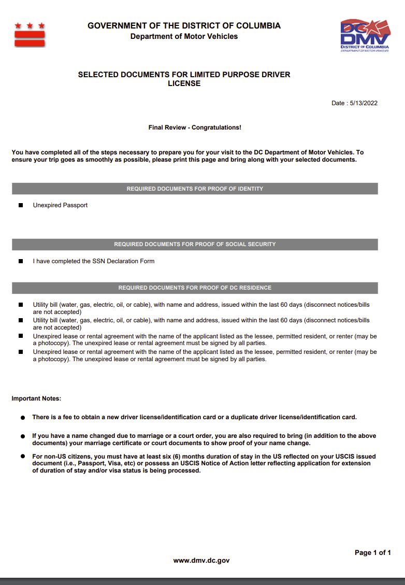

The **Limited Purpose driver license** also requires a one-time validation of source documents when applying for your DC Limited Purpose driver license. The driver knowledge and road tests will be required for all applicants applying for the Limited Purpose driver license. First time DC applicants must be a resident of the District of Columbia for at least 6 months. Applicants must have never been issued a social security number; or previously issued a social security number but no longer eligible; or not eligible for a social security number. The Limited Purpose driver license may not be used for federal purposes. You must schedule an appointment to obtain a Limited Purpose driver license. Prior to your DMV appointment, be sure to study and review the Driver Manual.

• [Proof of Identity](https://dmv.dc.gov/node/1115407)
• [Proof of DC Residency](https://dmv.dc.gov/node/1115502)
• [Proof of 6-Month DC Residency](https://dmv.dc.gov/node/1115362)
• [SSN Declaration Form](http://dmv.dc.gov/page/social-security-number-declaration-limited-purpose-credential)
• No outstanding debts to DC or other jurisdictions
• [Proof of Parental Approval (if 16 or 17 years old)](https://dmv.dc.gov/publication/parental-consent-form-obtain-learner-permit-or-identification-card)

https://dmv.dc.gov/sites/default/files/dc/sites/dmv/publication/attachments/DL_Application_BOEEUpdates_11-15-21.pdf

