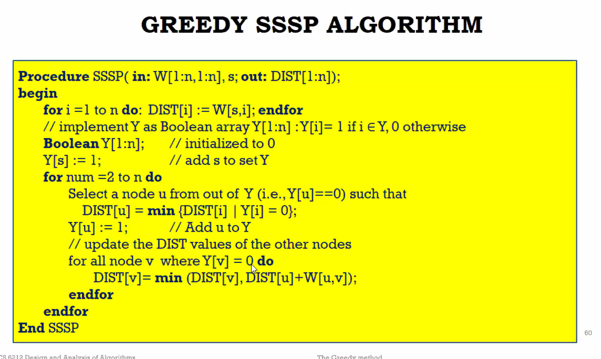

# greedy method

Knapsack problem

Prove greedy is not the optimal

since greedy should provide the most optimal for each step

just proof by counter-example to the method that greedy is not picking the best optimal item.

MST(minimum spanning tree)

Use dfs for circle check?

known edge:

tree mapping.(union find)

if edge's two nodes are in different trees, no circle problem

if same tree, no add.

