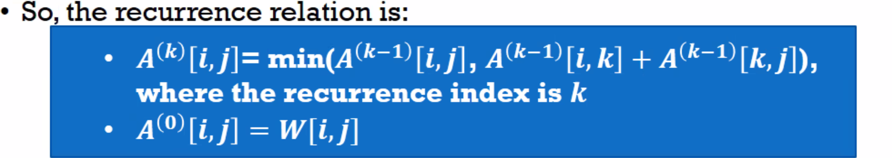
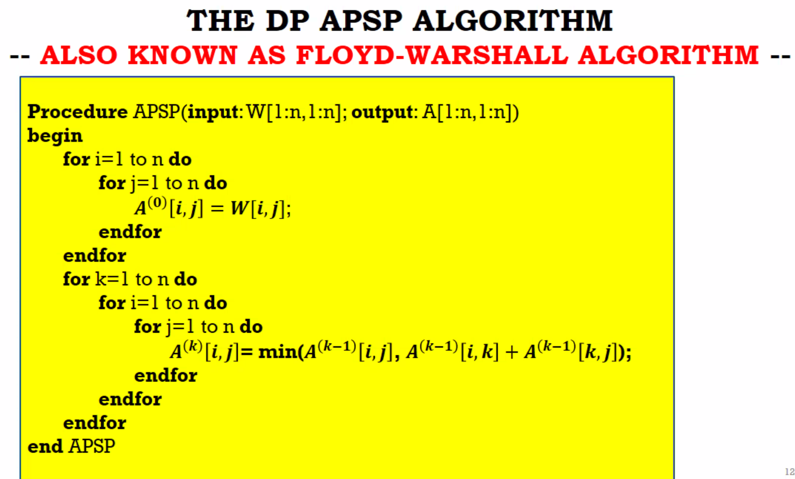
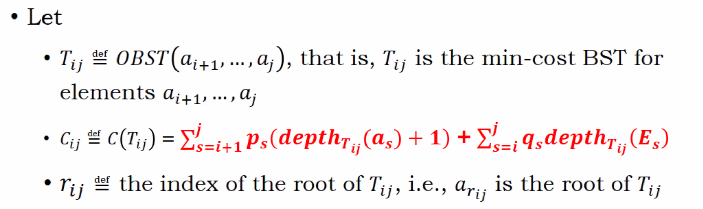
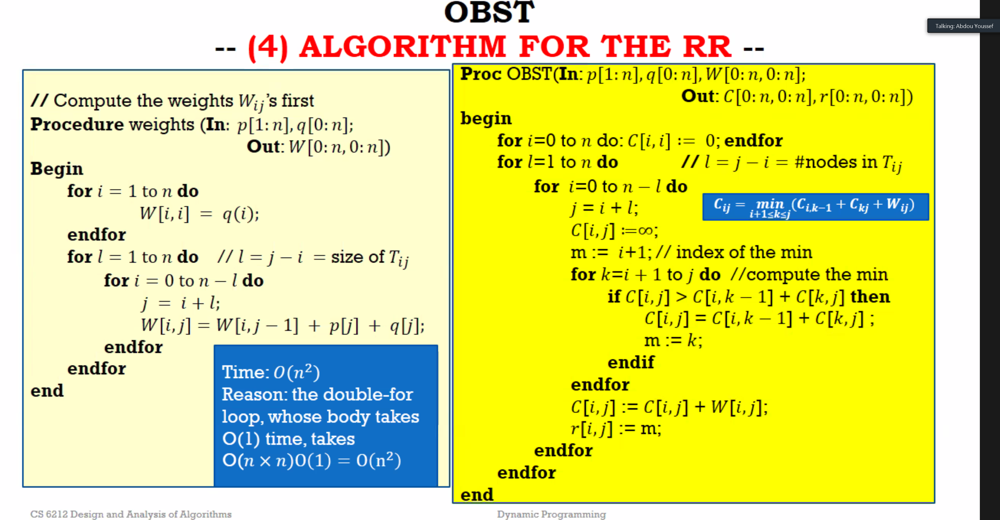

# DP

- all-pair shortest path problem(APSP)
  - k-special path
    - all via(intermidiate)nodes are leq k
    - 
    - 
    - Floyd-warshall

- Optimal binary search tree(OBST)

  - 
  - Try every node to seperate for two sub-trees, find the minimum point of all(r~ij~)
  - 
  - 

  