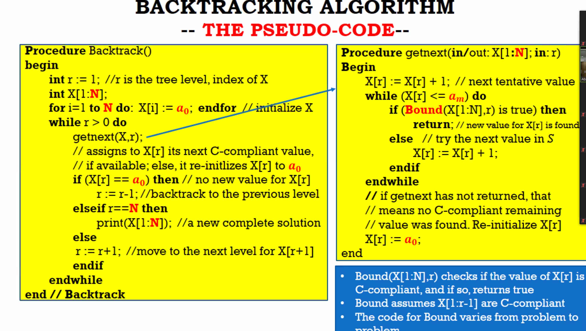
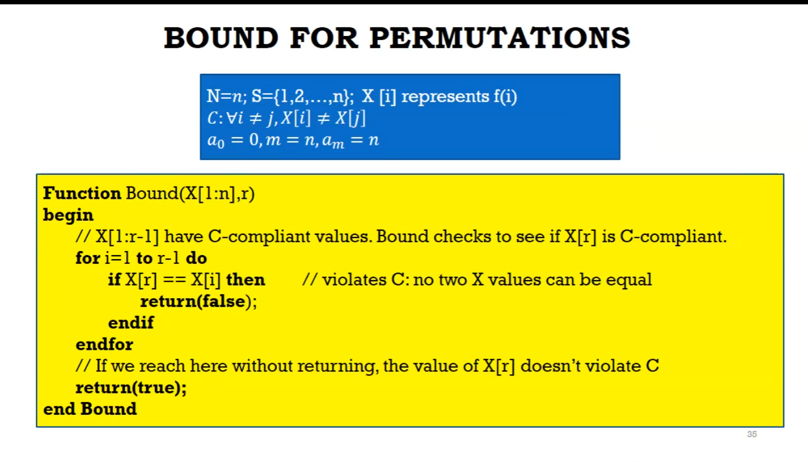

## Back tracking for final

- 
- just process N,a0(domain)S,Bound function

- each combinatorial family
  - X[1:N]
  - S -> the finite domain of each element
  - C -> Constraints of the famliy

- for binary string, S={0,1}
  - c= none
  - each value is individual from each other
- sub set of a given set:
  - s={0,1}
  - E={1,2,3,4},for {2,4} = X[0,1,0,1}
- permutation
  - S={1...n}
  - C: for i!=j, x[i]!=x[j]
- k-clique:
  - k nodes that all adjacent to each other in a graph
- k-coloring
  - 

