# Induction

## Proof Induction

prove basic(f(0)=x)

prove induction step, assume f(n) is true, prove f(n+1) based on that

proved

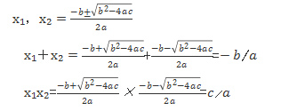

## LRR（liner recurrence relation） of order 1(the x~n~ depends on x~n-1~)

 

𝑥~n~ = 𝐴a^n^ + sp.x~n~ 

x~n~=ax~n-1~+b

solve b,A using x~n~,x~n-1~

x~n~=2x~n-1~+2^n^, x~0~=0

a=2，b=2^n^

sp.x~n~=c2^n^+d

 𝐴2^n^+c2^n^+d=2(𝐴2^n-1^+c2^n-1^+d)+2^n^= 𝐴2^n^+c2^n^+2d+2^n^

d=-2^n^

d is not constant. not working

use sp.x~n~ = (cn+d)2^n^+e

 𝐴2^n^+ (cn+d)2^n^+e =2(𝐴2^n-1^+ (cn-c+d)2^n-1^+e)+2^n^

A+cn+d=A+cn-c+d+1

e=2e,e=0

c=1

## LRR of order2(x~n~ depends on x~n-1~,x~n-2~)

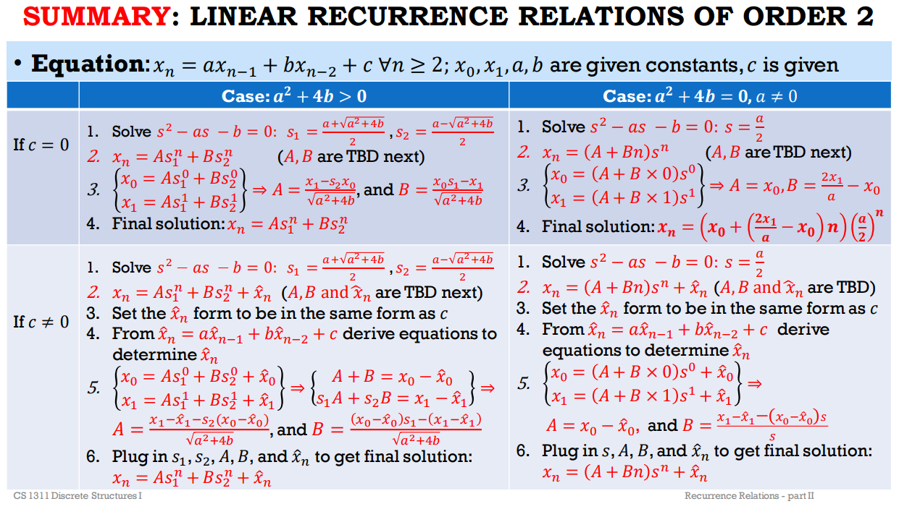

# Introduction

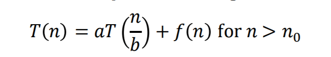

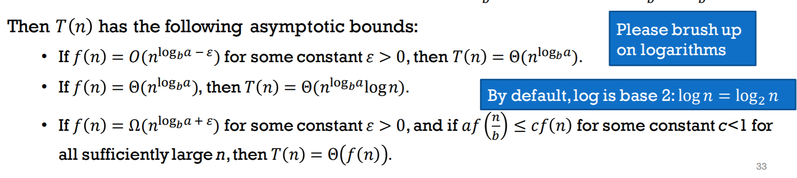

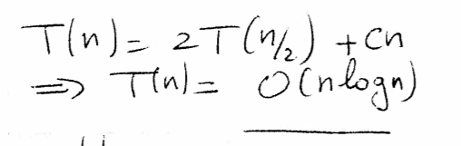

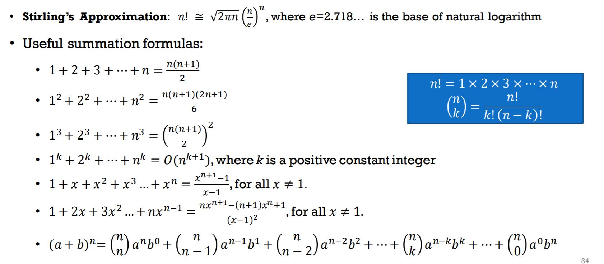

# Data structure

stack pop push top, queue dequeue,enqueue

Tree height: level-1, (root-> level0)

- perfect binary tree: non-leaf have two child and same level
- Almost complete binary tree: last level has lack leafs from right

## Binary search tree

- insert
  - search for a, if not exist, create the node containing a
  - see search and insert example 
    - constant time in searching
- delete
  - delete pointer, attach the child to parent.
  - pick largest value(rightmost) in left brach,use that node as the deleted
    - make left child to the previous parent
- use hash for maps?

# MinHeap

- child must be larger than parent.
  - swap child  and parent if not
  - become valid, or child become the root
- delete: swap with the last leaf and delete
  - then swap with the smaller leaf
- logN leve

## Union find Data structure

- every child has a parent.
- construct an arrry of index(element number) and it's own parent. use number to find which set it is in.
- single tree is the worst case in union find with only one array.
- path compression, as a find, make every node in the path to point directly to the parent.O(n)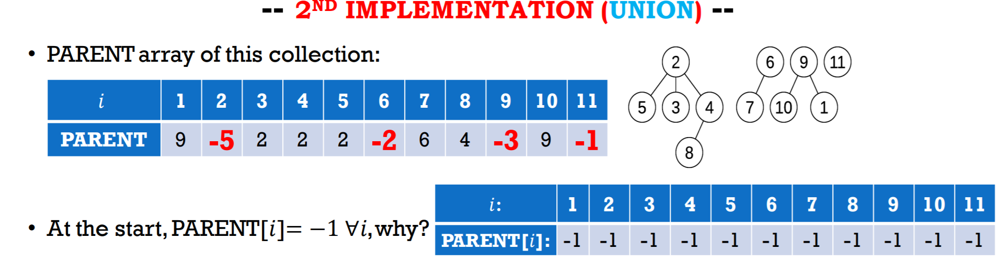

## DC

- mergesort
  - breakdown to single pieces and merge sorted list
- 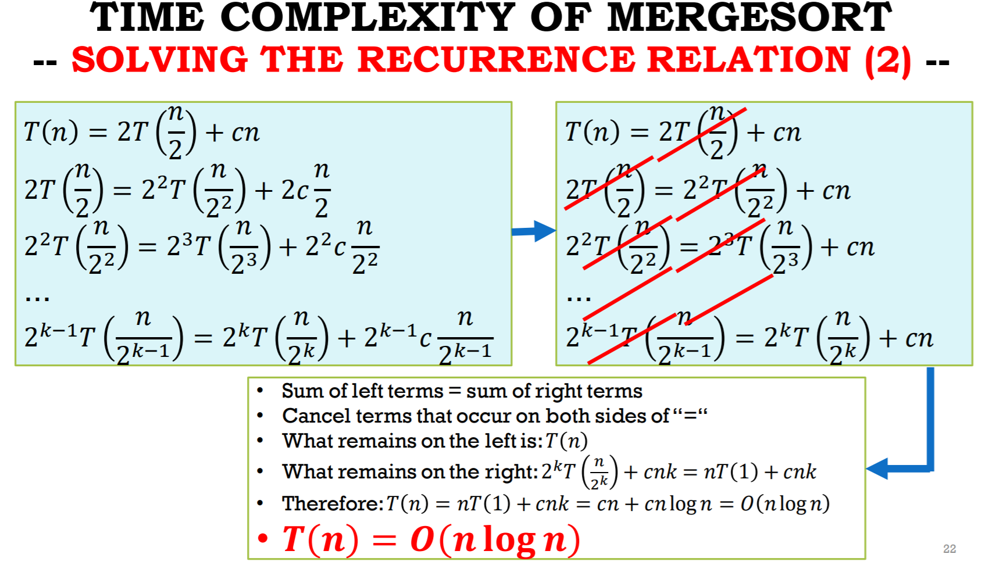

- Quicksort
  - p==q return
  - r= partition A[p:q]
  - quicksort A[p:r-1]
  - quicksort A[r+1:q]
- select(sort)
- 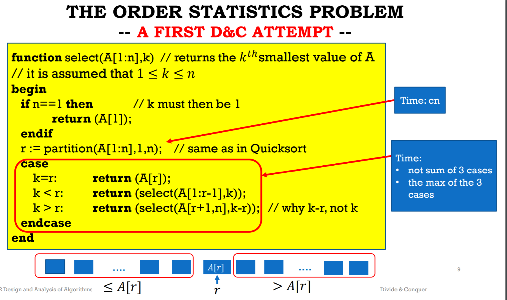

- Theorem: The time complexity 𝑇𝑇 𝑛𝑛 of QuickSelect(A[1:n],k) satisfies: 𝑇𝑇 𝑛𝑛 ≤ 20𝑐n

- 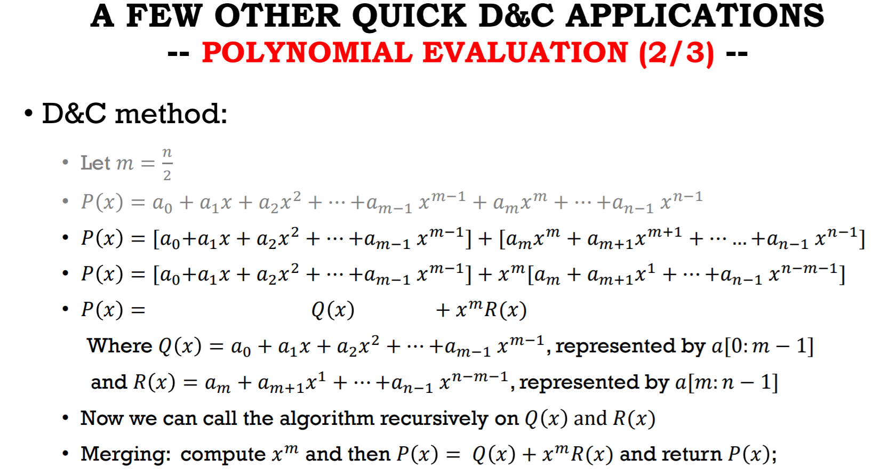

  # greedy

  MST(minimum spanning tree)

  Use unionfind for circle check?

  known edge:

  tree mapping.(union find)

  if edge's two nodes are in different trees, no circle problem

  if same tree, no add.

  - single source shortest path

  

- Heap sort
  - deletemin, and form a new array
- Proof of optimality
  - assume counter example exist
  - • The contradiction means that the assumption that DIST[u] ≠ distance(s,u) must be false • Hence, DIST[u] = distance(s,u). 
- 

# Examples

Induction

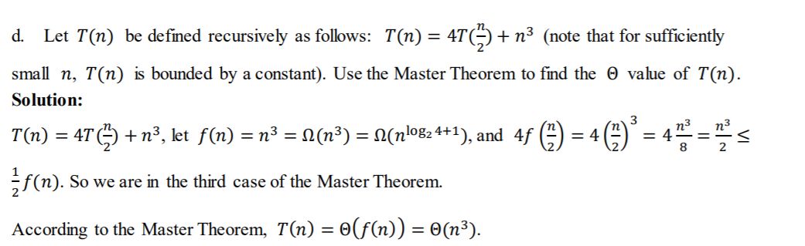

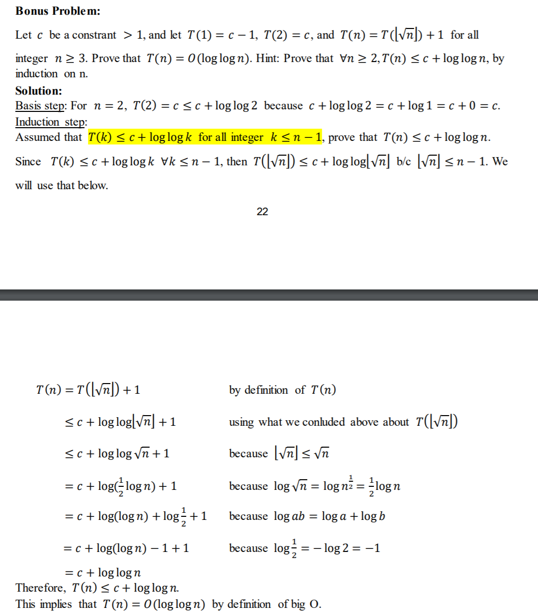

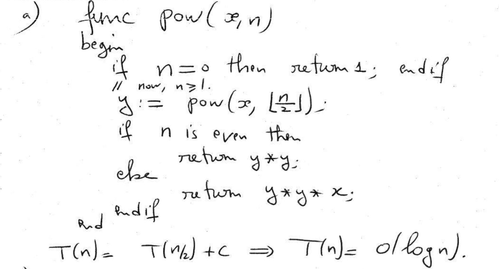

