# **Problem 1**

## a:

**Basic step**: 

n=1

left: $f(1)=1^2=1$

right : $f(1)=\frac{1(1+1)(2+1)}{6}=1$

left = right

**Induction step**:

The equation can be changed to:
$$
f(n)=f(n-1)+n^2 \forall n\gt1\label{ref1}
$$
Assume that:
$$
f(n-1)=\frac{(n-1)n(2n-1)}{6}
$$

As ref ( $\ref{ref1}$)
$$
\begin{align*}
f(n) &= \frac{(n-1)n(2n-1)}{6}+n^2\\
&=\frac{2n^3-2n^2-n^2+n+6n^2}{6}\\
&=\frac{2n^3+3n^2+n}{6}\\
&=\frac{n(n+1)(2n+1)}{6}
\end{align*}
$$
Therefore, $f(n)=\frac{n(n+1)(2n+1)}{6}$ 


## b:

$$
T(1)=c\\
T(n)=3T(\frac{n}{3})+c\forall n\geq3\\
n=3^k\forall k>0\\
prove \ T(n)=\frac{3c}{2}n-\frac{c}{2}
$$

**Basic step**

Assume
$$
T(n)=\frac{3c}{2}n-\frac{c}{2}
$$
We have
$$
\begin{cases}
n=3^k\\
T(n)=3T(\frac{n}{3})+c
\end{cases}
$$
So 
$$
T(3^k)=3T(3^{k-1})+c
$$
Basic step as k=0
$$
T(3^0)=\frac{3c}{2}3^0-\frac{c}{2}=c
$$
Basic step proved

**Induction step**
$$
\begin{align*}
T(n)=T(3^k)&=3T(3^{k-1})+c\\
&=3\frac{3c}{2}3^{k-1}-\frac{3c}{2}+c\\
&=\frac{3c}{2}3^k-\frac{c}{2}\\
&=\frac{3c}{2}n-\frac{c}{2}\\
\end{align*}
$$
Induction step proved

## c:

$$
\begin{cases}
T(1)=c\\
T(n)=T(\lfloor{\frac{n}{2}}\rfloor)+T(\lceil\frac{n}{2}\rceil)+c\ \forall n\geq2
\end{cases}
$$

prove
$$
T(n)\leq2cn-c
$$
**basic step**
$$
T(1)=c\leq2c-c=c
$$
**induction step**

Assume 
$$
T(m)\leq2cm-c\ \forall m\leq n-1
$$
From (8) We can see, for $\lfloor{\frac{n}{2}}\rfloor=\lceil\frac{n}{2}\rceil=\frac{n}{2}$
$$
T(n)=2T(\frac{n}{2})+c=2T(m)+c\leq 2(cn-c)+c=2cn-c
$$
for $\lfloor{\frac{n}{2}}\rfloor=\frac{n-1}{2},\lceil\frac{n}{2}\rceil=\frac{n+1}{2}$

set $m=\frac{n+1}{2}$
$$
\begin{align*}
T(n)&=T(\frac{n-1}{2})+T(\frac{n+1}{2})+c\\
&=T(m-1)+T(m)+c\\
&\leq 2c(\frac{n-1}{2}+\frac{n+1}{2})-2c+c\\
&=2cn-c\\
\end{align*}
$$

$$
T(n)\leq2cn-c
$$


From (12) and(13), we can conclude
$$
T(n)\leq2nc-c
$$
so the induction step is proved

## d:

$$
T(n)=4T(\frac{n}{2})+n^3
$$

Use the Master Theorem to find the Θ value of 𝑇(n)


By the master Theorem
$$
T(n)=aT(\frac{n}{b})+f(n)\ for\ n>n_0\\
f(n)=n^3\\
b=2
$$
So as we see from the asymptotic bounds in master theorem
$$
If \ f(n)= Θ(n^{log_ba}), then\ T(n)=Θ(n^{\log_ba}\log n)
$$
So
$$
f(n^3)=Θ(n^{log_28})\\
a=3\\
T(n)=Θ(n^{\log_28}\log n)=Θ(n^3\log n)
$$

# Problem 2

## a:

- height 0

~~~mermaid
flowchart TD
    A((1))
~~~

- height 1

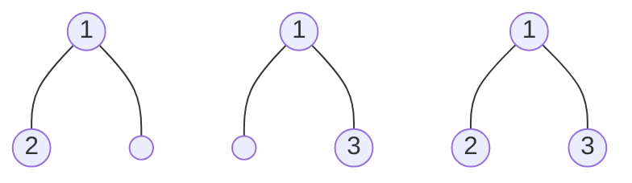

- height2

  ```mermaid
  flowchart TD
  	H((1))---I((2))
      H((1))---J((3))
      I((2))---K((4))
      I((2))---L((5))
      J((3))---M((6))
      J((3))---N((7))
      a((1))---b((2))
      a((1))---c((3))
      b((2))---d((4))
      b((2))---e(( ))
      a2((1))---b2((2))
      a2((1))---c2((3))
      b2((2))---d2(( ))
      b2((2))---e2((5))
      a4((1))---b4((2))
      a4((1))---c4((3))
      b4((2))---d4((4))
      b4((2))---e4((5))
      a3((1))---b3((2))
      a3((1))---c3((3))
      c3((3))---d3((6))
      c3((3))---e3(( ))
      a5((1))---b5((2))
      a5((1))---c5((3))
      c5((3))---d5((6))
      c5((3))---e5((7))
      

## b:

- height 0

  ```mermaid
  flowchart TD
      A((1))
  ```

- height 1

  ``` mermaid
  flowchart TD
      D((1))---F(( ))
      D((1))---G((3))
  ```

- height2

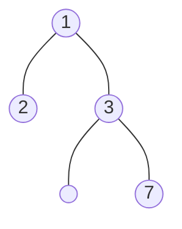

- height3

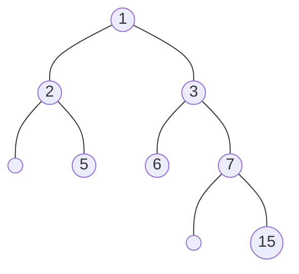

## c:

as we can see from b

the left subtree of the root of height2 is the height0, the right subtree of root of height2 is the height1

and the left subtree of the root of height3 is the height1, the right subtree of root of height3 is the height2

And we need to add the root (1node) to the sum

so we can get the equition
$$
\begin{cases}
N(h)=N(h-1)+N(h-2)+1\ \forall\ h\geq2\\
N(0)=1\\
N(1)=2
\end{cases}
$$

## d:

for this case, the defination of
$$
N(h)=N(h-1)+N(h-2)+1\ \forall\ h\geq2\\
$$
matches the LRR of order2
$$
x_n=ax_{n-1}+bx_{n-2}+c\ \forall\ n\geq2
$$
And $c=1, a = b = 1$ so $a^2+4b>0$

So we can assume that $x_n=As_1^n+Bs_2^n+\hat{x}_n$

So firstly we need to solve $s^2-as-b=0$

and $s1=\frac{1+\sqrt{5}}{2}$,$s2=\frac{1-\sqrt{5}}{2}$

This is the same value as we've got in the hint of the problem

as $c=1$

we set $\hat{x}_n=d$

From $\hat{x}_n=a\hat{x}_{n-1}+b\hat{x}_{n-2}+c$

we get $d=d+d+1$

so $\hat{x}_n=d=-1$

now we can use the value of $x_0$ and $x_1$ to determin the value of A and B

$A=\frac{2+1-\frac{1-\sqrt{5}}{2}(1+1)}{\sqrt{5}}=1+\frac{2}{\sqrt{5}}$

$B=\frac{(1+1)\frac{1+\sqrt{5}}{2}-(2+1)}{\sqrt{5}}=1-\frac{2}{\sqrt{5}}$

So the final version of the equition looks like

$N(h)=(1+\frac{2}{\sqrt{5}})(\frac{1+\sqrt{5}}{2})^h+(1-\frac{2}{\sqrt{5}})(\frac{1-\sqrt{5}}{2})^h-1\ \forall\ h\geq0$

# Problem 3

## a:

```c++
struct SampleNode{
	double data; 
	SampleNode *left; 
	SampleNode *right;
};

struct Record{
    double sum = 0;
    int count = 0;
}

Record travel(*SampleNode){
    Record tmpLeft,tmpRight;
    ## travel the tree
    if *SampleNode.left != null{
        tmpLeft = travel(*SampleNode.left);
    }
    if *SampleNode.right != null{
        tmpRight = travel(*SampleNode.right);
    }
    ## adding up the sum and count
    tmpLeft.sum=tmpLeft.sum+tmpRight.sum+*SampleNode.data;
    tmpLeft.count=tmpLeft.count+tmpRight.count+1;
    return tmpLeft;
}

int main(){
    SampleNode *T;
    ## populating T and it's leaf
    Record FinalOutput;
    FinalOutput = travel(T);
    printf("total nodes = %d\n average of data = %f\n", FinalOutput.count,FinalOutput.sum/FinalOutput.count);
    return 0;
}

```

The time complexity of this algorithm is O(N), N is the number of nodes.

## b:

```c++
struct SampleNode{
	SampleNode *left; 
	SampleNode *right;
};

bool isNodeFull(*SampleNode){
    ## travel the tree
    if *SampleNode.left!= null && *SampleNode.right!=null{
        ## it is a full node with child, combine the child's result and return
        return travel(*SampleNode.left)&&travel(*SampleNode.right)
    }else if *SampleNode.left==null && *SampleNode.right==null{
        ## it is a leaf node, should be full at this point
        return true;
    }
    ## this(not matching the pervious condition) means the node is not full
    return false;
}

int main(){
    SampleNode *T;
    ## populating T and it's leaf
    ## output is for true,output is not for false return
    printf("this %s a full binary tree\n",travel(T)?"is":"is not");
    return 0;
}
```

The worst time complexity of this algorithm is O(N), N is the number of nodes.


# Problem 4

## a:


intert 25, 11, 54, 35, 46, 5, 14, 65, 2, 59, 3 to min heap, first 9 show result, last 3 show step by step

- insert25


| 1    | 2    | 3    | 4    | 5    | 6    | 7    | 8    | 9    | 10   | 11   | 12   |
| ---- | ---- | ---- | ---- | ---- | ---- | ---- | ---- | ---- | ---- | ---- | ---- |
| 25   |      |      |      |      |      |      |      |      |      |      |      |

- insert 11


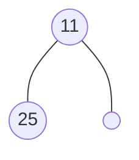


| 1    | 2    | 3    | 4    | 5    | 6    | 7    | 8    | 9    | 10   | 11   | 12   |
| ---- | ---- | ---- | ---- | ---- | ---- | ---- | ---- | ---- | ---- | ---- | ---- |
| 11   | 25   |      |      |      |      |      |      |      |      |      |      |

- insert 54


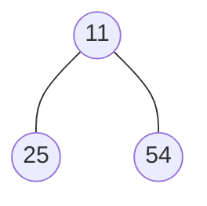


| 1    | 2    | 3    | 4    | 5    | 6    | 7    | 8    | 9    | 10   | 11   | 12   |
| ---- | ---- | ---- | ---- | ---- | ---- | ---- | ---- | ---- | ---- | ---- | ---- |
| 11   | 25   | 54   |      |      |      |      |      |      |      |      |      |

- insert 35


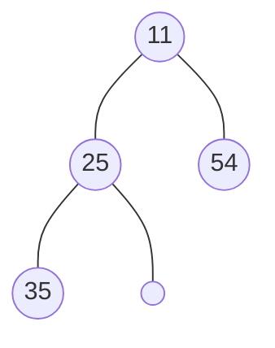


| 1    | 2    | 3    | 4    | 5    | 6    | 7    | 8    | 9    | 10   | 11   | 12   |
| ---- | ---- | ---- | ---- | ---- | ---- | ---- | ---- | ---- | ---- | ---- | ---- |
| 11   | 25   | 54   | 35   |      |      |      |      |      |      |      |      |

- insert 46


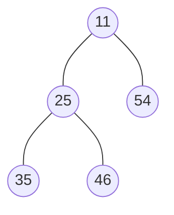


| 1    | 2    | 3    | 4    | 5    | 6    | 7    | 8    | 9    | 10   | 11   | 12   |
| ---- | ---- | ---- | ---- | ---- | ---- | ---- | ---- | ---- | ---- | ---- | ---- |
| 11   | 25   | 54   | 35   | 46   |      |      |      |      |      |      |      |

- insert 5


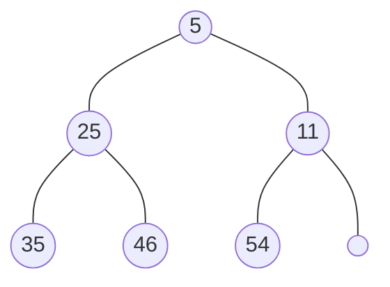


| 1    | 2    | 3    | 4    | 5    | 6    | 7    | 8    | 9    | 10   | 11   | 12   |
| ---- | ---- | ---- | ---- | ---- | ---- | ---- | ---- | ---- | ---- | ---- | ---- |
| 5    | 25   | 11   | 35   | 46   | 54   |      |      |      |      |      |      |

- insert 14


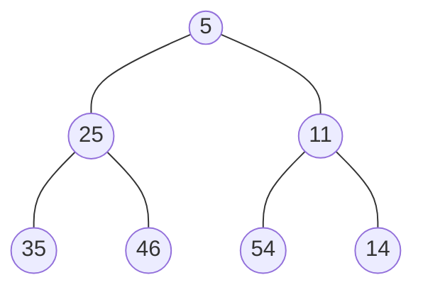


| 1    | 2    | 3    | 4    | 5    | 6    | 7    | 8    | 9    | 10   | 11   | 12   |
| ---- | ---- | ---- | ---- | ---- | ---- | ---- | ---- | ---- | ---- | ---- | ---- |
| 5    | 25   | 11   | 35   | 46   | 54   | 14   |      |      |      |      |      |

- insert 65


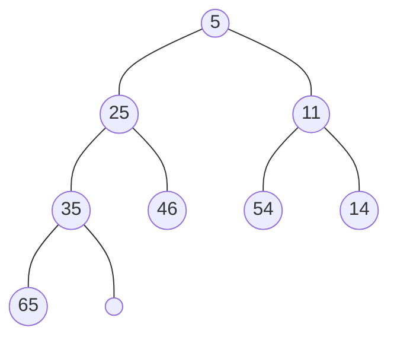


| 1    | 2    | 3    | 4    | 5    | 6    | 7    | 8    | 9    | 10   | 11   | 12   |
| ---- | ---- | ---- | ---- | ---- | ---- | ---- | ---- | ---- | ---- | ---- | ---- |
| 5    | 25   | 11   | 35   | 46   | 54   | 14   | 65   |      |      |      |      |

- insert 2
  - first step


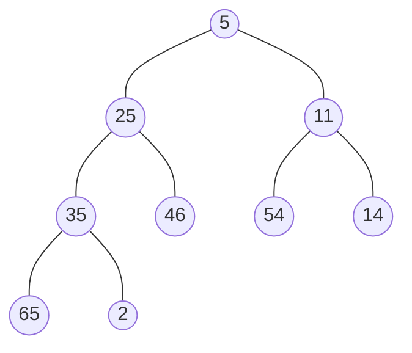


| 1    | 2    | 3    | 4    | 5    | 6    | 7    | 8    | 9    | 10   | 11   | 12   |
| ---- | ---- | ---- | ---- | ---- | ---- | ---- | ---- | ---- | ---- | ---- | ---- |
| 5    | 25   | 11   | 35   | 46   | 54   | 14   | 65   | 2    |      |      |      |

- - second step


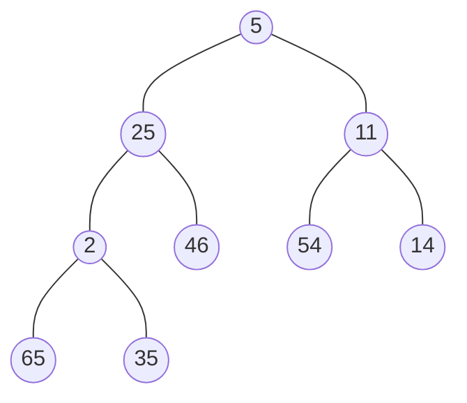


| 1    | 2    | 3    | 4    | 5    | 6    | 7    | 8    | 9    | 10   | 11   | 12   |
| ---- | ---- | ---- | ---- | ---- | ---- | ---- | ---- | ---- | ---- | ---- | ---- |
| 5    | 25   | 11   | 2    | 46   | 54   | 14   | 65   | 35   |      |      |      |

- - third step


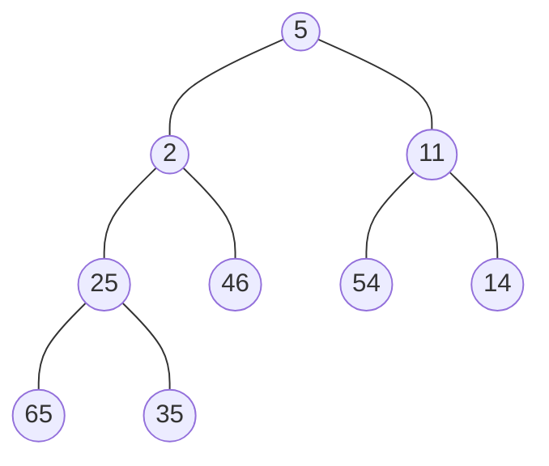


| 1    | 2    | 3    | 4    | 5    | 6    | 7    | 8    | 9    | 10   | 11   | 12   |
| ---- | ---- | ---- | ---- | ---- | ---- | ---- | ---- | ---- | ---- | ---- | ---- |
| 5    | 2    | 11   | 25   | 46   | 54   | 14   | 65   | 35   |      |      |      |

- - fouth step


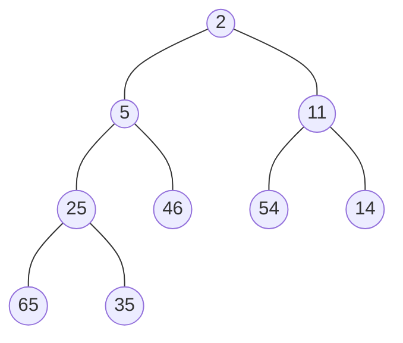


| 1    | 2    | 3    | 4    | 5    | 6    | 7    | 8    | 9    | 10   | 11   | 12   |
| ---- | ---- | ---- | ---- | ---- | ---- | ---- | ---- | ---- | ---- | ---- | ---- |
| 2    | 5    | 11   | 25   | 46   | 54   | 14   | 65   | 35   |      |      |      |

- insert 59

- - first step


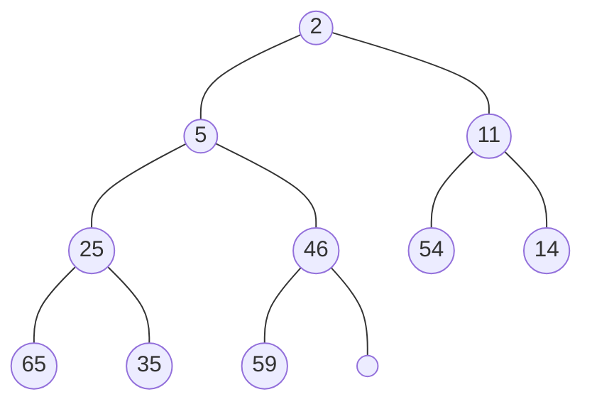


| 1    | 2    | 3    | 4    | 5    | 6    | 7    | 8    | 9    | 10   | 11   | 12   |
| ---- | ---- | ---- | ---- | ---- | ---- | ---- | ---- | ---- | ---- | ---- | ---- |
| 2    | 5    | 11   | 25   | 46   | 54   | 14   | 65   | 35   | 59   |      |      |

- insert 3

- - first step


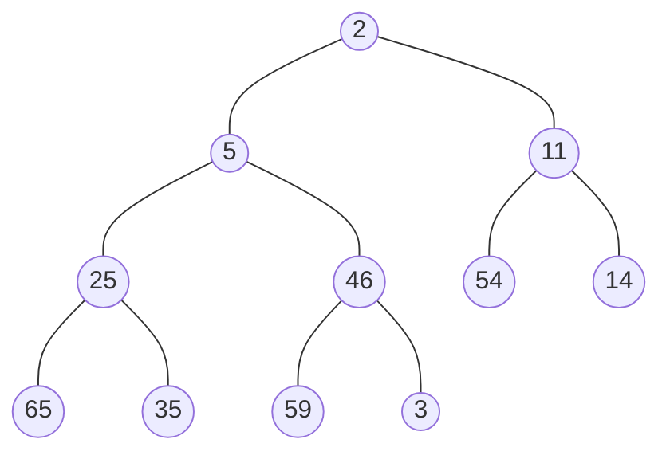


| 1    | 2    | 3    | 4    | 5    | 6    | 7    | 8    | 9    | 10   | 11   | 12   |
| ---- | ---- | ---- | ---- | ---- | ---- | ---- | ---- | ---- | ---- | ---- | ---- |
| 2    | 5    | 11   | 25   | 46   | 54   | 14   | 65   | 35   | 59   | 3    |      |

- - second step


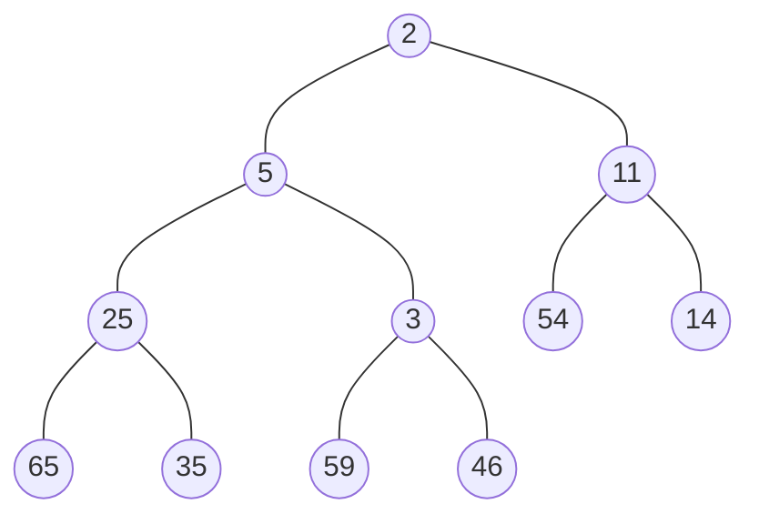


| 1    | 2    | 3    | 4    | 5    | 6    | 7    | 8    | 9    | 10   | 11   | 12   |
| ---- | ---- | ---- | ---- | ---- | ---- | ---- | ---- | ---- | ---- | ---- | ---- |
| 2    | 5    | 11   | 25   | 3    | 54   | 14   | 65   | 35   | 59   | 46   |      |

- - third step


| 1    | 2    | 3    | 4    | 5    | 6    | 7    | 8    | 9    | 10   | 11   | 12   |
| ---- | ---- | ---- | ---- | ---- | ---- | ---- | ---- | ---- | ---- | ---- | ---- |
| 2    | 3    | 11   | 25   | 5    | 54   | 14   | 65   | 35   | 59   | 46   |      |

Now the insert completes

## b:

- Deletemin

- - first step


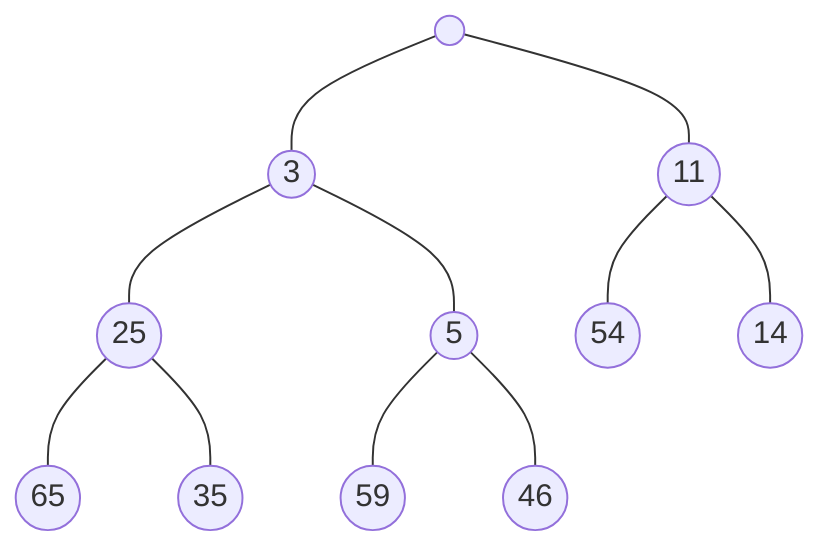


| 1    | 2    | 3    | 4    | 5    | 6    | 7    | 8    | 9    | 10   | 11   | 12   |
| ---- | ---- | ---- | ---- | ---- | ---- | ---- | ---- | ---- | ---- | ---- | ---- |
|      | 3    | 11   | 25   | 5    | 54   | 14   | 65   | 35   | 59   | 46   |      |

- - second step


```mermaid
flowchart TD
	a2((46))---a3((3))
	a2((46))---a4((11))
	a3((3))---b((35))
	a3((3))---b2((5))
	a4((11))---a5((54))
	a4((11))---a6((14))
	b((25))---b6((65))
	b((25))---b7((35))
	b2((5))---d((59))
	b2((5))---d2(( ))
```


| 1    | 2    | 3    | 4    | 5    | 6    | 7    | 8    | 9    | 10   | 11   | 12   |
| ---- | ---- | ---- | ---- | ---- | ---- | ---- | ---- | ---- | ---- | ---- | ---- |
| 46   | 3    | 11   | 25   | 5    | 54   | 14   | 65   | 35   | 59   |      |      |

- - third step


```mermaid
flowchart TD
	a2((3))---a3((46))
	a2((3))---a4((11))
	a3((46))---b((35))
	a3((46))---b2((5))
	a4((11))---a5((54))
	a4((11))---a6((14))
	b((25))---b6((65))
	b((25))---b7((35))
	b2((5))---d((59))
	b2((5))---d2(( ))
```


| 1    | 2    | 3    | 4    | 5    | 6    | 7    | 8    | 9    | 10   | 11   | 12   |
| ---- | ---- | ---- | ---- | ---- | ---- | ---- | ---- | ---- | ---- | ---- | ---- |
| 3    | 46   | 11   | 25   | 5    | 54   | 14   | 65   | 35   | 59   |      |      |

- - fourth step


```mermaid
flowchart TD
	a2((3))---a3((5))
	a2((3))---a4((11))
	a3((5))---b((35))
	a3((5))---b2((46))
	a4((11))---a5((54))
	a4((11))---a6((14))
	b((25))---b6((65))
	b((25))---b7((35))
	b2((46))---d((59))
	b2((46))---d2(( ))
```


| 1    | 2    | 3    | 4    | 5    | 6    | 7    | 8    | 9    | 10   | 11   | 12   |
| ---- | ---- | ---- | ---- | ---- | ---- | ---- | ---- | ---- | ---- | ---- | ---- |
| 3    | 5    | 11   | 25   | 46   | 54   | 14   | 65   | 35   | 59   |      |      |

Now the delete progress is finished

## c:

Insert 25, 11, 54, 35, 46, 5, 14, 65, 2, 59, 3, 12, 13, 7, 10, 18, 17, 15 into binary search tree

- insert 25


```mermaid
flowchart TD
	a2((25))

```

- insert 11

```mermaid
flowchart TD
	a2((25))---b2((11))
	a2((25))---b3(( ))
```

- insert 54

```mermaid
flowchart TD
	a2((25))---b2((11))
	a2((25))---b3((54))
```

- insert 35

```mermaid
flowchart TD
	a2((25))---b2((11))
	a2((25))---b3((54))
	b3((54))---b4((35))
	b3((54))---b5(( ))
	
```

- insert 46

```mermaid
flowchart TD
	a2((25))---b2((11))
	a2((25))---b3((54))
	b3((54))---b4((35))
	b3((54))---b5(( ))
	b4((35))---b6(( ))
	b4((35))---b7((46))
	
```

- insert 5

```mermaid
flowchart TD
	a2((25))---b2((11))
	a2((25))---b3((54))
	b2((11))---d2((5))
	b2((11))---d3(( ))
	b3((54))---b4((35))
	b3((54))---b5(( ))
	b4((35))---b6(( ))
	b4((35))---b7((46))
	
```

- insert 14

```mermaid
flowchart TD
	a2((25))---b2((11))
	a2((25))---b3((54))
	b2((11))---d2((5))
	b2((11))---d3((14))
	b3((54))---b4((35))
	b3((54))---b5(( ))
	b4((35))---b6(( ))
	b4((35))---b7((46))
	
```

- insert 65

```mermaid
flowchart TD
	a2((25))---b2((11))
	a2((25))---b3((54))
	b2((11))---d2((5))
	b2((11))---d3((14))
	b3((54))---b4((35))
	b3((54))---b5((65))
	b4((35))---b6(( ))
	b4((35))---b7((46))
	
```

- insert 2

```mermaid
flowchart TD
	a2((25))---b2((11))
	a2((25))---b3((54))
	b2((11))---d2((5))
	b2((11))---d3((14))
	d2((5))---e1((2))
	d2((5))---e2(( ))
	b3((54))---b4((35))
	b3((54))---b5((65))
	b4((35))---b6(( ))
	b4((35))---b7((46))
	
```

- insert 59

```mermaid
flowchart TD
	a2((25))---b2((11))
	a2((25))---b3((54))
	b2((11))---d2((5))
	b2((11))---d3((14))
	d2((5))---e1((2))
	d2((5))---e2(( ))
	b3((54))---b4((35))
	b3((54))---b5((65))
	b5((65))---e3((59))
	b5((65))---e4(( ))
	b4((35))---b6(( ))
	b4((35))---b7((46))
	
```

- insert 3

```mermaid
flowchart TD
	a2((25))---b2((11))
	a2((25))---b3((54))
	b2((11))---d2((5))
	b2((11))---d3((14))
	d2((5))---e1((2))
	d2((5))---e2(( ))
	e1((2))---f1(( ))
	e1((2))---f2((3))
	b3((54))---b4((35))
	b3((54))---b5((65))
	b4((35))---b6(( ))
	b4((35))---b7((46))
	b5((65))---e3((59))
	b5((65))---e4(( ))

	

	
```

- insert 12

```mermaid
flowchart TD
	a2((25))---b2((11))
	a2((25))---b3((54))
	b2((11))---d2((5))
	b2((11))---d3((14))
	d2((5))---e1((2))
	d2((5))---e2(( ))
	d3((14))---f3((12))
	d3((14))---f4(( ))
	e1((2))---f1(( ))
	e1((2))---f2((3))
	b3((54))---b4((35))
	b3((54))---b5((65))
	b4((35))---b6(( ))
	b4((35))---b7((46))
	b5((65))---e3((59))
	b5((65))---e4(( ))
	
```

- insert 13

```mermaid
flowchart TD
	a2((25))---b2((11))
	a2((25))---b3((54))
	b2((11))---d2((5))
	b2((11))---d3((14))
	d2((5))---e1((2))
	d2((5))---e2(( ))
	d3((14))---f3((12))
	d3((14))---f4(( ))
	e1((2))---f1(( ))
	e1((2))---f2((3))
	f3((12))---f5(( ))
	f3((12))---f6((13))
	b3((54))---b4((35))
	b3((54))---b5((65))
	b4((35))---b6(( ))
	b4((35))---b7((46))
	b5((65))---e3((59))
	b5((65))---e4(( ))

	
```

- insert 7

```mermaid
flowchart TD
	a2((25))---b2((11))
	a2((25))---b3((54))
	b2((11))---d2((5))
	b2((11))---d3((14))
	d2((5))---e1((2))
	d2((5))---e2((7))
	d3((14))---f3((12))
	d3((14))---f4(( ))
	e1((2))---f1(( ))
	e1((2))---f2((3))
	f3((12))---f5(( ))
	f3((12))---f6((13))
	b3((54))---b4((35))
	b3((54))---b5((65))
	b4((35))---b6(( ))
	b4((35))---b7((46))
	b5((65))---e3((59))
	b5((65))---e4(( ))

	
```

- insert 10

```mermaid
flowchart TD
	a2((25))---b2((11))
	a2((25))---b3((54))
	b2((11))---d2((5))
	b2((11))---d3((14))
	d2((5))---e1((2))
	d2((5))---e2((7))
	d3((14))---f3((12))
	d3((14))---f4(( ))
	e1((2))---f1(( ))
	e1((2))---f2((3))
	e2((7))---g1(( ))
	e2((7))---g2((10))
	f3((12))---f5(( ))
	f3((12))---f6((13))
	b3((54))---b4((35))
	b3((54))---b5((65))
	b4((35))---b6(( ))
	b4((35))---b7((46))
	b5((65))---e3((59))
	b5((65))---e4(( ))
	
	
```

- insert 18

```mermaid
flowchart TD
	a2((25))---b2((11))
	a2((25))---b3((54))
	b2((11))---d2((5))
	b2((11))---d3((14))
	d2((5))---e1((2))
	d2((5))---e2((7))
	d3((14))---f3((12))
	d3((14))---f4((18))
	e1((2))---f1(( ))
	e1((2))---f2((3))
	e2((7))---g1(( ))
	e2((7))---g2((10))
	f3((12))---f5(( ))
	f3((12))---f6((13))
	b3((54))---b4((35))
	b3((54))---b5((65))
	b4((35))---b6(( ))
	b4((35))---b7((46))
	b5((65))---e3((59))
	b5((65))---e4(( ))
	
```

- insert 17

```mermaid
flowchart TD
	a2((25))---b2((11))
	a2((25))---b3((54))
	b2((11))---d2((5))
	b2((11))---d3((14))
	d2((5))---e1((2))
	d2((5))---e2((7))
	d3((14))---f3((12))
	d3((14))---f4((18))
	e1((2))---f1(( ))
	e1((2))---f2((3))
	e2((7))---g1(( ))
	e2((7))---g2((10))
	f3((12))---f5(( ))
	f3((12))---f6((13))
	f4((18))---g3((17))
	f4((18))---g4(( ))
	b3((54))---b4((35))
	b3((54))---b5((65))
	b4((35))---b6(( ))
	b4((35))---b7((46))
	b5((65))---e3((59))
	b5((65))---e4(( ))

	
```

- insert 15

```mermaid
flowchart TD
	a2((25))---b2((11))
	a2((25))---b3((54))
	b2((11))---d2((5))
	b2((11))---d3((14))
	d2((5))---e1((2))
	d2((5))---e2((7))
	d3((14))---f3((12))
	d3((14))---f4((18))
	e1((2))---f1(( ))
	e1((2))---f2((3))
	e2((7))---g1(( ))
	e2((7))---g2((10))
	f3((12))---f5(( ))
	f3((12))---f6((13))
	f4((18))---g3((17))
	f4((18))---g4(( ))
	b3((54))---b4((35))
	b3((54))---b5((65))
	b4((35))---b6(( ))
	b4((35))---b7((46))
	b5((65))---e3((59))
	b5((65))---e4(( ))
	g3((17))---d4((15))
	g3((17))---d5(( ))
```

- delete 11
  - firstly 11 is gone

```mermaid
flowchart TD
	a2((25))---b2(( ))
	a2((25))---b3((54))
	b2(( ))---d2((5))
	b2(( ))---d3((14))
	d2((5))---e1((2))
	d2((5))---e2((7))
	d3((14))---f3((12))
	d3((14))---f4((18))
	e1((2))---f1(( ))
	e1((2))---f2((3))
	e2((7))---g1(( ))
	e2((7))---g2((10))
	f3((12))---f5(( ))
	f3((12))---f6((13))
	f4((18))---g3((17))
	f4((18))---g4(( ))
	b3((54))---b4((35))
	b3((54))---b5((65))
	b4((35))---b6(( ))
	b4((35))---b7((46))
	b5((65))---e3((59))
	b5((65))---e4(( ))
	g3((17))---d4((15))
	g3((17))---d5(( ))
```

- - second find the largest on the left of the deleted node, which is 10, to replace deleted node

```mermaid
flowchart TD
	a2((25))---b2((10))
	a2((25))---b3((54))
	b2((10))---d2((5))
	b2((10))---d3((14))
	d2((5))---e1((2))
	d2((5))---e2((7))
	d3((14))---f3((12))
	d3((14))---f4((18))
	e1((2))---f1(( ))
	e1((2))---f2((3))
	f3((12))---f5(( ))
	f3((12))---f6((13))
	f4((18))---g3((17))
	f4((18))---g4(( ))
	b3((54))---b4((35))
	b3((54))---b5((65))
	b4((35))---b6(( ))
	b4((35))---b7((46))
	b5((65))---e3((59))
	b5((65))---e4(( ))
	g3((17))---d4((15))
	g3((17))---d5(( ))
```

10 has no leaf originally, so this is the final state.


# problem 5

- initial state

```mermaid
flowchart TD
    a((1))
    b((2))
    c((3))
    d((4))
    e((5))
    f((6))
    g((7))
    h((8))
    i((9))
    j((10))
    k((11))
```


| 1    | 2    | 3    | 4    | 5    | 6    | 7    | 8    | 9    | 10   | 11   |
| ---- | ---- | ---- | ---- | ---- | ---- | ---- | ---- | ---- | ---- | ---- |
| -1   | -1   | -1   | -1   | -1   | -1   | -1   | -1   | -1   | -1   | -1   |

- U(1,4)

```mermaid
flowchart TD
    a((1))---d((4))
    b((2))
    c((3))
    e((5))
    f((6))
    g((7))
    h((8))
    i((9))
    j((10))
    k((11))
```


| 1    | 2    | 3    | 4    | 5    | 6    | 7    | 8    | 9    | 10   | 11   |
| ---- | ---- | ---- | ---- | ---- | ---- | ---- | ---- | ---- | ---- | ---- |
| -2   | -1   | -1   | 1    | -1   | -1   | -1   | -1   | -1   | -1   | -1   |

- U(2,3)

```mermaid
flowchart TD
    a((1))---d((4))
    b((2))---c((3))
    e((5))
    f((6))
    g((7))
    h((8))
    i((9))
    j((10))
    k((11))
```


| 1    | 2    | 3    | 4    | 5    | 6    | 7    | 8    | 9    | 10   | 11   |
| ---- | ---- | ---- | ---- | ---- | ---- | ---- | ---- | ---- | ---- | ---- |
| -2   | -2   | 2    | 1    | -1   | -1   | -1   | -1   | -1   | -1   | -1   |

- U(1,2)

```mermaid
flowchart TD
    a((1))---d((4))
    a((1))---b((2))
    b((2))---c((3))
    e((5))
    f((6))
    g((7))
    h((8))
    i((9))
    j((10))
    k((11))
```


| 1    | 2    | 3    | 4    | 5    | 6    | 7    | 8    | 9    | 10   | 11   |
| ---- | ---- | ---- | ---- | ---- | ---- | ---- | ---- | ---- | ---- | ---- |
| -4   | 1    | 2    | 1    | -1   | -1   | -1   | -1   | -1   | -1   | -1   |

- U(5,6)

```mermaid
flowchart TD
    a((1))---d((4))
    a((1))---b((2))
    b((2))---c((3))
    e((5))---f((6))
    g((7))
    h((8))
    i((9))
    j((10))
    k((11))
```


| 1    | 2    | 3    | 4    | 5    | 6    | 7    | 8    | 9    | 10   | 11   |
| ---- | ---- | ---- | ---- | ---- | ---- | ---- | ---- | ---- | ---- | ---- |
| -4   | 1    | 2    | 1    | -2   | 5    | -1   | -1   | -1   | -1   | -1   |

- U(1,5)

```mermaid
flowchart TD
    a((1))---d((4))
    a((1))---b((2))
    a((1))---e((5))
    b((2))---c((3))
    e((5))---f((6))
    g((7))
    h((8))
    i((9))
    j((10))
    k((11))
```


| 1    | 2    | 3    | 4    | 5    | 6    | 7    | 8    | 9    | 10   | 11   |
| ---- | ---- | ---- | ---- | ---- | ---- | ---- | ---- | ---- | ---- | ---- |
| -6   | 1    | 2    | 1    | 1    | 5    | -1   | -1   | -1   | -1   | -1   |

- U(7,8)

```mermaid
flowchart TD
    a((1))---d((4))
    a((1))---b((2))
    a((1))---e((5))
    b((2))---c((3))
    e((5))---f((6))
    g((7))---h((8))
    i((9))
    j((10))
    k((11))
```


| 1    | 2    | 3    | 4    | 5    | 6    | 7    | 8    | 9    | 10   | 11   |
| ---- | ---- | ---- | ---- | ---- | ---- | ---- | ---- | ---- | ---- | ---- |
| -6   | 1    | 2    | 1    | 1    | 5    | -2   | 7    | -1   | -1   | -1   |

- U(9,10)

```mermaid
flowchart TD
    a((1))---d((4))
    a((1))---b((2))
    a((1))---e((5))
    b((2))---c((3))
    e((5))---f((6))
    g((7))---h((8))
    i((9))---j((10))
    k((11))
```


| 1    | 2    | 3    | 4    | 5    | 6    | 7    | 8    | 9    | 10   | 11   |
| ---- | ---- | ---- | ---- | ---- | ---- | ---- | ---- | ---- | ---- | ---- |
| -6   | 1    | 2    | 1    | 1    | 5    | -2   | 7    | -2   | 9    | -1   |

- U(9,11)

```mermaid
flowchart TD
    a((1))---d((4))
    a((1))---b((2))
    a((1))---e((5))
    b((2))---c((3))
    e((5))---f((6))
    g((7))---h((8))
    i((9))---j((10))
    i((9))---k((11))
```


| 1    | 2    | 3    | 4    | 5    | 6    | 7    | 8    | 9    | 10   | 11   |
| ---- | ---- | ---- | ---- | ---- | ---- | ---- | ---- | ---- | ---- | ---- |
| -6   | 1    | 2    | 1    | 1    | 5    | -2   | 7    | -3   | 9    | 9    |

- U(7,9)

```mermaid
flowchart TD
    a((1))---d((4))
    a((1))---b((2))
    a((1))---e((5))
    b((2))---c((3))
    e((5))---f((6))
    g((7))---h((8))
    i((9))---g((7))
    i((9))---j((10))
    i((9))---k((11))
    k((11))
```


| 1    | 2    | 3    | 4    | 5    | 6    | 7    | 8    | 9    | 10   | 11   |
| ---- | ---- | ---- | ---- | ---- | ---- | ---- | ---- | ---- | ---- | ---- |
| -6   | 1    | 2    | 1    | 1    | 5    | 9    | 7    | -5   | 9    | 9    |

- U(9,1)

```mermaid
flowchart TD
    a((1))---d((4))
    a((1))---i((9))
    a((1))---b((2))
    a((1))---e((5))
    b((2))---c((3))
    e((5))---f((6))
    g((7))---h((8))
    i((9))---g((7))
    i((9))---j((10))
    i((9))---k((11))
    k((11))
```


| 1    | 2    | 3    | 4    | 5    | 6    | 7    | 8    | 9    | 10   | 11   |
| ---- | ---- | ---- | ---- | ---- | ---- | ---- | ---- | ---- | ---- | ---- |
| -11  | 1    | 2    | 1    | 1    | 5    | 9    | 7    | 1    | 9    | 9    |

- F(8) Using path compression
  - find 8, 8->7->9->1, all these three nodes are set to 1's direct child

```mermaid
flowchart TD
    a((1))---d((4))
    a((1))---i((9))
    a((1))---b((2))
    a((1))---e((5))
    b((2))---c((3))
    e((5))---f((6))
    a((1))---h((8))
    a((1))---g((7))
    i((9))---j((10))
    i((9))---k((11))
    k((11))
```


| 1    | 2    | 3    | 4    | 5    | 6    | 7    | 8    | 9    | 10   | 11   |
| ---- | ---- | ---- | ---- | ---- | ---- | ---- | ---- | ---- | ---- | ---- |
| -11  | 1    | 2    | 1    | 1    | 5    | 1    | 1    | 1    | 9    | 9    |

finished


# Bonus Problem

Assume that $\forall n\geq2,T(n)\leq c+\log\log n$

**Baisc step:**

$T(2)=c\leq c+\log\log 2$

**Induction step:**

Assume that $T(m)\leq c+\log\log m \forall m\leq n-1$ 

set $m=\lfloor\sqrt n\rfloor$

as $\lfloor\sqrt n\rfloor \leq \sqrt n$

We have
$$
\begin{align*}
T(n)&=T(\lfloor\sqrt n\rfloor)+1\\
&=T(m)+1\\
&\leq c + \log\log \sqrt n +1\\
&\leq c + \log\log  n
\end{align*}
$$
so the induction step is proved


