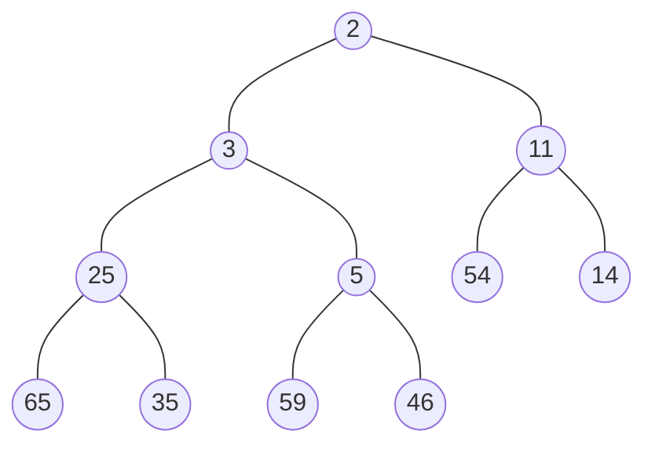
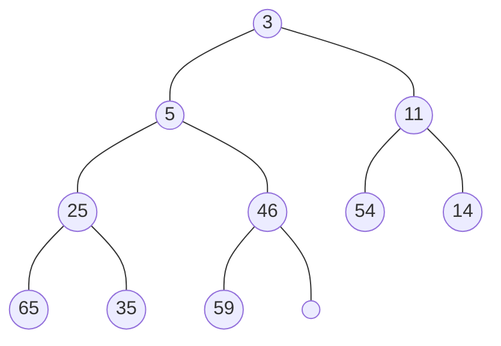
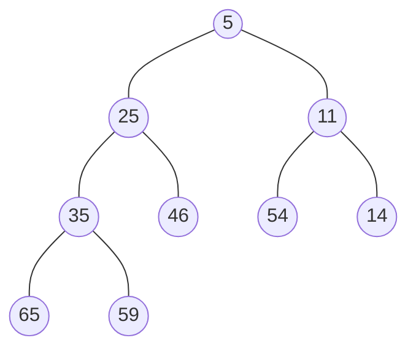
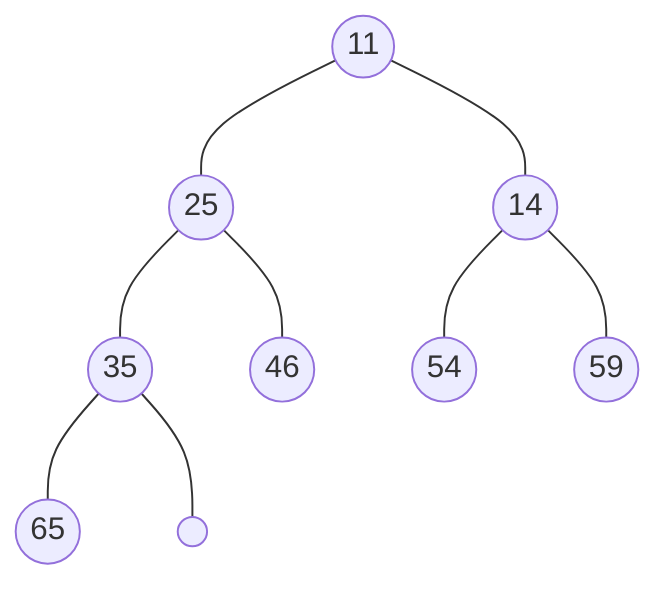
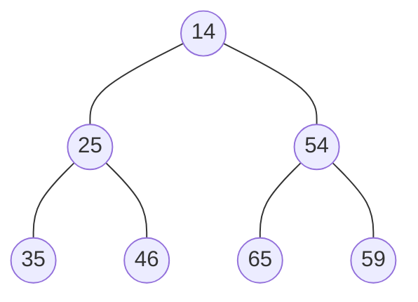
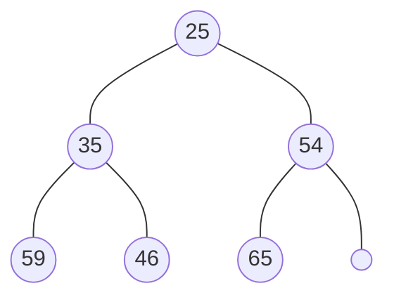
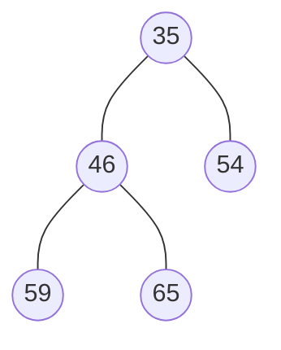
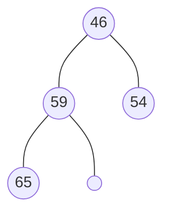
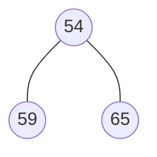
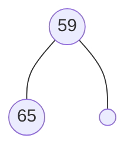

# problem1

## a heapsort

### start:

| 1    | 2    | 3    | 4    | 5    | 6    | 7    | 8    | 9    | 10   | 11   | 12   |
| ---- | ---- | ---- | ---- | ---- | ---- | ---- | ---- | ---- | ---- | ---- | ---- |
| 2    | 3    | 11   | 25   | 5    | 54   | 14   | 65   | 35   | 59   | 46   |      |




### 

| 1    | 2    | 3    | 4    | 5    | 6    | 7    | 8    | 9    | 10   | 11   | 12   |
| ---- | ---- | ---- | ---- | ---- | ---- | ---- | ---- | ---- | ---- | ---- | ---- |
|      |      |      |      |      |      |      |      |      |      |      |      |

### delete2

| 1    | 2    | 3    | 4    | 5    | 6    | 7    | 8    | 9    | 10   | 11   | 12   |
| ---- | ---- | ---- | ---- | ---- | ---- | ---- | ---- | ---- | ---- | ---- | ---- |
| 3    | 5    | 11   | 25   | 46   | 54   | 14   | 65   | 35   | 59   |      |      |




| 1    | 2    | 3    | 4    | 5    | 6    | 7    | 8    | 9    | 10   | 11   | 12   |
| ---- | ---- | ---- | ---- | ---- | ---- | ---- | ---- | ---- | ---- | ---- | ---- |
| 2    |      |      |      |      |      |      |      |      |      |      |      |

### delete3

| 1    | 2    | 3    | 4    | 5    | 6    | 7    | 8    | 9    | 10   | 11   | 12   |
| ---- | ---- | ---- | ---- | ---- | ---- | ---- | ---- | ---- | ---- | ---- | ---- |
| 5    | 25   | 11   | 35   | 46   | 54   | 14   | 65   | 59   |      |      |      |




| 1    | 2    | 3    | 4    | 5    | 6    | 7    | 8    | 9    | 10   | 11   | 12   |
| ---- | ---- | ---- | ---- | ---- | ---- | ---- | ---- | ---- | ---- | ---- | ---- |
| 2    | 3    |      |      |      |      |      |      |      |      |      |      |

### delete5

| 1    | 2    | 3    | 4    | 5    | 6    | 7    | 8    | 9    | 10   | 11   | 12   |
| ---- | ---- | ---- | ---- | ---- | ---- | ---- | ---- | ---- | ---- | ---- | ---- |
| 11   | 25   | 14   | 35   | 46   | 54   | 59   | 65   |      |      |      |      |




| 1    | 2    | 3    | 4    | 5    | 6    | 7    | 8    | 9    | 10   | 11   | 12   |
| ---- | ---- | ---- | ---- | ---- | ---- | ---- | ---- | ---- | ---- | ---- | ---- |
| 2    | 3    | 5    |      |      |      |      |      |      |      |      |      |

### delete11

| 1    | 2    | 3    | 4    | 5    | 6    | 7    | 8    | 9    | 10   | 11   | 12   |
| ---- | ---- | ---- | ---- | ---- | ---- | ---- | ---- | ---- | ---- | ---- | ---- |
| 14   | 25   | 54   | 35   | 46   | 65   | 59   |      |      |      |      |      |




| 1    | 2    | 3    | 4    | 5    | 6    | 7    | 8    | 9    | 10   | 11   | 12   |
| ---- | ---- | ---- | ---- | ---- | ---- | ---- | ---- | ---- | ---- | ---- | ---- |
| 2    | 3    | 5    | 11   |      |      |      |      |      |      |      |      |

### delete14

| 1    | 2    | 3    | 4    | 5    | 6    | 7    | 8    | 9    | 10   | 11   | 12   |
| ---- | ---- | ---- | ---- | ---- | ---- | ---- | ---- | ---- | ---- | ---- | ---- |
| 25   | 35   | 54   | 59   | 46   | 65   |      |      |      |      |      |      |




| 1    | 2    | 3    | 4    | 5    | 6    | 7    | 8    | 9    | 10   | 11   | 12   |
| ---- | ---- | ---- | ---- | ---- | ---- | ---- | ---- | ---- | ---- | ---- | ---- |
| 2    | 3    | 5    | 11   | 14   |      |      |      |      |      |      |      |

### delete14

| 1    | 2    | 3    | 4    | 5    | 6    | 7    | 8    | 9    | 10   | 11   | 12   |
| ---- | ---- | ---- | ---- | ---- | ---- | ---- | ---- | ---- | ---- | ---- | ---- |
| 25   | 35   | 54   | 59   | 46   | 65   |      |      |      |      |      |      |


| 1    | 2    | 3    | 4    | 5    | 6    | 7    | 8    | 9    | 10   | 11   | 12   |
| ---- | ---- | ---- | ---- | ---- | ---- | ---- | ---- | ---- | ---- | ---- | ---- |
| 2    | 3    | 5    | 11   | 14   |      |      |      |      |      |      |      |

### delete25

| 1    | 2    | 3    | 4    | 5    | 6    | 7    | 8    | 9    | 10   | 11   | 12   |
| ---- | ---- | ---- | ---- | ---- | ---- | ---- | ---- | ---- | ---- | ---- | ---- |
| 35   | 46   | 54   | 59   | 65   |      |      |      |      |      |      |      |




| 1    | 2    | 3    | 4    | 5    | 6    | 7    | 8    | 9    | 10   | 11   | 12   |
| ---- | ---- | ---- | ---- | ---- | ---- | ---- | ---- | ---- | ---- | ---- | ---- |
| 2    | 3    | 5    | 11   | 14   | 25   |      |      |      |      |      |      |

### delete35

| 1    | 2    | 3    | 4    | 5    | 6    | 7    | 8    | 9    | 10   | 11   | 12   |
| ---- | ---- | ---- | ---- | ---- | ---- | ---- | ---- | ---- | ---- | ---- | ---- |
| 46   | 59   | 54   | 65   |      |      |      |      |      |      |      |      |




| 1    | 2    | 3    | 4    | 5    | 6    | 7    | 8    | 9    | 10   | 11   | 12   |
| ---- | ---- | ---- | ---- | ---- | ---- | ---- | ---- | ---- | ---- | ---- | ---- |
| 2    | 3    | 5    | 11   | 14   | 25   | 35   |      |      |      |      |      |

### delete46

| 1    | 2    | 3    | 4    | 5    | 6    | 7    | 8    | 9    | 10   | 11   | 12   |
| ---- | ---- | ---- | ---- | ---- | ---- | ---- | ---- | ---- | ---- | ---- | ---- |
| 54   | 59   | 65   |      |      |      |      |      |      |      |      |      |




| 1    | 2    | 3    | 4    | 5    | 6    | 7    | 8    | 9    | 10   | 11   | 12   |
| ---- | ---- | ---- | ---- | ---- | ---- | ---- | ---- | ---- | ---- | ---- | ---- |
| 2    | 3    | 5    | 11   | 14   | 25   | 35   | 46   |      |      |      |      |

### delete54

| 1    | 2    | 3    | 4    | 5    | 6    | 7    | 8    | 9    | 10   | 11   | 12   |
| ---- | ---- | ---- | ---- | ---- | ---- | ---- | ---- | ---- | ---- | ---- | ---- |
| 59   | 65   |      |      |      |      |      |      |      |      |      |      |




| 1    | 2    | 3    | 4    | 5    | 6    | 7    | 8    | 9    | 10   | 11   | 12   |
| ---- | ---- | ---- | ---- | ---- | ---- | ---- | ---- | ---- | ---- | ---- | ---- |
| 2    | 3    | 5    | 11   | 14   | 25   | 35   | 46   | 54   |      |      |      |

### delete59

| 1    | 2    | 3    | 4    | 5    | 6    | 7    | 8    | 9    | 10   | 11   | 12   |
| ---- | ---- | ---- | ---- | ---- | ---- | ---- | ---- | ---- | ---- | ---- | ---- |
| 65   |      |      |      |      |      |      |      |      |      |      |      |


| 1    | 2    | 3    | 4    | 5    | 6    | 7    | 8    | 9    | 10   | 11   | 12   |
| ---- | ---- | ---- | ---- | ---- | ---- | ---- | ---- | ---- | ---- | ---- | ---- |
| 2    | 3    | 5    | 11   | 14   | 25   | 35   | 46   | 54   | 59   |      |      |

### delete65

| 1    | 2    | 3    | 4    | 5    | 6    | 7    | 8    | 9    | 10   | 11   | 12   |
| ---- | ---- | ---- | ---- | ---- | ---- | ---- | ---- | ---- | ---- | ---- | ---- |
|      |      |      |      |      |      |      |      |      |      |      |      |


```mermaid
flowchart TD
	
```

| 1    | 2    | 3    | 4    | 5    | 6    | 7    | 8    | 9    | 10   | 11   | 12   |
| ---- | ---- | ---- | ---- | ---- | ---- | ---- | ---- | ---- | ---- | ---- | ---- |
| 2    | 3    | 5    | 11   | 14   | 25   | 35   | 46   | 54   | 59   | 65   |      |

heapsort finished


## b quicksort

| 1    | 2    | 3    | 4    | 5    | 6    | 7    | 8    | 9    | 10   | 11   | 12   |
| ---- | ---- | ---- | ---- | ---- | ---- | ---- | ---- | ---- | ---- | ---- | ---- |
| 25   | 11   | 54   | 35   | 46   | 5    | 14   | 65   | 2    | 59   | 3    |      |

### use 25 to partition

| 1    | 2    | 3    | 4    | 5    | 6(partition) | 7    | 8    | 9    | 10   | 11   | 12   |
| ---- | ---- | ---- | ---- | ---- | ------------ | ---- | ---- | ---- | ---- | ---- | ---- |
| 5    | 11   | 3    | 2    | 14   | 25           | 46   | 65   | 35   | 59   | 54   |      |

### use 5,46 to partition

| 1    | 2    | 3(partition) | 4    | 5    | 6(partition) | 7    | 8(partition) | 9    | 10   | 11   | 12   |
| ---- | ---- | ------------ | ---- | ---- | ------------ | ---- | ------------ | ---- | ---- | ---- | ---- |
| 3    | 2    | 5            | 11   | 14   | 25           | 35   | 46           | 65   | 59   | 54   |      |

### use 3，11，65 to partition

| 1    | 2(partition) | 3(partition) | 4(partition) | 5    | 6(partition) | 7    | 8(partition) | 9    | 10   | 11(partition) | 12   |
| ---- | ------------ | ------------ | ------------ | ---- | ------------ | ---- | ------------ | ---- | ---- | ------------- | ---- |
| 2    | 3            | 5            | 11           | 14   | 25           | 35   | 46           | 54   | 59   | 65            |      |

### now all item is returned, sort finished


## c mergesort

| 1    | 2    | 3    | 4    | 5    | 6    | 7    | 8    | 9    | 10   | 11   |
| ---- | ---- | ---- | ---- | ---- | ---- | ---- | ---- | ---- | ---- | ---- |
| 25   | 11   | 54   | 35   | 46   | 5    | 14   | 65   | 2    | 59   | 3    |

### Split

| 1    | 2    | 3    | 4    | 5    | 6    |      | 7    | 8    | 9    | 10   | 11   |
| ---- | ---- | ---- | ---- | ---- | ---- | ---- | ---- | ---- | ---- | ---- | ---- |
| 25   | 11   | 54   | 35   | 46   | 5    |      | 14   | 65   | 2    | 59   | 3    |

### Split

| 1    | 2    | 3    |      | 4    | 5    | 6    |      | 7    | 8    | 9    |      | 10   | 11   |
| ---- | ---- | ---- | ---- | ---- | ---- | ---- | ---- | ---- | ---- | ---- | ---- | ---- | ---- |
| 25   | 11   | 54   |      | 35   | 46   | 5    |      | 14   | 65   | 2    |      | 59   | 3    |

### Split

| 1    | 2    |      | 3    |      | 4    | 5    |      | 6    |      | 7    | 8    |      | 9    |      | 10   | 11   |
| ---- | ---- | ---- | ---- | ---- | ---- | ---- | ---- | ---- | ---- | ---- | ---- | ---- | ---- | ---- | ---- | ---- |
| 25   | 11   |      | 54   |      | 35   | 46   |      | 5    |      | 14   | 65   |      | 2    |      | 59   | 3    |

### Split

| 1    |      | 2    |      | 3    |      | 4    |      | 5    |      | 6    |      | 7    |      | 8    |      | 9    |      | 10   |      | 11   |
| ---- | ---- | ---- | ---- | ---- | ---- | ---- | ---- | ---- | ---- | ---- | ---- | ---- | ---- | ---- | ---- | ---- | ---- | ---- | ---- | ---- |
| 25   |      | 11   |      | 54   |      | 35   |      | 46   |      | 5    |      | 14   |      | 65   |      | 2    |      | 59   |      | 3    |

### Merge

| 1    | 2    |      | 3    |      | 4    | 5    |      | 6    |      | 7    | 8    |      | 9    |      | 10   |      | 11   |
| ---- | ---- | ---- | ---- | ---- | ---- | ---- | ---- | ---- | ---- | ---- | ---- | ---- | ---- | ---- | ---- | ---- | ---- |
| 11   | 25   |      | 54   |      | 35   | 46   |      | 5    |      | 14   | 65   |      | 2    |      | 59   |      | 3    |

### Merge

| 1    | 2    | 3    |      | 4    | 5    | 6    |      | 7    | 8    | 9    |      | 10   | 11   |
| ---- | ---- | ---- | ---- | ---- | ---- | ---- | ---- | ---- | ---- | ---- | ---- | ---- | ---- |
| 11   | 25   | 54   |      | 5    | 35   | 46   |      | 2    | 14   | 65   |      | 3    | 59   |

### Merge

| 1    | 2    | 3    | 4    | 5    | 6    |      | 7    | 8    | 9    | 10   | 11   |
| ---- | ---- | ---- | ---- | ---- | ---- | ---- | ---- | ---- | ---- | ---- | ---- |
| 5    | 11   | 25   | 35   | 46   | 54   |      | 2    | 3    | 14   | 59   | 65   |

### Merge

| 1    | 2    | 3    | 4    | 5    | 6    | 7    | 8    | 9    | 10   | 11   |
| ---- | ---- | ---- | ---- | ---- | ---- | ---- | ---- | ---- | ---- | ---- |
| 2    | 3    | 5    | 11   | 14   | 25   | 35   | 46   | 54   | 59   | 65   |


## d insertion sort

### insert 25

| 1    | 2    | 3    | 4    | 5    | 6    | 7    | 8    | 9    | 10   | 11   |
| ---- | ---- | ---- | ---- | ---- | ---- | ---- | ---- | ---- | ---- | ---- |
| 25   |      |      |      |      |      |      |      |      |      |      |

### insert 11

| 1    | 2    | 3    | 4    | 5    | 6    | 7    | 8    | 9    | 10   | 11   |
| ---- | ---- | ---- | ---- | ---- | ---- | ---- | ---- | ---- | ---- | ---- |
| 11   | 25   |      |      |      |      |      |      |      |      |      |

### insert 54

| 1    | 2    | 3    | 4    | 5    | 6    | 7    | 8    | 9    | 10   | 11   |
| ---- | ---- | ---- | ---- | ---- | ---- | ---- | ---- | ---- | ---- | ---- |
| 11   | 25   | 54   |      |      |      |      |      |      |      |      |

### insert 35

| 1    | 2    | 3    | 4    | 5    | 6    | 7    | 8    | 9    | 10   | 11   |
| ---- | ---- | ---- | ---- | ---- | ---- | ---- | ---- | ---- | ---- | ---- |
| 11   | 25   | 35   | 54   |      |      |      |      |      |      |      |

### insert 46

| 1    | 2    | 3    | 4    | 5    | 6    | 7    | 8    | 9    | 10   | 11   |
| ---- | ---- | ---- | ---- | ---- | ---- | ---- | ---- | ---- | ---- | ---- |
| 11   | 25   | 35   | 46   | 54   |      |      |      |      |      |      |

### insert 5

| 1    | 2    | 3    | 4    | 5    | 6    | 7    | 8    | 9    | 10   | 11   |
| ---- | ---- | ---- | ---- | ---- | ---- | ---- | ---- | ---- | ---- | ---- |
| 5    | 11   | 25   | 35   | 46   | 54   |      |      |      |      |      |

### insert 14

| 1    | 2    | 3    | 4    | 5    | 6    | 7    | 8    | 9    | 10   | 11   |
| ---- | ---- | ---- | ---- | ---- | ---- | ---- | ---- | ---- | ---- | ---- |
| 5    | 11   | 14   | 25   | 35   | 46   | 54   |      |      |      |      |

### insert 65

| 1    | 2    | 3    | 4    | 5    | 6    | 7    | 8    | 9    | 10   | 11   |
| ---- | ---- | ---- | ---- | ---- | ---- | ---- | ---- | ---- | ---- | ---- |
| 5    | 11   | 14   | 25   | 35   | 46   | 54   | 65   |      |      |      |

### insert 2

| 1    | 2    | 3    | 4    | 5    | 6    | 7    | 8    | 9    | 10   | 11   |
| ---- | ---- | ---- | ---- | ---- | ---- | ---- | ---- | ---- | ---- | ---- |
| 2    | 5    | 11   | 14   | 25   | 35   | 46   | 54   | 65   |      |      |

### insert 59

| 1    | 2    | 3    | 4    | 5    | 6    | 7    | 8    | 9    | 10   | 11   |
| ---- | ---- | ---- | ---- | ---- | ---- | ---- | ---- | ---- | ---- | ---- |
| 2    | 5    | 11   | 14   | 25   | 35   | 46   | 54   | 59   | 65   |      |

### insert 3

| 1    | 2    | 3    | 4    | 5    | 6    | 7    | 8    | 9    | 10   | 11   |
| ---- | ---- | ---- | ---- | ---- | ---- | ---- | ---- | ---- | ---- | ---- |
| 2    | 3    | 5    | 11   | 14   | 25   | 35   | 46   | 54   | 59   | 65   |

Insertion sort completed


## e selection sort

| 1    | 2    | 3    | 4    | 5    | 6    | 7    | 8    | 9    | 10   | 11   |
| ---- | ---- | ---- | ---- | ---- | ---- | ---- | ---- | ---- | ---- | ---- |
| 25   | 11   | 54   | 35   | 46   | 5    | 14   | 65   | 2    | 59   | 3    |

### min->2

| 1    | 2    | 3    | 4    | 5    | 6    | 7    | 8    | 9    | 10   | 11   |
| ---- | ---- | ---- | ---- | ---- | ---- | ---- | ---- | ---- | ---- | ---- |
| 2    | 11   | 54   | 35   | 46   | 5    | 14   | 65   | 25   | 59   | 3    |

### min->3

| 1    | 2    | 3    | 4    | 5    | 6    | 7    | 8    | 9    | 10   | 11   |
| ---- | ---- | ---- | ---- | ---- | ---- | ---- | ---- | ---- | ---- | ---- |
| 2    | 3    | 54   | 35   | 46   | 5    | 14   | 65   | 25   | 59   | 11   |

### min->5

| 1    | 2    | 3    | 4    | 5    | 6    | 7    | 8    | 9    | 10   | 11   |
| ---- | ---- | ---- | ---- | ---- | ---- | ---- | ---- | ---- | ---- | ---- |
| 2    | 3    | 5    | 35   | 46   | 54   | 14   | 65   | 25   | 59   | 11   |

### min->11

| 1    | 2    | 3    | 4    | 5    | 6    | 7    | 8    | 9    | 10   | 11   |
| ---- | ---- | ---- | ---- | ---- | ---- | ---- | ---- | ---- | ---- | ---- |
| 2    | 3    | 5    | 11   | 46   | 54   | 14   | 65   | 25   | 59   | 35   |

### min->14

| 1    | 2    | 3    | 4    | 5    | 6    | 7    | 8    | 9    | 10   | 11   |
| ---- | ---- | ---- | ---- | ---- | ---- | ---- | ---- | ---- | ---- | ---- |
| 2    | 3    | 5    | 11   | 14   | 54   | 46   | 65   | 25   | 59   | 35   |

### min->25

| 1    | 2    | 3    | 4    | 5    | 6    | 7    | 8    | 9    | 10   | 11   |
| ---- | ---- | ---- | ---- | ---- | ---- | ---- | ---- | ---- | ---- | ---- |
| 2    | 3    | 5    | 11   | 14   | 25   | 46   | 65   | 54   | 59   | 35   |

### min->35

| 1    | 2    | 3    | 4    | 5    | 6    | 7    | 8    | 9    | 10   | 11   |
| ---- | ---- | ---- | ---- | ---- | ---- | ---- | ---- | ---- | ---- | ---- |
| 2    | 3    | 5    | 11   | 14   | 25   | 35   | 65   | 54   | 59   | 46   |

### min->46

| 1    | 2    | 3    | 4    | 5    | 6    | 7    | 8    | 9    | 10   | 11   |
| ---- | ---- | ---- | ---- | ---- | ---- | ---- | ---- | ---- | ---- | ---- |
| 2    | 3    | 5    | 11   | 14   | 25   | 35   | 46   | 54   | 59   | 65   |

### min->54

| 1    | 2    | 3    | 4    | 5    | 6    | 7    | 8    | 9    | 10   | 11   |
| ---- | ---- | ---- | ---- | ---- | ---- | ---- | ---- | ---- | ---- | ---- |
| 2    | 3    | 5    | 11   | 14   | 25   | 35   | 46   | 54   | 59   | 65   |

### min->59

| 1    | 2    | 3    | 4    | 5    | 6    | 7    | 8    | 9    | 10   | 11   |
| ---- | ---- | ---- | ---- | ---- | ---- | ---- | ---- | ---- | ---- | ---- |
| 2    | 3    | 5    | 11   | 14   | 25   | 35   | 46   | 54   | 59   | 65   |

### min->65

| 1    | 2    | 3    | 4    | 5    | 6    | 7    | 8    | 9    | 10   | 11   |
| ---- | ---- | ---- | ---- | ---- | ---- | ---- | ---- | ---- | ---- | ---- |
| 2    | 3    | 5    | 11   | 14   | 25   | 35   | 46   | 54   | 59   | 65   |

selection sort finished


# problem2

## a

### Minimum prefix

```c++
struct recursiveResult
begin
	float leftMin；
	int leftMinMarker;
	float total;
end recursiveResult

function getMinimumPrefix(x[1:n])
begin
	recursiveResult result;
    if (n==1) then
		result.leftMin = x[0];
		result.leftMinMarker = 1;
		result.total = x[0];
		return (result);
	endif
	recursiveResult leftResult;
	recursiveResult rightResult;
	int mid;
	mid = floor(n/2);
	//leftside
	leftResult = getMinimumPrefix(x[1:mid])
	//rightside
	rightResult = getMinimumPrefix(x[mid+1:n])
    //get the smallest prefix in the two prefix
    if (leftResult.leftMin <= leftResult.total * rightResult.leftMin) then
        result.leftMin = leftResult.leftMin;
        result.leftMinMarker = leftResult.leftMinMarker;
	else
        result.leftMin = leftResult.total * rightResult.leftMin;
        result.leftMinMarker = rightResult.leftMinMarker + mid;
	endif
    //add the total for outer level usage
    result.total = leftResult.total * rightResult.total;
	return(result)
end getMinimumPrefix
    
function main()
begin
    float x[1:n]=[0.1,0.2,0.3,.....]
    int k;
    recursiveResult result;
	recursiveResult = getMinimumPrefix(x);
	k = recursiveResult.leftMinMarker;
	print(k);
end main
```

### Minimum suffix

```c++
struct recursiveResult
begin
	float rightMin；
	int rightMinMarker;
	float total;
end recursiveResult

function getMinimumSuffix(x[1:n])
begin
	recursiveResult result;
    if (n==1) then
		result.rightMin = x[0];
		result.rightMinMarker = 1;
		result.total = x[0];
		return (result);
	endif
	recursiveResult leftResult;
	recursiveResult rightResult;
	int mid;
	mid = floor(n/2);
	//leftside
	leftResult = getMinimumSuffix(x[1:mid])
	//rightside
	rightResult = getMinimumSuffix(x[mid+1:n])
    //get the smallest suffix in the two suffix
    if (rightResult.rightMin <= rightResult.total * leftResult.rightmin) then
        result.rightMin = rightResult.rightMin;
        result.rightMinMarker = rightResult.rightMinMarker;
	else
        result.rightMin = rightResult.total * leftResult.rightmin;
        result.rightMinMarker = leftResult.rightMinMarker + mid;
	endif
    //add the total for outer level usage
    result.total = leftResult.total * rightResult.total;
	return(result)
end getMinimumPrefix
    
function main()
begin
    float x[1:n]=[0.1,0.2,0.3,.....]
    int k;
    recursiveResult result;
	recursiveResult = getMinimumSuffix(x);
	k = recursiveResult.rightMinMarker;
	print(k);
end main
```

## Minimum subarray

```c++
struct recursiveResult
begin
	float rightMin；
	int rightMinMarker;
	float leftMin;
	int leftMinMarker;
	float middleMin;
	int middleMinLeftMarker;
	int middleMinRightMarker;
	float total;
end recursiveResult
    
function getMinimumSubarray(x[1:n])
begin
	recursiveResult result;
    if (n==1) then
		result.rightMin = x[0];
		result.rightMinMarker = 1;
		reuslt.leftMin = x[0];
        result.leftMinMarker =1;
		result.middleMin = x[0];
		result.middleMinLeftMarker = 1;
		result.middleMinRightMarker = 1;
		result.total = x[0];
		return (result);
	endif
	recursiveResult leftResult;
	recursiveResult rightResult;
	int mid;
	mid = floor(n/2);
	//leftside
	leftResult = getMinimumSubarray(x[1:mid])
	//rightside
	rightResult = getMinimumSubarray(x[mid+1:n])
    //get the smallest suffix in the two suffix
    if (rightResult.rightMin <= rightResult.total * leftResult.rightmin) then
        result.rightMin = rightResult.rightMin;
        result.rightMinMarker = rightResult.rightMinMarker;
	else
        result.rightMin = rightResult.total * leftResult.rightmin;
        result.rightMinMarker = leftResult.rightMinMarker + mid;
	endif 
    //get the smallest prefix in the two prefix
    if (leftResult.leftMin <= leftResult.total * rightResult.leftMin) then
        result.leftMin = leftResult.leftMin;
        result.leftMinMarker = leftResult.leftMinMarker;
	else
        result.leftMin = leftResult.total * rightResult.leftMin;
        result.leftMinMarker = rightResult.leftMinMarker + mid;
	endif
    //get the smallest subarray in the two subarray and left suffix* right prefix
    if (leftResult.middleMin <= rightResult.middleMin && leftResult.middleMin <= leftResult.rightMin*rightResult.leftMin) then
    	result.middleMin = leftResult.MiddleMin;
		result.middleMinLeftMarker = leftResult.middleMinLeftMarker;
		result.middleMinRightMarker = leftResult.middleMinRightMarker;
	else if (rightResult.middleMin <= leftResult.middleMin && rightResult.middleMin <= leftResult.rightMin*rightResult.leftMin) then
        result.middleMin = leftResult.rightMin*rightResult.leftMin;
		result.middleMinLeftMarker = leftResult.middleMinLeftMarker;
		result.middleMinRightMarker = rightResult.middleMinRightMarker + mid;
	else
        result.middleMin = rightResult.MiddleMin;
	endif
    //add the total for outer level usage
    result.total = leftResult.total * rightResult.total;
	return(result);
end getMinimumSubarray
        
function main()
begin
    float x[1:n]=[0.1,0.2,0.3,.....]
    int k,r;
    recursiveResult result;
	recursiveResult = getMinimumSubarray(x);
	k = recursiveResult.middleMinLeftMarker;
	r = recursiveResult.middleMinRightMarker;
	print(k,r);
end main
```

## c

About Time Complexity, the three algorithms above are all acting in a same way, that is recursively split the input into two half and calls themselves, then each recursive call it self does constant operations. So
$$
T(1)=c\\
T(n)=T(\frac{n}{2})+c\\
Therefore\\
T(n)=O(logn)
$$


# problem3

```c++
struct recursiveResult
begin
    float maxTrough;
	int maxTroughMarker;
end recursiveResult
    
struct minHeapNode
begin
    float value;
    int location;
end minHeapNode
    
function buildMinHeap(x[1:n])
begin
    int i;
    minHeapNode minHeap[1:n];
	int mapArray[1:n];
	for i=1 to n do
        //insert into min heap
        minHeapNode heapNode;
		heapNode.value = x[i];
        heapNode.location = i;
        minHeap[i]= heapNode;
		mapArray[i]=i;
		int currentLocation;
		currentLocation = i;
		while (currentLocation != 1 and minHeap[currentLocation].value < minHeap[floor(currentLocation/2)].value) do
            //swap both minheap and the minheap mapping array
            swap (minHeap[currentLocation],minHeap[floor(currentLocation/2)]);
			swap (mapArray[minHeap[currentLocation].location],mapArray[minHeap[floor(currentLocation/2)].location]);
			currentLocation = floor(currentLocation/2);
		endwhile
    endfor
	return (minHeap,mapArray);
end buildMinHeap
    
function heapify(x[1:n],mapArray[1:n],location)
begin
    while((location<n/2)&&(x[location].value>x[location*2].value ||x[location].value>x[location*2+1].value)||((location!=1)&&(x[location].value < x[floor(location/2)].value)) do
    	if (x[location].value>x[location*2].value ||x[location].value>x[location*2+1].value) then
          	//swap down
        	if x[location*2].value > x[location*2+1].value then
          		swap (x[location],x[location*2+1]);
				swap (mapArray[x[location].location],mapArray[x[location*2+1].location]);
				location = floor(location*2+1);
          	else
          		swap (x[location],x[location*2]);
				swap (mapArray[x[location].location],mapArray[x[location*2].location]);
				location = floor(location*2);
       	else
          	//swap up
          	//swap both minheap and the minheap mapping array
            swap (x[location],x[floor(location/2)]);
			swap (mapArray[x[location].location],mapArray[x[floor(location/2)].location]);
			location = floor(location/2);
        endif
    endwhile
	return x,mapArray;
end heapify
    
function getTrough(x[1:n],l)
begin
    int mid = floor(n/2);
	float midTrough;
	int midTroughMarker;
	int i;
	float arrayToCheck[];
	int arrayLength;
	if 2*l>n then
        //the basic unit of recursive
        arrayToCheck = x;
		arrayLength = n;
	else
        //the middle unit of recursive
        arrayToCheck = x[mid-l+1:mid+l]
        arrayLength = 2*l;
	endif
	//build a l size min heap, with mapping to the element's location in a
	//this minheap also has a location value for it to map to the array when doing heapify
	//also return a l size location mapArray for each element in array x to find it's location in the min heap.
	minHeapNode minHeap[1:l];
	int mapArray[1:l];
	minHeap,mapArray := buildMinHeap(arrayToCheck[1:l]);
    midTroughMarker = 1;
	midTrough = minHeap[1].value;
    for i=l+1 to arrayLength do
        // replace old value with new one
        minHeap[mapArray[i%l]].value = arrayToCheck[i];
		// rebuild the heap, return the new heap and the heap mapArray
		minHeap,mapArray = heapify(arrayToCheck[1:arrayLength];mapArray[1:l],mapArray[i%l]);
        // check for trough, the 1st element in min heap is always min
        if midTrough<minHeap[1].value then
            //record the new max trough
            midTrough = minHeap[1].value;
			midTroughMarker = i-l;
		endif
    endfor
    recursiveResult result;
    if 2*l>n then
        //the basic unit of recursive
        result.maxTrough = midTrough;
		result.maxTroughMarker = midTroughMarker;
    else
        //start recursive here
   		recursiveResult leftResult;
		recursiveResult rightResult;
		leftResult = getTrough(x[1:mid],l);
    	rightResult = getTrough(x[mid+1:n],l);
		if (midTrough >= leftResult.maxTrough && midTrough >= rightResult.maxTrough) then
            result.maxTrough = midTrough;
			//need to add offset to marker
			result.maxTroughMarker = mid-l+midTroughMarker-1;
		else if leftResult.maxTrough >= rightResult.maxTrough then
            result.maxTrough = leftResult.maxTrough;
			result.maxTroughMarker = leftResult.maxTroughMarker;
		else
            result.maxTrough = rightResult.maxTrough;
			result.maxTroughMarker = rightResult.maxTroughMarker + mid;
		endif
	return (result);
end getTrough
    
    
func main()
begin
    //populate x and l here
	float x[1:n]=[1,2,3,4,5,6,7,8...]
    int l = 22;
	print(getTrough(x,l).maxTroughMarker)
end main
```

For Time complexity, the algorithm calls itself on half recursively. And will have l times of heapify on l elements (log l for each heapify) operations per recursive call. So 
$$
T(2*l)=c*l\log l\\
T(n)=T(\frac{n}{2})+c*l\log l\\
Therefore\\
T(n)=O(l\log l\log n)
$$


# bonus

```c++
function getMultiplyResult(arr[1:n])
begin
    //by defination
	if (n == 1) then
	    return arr;
	endif
	int mid;
	mid = n/2;
	//start compute
	int rightUpArr[1:mid];
	int leftDownArr[1:mid];
	//assume we are using deep copy here, start recursion
	leftDownArr = getMultiplyResult(arr[1:mid]);
	rightUpArr  = getMultiplyResult(arr[mid+1:n]);
	//leftUpArr,rightDownArr are identity matrix, so should return same arr value directly
	int i;
	for i=1 to mid do
		arr[i]     += rightUpArr[i];
		arr[i+mid] += leftDownArr[i];
	endfor
	return (arr);
end getMultiplyResult

func main()
begin
	int x[1:n]=[1,2,3,4,5,6,7,8...]
    //we can assume n=len(x) here, so n is not passed into function
	print(getMultiplyResult(x))
end main
```

For Time complexity, the algorithm calls it self on half recursively. And will have cn operations per recursive call. So 
$$
T(1)=c\\
T(n)=T(\frac{n}{2})+cn\\
Therefore\\
T(n)=O(nlogn)
$$
