# problem1

## a heapsort

### start:

| 1    | 2    | 3    | 4    | 5    | 6    | 7    | 8    | 9    | 10   | 11   | 12   |
| ---- | ---- | ---- | ---- | ---- | ---- | ---- | ---- | ---- | ---- | ---- | ---- |
| 2    | 3    | 11   | 25   | 5    | 54   | 14   | 65   | 35   | 59   | 46   |      |


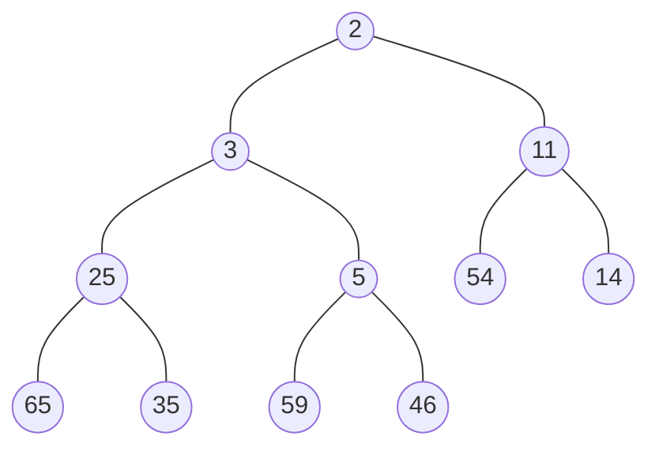

### 

| 1    | 2    | 3    | 4    | 5    | 6    | 7    | 8    | 9    | 10   | 11   | 12   |
| ---- | ---- | ---- | ---- | ---- | ---- | ---- | ---- | ---- | ---- | ---- | ---- |
|      |      |      |      |      |      |      |      |      |      |      |      |

### delete2

| 1    | 2    | 3    | 4    | 5    | 6    | 7    | 8    | 9    | 10   | 11   | 12   |
| ---- | ---- | ---- | ---- | ---- | ---- | ---- | ---- | ---- | ---- | ---- | ---- |
| 3    | 5    | 11   | 25   | 46   | 54   | 14   | 65   | 35   | 59   |      |      |


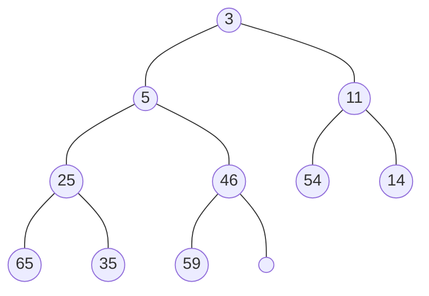

| 1    | 2    | 3    | 4    | 5    | 6    | 7    | 8    | 9    | 10   | 11   | 12   |
| ---- | ---- | ---- | ---- | ---- | ---- | ---- | ---- | ---- | ---- | ---- | ---- |
| 2    |      |      |      |      |      |      |      |      |      |      |      |

### delete3

| 1    | 2    | 3    | 4    | 5    | 6    | 7    | 8    | 9    | 10   | 11   | 12   |
| ---- | ---- | ---- | ---- | ---- | ---- | ---- | ---- | ---- | ---- | ---- | ---- |
| 5    | 25   | 11   | 35   | 46   | 54   | 14   | 65   | 59   |      |      |      |


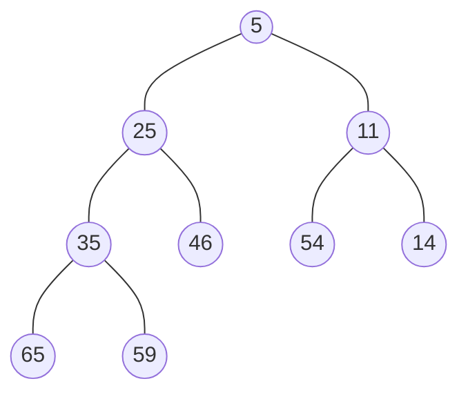

| 1    | 2    | 3    | 4    | 5    | 6    | 7    | 8    | 9    | 10   | 11   | 12   |
| ---- | ---- | ---- | ---- | ---- | ---- | ---- | ---- | ---- | ---- | ---- | ---- |
| 2    | 3    |      |      |      |      |      |      |      |      |      |      |

### delete5

| 1    | 2    | 3    | 4    | 5    | 6    | 7    | 8    | 9    | 10   | 11   | 12   |
| ---- | ---- | ---- | ---- | ---- | ---- | ---- | ---- | ---- | ---- | ---- | ---- |
| 11   | 25   | 14   | 35   | 46   | 54   | 59   | 65   |      |      |      |      |


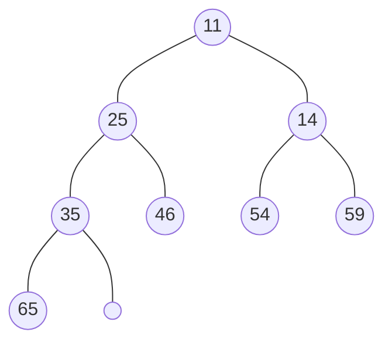

| 1    | 2    | 3    | 4    | 5    | 6    | 7    | 8    | 9    | 10   | 11   | 12   |
| ---- | ---- | ---- | ---- | ---- | ---- | ---- | ---- | ---- | ---- | ---- | ---- |
| 2    | 3    | 5    |      |      |      |      |      |      |      |      |      |

### delete11

| 1    | 2    | 3    | 4    | 5    | 6    | 7    | 8    | 9    | 10   | 11   | 12   |
| ---- | ---- | ---- | ---- | ---- | ---- | ---- | ---- | ---- | ---- | ---- | ---- |
| 14   | 25   | 54   | 35   | 46   | 65   | 59   |      |      |      |      |      |


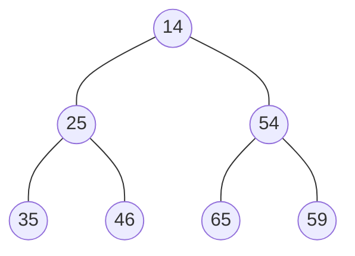

| 1    | 2    | 3    | 4    | 5    | 6    | 7    | 8    | 9    | 10   | 11   | 12   |
| ---- | ---- | ---- | ---- | ---- | ---- | ---- | ---- | ---- | ---- | ---- | ---- |
| 2    | 3    | 5    | 11   |      |      |      |      |      |      |      |      |

### delete14

| 1    | 2    | 3    | 4    | 5    | 6    | 7    | 8    | 9    | 10   | 11   | 12   |
| ---- | ---- | ---- | ---- | ---- | ---- | ---- | ---- | ---- | ---- | ---- | ---- |
| 25   | 35   | 54   | 59   | 46   | 65   |      |      |      |      |      |      |


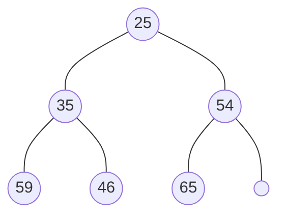

| 1    | 2    | 3    | 4    | 5    | 6    | 7    | 8    | 9    | 10   | 11   | 12   |
| ---- | ---- | ---- | ---- | ---- | ---- | ---- | ---- | ---- | ---- | ---- | ---- |
| 2    | 3    | 5    | 11   | 14   |      |      |      |      |      |      |      |

### delete14

| 1    | 2    | 3    | 4    | 5    | 6    | 7    | 8    | 9    | 10   | 11   | 12   |
| ---- | ---- | ---- | ---- | ---- | ---- | ---- | ---- | ---- | ---- | ---- | ---- |
| 25   | 35   | 54   | 59   | 46   | 65   |      |      |      |      |      |      |


| 1    | 2    | 3    | 4    | 5    | 6    | 7    | 8    | 9    | 10   | 11   | 12   |
| ---- | ---- | ---- | ---- | ---- | ---- | ---- | ---- | ---- | ---- | ---- | ---- |
| 2    | 3    | 5    | 11   | 14   |      |      |      |      |      |      |      |

### delete25

| 1    | 2    | 3    | 4    | 5    | 6    | 7    | 8    | 9    | 10   | 11   | 12   |
| ---- | ---- | ---- | ---- | ---- | ---- | ---- | ---- | ---- | ---- | ---- | ---- |
| 35   | 46   | 54   | 59   | 65   |      |      |      |      |      |      |      |


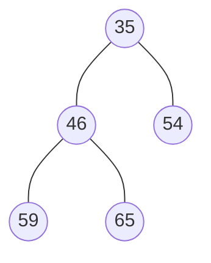

| 1    | 2    | 3    | 4    | 5    | 6    | 7    | 8    | 9    | 10   | 11   | 12   |
| ---- | ---- | ---- | ---- | ---- | ---- | ---- | ---- | ---- | ---- | ---- | ---- |
| 2    | 3    | 5    | 11   | 14   | 25   |      |      |      |      |      |      |

### delete35

| 1    | 2    | 3    | 4    | 5    | 6    | 7    | 8    | 9    | 10   | 11   | 12   |
| ---- | ---- | ---- | ---- | ---- | ---- | ---- | ---- | ---- | ---- | ---- | ---- |
| 46   | 59   | 54   | 65   |      |      |      |      |      |      |      |      |


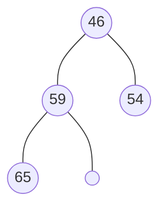

| 1    | 2    | 3    | 4    | 5    | 6    | 7    | 8    | 9    | 10   | 11   | 12   |
| ---- | ---- | ---- | ---- | ---- | ---- | ---- | ---- | ---- | ---- | ---- | ---- |
| 2    | 3    | 5    | 11   | 14   | 25   | 35   |      |      |      |      |      |

### delete46

| 1    | 2    | 3    | 4    | 5    | 6    | 7    | 8    | 9    | 10   | 11   | 12   |
| ---- | ---- | ---- | ---- | ---- | ---- | ---- | ---- | ---- | ---- | ---- | ---- |
| 54   | 59   | 65   |      |      |      |      |      |      |      |      |      |


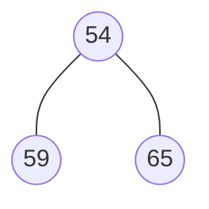

| 1    | 2    | 3    | 4    | 5    | 6    | 7    | 8    | 9    | 10   | 11   | 12   |
| ---- | ---- | ---- | ---- | ---- | ---- | ---- | ---- | ---- | ---- | ---- | ---- |
| 2    | 3    | 5    | 11   | 14   | 25   | 35   | 46   |      |      |      |      |

### delete54

| 1    | 2    | 3    | 4    | 5    | 6    | 7    | 8    | 9    | 10   | 11   | 12   |
| ---- | ---- | ---- | ---- | ---- | ---- | ---- | ---- | ---- | ---- | ---- | ---- |
| 59   | 65   |      |      |      |      |      |      |      |      |      |      |


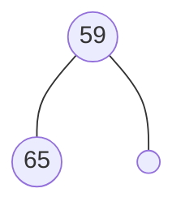

| 1    | 2    | 3    | 4    | 5    | 6    | 7    | 8    | 9    | 10   | 11   | 12   |
| ---- | ---- | ---- | ---- | ---- | ---- | ---- | ---- | ---- | ---- | ---- | ---- |
| 2    | 3    | 5    | 11   | 14   | 25   | 35   | 46   | 54   |      |      |      |

### delete59

| 1    | 2    | 3    | 4    | 5    | 6    | 7    | 8    | 9    | 10   | 11   | 12   |
| ---- | ---- | ---- | ---- | ---- | ---- | ---- | ---- | ---- | ---- | ---- | ---- |
| 65   |      |      |      |      |      |      |      |      |      |      |      |


| 1    | 2    | 3    | 4    | 5    | 6    | 7    | 8    | 9    | 10   | 11   | 12   |
| ---- | ---- | ---- | ---- | ---- | ---- | ---- | ---- | ---- | ---- | ---- | ---- |
| 2    | 3    | 5    | 11   | 14   | 25   | 35   | 46   | 54   | 59   |      |      |

### delete65

| 1    | 2    | 3    | 4    | 5    | 6    | 7    | 8    | 9    | 10   | 11   | 12   |
| ---- | ---- | ---- | ---- | ---- | ---- | ---- | ---- | ---- | ---- | ---- | ---- |
|      |      |      |      |      |      |      |      |      |      |      |      |


```mermaid
flowchart TD
	
```

| 1    | 2    | 3    | 4    | 5    | 6    | 7    | 8    | 9    | 10   | 11   | 12   |
| ---- | ---- | ---- | ---- | ---- | ---- | ---- | ---- | ---- | ---- | ---- | ---- |
| 2    | 3    | 5    | 11   | 14   | 25   | 35   | 46   | 54   | 59   | 65   |      |

heapsort finished


## b quicksort

| 1    | 2    | 3    | 4    | 5    | 6    | 7    | 8    | 9    | 10   | 11   | 12   |
| ---- | ---- | ---- | ---- | ---- | ---- | ---- | ---- | ---- | ---- | ---- | ---- |
| 25   | 11   | 54   | 35   | 46   | 5    | 14   | 65   | 2    | 59   | 3    |      |

### use 25 to partition

| 1    | 2    | 3    | 4    | 5    | 6(partition) | 7    | 8    | 9    | 10   | 11   | 12   |
| ---- | ---- | ---- | ---- | ---- | ------------ | ---- | ---- | ---- | ---- | ---- | ---- |
| 5    | 11   | 3    | 2    | 14   | 25           | 46   | 65   | 35   | 59   | 54   |      |

### use 5,46 to partition

| 1    | 2    | 3(partition) | 4    | 5    | 6(partition) | 7    | 8(partition) | 9    | 10   | 11   | 12   |
| ---- | ---- | ------------ | ---- | ---- | ------------ | ---- | ------------ | ---- | ---- | ---- | ---- |
| 3    | 2    | 5            | 11   | 14   | 25           | 35   | 46           | 65   | 59   | 54   |      |

### use 3，11，65 to partition

| 1    | 2(partition) | 3(partition) | 4(partition) | 5    | 6(partition) | 7    | 8(partition) | 9    | 10   | 11(partition) | 12   |
| ---- | ------------ | ------------ | ------------ | ---- | ------------ | ---- | ------------ | ---- | ---- | ------------- | ---- |
| 2    | 3            | 5            | 11           | 14   | 25           | 35   | 46           | 54   | 59   | 65            |      |

### now all item is returned, sort finished


## c mergesort

| 1    | 2    | 3    | 4    | 5    | 6    | 7    | 8    | 9    | 10   | 11   |
| ---- | ---- | ---- | ---- | ---- | ---- | ---- | ---- | ---- | ---- | ---- |
| 25   | 11   | 54   | 35   | 46   | 5    | 14   | 65   | 2    | 59   | 3    |

### Split

| 1    | 2    | 3    | 4    | 5    | 6    |      | 7    | 8    | 9    | 10   | 11   |
| ---- | ---- | ---- | ---- | ---- | ---- | ---- | ---- | ---- | ---- | ---- | ---- |
| 25   | 11   | 54   | 35   | 46   | 5    |      | 14   | 65   | 2    | 59   | 3    |

### Split

| 1    | 2    | 3    |      | 4    | 5    | 6    |      | 7    | 8    | 9    |      | 10   | 11   |
| ---- | ---- | ---- | ---- | ---- | ---- | ---- | ---- | ---- | ---- | ---- | ---- | ---- | ---- |
| 25   | 11   | 54   |      | 35   | 46   | 5    |      | 14   | 65   | 2    |      | 59   | 3    |

### Split

| 1    | 2    |      | 3    |      | 4    | 5    |      | 6    |      | 7    | 8    |      | 9    |      | 10   | 11   |
| ---- | ---- | ---- | ---- | ---- | ---- | ---- | ---- | ---- | ---- | ---- | ---- | ---- | ---- | ---- | ---- | ---- |
| 25   | 11   |      | 54   |      | 35   | 46   |      | 5    |      | 14   | 65   |      | 2    |      | 59   | 3    |

### Split

| 1    |      | 2    |      | 3    |      | 4    |      | 5    |      | 6    |      | 7    |      | 8    |      | 9    |      | 10   |      | 11   |
| ---- | ---- | ---- | ---- | ---- | ---- | ---- | ---- | ---- | ---- | ---- | ---- | ---- | ---- | ---- | ---- | ---- | ---- | ---- | ---- | ---- |
| 25   |      | 11   |      | 54   |      | 35   |      | 46   |      | 5    |      | 14   |      | 65   |      | 2    |      | 59   |      | 3    |

### Merge

| 1    | 2    |      | 3    |      | 4    | 5    |      | 6    |      | 7    | 8    |      | 9    |      | 10   |      | 11   |
| ---- | ---- | ---- | ---- | ---- | ---- | ---- | ---- | ---- | ---- | ---- | ---- | ---- | ---- | ---- | ---- | ---- | ---- |
| 11   | 25   |      | 54   |      | 35   | 46   |      | 5    |      | 14   | 65   |      | 2    |      | 59   |      | 3    |

### Merge

| 1    | 2    | 3    |      | 4    | 5    | 6    |      | 7    | 8    | 9    |      | 10   | 11   |
| ---- | ---- | ---- | ---- | ---- | ---- | ---- | ---- | ---- | ---- | ---- | ---- | ---- | ---- |
| 11   | 25   | 54   |      | 5    | 35   | 46   |      | 2    | 14   | 65   |      | 3    | 59   |

### Merge

| 1    | 2    | 3    | 4    | 5    | 6    |      | 7    | 8    | 9    | 10   | 11   |
| ---- | ---- | ---- | ---- | ---- | ---- | ---- | ---- | ---- | ---- | ---- | ---- |
| 5    | 11   | 25   | 35   | 46   | 54   |      | 2    | 3    | 14   | 59   | 65   |

### Merge

| 1    | 2    | 3    | 4    | 5    | 6    | 7    | 8    | 9    | 10   | 11   |
| ---- | ---- | ---- | ---- | ---- | ---- | ---- | ---- | ---- | ---- | ---- |
| 2    | 3    | 5    | 11   | 14   | 25   | 35   | 46   | 54   | 59   | 65   |


## d insertion sort

### insert 25

| 1    | 2    | 3    | 4    | 5    | 6    | 7    | 8    | 9    | 10   | 11   |
| ---- | ---- | ---- | ---- | ---- | ---- | ---- | ---- | ---- | ---- | ---- |
| 25   |      |      |      |      |      |      |      |      |      |      |

### insert 11

| 1    | 2    | 3    | 4    | 5    | 6    | 7    | 8    | 9    | 10   | 11   |
| ---- | ---- | ---- | ---- | ---- | ---- | ---- | ---- | ---- | ---- | ---- |
| 11   | 25   |      |      |      |      |      |      |      |      |      |

### insert 54

| 1    | 2    | 3    | 4    | 5    | 6    | 7    | 8    | 9    | 10   | 11   |
| ---- | ---- | ---- | ---- | ---- | ---- | ---- | ---- | ---- | ---- | ---- |
| 11   | 25   | 54   |      |      |      |      |      |      |      |      |

### insert 35

| 1    | 2    | 3    | 4    | 5    | 6    | 7    | 8    | 9    | 10   | 11   |
| ---- | ---- | ---- | ---- | ---- | ---- | ---- | ---- | ---- | ---- | ---- |
| 11   | 25   | 35   | 54   |      |      |      |      |      |      |      |

### insert 46

| 1    | 2    | 3    | 4    | 5    | 6    | 7    | 8    | 9    | 10   | 11   |
| ---- | ---- | ---- | ---- | ---- | ---- | ---- | ---- | ---- | ---- | ---- |
| 11   | 25   | 35   | 46   | 54   |      |      |      |      |      |      |

### insert 5

| 1    | 2    | 3    | 4    | 5    | 6    | 7    | 8    | 9    | 10   | 11   |
| ---- | ---- | ---- | ---- | ---- | ---- | ---- | ---- | ---- | ---- | ---- |
| 5    | 11   | 25   | 35   | 46   | 54   |      |      |      |      |      |

### insert 14

| 1    | 2    | 3    | 4    | 5    | 6    | 7    | 8    | 9    | 10   | 11   |
| ---- | ---- | ---- | ---- | ---- | ---- | ---- | ---- | ---- | ---- | ---- |
| 5    | 11   | 14   | 25   | 35   | 46   | 54   |      |      |      |      |

### insert 65

| 1    | 2    | 3    | 4    | 5    | 6    | 7    | 8    | 9    | 10   | 11   |
| ---- | ---- | ---- | ---- | ---- | ---- | ---- | ---- | ---- | ---- | ---- |
| 5    | 11   | 14   | 25   | 35   | 46   | 54   | 65   |      |      |      |

### insert 2

| 1    | 2    | 3    | 4    | 5    | 6    | 7    | 8    | 9    | 10   | 11   |
| ---- | ---- | ---- | ---- | ---- | ---- | ---- | ---- | ---- | ---- | ---- |
| 2    | 5    | 11   | 14   | 25   | 35   | 46   | 54   | 65   |      |      |

### insert 59

| 1    | 2    | 3    | 4    | 5    | 6    | 7    | 8    | 9    | 10   | 11   |
| ---- | ---- | ---- | ---- | ---- | ---- | ---- | ---- | ---- | ---- | ---- |
| 2    | 5    | 11   | 14   | 25   | 35   | 46   | 54   | 59   | 65   |      |

### insert 3

| 1    | 2    | 3    | 4    | 5    | 6    | 7    | 8    | 9    | 10   | 11   |
| ---- | ---- | ---- | ---- | ---- | ---- | ---- | ---- | ---- | ---- | ---- |
| 2    | 3    | 5    | 11   | 14   | 25   | 35   | 46   | 54   | 59   | 65   |

Insertion sort completed


## e selection sort

| 1    | 2    | 3    | 4    | 5    | 6    | 7    | 8    | 9    | 10   | 11   |
| ---- | ---- | ---- | ---- | ---- | ---- | ---- | ---- | ---- | ---- | ---- |
| 25   | 11   | 54   | 35   | 46   | 5    | 14   | 65   | 2    | 59   | 3    |

### min->2

| 1    | 2    | 3    | 4    | 5    | 6    | 7    | 8    | 9    | 10   | 11   |
| ---- | ---- | ---- | ---- | ---- | ---- | ---- | ---- | ---- | ---- | ---- |
| 2    | 11   | 54   | 35   | 46   | 5    | 14   | 65   | 25   | 59   | 3    |

### min->3

| 1    | 2    | 3    | 4    | 5    | 6    | 7    | 8    | 9    | 10   | 11   |
| ---- | ---- | ---- | ---- | ---- | ---- | ---- | ---- | ---- | ---- | ---- |
| 2    | 3    | 54   | 35   | 46   | 5    | 14   | 65   | 25   | 59   | 11   |

### min->5

| 1    | 2    | 3    | 4    | 5    | 6    | 7    | 8    | 9    | 10   | 11   |
| ---- | ---- | ---- | ---- | ---- | ---- | ---- | ---- | ---- | ---- | ---- |
| 2    | 3    | 5    | 35   | 46   | 54   | 14   | 65   | 25   | 59   | 11   |

### min->11

| 1    | 2    | 3    | 4    | 5    | 6    | 7    | 8    | 9    | 10   | 11   |
| ---- | ---- | ---- | ---- | ---- | ---- | ---- | ---- | ---- | ---- | ---- |
| 2    | 3    | 5    | 11   | 46   | 54   | 14   | 65   | 25   | 59   | 35   |

### min->14

| 1    | 2    | 3    | 4    | 5    | 6    | 7    | 8    | 9    | 10   | 11   |
| ---- | ---- | ---- | ---- | ---- | ---- | ---- | ---- | ---- | ---- | ---- |
| 2    | 3    | 5    | 11   | 14   | 54   | 46   | 65   | 25   | 59   | 35   |

### min->25

| 1    | 2    | 3    | 4    | 5    | 6    | 7    | 8    | 9    | 10   | 11   |
| ---- | ---- | ---- | ---- | ---- | ---- | ---- | ---- | ---- | ---- | ---- |
| 2    | 3    | 5    | 11   | 14   | 25   | 46   | 65   | 54   | 59   | 35   |

### min->35

| 1    | 2    | 3    | 4    | 5    | 6    | 7    | 8    | 9    | 10   | 11   |
| ---- | ---- | ---- | ---- | ---- | ---- | ---- | ---- | ---- | ---- | ---- |
| 2    | 3    | 5    | 11   | 14   | 25   | 35   | 65   | 54   | 59   | 46   |

### min->46

| 1    | 2    | 3    | 4    | 5    | 6    | 7    | 8    | 9    | 10   | 11   |
| ---- | ---- | ---- | ---- | ---- | ---- | ---- | ---- | ---- | ---- | ---- |
| 2    | 3    | 5    | 11   | 14   | 25   | 35   | 46   | 54   | 59   | 65   |

### min->54

| 1    | 2    | 3    | 4    | 5    | 6    | 7    | 8    | 9    | 10   | 11   |
| ---- | ---- | ---- | ---- | ---- | ---- | ---- | ---- | ---- | ---- | ---- |
| 2    | 3    | 5    | 11   | 14   | 25   | 35   | 46   | 54   | 59   | 65   |

### min->59

| 1    | 2    | 3    | 4    | 5    | 6    | 7    | 8    | 9    | 10   | 11   |
| ---- | ---- | ---- | ---- | ---- | ---- | ---- | ---- | ---- | ---- | ---- |
| 2    | 3    | 5    | 11   | 14   | 25   | 35   | 46   | 54   | 59   | 65   |

### min->65

| 1    | 2    | 3    | 4    | 5    | 6    | 7    | 8    | 9    | 10   | 11   |
| ---- | ---- | ---- | ---- | ---- | ---- | ---- | ---- | ---- | ---- | ---- |
| 2    | 3    | 5    | 11   | 14   | 25   | 35   | 46   | 54   | 59   | 65   |

selection sort finished


# problem2

## a

### Minimum prefix

```c++
struct recursiveResult
begin
	float leftMin；
	int leftMinMarker;
	float leftMax；
	int leftMaxMarker;
	float total;
end recursiveResult

function getMinimumPrefix(x[1:n])
begin
	recursiveResult result;
    if (n==1) then
		result.leftMin = x[0];
		result.leftMinMarker = 1;
		result.rightMin = x[0];
		result.rightMinMarker = 1;
		result.total = x[0];
		return (result);
	endif
	recursiveResult leftResult;
	recursiveResult rightResult;
	int mid;
	mid = floor(n/2);
	//leftside
	leftResult = getMinimumPrefix(x[1:mid])
	//rightside
	rightResult = getMinimumPrefix(x[mid+1:n])
    //get the min prefix in the three possible prefix
    result.leftMin = min(leftResult.total * rightResult.leftMax,leftResult.total * rightResult.leftMin,leftResult.leftMin)
    //choose accordingly to previous result
    result.leftMinMarker = minMarker(right.leftMaxMarker+mid,right.leftMinMarker+mid,left.leftMinMarker)
    //get the max prefix in the three possible prefix
    result.leftMax = max(leftResult.total * rightResult.leftMax,leftResult.total * rightResult.leftMin,leftResult.leftMax)
    //choose accordingly to previous result
    result.leftMaxMarker = maxMarker(right.leftMaxMarker+mid,right.leftMinMarker+mid,left.leftMaxMarker)
    //add the total for outer level usage
    result.total = leftResult.total * rightResult.total;
	return(result)
end getMinimumPrefix
    
function main()
begin
    float x[1:n]=[0.1,0.2,0.3,.....]
    int k;
    recursiveResult result;
	recursiveResult = getMinimumPrefix(x);
	k = recursiveResult.leftMinMarker;
	print(k);
end main
```

### Minimum suffix

```c++
struct recursiveResult
begin
	float rightMin；
	int rightMinMarker;
	float rightMax;
	int rightMaxMarker;
	float total;
end recursiveResult

function getMinimumSuffix(x[1:n])
begin
	recursiveResult result;
    if (n==1) then
		result.rightMin = x[0];
		result.rightMinMarker = 1;
		result.rightMax = x[0];
		result.rightMaxMarker = 1;
		result.total = x[0];
		return (result);
	endif
	recursiveResult leftResult;
	recursiveResult rightResult;
	int mid;
	mid = floor(n/2);
	//leftside
	leftResult = getMinimumSuffix(x[1:mid])
	//rightside
	rightResult = getMinimumSuffix(x[mid+1:n])
    //get the min suffix in the three possible suffix
    result.rightMin = min(rightResult.total * leftResult.rightMax,rightResult.total * leftResult.rightMin,rightResult.rightMin)
    //choose accordingly to previous result
    result.rightMinMarker = minMarker(left.rightMaxMarker,left.rightMinMarker,right.rightMinMarker+mid)
    //get the max suffix in the three possible suffix
    result.rightMax = max(rightResult.total * leftResult.rightMax,rightResult.total * leftResult.rightMin,rightResult.rightMax)
    //choose accordingly to previous result
    result.rightMaxMarker = maxMarker(left.rightMaxMarker,left.rightMinMarker,right.rightMaxMarker+mid)
    //add the total for outer level usage
    result.total = leftResult.total * rightResult.total;
	return(result)
end getMinimumPrefix
    
function main()
begin
    float x[1:n]=[0.1,0.2,0.3,.....]
    int k;
    recursiveResult result;
	recursiveResult = getMinimumSuffix(x);
	k = recursiveResult.rightMinMarker;
	print(k);
end main
```

## Minimum subarray

```c++
struct recursiveResult
begin
	float rightMin；
	int rightMinMarker;
	float rightMax；
	int rightMaxMarker;
	float leftMin;
	int leftMinMarker;
	float leftMax;
	int leftMaxMarker;
	float middleMin;
	int middleMinLeftMarker;
	int middleMinRightMarker;
	float total;
end recursiveResult
    
function getMinimumSubarray(x[1:n])
begin
	recursiveResult result;
    if (n==1) then
		result.rightMin = x[0];
		result.rightMinMarker = 1;
		reuslt.leftMin = x[0];
        result.leftMinMarker =1;
		result.middleMin = x[0];
		result.middleMinLeftMarker = 1;
		result.middleMinRightMarker = 1;
		result.total = x[0];
		return (result);
	endif
	recursiveResult leftResult;
	recursiveResult rightResult;
	int mid;
	mid = floor(n/2);
	//leftside
	leftResult = getMinimumSubarray(x[1:mid])
	//rightside
	rightResult = getMinimumSubarray(x[mid+1:n])
        
    //get the min prefix in the three possible prefix
    result.leftMin = min(leftResult.total * rightResult.leftMax,leftResult.total * rightResult.leftMin,leftResult.leftMin)
    //choose accordingly to previous result
    result.leftMinMarker = minMarker(right.leftMaxMarker+mid,right.leftMinMarker+mid,left.leftMinMarker)
    //get the max prefix in the three possible prefix
    result.leftMax = max(leftResult.total * rightResult.leftMax,leftResult.total * rightResult.leftMin,leftResult.leftMax)
    //choose accordingly to previous result
    result.leftMaxMarker = maxMarker(right.leftMaxMarker+mid,right.leftMinMarker+mid,left.leftMaxMarker)
        
     //get the min suffix in the three possible suffix
    result.rightMin = min(rightResult.total * leftResult.rightMax,rightResult.total * leftResult.rightMin,rightResult.rightMin)
    //choose accordingly to previous result
    result.rightMinMarker = minMarker(left.rightMaxMarker,left.rightMinMarker,right.rightMinMarker+mid)
    //get the max suffix in the three possible suffix
    result.rightMax = max(rightResult.total * leftResult.rightMax,rightResult.total * leftResult.rightMin,rightResult.rightMax)
    //choose accordingly to previous result
    result.rightMaxMarker = maxMarker(left.rightMaxMarker,left.rightMinMarker,right.rightMaxMarker+mid)
    
    //get the min suffix in the 6 possible min suffixs
    result.middleMin = min(leftResult.middleMin,rightResult.middleMin,leftResult.rightMin*rightResult.leftMin,            leftResult.rightMin*rightResult.leftMax,leftResult.rightMax*rightResult.leftMin,leftResult.rightMax*rightResult.leftMax)
    //get the left marker accordingly
    result.middleMinLeftMarker = minLeftMarker(leftResult.middleMinLeftMarker,rightResult.middleMinLeftMarker+mid,leftResult.rightMinMarker,leftResult.rightMinMarker,leftResult.rightMaxMarker,leftResult.rightMaxMarker)
    //get the right marker accordingly
    result.middleMinRightMarker = minRightMarker(leftResult.middleMinRightMarker,rightResult.middleMinRightMarker+mid,rightResult.leftMinMarker+mid,rightResult.leftMaxMarker+mid,rightResult.leftMinMarker+mid,rightResult.leftMaxMarker+mid)
	
    //add the total for outer level usage
    result.total = leftResult.total * rightResult.total;
	return(result);
end getMinimumSubarray
        
function main()
begin
    float x[1:n]=[0.1,0.2,0.3,.....]
    int k,r;
    recursiveResult result;
	recursiveResult = getMinimumSubarray(x);
	k = recursiveResult.middleMinLeftMarker;
	r = recursiveResult.middleMinRightMarker;
	print(k,r);
end main
```

## c

About Time Complexity, the three algorithms above are all acting in a same way, that is recursively split the input into two half and calls themselves, then each recursive call it self does constant operations. So
$$
T(1)=c\\
T(n)=T(\frac{n}{2})+c\\
Therefore\\
T(n)=O(logn)
$$


# problem3

```c++
struct recursiveResult
begin
    float maxTrough;
	int maxTroughMarker;
end recursiveResult
    
struct minHeapNode
begin
    float value;
    int location;
end minHeapNode
    
function buildMinHeap(x[1:n])
begin
    int i;
    minHeapNode minHeap[1:n];
	int mapArray[1:n];
	for i=1 to n do
        //insert into min heap
        minHeapNode heapNode;
		heapNode.value = x[i];
        heapNode.location = i;
        minHeap[i]= heapNode;
		mapArray[i]=i;
		int currentLocation;
		currentLocation = i;
		while (currentLocation != 1 and minHeap[currentLocation].value < minHeap[floor(currentLocation/2)].value) do
            //swap both minheap and the minheap mapping array
            swap (minHeap[currentLocation],minHeap[floor(currentLocation/2)]);
			swap (mapArray[minHeap[currentLocation].location],mapArray[minHeap[floor(currentLocation/2)].location]);
			currentLocation = floor(currentLocation/2);
		endwhile
    endfor
	return (minHeap,mapArray);
end buildMinHeap
    
function heapify(x[1:n],mapArray[1:n],location)
begin
    while((location<n/2)&&(x[location].value>x[location*2].value ||x[location].value>x[location*2+1].value)||((location!=1)&&(x[location].value < x[floor(location/2)].value)) do
    	if (x[location].value>x[location*2].value ||x[location].value>x[location*2+1].value) then
          	//swap down
        	if x[location*2].value > x[location*2+1].value then
          		swap (x[location],x[location*2+1]);
				swap (mapArray[x[location].location],mapArray[x[location*2+1].location]);
				location = floor(location*2+1);
          	else
          		swap (x[location],x[location*2]);
				swap (mapArray[x[location].location],mapArray[x[location*2].location]);
				location = floor(location*2);
       	else
          	//swap up
          	//swap both minheap and the minheap mapping array
            swap (x[location],x[floor(location/2)]);
			swap (mapArray[x[location].location],mapArray[x[floor(location/2)].location]);
			location = floor(location/2);
        endif
    endwhile
	return x,mapArray;
end heapify
    
function getTrough(x[1:n],l)
begin
    int mid = floor(n/2);
	float midTrough;
	int midTroughMarker;
	int i;
	float arrayToCheck[];
	int arrayLength;
	if 2*l>n then
        //the basic unit of recursive
        arrayToCheck = x;
		arrayLength = n;
	else
        //the middle unit of recursive
        arrayToCheck = x[mid-l+1:mid+l]
        arrayLength = 2*l;
	endif
	//build a l size min heap, with mapping to the element's location in a
	//this minheap also has a location value for it to map to the array when doing heapify
	//also return a l size location mapArray for each element in array x to find it's location in the min heap.
	minHeapNode minHeap[1:l];
	int mapArray[1:l];
	minHeap,mapArray := buildMinHeap(arrayToCheck[1:l]);
    midTroughMarker = 1;
	midTrough = minHeap[1].value;
    for i=l+1 to arrayLength do
        // replace old value with new one
        minHeap[mapArray[i%l]].value = arrayToCheck[i];
		// rebuild the heap, return the new heap and the heap mapArray
		minHeap,mapArray = heapify(arrayToCheck[1:arrayLength];mapArray[1:l],mapArray[i%l]);
        // check for trough, the 1st element in min heap is always min
        if midTrough<minHeap[1].value then
            //record the new max trough
            midTrough = minHeap[1].value;
			midTroughMarker = i-l;
		endif
    endfor
    recursiveResult result;
    if 2*l>n then
        //the basic unit of recursive
        result.maxTrough = midTrough;
		result.maxTroughMarker = midTroughMarker;
    else
        //start recursive here
   		recursiveResult leftResult;
		recursiveResult rightResult;
		leftResult = getTrough(x[1:mid],l);
    	rightResult = getTrough(x[mid+1:n],l);
		if (midTrough >= leftResult.maxTrough && midTrough >= rightResult.maxTrough) then
            result.maxTrough = midTrough;
			//need to add offset to marker
			result.maxTroughMarker = mid-l+midTroughMarker-1;
		else if leftResult.maxTrough >= rightResult.maxTrough then
            result.maxTrough = leftResult.maxTrough;
			result.maxTroughMarker = leftResult.maxTroughMarker;
		else
            result.maxTrough = rightResult.maxTrough;
			result.maxTroughMarker = rightResult.maxTroughMarker + mid;
		endif
	return (result);
end getTrough
    
    
func main()
begin
    //populate x and l here
	float x[1:n]=[1,2,3,4,5,6,7,8...]
    int l = 22;
	print(getTrough(x,l).maxTroughMarker)
end main
```

For Time complexity, the algorithm calls itself on half recursively. And each recursive operation will have 1 time of building min-heap(O(l)) and l times of heapify on l elements (log l for each heapify) operations. So
$$
T(2*l)=c*l\log l\\
T(n)=T(\frac{n}{2})+c*l\log l\\
Therefore\\
T(n)=O(l\log l\log n)
$$

# problem 4

For the `Knapsack` problem, a greedy solution on `price per weight` is needed


Calculate `price per weight` first

| weight       | 8    | 14   | 6    | 4    | 2    | 10   |
| ------------ | ---- | ---- | ---- | ---- | ---- | ---- |
| price        | 40   | 14   | 24   | 12   | 12   | 20   |
| price/weight | 5    | 1    | 4    | 3    | 6    | 2    |
| x            |      |      |      |      |      |      |

M=14

###  firstly choose the highest `price/weight` which is 6

| weight       | 8    | 14   | 6    | 4    | 2    | 10   |
| ------------ | ---- | ---- | ---- | ---- | ---- | ---- |
| price        | 40   | 14   | 24   | 12   | 12   | 20   |
| price/weight | 5    | 1    | 4    | 3    | 6    | 2    |
| x            |      |      |      |      | 2    |      |

M=12

###  choose the highest `price/weight` which is other than 6（5）

| weight       | 8    | 14   | 6    | 4    | 2    | 10   |
| ------------ | ---- | ---- | ---- | ---- | ---- | ---- |
| price        | 40   | 14   | 24   | 12   | 12   | 20   |
| price/weight | 5    | 1    | 4    | 3    | 6    | 2    |
| x            | 8    |      |      |      | 2    |      |

M=4

###  choose the highest `price/weight` which is other than 6，5（4）

| weight       | 8    | 14   | 6    | 4    | 2    | 10   |
| ------------ | ---- | ---- | ---- | ---- | ---- | ---- |
| price        | 40   | 14   | 24   | 12   | 12   | 20   |
| price/weight | 5    | 1    | 4    | 3    | 6    | 2    |
| x            | 1    |      | 2/3  |      | 1    |      |

M=0

because the remaining capacity is only 4, only 4/6 of the total weight can be taken. so x =2/3, and now the pack is full.

So the x~n~ is shown below

| n    | 1    | 2    | 3    | 4    | 5    | 6    |
| ---- | ---- | ---- | ---- | ---- | ---- | ---- |
| x~n~ | 1    | 0    | 2/3  | 0    | 1    | 0    |

total price should be

x~1~P~1~+x~3~P~3~+x~5~P~5~= 40+16+12=68

# problem 5

## a

We have the graph G as below

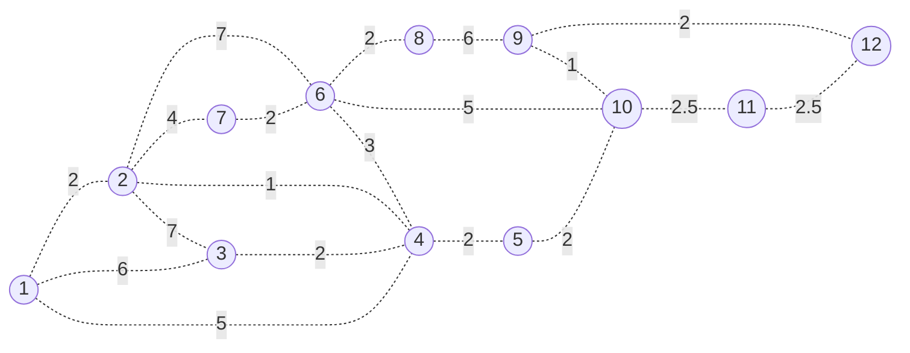

### Search for the smallest weight (1), add to the tree(the bold line)

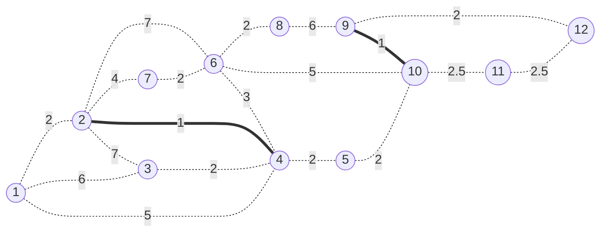

add E(2,4),E(9,10)

check for circle, no circle

check for count(E)=2!=11

ok continue

### Search for the smallest weight (2), add to the tree

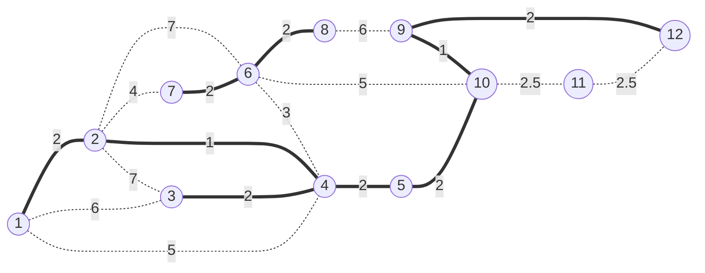

Add E(1,2),E(3,4),E(6,7),E(4,5),E(5,10),E(9,10),E(6,8)

check for circle, no circle

check for count(E)=9!=11

ok continue

### Search for the smallest weight (2.5), add to the tree

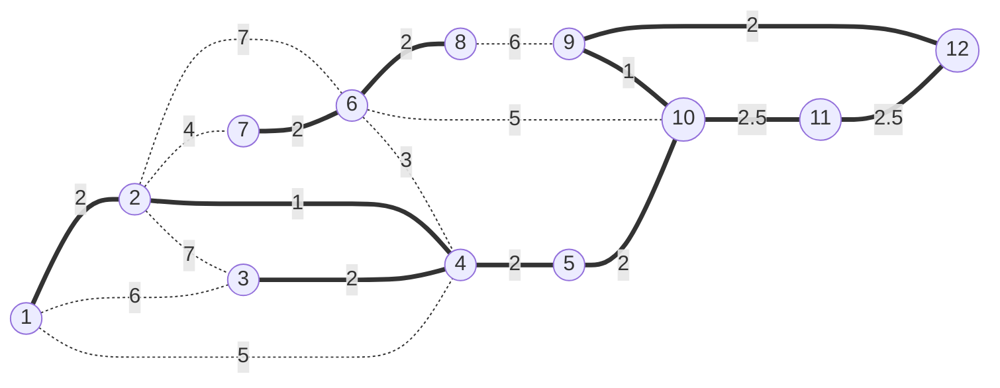

Add E(10,11),E(11,12)

check for circle, adding E(11,12), vertex 11,12 is on the same tree, 9,10,11,12 is a circle, so remove E(11,12)

### 

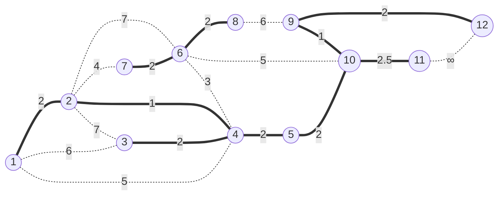


check for count(E)=10!=11

ok continue

### Search for the smallest weight (3), add to the tree

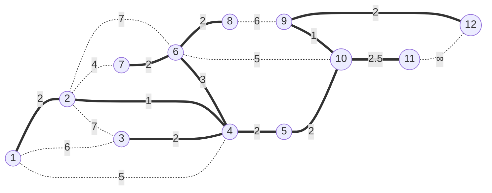

check for circle, adding E(4,6) is on the different tree, no circle

check for count(E)=11==11

so now the tree should be a `MST` of G

## b

### Add 1 to group

distance from 1

| i    | 1+   | 2    | 3    | 4    | 5          | 6          | 7          | 8          | 9          | 10         | 11         | 12         |
| ---- | ---- | ---- | ---- | ---- | ---------- | ---------- | ---------- | ---------- | ---------- | ---------- | ---------- | ---------- |
| D[i] | 0    | 2    | 6    | 5    | $$\infty$$ | $$\infty$$ | $$\infty$$ | $$\infty$$ | $$\infty$$ | $$\infty$$ | $$\infty$$ | $$\infty$$ |

### choose the shortest distance (D[2]=2)to add to group

refresh distance from 1

D(1,2)+D(2,4)=3>D(1,4)=5

| i    | 1+   | 2+   | 3    | 4    | 5          | 6    | 7    | 8          | 9          | 10         | 11         | 12         |
| ---- | ---- | ---- | ---- | ---- | ---------- | ---- | ---- | ---------- | ---------- | ---------- | ---------- | ---------- |
| D[i] | 0    | 2    | 6    | 3    | $$\infty$$ | 9    | 6    | $$\infty$$ | $$\infty$$ | $$\infty$$ | $$\infty$$ | $$\infty$$ |

### choose the shortest distance (D[4]=3)to add to group

refresh distance from 1

D(1,4)+D(4,6)=6>D(1,6)=9

D(1,4)+D(4,3)=5>D(1,3)=6

| i    | 1+   | 2+   | 3    | 4+   | 5    | 6    | 7    | 8          | 9          | 10         | 11         | 12         |
| ---- | ---- | ---- | ---- | ---- | ---- | ---- | ---- | ---------- | ---------- | ---------- | ---------- | ---------- |
| D[i] | 0    | 2    | 5    | 3    | 5    | 6    | 6    | $$\infty$$ | $$\infty$$ | $$\infty$$ | $$\infty$$ | $$\infty$$ |

### choose the shortest distance (D[5]=5)to add to group

refresh distance from 1

| i    | 1+   | 2+   | 3    | 4+   | 5+   | 6    | 7    | 8          | 9          | 10   | 11         | 12         |
| ---- | ---- | ---- | ---- | ---- | ---- | ---- | ---- | ---------- | ---------- | ---- | ---------- | ---------- |
| D[i] | 0    | 2    | 5    | 3    | 5    | 6    | 6    | $$\infty$$ | $$\infty$$ | 7    | $$\infty$$ | $$\infty$$ |

### choose the shortest distance (D[3]=5)to add to group

refresh distance from 1

| i    | 1+   | 2+   | 3+   | 4+   | 5+   | 6    | 7    | 8          | 9          | 10   | 11         | 12         |
| ---- | ---- | ---- | ---- | ---- | ---- | ---- | ---- | ---------- | ---------- | ---- | ---------- | ---------- |
| D[i] | 0    | 2    | 5    | 3    | 5    | 6    | 6    | $$\infty$$ | $$\infty$$ | 7    | $$\infty$$ | $$\infty$$ |

### choose the shortest distance (D[6]=6)to add to group

refresh distance from 1

| i    | 1+   | 2+   | 3+   | 4+   | 5+   | 6+   | 7    | 8    | 9          | 10   | 11         | 12         |
| ---- | ---- | ---- | ---- | ---- | ---- | ---- | ---- | ---- | ---------- | ---- | ---------- | ---------- |
| D[i] | 0    | 2    | 5    | 3    | 5    | 6    | 6    | 8    | $$\infty$$ | 7    | $$\infty$$ | $$\infty$$ |

### choose the shortest distance (D[7]=6)to add to group

refresh distance from 1

| i    | 1+   | 2+   | 3+   | 4+   | 5+   | 6+   | 7+   | 8    | 9          | 10   | 11         | 12         |
| ---- | ---- | ---- | ---- | ---- | ---- | ---- | ---- | ---- | ---------- | ---- | ---------- | ---------- |
| D[i] | 0    | 2    | 5    | 3    | 5    | 6    | 6    | 8    | $$\infty$$ | 7    | $$\infty$$ | $$\infty$$ |

### choose the shortest distance (D[10]=7)to add to group

refresh distance from 1

| i    | 1+   | 2+   | 3+   | 4+   | 5+   | 6+   | 7+   | 8    | 9    | 10+  | 11   | 12         |
| ---- | ---- | ---- | ---- | ---- | ---- | ---- | ---- | ---- | ---- | ---- | ---- | ---------- |
| D[i] | 0    | 2    | 5    | 3    | 5    | 6    | 6    | 8    | 8    | 7    | 9.5  | $$\infty$$ |

### choose the shortest distance (D[8]=8)to add to group

refresh distance from 1

| i    | 1+   | 2+   | 3+   | 4+   | 5+   | 6+   | 7+   | 8+   | 9    | 10+  | 11   | 12         |
| ---- | ---- | ---- | ---- | ---- | ---- | ---- | ---- | ---- | ---- | ---- | ---- | ---------- |
| D[i] | 0    | 2    | 5    | 3    | 5    | 6    | 6    | 8    | 8    | 7    | 9.5  | $$\infty$$ |

### choose the shortest distance (D[9]=8)to add to group

refresh distance from 1

| i    | 1+   | 2+   | 3+   | 4+   | 5+   | 6+   | 7+   | 8+   | 9    | 10+  | 11   | 12   |
| ---- | ---- | ---- | ---- | ---- | ---- | ---- | ---- | ---- | ---- | ---- | ---- | ---- |
| D[i] | 0    | 2    | 5    | 3    | 5    | 6    | 6    | 8    | 8    | 7    | 9.5  | 10   |


### choose the shortest distance (D[11]=9.5)to add to group

refresh distance from 1

| i    | 1+   | 2+   | 3+   | 4+   | 5+   | 6+   | 7+   | 8+   | 9+   | 10+  | 11+  | 12   |
| ---- | ---- | ---- | ---- | ---- | ---- | ---- | ---- | ---- | ---- | ---- | ---- | ---- |
| D[i] | 0    | 2    | 5    | 3    | 5    | 6    | 6    | 8    | 8    | 7    | 9.5  | 10   |


### choose the shortest distance (D[12]=10)to add to group

refresh distance from 1

| i    | 1+   | 2+   | 3+   | 4+   | 5+   | 6+   | 7+   | 8+   | 9+   | 10+  | 11+  | 12+  |
| ---- | ---- | ---- | ---- | ---- | ---- | ---- | ---- | ---- | ---- | ---- | ---- | ---- |
| D[i] | 0    | 2    | 5    | 3    | 5    | 6    | 6    | 8    | 8    | 7    | 9.5  | 10   |

now that all the elements are added to the group, finished.

## c

2: 1->2

3: 1->2->4->3

4: 1->2>4

5: 1->2->4->5

6: 1->2->4->6

7: 1->2->7

8: 1->2->4->6->8

9: 1->2->4->5->10->9

10:1->2->4->5->10

11:1->2->4->5->10->11

12: 1->2->4->5->10->9->12

To add these paths all together, got the spanning tree below

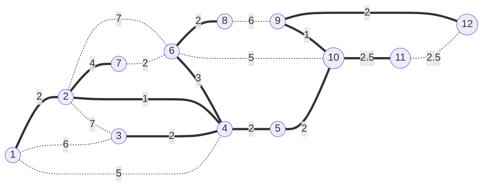

This is not a minimum spanning tree, for this tree added E(2,7) =4 instead of the minimum edge E(6,7)=2

# problem6

## a

basic idea

```mermaid
flowchart TD
    A[Start] -->  1[find the nodes with the minimum edges];
    1 --> 2[add it to the independent set]
    2 --> 3[remove all the neighbouring nodes]
    3 --> B{more nodes?};
    B -->|Yes| 1
    B ---->|No| E[End];
```


By removing the node with minimum neighbours one by one, hope this algorithem will have the maximum removal times, in order to bring out the maximum independent set

pesudo code

```c++
function min(A[1:n])
begin
    int min = A[1];
    for int i=2 to n
		if min>a[i] then
            min = a[i]
        endif
    endfor
	return min
end min
            
function minLocation(A[1:n])
begin
    int min = A[1];
	int mark = 1;
    for int i=2 to n
		if min>a[i] then
            min = a[i]
            mark = i;
        endif
    endfor
	return mark
endmin
            
//assume G is an adjacency matrix of n node graph
function greedyGetMaxIndependentSet(G[1:n][1:n])
begin
    //count edge for each node
    int edgeNum[1:n];
	int independentSet[1:n];
	for int i=1 to n do
        for int j=i+1 to n do
            if G[i][j]=1 then
                edgeNum[i]++;
                edgeNum[j]++;
			endif
        endfor
    endfor
    int counter = 0;
    for min(edgeNum[1:n])!=0 do
        //get node with min edges
        int currentLocation := minLocation(edgeNum[1:n]);
        //add to independent set
        independentSet[counter]=currentLocation;
		counter ++;
		//remove neighbours
		for int i=1 to n do
            if G[currentLocation][i] == 1 then
                for int j=1 to n do
                    if G[i][j]!=0 then
                        edgeNum[i]--;
                        edgeNum[j]--;
    					G[i][j]=0;
						G[j][i]=0;
					endif
               endfor
            endif
       endfor
       edgeNum[currentLocation]=0;
    endfor
    return independentSet[1:counter];
end greedyGetMaxIndependentSet
```

Counter Example:

```mermaid
flowchart TD
	1((1))---2((2))
	1---3((3))
	2---4((4))
	3---5((5))
	4---5((5))
	5---6((6))
	4---6((6))
```

In this case, 1,2,3,6 all have 2 edges, but if we select node 1 as the first node to remove, we will result in (1,4) as the maximum set, while choosing 2,3,6 at start node will have a maximum set of 3 (2,3,6). So in this case, greedy is not always optimal.

## b

basic idea

```mermaid
flowchart TD
    A[Start] -->  1[find the nodes with maximum edges];
    1 --> 2[add it to the vertex cover]
    2 --> 3[remove all it's edges]
    3 --> B{more edges?};
    B -->|Yes| 1
    B ---->|No| E[End];
```

For edges removed in each step is the current maximum, after removed all edges, we hope this algorithem will bring out the minimum vertex cover

pesudo code

```c++
function max(A[1:n])
begin
    int max = A[1];
    for int i=2 to n
		if max<a[i] then
            max = a[i]
        endif
    endfor
	return max
end min
            
function maxLocation(A[1:n])
begin
    int max = A[1];
	int mark = 1;
    for int i=2 to n
		if max<a[i] then
            max = a[i]
            mark = i;
        endif
    endfor
	return mark
endmin
            
//assume G is an adjacency matrix of n node graph
function greedyGetMinVertexCover(G[1:n][1:n])
begin
    //count edge for each node
    int edgeNum[1:n];
	int vertexCover[1:n];
	for int i=1 to n do
        for int j=i+1 to n do
            if G[i][j]=1 then
                edgeNum[i]++;
                edgeNum[j]++;
			endif
        endfor
    endfor
    int counter = 0;
    for max(edgeNum[1:n])!=0 do
        //get node with max edges
        int currentLocation = maxLocation(edgeNum[1:n]);
        //add to vertex cover set
        vertexCover[counter]=currentLocation;
		counter ++;
		//remove edges
		for int i=1 to n do
            if G[currentLocation][i] == 1 then
                        edgeNum[i]--;
    					G[i][currentLocation]=0;
						G[currentLocation][i]=0;
            endif
        endfor
        edgeNum[currentLocation] = 0;
    endfor
    return vertexCover[1:counter];
end greedyGetMinVertexCover
```

Counter Example:

```mermaid
flowchart TD
1((1))---2((2))
2---3((3))
2---4((4))
2---5((5))
3---7((7))
3---6((6))
4---6
3---4
5---4
5---6
5---8((8))
6---9((9))

```

In this case, we can see 2,3,4,5,6 all have 4 edges, if we remove 4 first, the result would be a 5 node vertex cover like(1,4,7,8,9), but if we remove 2 first, the result would be a 4 node vertex (2,3,5,6) so this counter case proved that greedy is not always optimal for vertex cover problem

# bonus

```c++
function getMultiplyResult(arr[1:n])
begin
    //by defination
	if (n == 1) then
	    return arr;
	endif
	int mid;
	mid = n/2;
	//start compute
	int rightUpArr[1:mid];
	int leftDownArr[1:mid];
	//assume we are using deep copy here, start recursion
	leftDownArr = getMultiplyResult(arr[1:mid]);
	rightUpArr  = getMultiplyResult(arr[mid+1:n]);
	//leftUpArr,rightDownArr are identity matrix, so should return same arr value directly
	int i;
	for i=1 to mid do
		arr[i]     += rightUpArr[i];
		arr[i+mid] += leftDownArr[i];
	endfor
	return (arr);
end getMultiplyResult

func main()
begin
	int x[1:n]=[1,2,3,4,5,6,7,8...]
    //we can assume n=len(x) here, so n is not passed into function
	print(getMultiplyResult(x))
end main
```

For Time complexity, the algorithm calls it self on half recursively. And will have cn operations per recursive call. So 
$$
T(1)=c\\
T(n)=T(\frac{n}{2})+cn\\
Therefore\\
T(n)=O(nlogn)
$$
