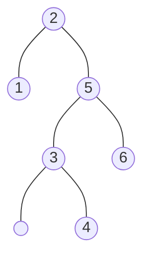
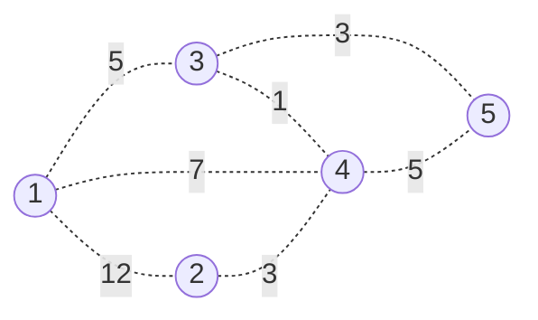
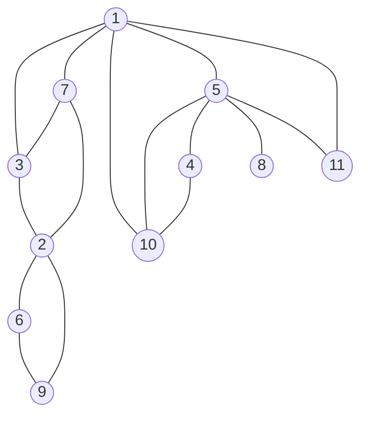
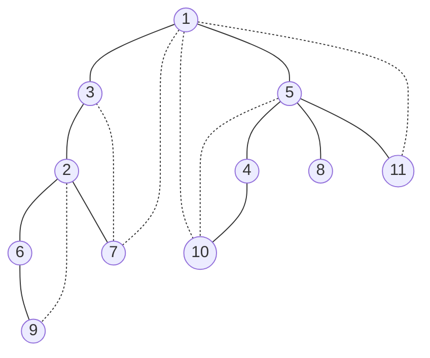
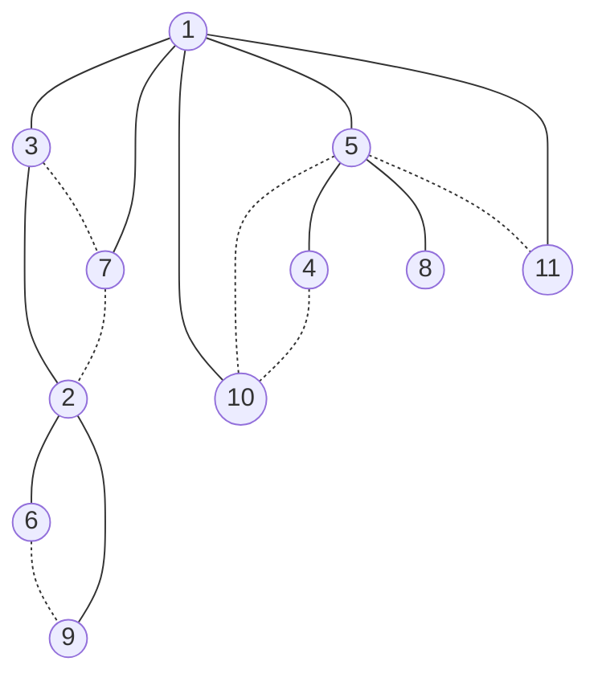

# Problem1

## a

- w~ij~

  - | j\i  | 0               | 1               | 2               | 3              | 4              | 5              | 6    |
    | ---- | --------------- | --------------- | --------------- | -------------- | -------------- | -------------- | ---- |
    | 0    | $\frac{1}{20}$  |                 |                 |                |                |                |      |
    | 1    | $\frac{3}{20}$  | $\frac{1}{20}$  |                 |                |                |                |      |
    | 2    | $\frac{9}{20}$  | $\frac{7}{20}$  | $\frac{1}{20}$  |                |                |                |      |
    | 3    | $\frac{12}{20}$ | $\frac{10}{20}$ | $\frac{4}{20}$  | $\frac{1}{20}$ |                |                |      |
    | 4    | $\frac{14}{20}$ | $\frac{12}{20}$ | $\frac{6}{20}$  | $\frac{3}{20}$ | $\frac{1}{20}$ |                |      |
    | 5    | $\frac{18}{20}$ | $\frac{16}{20}$ | $\frac{10}{20}$ | $\frac{7}{20}$ | $\frac{5}{20}$ | $\frac{1}{20}$ |      |
    | 6    | $\frac{20}{20}$ | $\frac{18}{20}$ | $\frac{12}{20}$ | $\frac{9}{20}$ | $\frac{7}{20}$ | $\frac{3}{20}$ | 0    |

- c~ij~&r~ij~

  - | j\i  | 0               | 1               | 2               | 3               | 4               | 5              | 6    |
    | ---- | --------------- | --------------- | --------------- | --------------- | --------------- | -------------- | ---- |
    | c0   | 0               |                 |                 |                 |                 |                |      |
    | r0   |                 |                 |                 |                 |                 |                |      |
    | c1   | $\frac{3}{20}$  | 0               |                 |                 |                 |                |      |
    | r1   | 1               |                 |                 |                 |                 |                |      |
    | c2   | $\frac{12}{20}$ | $\frac{7}{20}$  | 0               |                 |                 |                |      |
    | r2   | 2               | 2               |                 |                 |                 |                |      |
    | c3   | $\frac{19}{20}$ | $\frac{14}{20}$ | $\frac{4}{20}$  | 0               |                 |                |      |
    | r3   | 2               | 2               | 3               |                 |                 |                |      |
    | c4   | $\frac{26}{20}$ | $\frac{21}{20}$ | $\frac{9}{20}$  | $\frac{3}{20}$  | 0               |                |      |
    | r4   | 2               | 2               | 3               | 4               |                 |                |      |
    | c5   | $\frac{40}{20}$ | $\frac{33}{20}$ | $\frac{19}{20}$ | $\frac{10}{20}$ | $\frac{5}{20}$  | 0              |      |
    | r5   | 2               | 3               | 4               | 5               | 5               |                |      |
    | c6   | $\frac{47}{20}$ | $\frac{40}{20}$ | $\frac{24}{20}$ | $\frac{15}{20}$ | $\frac{10}{20}$ | $\frac{3}{20}$ | 0    |
    | r6   | 2               | 3               | 5               | 5               | 5               | 6              |      |

## b





# Problem2

## a

```c++
strunc employee
begin
    string name
    int salary
    employee[] sub
    int A
    int L
    int N
end employee

func Cal(T)
begin
    if len(T.sub ==0) then
        T.L = T.salary
        T.N = 0
        T.A = max(T.L,T.N)
        return
    endif
    for Child in T.sub
        Cal(Child)
        T.L += Child.N
        T.N += Child.A
    endfor
    T.A = max(T.L,T.N)
	return
end Cal
        
func GetList(T,List[string],layoffable)
begin
    SubLayOffAble = false
   	if layoffable && T.N < T.L then
        //layoff is better
        List.append(T.name)
    else
        //can't be laid off or keep is better
        SubLayOffAble = True
	endif
    if len(T.sub)==0 then
        return
    endif
    for Child in T.sub //will skip if no sub
        GetList(Child,List,SubLayOffAble)
    endfor
end GetList
        
func Main()
    *string[] List
    *employee T
    Cal(T)
    GetList(T,List,true)
    for employee in List
        println(employee)
    endfor
end main
```

## b

The Algorithm above calls on each employee twice and has constant operation on each employee(see the loop in the parent as the operation of child)

so for N employees, T(N)= 2cN

Therefore T(N)=O(N)

## c

Just change the layoffable parameter in GetList as False, this will ensure the CEO(root) will not be in the list.

```c++
func Main()
    *string[] List
    *employee T
    Cal(T)
    GetList(T,List,false)
    for employee in List
        println(employee)
    endfor
end main
```

# Problem3



- k=0

  - |      | 1        | 2        | 3        | 4    | 5        |
    | ---- | -------- | -------- | -------- | ---- | -------- |
    | 1    | 0        | 12       | 5        | 7    | $$\inf$$ |
    | 2    | 12       | 0        | $$\inf$$ | 3    | $$\inf$$ |
    | 3    | 5        | $$\inf$$ | 0        | 1    | 3        |
    | 4    | 7        | 3        | 1        | 0    | 5        |
    | 5    | $$\inf$$ | $$\inf$$ | 3        | 5    | 0        |

    k=1

    |      | 1        | 2        | 3    | 4    | 5        |
    | ---- | -------- | -------- | ---- | ---- | -------- |
    | 1    | 0        | 12       | 5    | 7    | $$\inf$$ |
    | 2    | 12       | 0        | 17   | 3    | $$\inf$$ |
    | 3    | 5        | 17       | 0    | 1    | 3        |
    | 4    | 7        | 3        | 1    | 0    | 5        |
    | 5    | $$\inf$$ | $$\inf$$ | 3    | 5    | 0        |

    k=2

    |      | 1        | 2        | 3    | 4    | 5        |
    | ---- | -------- | -------- | ---- | ---- | -------- |
    | 1    | 0        | 12       | 5    | 7    | $$\inf$$ |
    | 2    | 12       | 0        | 17   | 3    | $$\inf$$ |
    | 3    | 5        | 17       | 0    | 1    | 3        |
    | 4    | 7        | 3        | 1    | 0    | 5        |
    | 5    | $$\inf$$ | $$\inf$$ | 3    | 5    | 0        |

    k=3

    |      | 1    | 2    | 3    | 4    | 5    |
    | ---- | ---- | ---- | ---- | ---- | ---- |
    | 1    | 0    | 12   | 5    | 6    | 8    |
    | 2    | 12   | 0    | 17   | 3    | 20   |
    | 3    | 5    | 17   | 0    | 1    | 3    |
    | 4    | 6    | 3    | 1    | 0    | 4    |
    | 5    | 8    | 20   | 3    | 4    | 0    |

    k=4

    |      | 1    | 2    | 3    | 4    | 5    |
    | ---- | ---- | ---- | ---- | ---- | ---- |
    | 1    | 0    | 9    | 5    | 6    | 8    |
    | 2    | 9    | 0    | 4    | 3    | 7    |
    | 3    | 5    | 4    | 0    | 1    | 3    |
    | 4    | 6    | 3    | 1    | 0    | 4    |
    | 5    | 8    | 7    | 3    | 4    | 0    |

    k=5

    |      | 1    | 2    | 3    | 4    | 5    |
    | ---- | ---- | ---- | ---- | ---- | ---- |
    | 1    | 0    | 9    | 5    | 6    | 8    |
    | 2    | 9    | 0    | 4    | 3    | 7    |
    | 3    | 5    | 4    | 0    | 1    | 3    |
    | 4    | 6    | 3    | 1    | 0    | 4    |
    | 5    | 8    | 7    | 3    | 4    | 0    |

# Problem4

## a: Perfect Binary Tree

The idea here is to recursively call on the sub nodes in a DFS manner to check if they have 

- same level
- all nodes expect root have 2 or 0 sub nodes
- no circle
- all nodes are visited by comparing nodes visited to total nodes

If any of the above is not satisfied, the algorithm will directly return false

```c++
func CheckPerfectBinary(G[1...n][adj nodes],startpoint,source,visited[1...n])
begin
    int level = 0
    int totalNode =1
    visited[startpoint] = 1 //visited
    if len(G[startpoint])==1 then
        return true,level,totalNode //this is the leaf,retrun {is binary,level 0,total nodes 1}
    endif
    int subNode = 0
    int initChildLevel = -1
	for nodes in G[startpoint]
        //for visited nodes
        if visited[node] == 1 then
            if node == source then
                continue // skip the source of recursion
            else
                return false,0,0 // this means a node visited and not source found, would cause a circle in the graph, return false
            endif
      	endif
        //for unvisited nodes
        subNode++
        if subNode >2
            //this means we are having more edges than expected(already skipped the soruce edge, return false		
            return false,0,0
        endif
       	isPerfect,childLevel,nodeCount = CheckPerfectBinary(G,node,startpoint,visited) //recursively call the function on each subnode,startpoint now become the new source
        if !isPerfect then
            return false,0,0 //sub is not perfect, return
        endif
        if initChildLevel!= childLevel then
            if initChildLevel !=-1
            	//this means child has different level, which means is not perfect
            	return false,0,0
            endif
            initChildLevel = childLevel //this is the first child, use it's level as baseline
        endif
        totalNode+=nodeCount
    endfor
   	if subNode !=2 then
        return false,0,0 // this means this non-leaf node has more or less than two child, which will make this graph a non-full/perfect binary tree
    endif
    return true,initChildLevel++,totalNode //passed all check, this subtree is a perfect binary tree,return
end CheckPerfectBinary
        
func main()
begin
    int n //n nodes
    int visited[1...n] = 0 //a array to record if node is visited
    int G[1...n][adj nodes]//adj list
    isPerfect,childLevel,nodeCount = CheckPerfectBinary(G,1,0,visited)
    if isPerfect && nodeCount ==n then //check if visited node == total nodes, if not,means graph not connected, not binary tree
        print("isPerfect")
    else
        print("notPerfect")
    endif
end main
```

This algorithm calls on each vertex at constant operations, and the worst case here is to have checked a perfect binary tree, which is T(N)= cn, n as the number of vertex

The number of edges doesn't matter here, if a node with more edges than expected, this means it's not a perfect binary tree. And the algorithm will directly return false.

If loop exist or the graph is not connected, it will further reduce the time complexity by returning false early.

So the total time complexity is less than O(N+E) for we don't need to go through all edges if E>N-1

So in conclusion, the Time complexity of the algorithm is T(N) = O(N)

## b: Complete Binary Tree

This is very same as the previous algorithm expect we don't need to check for level

The idea here is to recursively call on the sub nodes in a DFS manner to check if they have 

- //same level
- all nodes expect root have 2 or 0 sub nodes
- no circle
- all nodes are visited by comparing nodes visited to total nodes

If any of the above is not satisfied, the algorithm will directly return false

```c++
func CheckCompleteBinary(G[1...n][adj nodes],startpoint,source,visited[1...n])
begin
    int totalNode =1
    visited[startpoint] = 1 //visited
    if len(G[startpoint])==1 then
        return true,totalNode //this is the leaf,retrun {is binary,total nodes 1}
    endif
    int subNode = 0
    
	for nodes in G[startpoint]
        //for visited nodes
        if visited[node] == 1 then
            if node == source then
                continue // skip the source of recursion
            else
                return false,0 // this means a node visited and not source found, would cause a circle in the graph, return false
            endif
      	endif
        //for unvisited nodes
        subNode++
        if subNode >2
            //this means we are having more edges than expected(already skipped the soruce edge, return false		
            return false,0
        endif
       	isComplete,nodeCount = CheckCompleteBinary(G,node,startpoint,visited) //recursively call the function on each subnode
        if !isComplete then
            return false,0 //sub is not complete, return
        endif
        totalNode+=nodeCount
    endfor
   	if subNode !=2 then
        return false,0 // this means this non-leaf node has more or less than two child, which will make this graph a non-complete/perfect binary tree
    endif
    return true,totalNode //passed all check, this subtree is a perfect binary tree,return
end CheckPerfectBinary
        
func main()
begin
    int n //n nodes
    int visited[1...n] = 0 //a array to record if node is visited
    int G[1...n][adj nodes]//adj list
    isComplete,nodeCount = CheckCompleteBinary(G,1,0,visited)
    if isComplete && nodeCount ==n then //check if visited node == total nodes, if not,means graph not connected, not binary tree
        print("isComplete")
    else
        print("notComplete")
    endif
end main
```

This algorithm calls on each vertex at constant operations, and the worst case here is to have checked a complete binary tree, which is T(N)= cn, n as the number of vertex

The number of edges doesn't matter here, if a node with more edges than expected, this means it's not a complete binary tree. And the algorithm will directly return false.

If loop exist or the graph is not connected, it will further reduce the time complexity.

So the total time complexity is less than O(N+E) for we don't need to go through all edges if E>N-1

So in conclusion, the Time complexity of the algorithm is T(N) = O(N)

## c:perfect k-ary tree

This is very same as the algorithm A expect we need to check subnode =k instead of 2

The idea here is to recursively call on the sub nodes in a DFS manner to check if they have 

- same level
- all nodes expect root have k or 0 sub nodes
- no circle
- all nodes are visited by comparing nodes visited to total nodes

If any of the above is not satisfied, the algorithm will directly return false

```c++
func CheckPerfectKary(G[1...n][adj nodes],startpoint,source,visited[1...n],k)
begin
    int level = 0
    int totalNode =1
    visited[startpoint] = 1 //visited
    if len(G[startpoint])==1 then
        return true,level,totalNode //this is the leaf,retrun {is k-ary,level 0,total nodes 1}
    endif
    int subNode = 0
    int initChildLevel = -1
    
	for nodes in G[startpoint]
        //for visited nodes
        if visited[node] == 1 then
            if node == source then
                continue // skip the source of recursion
            else
                return false,0,0 // this means a node visited and not source found, would cause a circle in the graph, return false
            endif
      	endif
        //for unvisited nodes
        subNode++
        if subNode > k
            //this means we are having more edges than expected(already skipped the soruce edge, return false		
            return false,0,0
        endif
       	isPerfect,childLevel,nodeCount = CheckPerfectKary(G,node,startpoint,visited,k) //recursively call the function on each subnode
        if !isPerfect then
            return false,0,0 //sub is not perfect, return
        endif
        if initChildLevel!= childLevel then
            if initChildLevel !=-1
            	//this means child has different level than other child, which means is not perfect
            	return false,0,0
            endif
            initChildLevel = childLevel //this is the first child, use it's level as baseline
        endif
        totalNode+=nodeCount
    endfor
   	if subNode !=k then
        return false,0,0 // this means this non-leaf node has more or less than k child, which will make this graph a non-full/perfect k-ary tree
    endif
    return true,initChildLevel++,totalNode //passed all check, this subtree is a perfect k-ary tree,return
end CheckPerfectBinary
        
func main()
begin
    int n //n nodes
    int visited[1...n] = 0 //a array to record if node is visited
    int G[1...n][adj nodes]//adj list
    int k //k ary
    isPerfect,childLevel,nodeCount = CheckPerfectKary(G,1,0,visited,k)
    if isPerfect && nodeCount ==n then //check if visited node == total nodes, if not,means graph not connected, not k-ary tree
        print("isPerfect")
    else
        print("notPerfect")
    endif
end main
```

This algorithm calls on each vertex at constant operations, and the worst case here is to have checked a perfect k-ary tree, which is T(N)= cn, n as the number of vertex

The number of edges doesn't matter here, if a node with more edges than expected, this means it's not a perfect k-ary tree. And the algorithm will directly return false.

If loop exist or the graph is not connected, it will further reduce the time complexity by returning false early.

So the total time complexity is less than O(N+E) for we don't need to go through all edges if E>N-1

So in conclusion, the Time complexity of the algorithm is T(N) = O(N)

# Problem 5

Original Graph



## a

DFST



| N    | 1    | 2    | 3    | 4    | 5    | 6    | 7    | 8    | 9    | 10   | 11   |
| ---- | ---- | ---- | ---- | ---- | ---- | ---- | ---- | ---- | ---- | ---- | ---- |
| DFN  | 1    | 3    | 2    | 8    | 7    | 4    | 6    | 10   | 5    | 9    | 11   |
| L    | 1    | 1    | 1    | 1    | 1    | 3    | 1    | 7    | 3    | 1    | 1    |

## b

- 1 is an articulation point for A has two sub trees
- 2 is an articulation point for it's subNode 6 and 9's L[6] and L[9]=DFN[2]
- 5 is an articulation point for it's subNode 8, L[8]=DFN[5]

## c

BFST




| N    | 1    | 2    | 3    | 4    | 5    | 6    | 7    | 8    | 9    | 10   | 11   |
| ---- | ---- | ---- | ---- | ---- | ---- | ---- | ---- | ---- | ---- | ---- | ---- |
| Dist | 0    | 2    | 1    | 2    | 1    | 3    | 1    | 2    | 3    | 1    | 1    |

# Bonus

- Assume we have a non-pseudo complete tree that is a OBST'
- So by definition or non-pseudo complete binary tree, there will be at least one leaf node at least two level higher than a not completed non-leaf node
- Thus if this tree rotates and fit this leaf node to the sub node two level higher than it's original location, it's height will be reduced by one level.
- By reducing the height of a single node, will improve the average efficiency of the BST, for each node is equal by the problem's definition.
- So there's a better BST than this so called OBST'
- So proved by contradiction, the OBST for the conditions described in the problem is a pseudo complete tree

