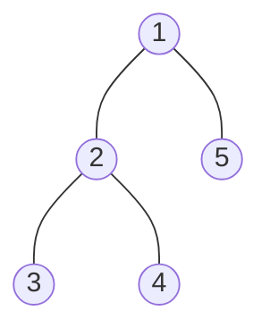
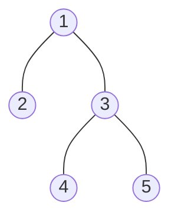
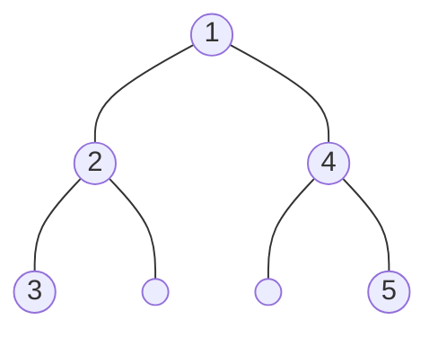

# Problem1

# Problem2

## a









## b

```c++
struct treenode
begin
    value int
    left *treenode
    right *treenode
end treenode
    
TreeGen(X[1:n],start,end)
begin
    T.value = X[start]
    //start as the root, also smallest
    mid = floor(start + 1 + end/2)
    if mid >= start + 1 then
        T.left = TreeGen(X,start+1,mid)
        //first half of remaining as left subtree
    endif
    if mid +1 <= end 
        T.right = TreeGen(X,mid+1,end)
        //second half of remaining as right subtree
    endif
    return T
end TreeGen
   	
```


# Bonus

- Basic step

  for tree T with one node, $$min(T)=root(T)$$

- Induction step

  Assume we have a canonically labeled tree of n nodes who's root is the minimum.

  When adding a new node to it and keep it cononical.

  From the defination of the cononical labeled tree, the sub nodes need to be larger than the root. So that the new pre-order traversal remains sorted.

  So the new node should be larger than the root.

  Thus, for the new canonically labeled tree with n+1 nodes, the root still remains minimum.

  Therefore, min(T~n~)=root(T~n~) and min(T~n+1~)=root(T~n+1~)

  Q.E.D

