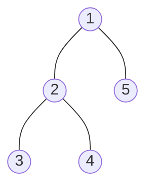
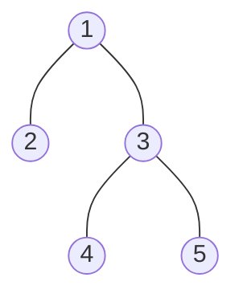
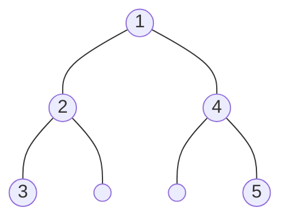
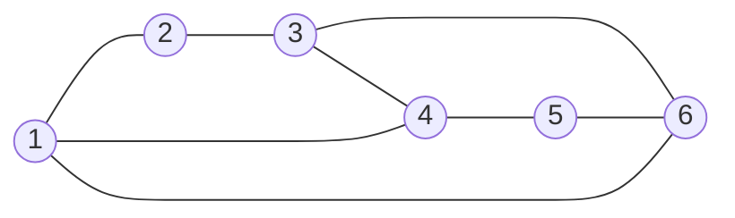
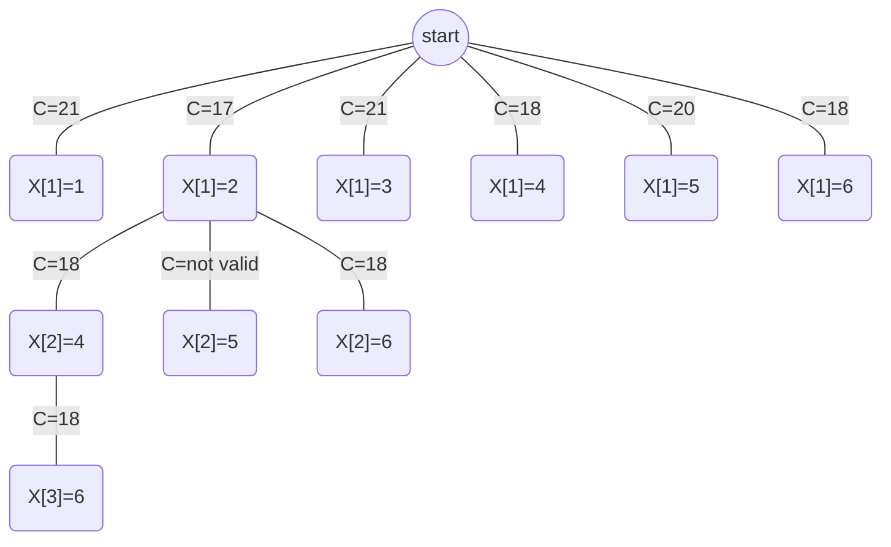
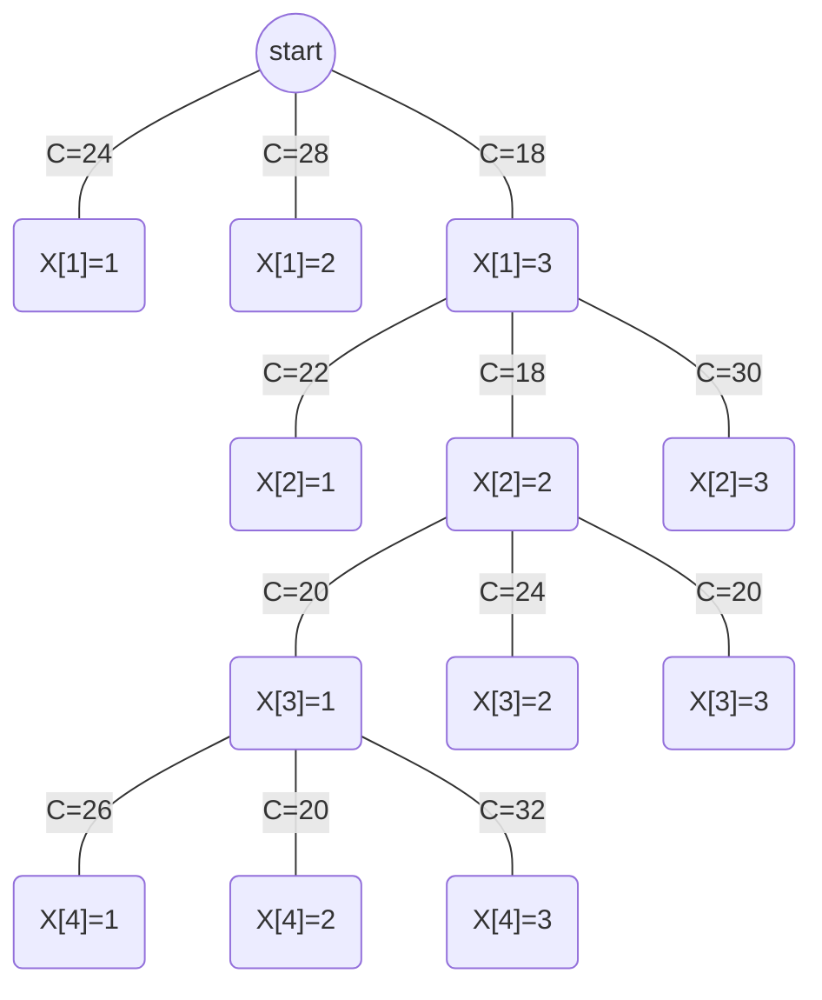
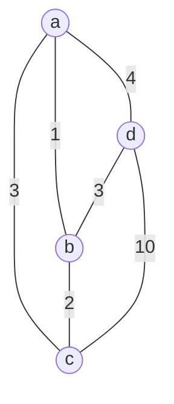

# Problem 1

## a

- Bound
  - N=n
  - S={1,2,....,n}
  - X[i] represents f(i)
  - C: 
    - $$ \forall i \neq j,X[i] \neq X[j]$$
    - $$ \forall i \lt j,A[X[i]] \leq A[X[j]]$$
    - $$\forall i>1,A[X[i]] \geq A[X[i-1]]$$
  - a~0~ = 0, m=n, a~m~ = n

```c++
Func Bound(A[1:n],X[1:n],r)
begin
    if r == 1 then
        return true
    endif
    if A[X[r]] < A[X[r-1]] then
        return false
    endif
    for i=1 to r-1 do
        if X[r] == x[i] then
            return false
        endif
    endfor
    return true
end Bound
```

## b

Bound

- N=n

- S={0,1}

- X[i] represents f(i)

- C: 

  - $ \forall X[i]=1, \sum(X[i]) < C$

- a~0~ = 0, m=n, a~m~ = n

- ```c++
  Func Bound(A[1:n],C,X[1:n],r)
  begin
      int sum = 0
      for i=1 to r do
          if X[i] == 1 then
              sum += A[i]
          endif
      endfor
      if sum < C
      	return true
      endif
      return false
  end Bound
  ```

# Problem 2
>>>>>>> f70b73258667cc417b134e63ab3c1ee6ee9794cc

## a









## b

```c++
struct treenode
begin
    value int
    left *treenode
    right *treenode
end treenode
    
TreeGen(X[1:n],start,end)
begin
<<<<<<< HEAD
    T.value = X[start]
    //start as the root, also smallest
    mid = floor(start + 1 + end/2)
    if mid >= start + 1 then
        T.left = TreeGen(X,start+1,mid)
        //first half of remaining as left subtree
    endif
    if mid +1 <= end 
=======
    int mid = 0
    int min = n
    //start as the root, also smallest
    for i=start to end do
        if X[i] < min then
            min = X[i]
            mid = i
        endif
    endfor
    T.value = min
    if mid > start then
        T.left = TreeGen(X,start,mid-1)
        //first half of remaining as left subtree
    endif
    if mid < end 
>>>>>>> f70b73258667cc417b134e63ab3c1ee6ee9794cc
        T.right = TreeGen(X,mid+1,end)
        //second half of remaining as right subtree
    endif
    return T
end TreeGen
<<<<<<< HEAD
   	
```


=======

main()
begin
    TreeGen(X[1:n],1,n)
end main
   	
```

## c

Bound

- N=n
- S={1,2,....,n}
- X[i] represents the inorder traversal of T upon a canonically labeled tree.
- C: 
  - $$ \forall i \neq j,X[i] \neq X[j]$$
  - The tree generated should be a canonically labeled tree
- a~0~ = 0, m=n, a~m~ = n

```c++
Func Bound(X[1:n],r)
begin
    for i=1 to r-1 do
        if X[r] == x[i] then
            return false
        endif
    endfor
    if r == n then
        return ConflictCheck(X[1:n],1,n,1)
        //if conflict in pre-order and in-order, return false
    endif
    return true
end Bound
            
Func ConflictCheck(X[1:n],start,end,*root)
begin
    int mid = 0
    for i=start to end
        if X[i]==root
          	mid = i
        endif
    endfor
    if mid == 0 then
        return false
        // the next root is not found in the check, this is a conflict
    endif
    if mid > start then
        if !ConflictCheck(X[1:n],start,mid-1,root++) then
            //next root is not found in the left branch, return false
            return false
        endif
    endif
    if mid < end then
        //all left is checked, goto check right branch
        if !ConflictCheck(X[1:n],mid+1,end,root++) then
            return false
        endif
    endif
    return true
end ConflictCheck
```

After generated all valid inorder traversal of T, use the function in problem 2.b to generate the trees needed.

# Problem 3

## a

An apporximate cost function for this k-node independent set question could be: The weight of l nodes so far + weight of k-l minimum non-adjecent nodes

$$ \hat{C}(N) = csf(l) + \sum_{i=l+1}^{k}w(i),i !adjecent$$

For the left min-weighted nodes might be adject to themselfs, the real cost will be higher or eq than $\hat C(N)$

thus, $$ \hat C(N) \leq C(N)$$ for every node N

and for the result, the value will be only cost so far,

thus, $\hat C(N) = C(N)$ for every result node.

According to the Theorem, this apporximate cost function will be valid for this B&B problem.

## b



| i      | 1    | 2    | 3    | 4    | 5    | 6    |
| ------ | ---- | ---- | ---- | ---- | ---- | ---- |
| weight | 9    | 8    | 7    | 6    | 5    | 4    |



As can be seen in the solution tree, the minimum-weight 3-node independent set is (2,4,6) adding up to 18 in weight.

# Problem4

## a

One possible $\hat{C}$ for this problem is the cost so far + the minimum cost for all future jobs for employees with less than $\lceil{\frac{n}{2}}\rceil$ jobs

$$ \hat{C}(f) = \sum_{i=1}^{k}C_{i,X[i]} +\sum_{i=k+1}^{n}min(C_{i,X[i]}\ for \ jobs(X[i])  \leq \lceil{\frac{n}{2}}\rceil)$$

For the remaining min effort taking jobs might be all belong to a single employee, if this employee has  $\lceil{\frac{n}{2}}\rceil$ jobs, the job need to be reassigned to other employee, thus the real cost will be higher or eq than $\hat C(f)$

thus, $$ \hat C(f) \leq C(f)$$ for every job node f

and for the result, the value will be only cost so far,($\sum_{i=1}^{n}C_{i,X[i]}$)

thus, $$\hat C(f) = C(f)$$ for every result job node.

According to the Theorem, this apporximate cost function will be valid for this job assign problem.

## b



So after the solution tree, the jobs assignment f for these 4 jobs are [3,2,1,2] which will just cost 20 in total.


# Problem 5

## a

Basic Idea:

- find minimum weighted edge to a non-visited node, then goto that node
- repeat till all nodes are visited
- go back to start

```c++
greedTST(A[1:n][1:n])
begin
    visited[1:n]=0
    startPoint = 1
    currPoint = startPoint
    totalWeight =0 
    for i = 1 to n do
        min = inf
        minMarker = 0
        for j = 1 to n do
            if j == currPoint then
                continue
            endif
            if A[currPoint][j] < min && visited[j] == 0 then
                min = A[currPoint][j]
                minMarker = j
            endif
        endfor
        totalWeight += A[currPoint][minMarker]
        visited[minMarker] = 1
        currPoint = minMarker
    endfor
    totalWeight += A[currPoint][startPoint]
    return totalWeight
end greedTST
```

For time complexity, the algorithm has visited n nodes and calculated n edges for each node. Totaly n*n operations.

Thus, T(n) = O(n^2^)

## b



For the most optimal case, a->c->b-d->a will add up to 12

But the greedy algorithm in section a will choose a->b->c->d->a which will add up to 17

So the greedy algorithm is not necessarily optimal in this TST problem

## c

Basic idea for D&C is

- divde nodes into two half recursively
- return 0 when only have one node
- upon merge, choose the least weighted edge to connect two child path
- after finish all merge, add the edge from start to end to make the hamilton path a hamiltion circle.

```c++
DCTST(A[1:n][1:n],start,end)
begin
    if start == end then
        return 0,start,end
    endif
    mid = floor(start+end)/2
    leftWeight,lstart,lend = DCTST(A[1:n][1:n],start,mid)
    rightWeight,rstart,rend = DCTST(A[1:n][1:n],mid+1,end)
    minWeight = leftWeight + rightWeight + min(A[lstart][rstart],A[lstart][rend],A[lend][rstart],A[lend][rend])
    newStart,newEnd = (the two points not in the minWeight Edge)
    return minWeight,newStart,newEnd
end DCTST
        
main()
begin
    weight,start,end = DCTST(A[1:n][1:n],1,n)
    weight += A[start][end]
    print(weight)
end main
```

For time complexity, this algorithm calls on it's half recusrively and does constant operation on each recursion.

T(n) = 2T(n/2)+c = cn

Thus, T(n) = O(n)

## d


For the most optimal case, a->c->b-d->a will add up to 12

But the DC algorithm in section c will choose a->b->c->d->a which will add up to 17

So the DC algorithm is not necessarily optimal in this TST problem
>>>>>>> f70b73258667cc417b134e63ab3c1ee6ee9794cc

# Bonus

- Basic step

  for tree T with one node, $$min(T)=root(T)$$

- Induction step

  Assume we have a canonically labeled tree of n nodes who's root is the minimum.

  When adding a new node to it and keep it cononical.

  From the defination of the cononical labeled tree, the sub nodes need to be larger than the root. So that the new pre-order traversal remains sorted.

  So the new node should be larger than the root.

  Thus, for the new canonically labeled tree with n+1 nodes, the root still remains minimum.

  Therefore, min(T~n~)=root(T~n~) and min(T~n+1~)=root(T~n+1~)

  Q.E.D

