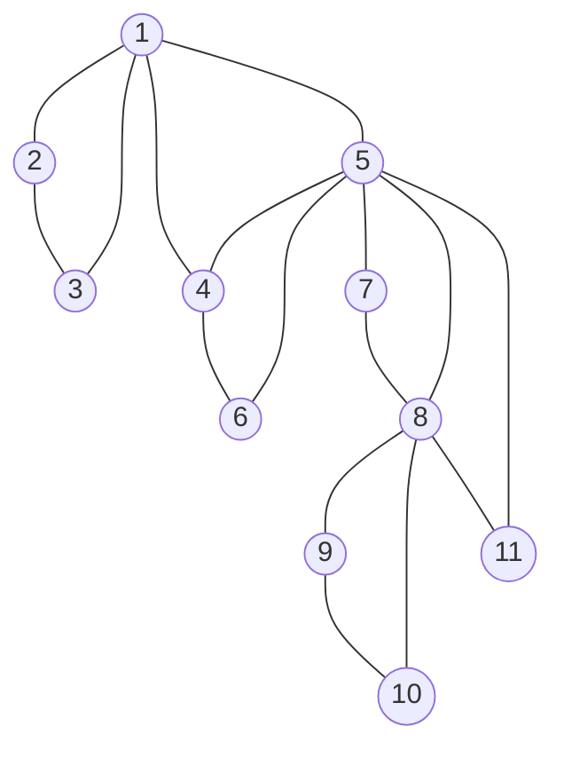
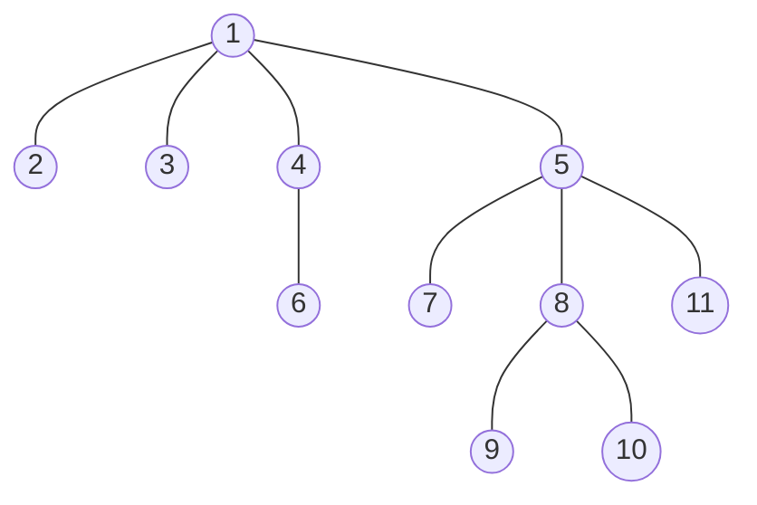
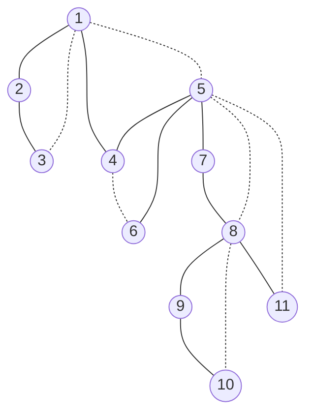
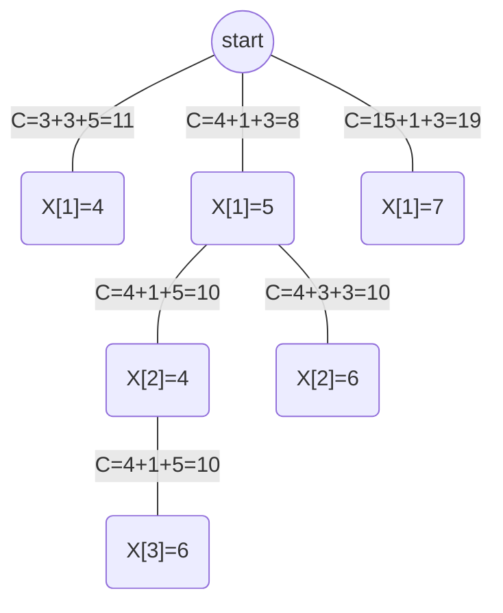

# Problem 1

Graph




## a:

BFS



## b

DFS



| N    | 1    | 2    | 3    | 4    | 5    | 6    | 7    | 8    | 9    | 10   | 11   |
| ---- | ---- | ---- | ---- | ---- | ---- | ---- | ---- | ---- | ---- | ---- | ---- |
| DFN  | 1    | 2    | 3    | 4    | 5    | 6    | 7    | 8    | 9    | 10   | 11   |
| L    | 1    | 1    | 1    | 1    | 1    | 4    | 5    | 5    | 8    | 8    | 5    |

For AP,

1 is an AP, for 1 is the root of DFST and it has more than one child

8 is an AP, for 8's child 9, has L[9]>=DFN[8]

5 is an AP, for 5's child 7, has L[7]>=DFN[5]

# Problem 2

- Representations

  - N=n

  - S={1,2,..,m}

  - X[i] represents node i in A has an edge to node X[i] in B

  - $$
    C:\forall i \neq j,X[i] \neq X[j]
    $$

```c++
Func Bound(A[1:n],X[1:n],r)
begin
    for i=1 to r-1 do
        // check conflict with previous edges
        if X[r] == X[i] then
            return false
        endif
    endfor
    // no conflict
    return true
end Bound
```

# Problem 3

## a

An apporximate cost function for this question could be: The weight of k edges so far + minimum weight of n-k edges starting from n-k unselected nodes in A to unselected nodes in B


$$
\hat{C}(N) = cost\ so\ far +min(edges\ from\ unselected\ nodes)
$$

$$
\hat{C}(N) = \sum_{i=1}^{k}W_{i,X[i]} +\sum_{i=k+1}^{n}min(W_{i,X[i]}, for \ X[i]\ not \ selected\ yet)
$$

For the remaining min-weighted edges might belong to same node in B, which is not reachable, so the real cost will be higher or eq than $$\hat C(N)$$

thus, $$\hat C(N) \leq C(N)$$ for every node N

and for the result, the value will be only cost so far($$\sum_{i=1}^{n}W_{i,X[i]}$$),

thus, $$\hat C(N) = C(N)$$ for every result node.

According to the Theorem, this apporximate cost function will be valid for this B&B problem.

## b



The optimal solution is the first result node, so the edges selected is (1,5),(2,4),(3,6)

The solution tree visit order is X[1]=4, X[1]=5, X[1]=6, X[2]=4, X[2]=6, X[3]=6

# Problem 4

- The basic idea is
  - break down to single number by D&C
  - upon merge, return
    - first number
    - last number
    - starting point of longest ramp
    - length of longest ramp
    - length of longest ramp from beginning
    - length of longest ramp till ending.
  - use the first number, last number in the merge stage to calculate new
    - starting point of longest ramp
    - length of longest ramp
    - length of longest ramp from beginning
    - length of longest ramp from ending.
  - after finished all merges, the starting point of longest ramp and length of longest ramp will be the answer

``` c++
// get Ramp takes an real number array
// get Ramp returns first_number,last_number, start of longest ramp, length of ramp, lenght of ramp from first number, lenght of ramp till last number
func getRamp(x[1:n])
begin
    //return if only one element
    if n == 1 then
        return x[1],x[1],1,1,1,1
    endif
    int mid
    mid = floor(n/2)
    //recursive call on half
    l_first,l_last,l_start_point,l_length,l_left_length,l_right_length = getRamp(x[1:mid])
    r_first,r_last,r_start_point,r_length,r_left_length,r_right_length = getRamp(x[mid+1:n])
    int start_point,length,left_length,right_length
    double first,last
    //gen new left length
    if l_left_length == mid && l_last < r_first then
        //extend left
        left_length = l_left_length + r_left_length
    else 
        left_length = l_left_length
    endif
    //gen new right length
    if r_right_length == n-mid+1 && l_last < r_first then
        //extend right
        right_length = r_right_length + l_right_length
    else 
        right_length = r_right_length
    endif
    //gen new total length in middle
    length = 0
    if l_last < r_first then
    	length = l_right_length + r_left_length
        start_point = mid - l_right_length + 1
    endif
    //compare with left
    if l_length > length then
        length = l_length
        start_point = l_start_point
    endif
    //compare with right
    if r_length > length then
        length = r_length
        start_point = mid + r_start_point
    endif
    //return
    return x[1],x[n],start_point,length,left_length,right_length
end getRamp
        
func main(A[1:n])
begin
    first,last,start,length,left_len,right_len = getRamp(A[1:n])
    int end
    end = start + length - 1
    printf("longest ramp in A is A[%d,%d]",start,end)
end main
```

About Time Complexity, the D&C algorithms above is recursively split the input into two half and calls themselves, then each recursive call it self does constant operations. So
$$
T(1)=c\\
T(N)=2*T(\frac{N}{2})+c\\
Therefore\\
T(N)=O(N)
$$


 