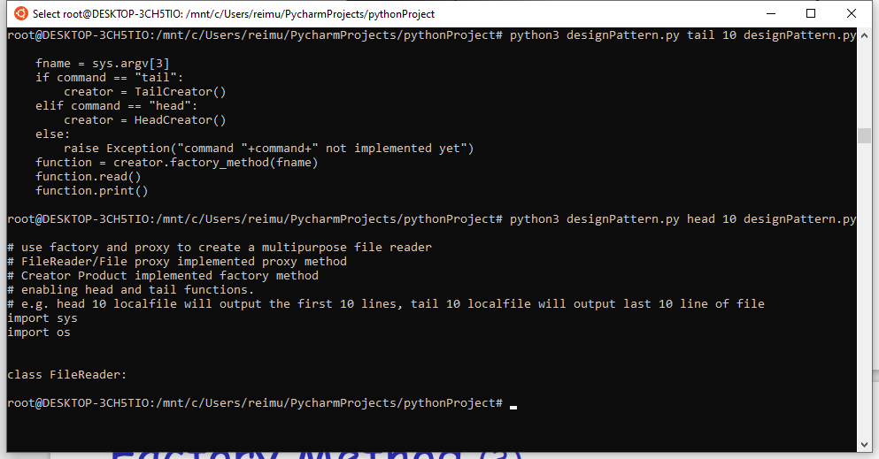

This python 3.9 code used factory method and proxy to create a simple file reader

FileReader/File proxy implemented proxy method 

Creator/Product implemented factory method

# Use

- `head {lines} {localfile}`
  - to output first {lines} lines of {localfile}
- `tail {lines} {localfile}`
  - to output last {lines} lines of {localfile}

