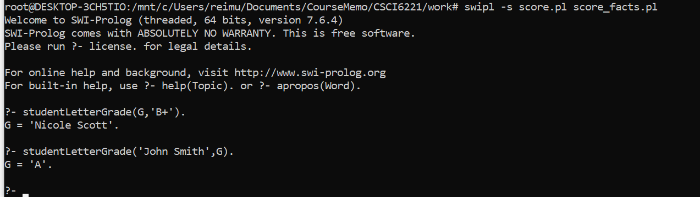

Online version: https://onlinegdb.com/IvpVkoz2P

- 1&2:
  - Use `swipl -s score.pl score_facts.pl` command to load both code and facts into the runtime.
  - See score_facts.pl for sample fact input format, edit accordingly.
- Query student's letter grade
  - `studentLetterGrade('John Smith',G).`
- Query student(s) whose letter grade matches to an input letter grade
  - `studentLetterGrade(G,'B+').`

Sample result shown below

