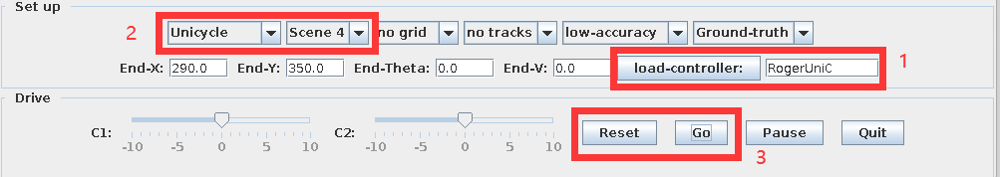
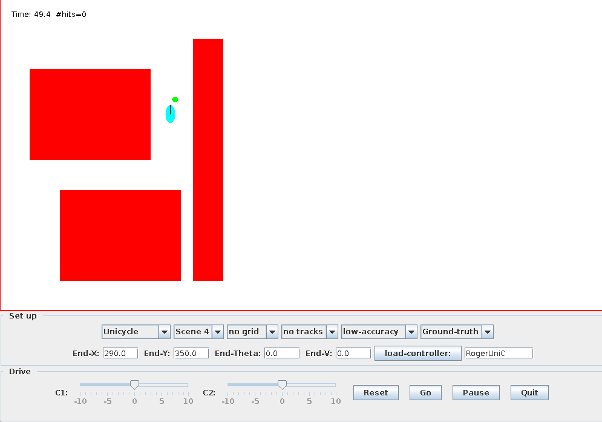
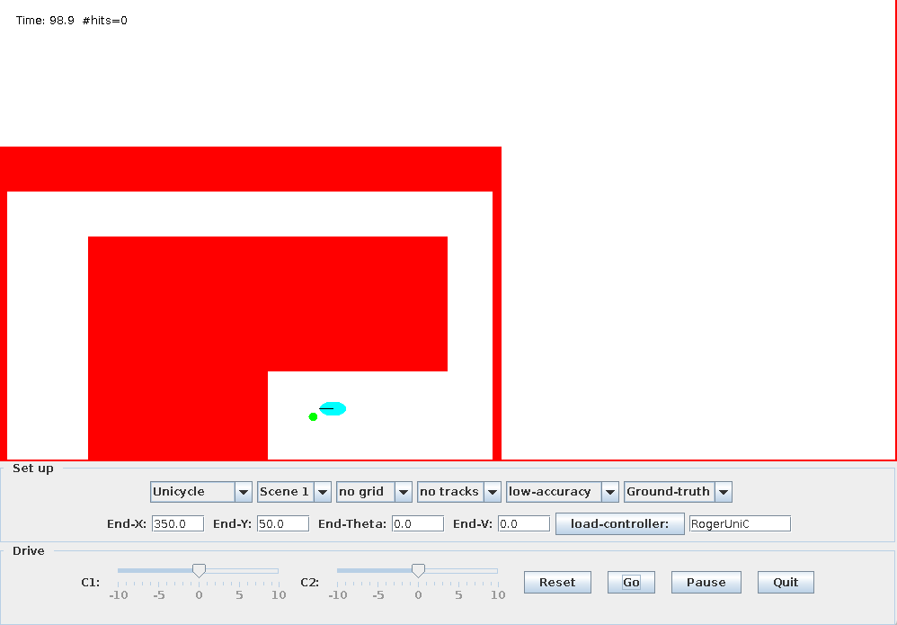
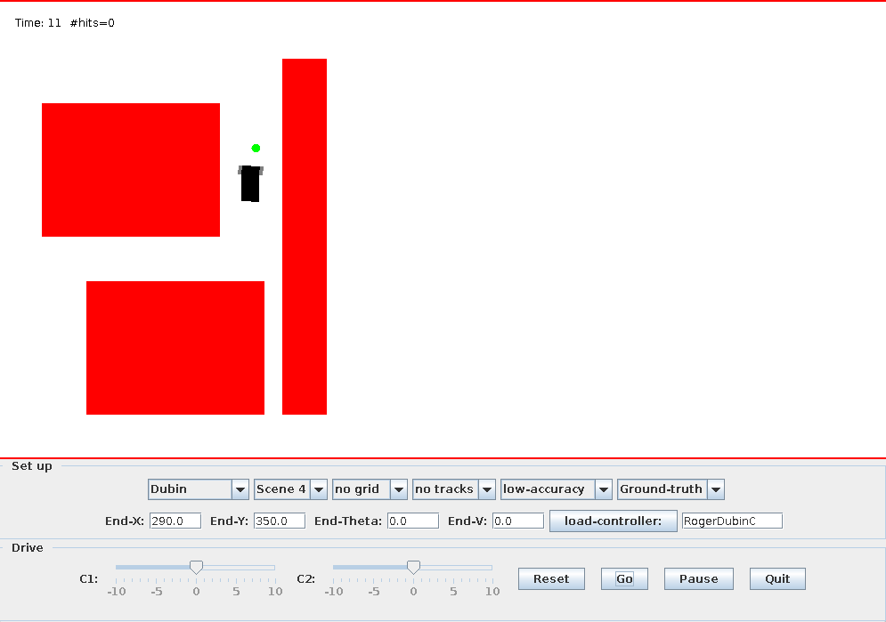
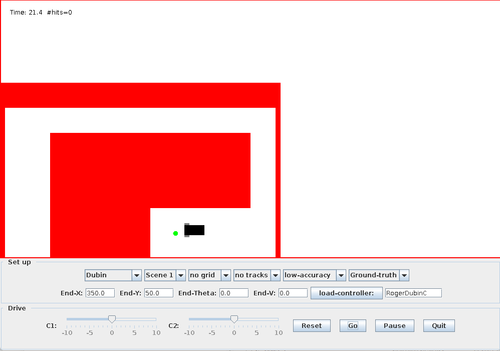

## Instruction for running simulator

1) Firstly unzip the file
   1) `unzip roger2.zip`
2) Go into the unzipped folder (this may vary, please cd into your unzipped location)
   1) `cd roger2`
3) Run CarGUI
   1) `java CarGUI auto`
4) Now the panel should appear,
5) 
   1) First Enter `RogerUniC` for unicycle controller or `RogerDubinC` for Dubin controller, then hit `load-controller` button
   2) Choose `Unicycle` or `Dubin` according to the controller you've loaded. Choose `Scene 4` or `Scene 1` for testing
   3) Hit the `Reset` Button, Then Hit the `Go` Button. The simulation should be running by now
6) Sample Run Results
   1) Unicycle Scene4
      1) 
   2) Unicycle Scene1
      1) 
   3) Dubin Scene4
      1) 
   4) Dubin Scene1
      1) 
7) As can be seen in the results, all simulation achieves the goal with no hit.

## Design Documents

### Path Finding

There are two main thing I've been mainly thinking about when I'm designing the path finding algorithm for this carsim.

- Keep the path away from the obstacles from a certain margin
  - (This part is implemented in `RogerDubinC.java:70`)
  - I achieve this by Split the canvas into 100 x 100 grid.
  - Then find block that has intersection with obstacles, then fill them with a positive number, like 3
  - Then find all block neighboring 3 and fill them with 2.
  - Find all blocks neighboring 2 and fill them 1.
  - Now all blocks that are near obstacles are marked with a positive number.
  - We run Astar algorithm on these blocks, and only return blocks with 0 when we call `getNeighbor` function.
  - After these process, A line with certain margin to all obstacles will be returned.
- Keep the final path as straight as possible, that means, removing unnecessary turnings
  - (This part is implemented in  `CBPlannerAStar:142`)
  - Another thing is that AStar Algorithm tend to keep the line as near to the obstacles as possible.
  - And this makes a line with a lot of turning around the obstacles. But this is not what I wanted.
  - Thus I have taken previous direction into consideration.
  - Instead of using `Cost So far + Estimated cost to goal`, I added direction change as a weight. So if going to the next block will require a direction change, I'll add 2 to the overall cost. If still going the same direction, no cost will be added.
  - So the final A* cost is calculated by `CostSoFar+EstimatedCostToGoal+TurningPenality`
  - This function will end up in a simple path with all long straight lines.

### Car Driving Strategy

- After We have the path to follow, the next part is to figure out how to make the car follow the path we've calculated.

- One of the difficulties is the dubin car is longer than it's width, so turning around without moving will cause the car to hit wall in certain narrow spaces.

  - To resolve this issue, I make the car to start turning 3 block ahead of the block in the calculated path.

  - For Dubin, I used

    - ```java
      if (thetaDiff>0.3) {
          //turn left
          phi = 10;
          vel = 1;
      }else if (thetaDiff<-0.3) {
          //turn right
          phi = 1;
          vel = 10;
      }else{
          //move forward
          phi = 10+thetaDiff*10;
          vel = 10-thetaDiff*10;
      }
      ```

  - For Unicycle, I used

    - ```java
      if (thetaDiff>0.3){
          //turn left
          phi = 5;
          vel = 10;
      }else if (thetaDiff<-0.3) {
          //turn right
          phi = -5;
          vel = 10;
      }else{
          //move forward
          phi = thetaDiff*10;
          vel = 10;
      }
      ```

  - So as you can see, they are all turning while moving instead of turning while staying at the same place.

  - And this strategy avoids the unnecessary space that is required for turning with out moving. And result in a faster overall speed.


