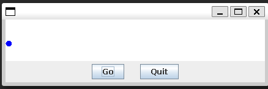
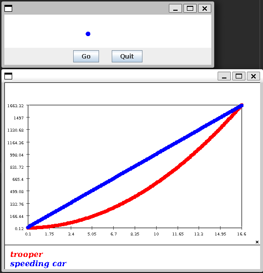
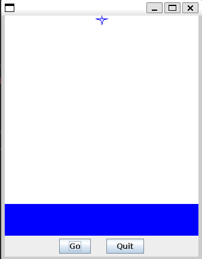
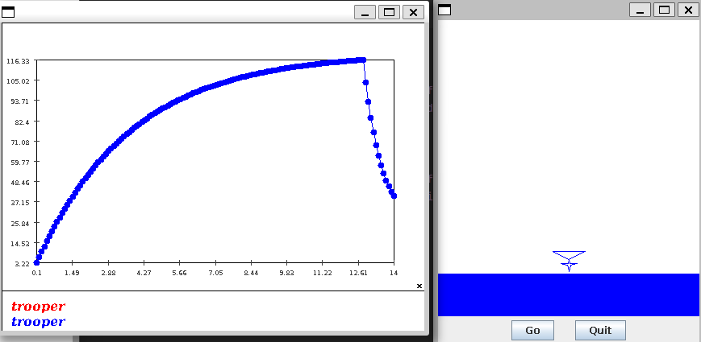
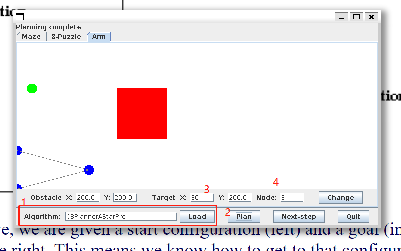
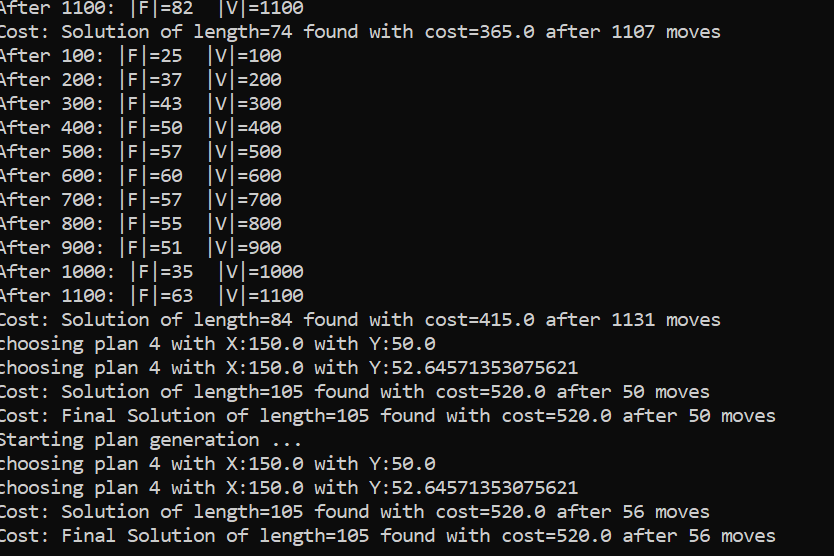
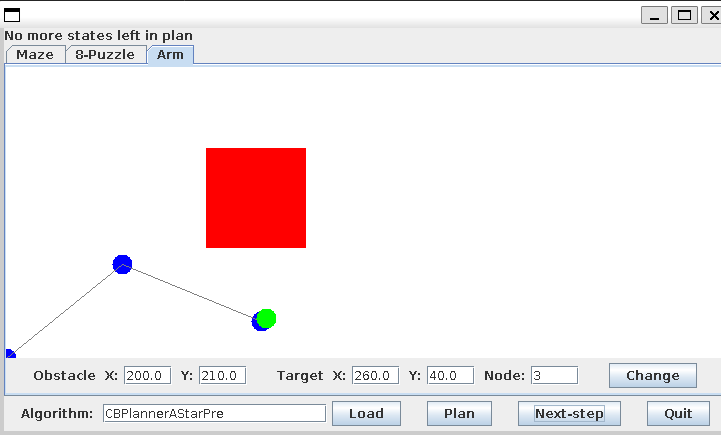
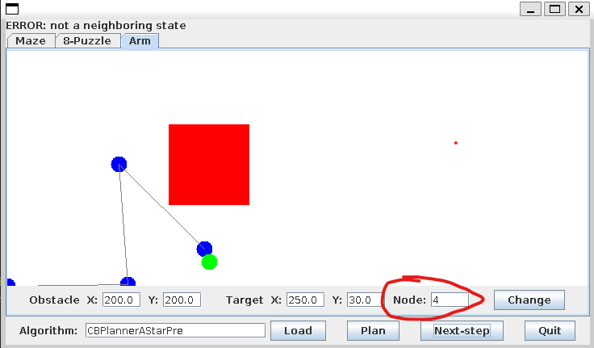

## Assignment3

### 1

- Instruction

- cd into the folder containing my homework java files

- compile and run the code as follows

- ```bash
  javac StateTrooperRoger.java
  java StateTrooperRoger
  ```

- You should see the GUI now.

- 

- Hit the `Go` button when you are ready.

- Sample result

  - 

- Answers to the questions are in the console output

- ```
  time used:16.599999999999966
  distance used:1663.32 
  trooper's speed:199.19999999999953
  ```

- For the distance, the program is using second * Miles/hour, so we need a conversion to make sense
  - 1663.32 (mile/h*second) = 0.462 mile

### 2

- cd into folder containing my homework java files

- compile and run the code as follows

- ```bash
  javac SkydiverRoger.java
  java SkydiverRoger
  ```

- You should see the GUI now.

- 

- Hit the `Go` button when you are ready.

- Sample result& velocity plot

- 

- You can see the skydiver's icon has a chute on it once it's deployed.

- The chute should be opened at 12.8s for the skydiver to land with a velocity less than 40 feet/sec

### 3

See `CBPlannerAStarPre.java` for code integration

Instruction for running codes

- cd into the unzipped folder

- run the following code to compile and run the GUI

- ```java
  javac CBPlannerAStarPre.java
  javac PlanningGUIRoger.java
  java PlanningGUIRoger
  ```

- You should see the GUI running by now

- 

- Change to tab `Arm`, and enter `CBPlannerAStarPre` in the Algorithm then hit the `Load` button.

- Once the GUI shows load complete, hit the `Plan` Button.

- You can change the Target X,Y and hit `Change` Button. Then hit `Plan` button again to see performance on different points.

- If you have changed the location of obstacles, please allow more processing time for the pre-calculations will be regenerated.

- Sample result

- 

- 

- You can also change the node from 3 to 4 and hit the Change Button to see how this program works on 4 node.

- 

 ### 3 Answers

- Then select a few new targets and compare regular A* with your new algorithm, which we'll call pre-A*. How will you choose which pre-stored plan to use? Alternatively, you could run all 5 of them (by stepping through each in turn). How often does pre-A* outperform A*?
  - intuitively, I chooses the plan which has the least distance between the plan's ending point and the goal.
  -  In 10 out of 10 tests the pre-A outperforms A*, pre-A often find solutions just with less than 100 moves from pre-defined routes but A\* need more than 1000 steps from beginning.
- [Optional for undergrads] Experiment with *k* and implement a parallel search, in which you treat each pre-stored plan as a separate search from that starting point, stepping through each in turn. At what values of *k* does the parallel-search become worse than the single run of A*? To make a fair comparison, add up the total time for a number of different goal states.
  - With the increase of K, if we are to include the time used for pre-calculating K-routes, When K is significantly larger than the count of different goal states. The pre-A will become worse than A*
- [Optional for undergrads] Use an arm with 4 links instead of 3. How does this change your findings? You can change the number of links by setting `numLinks=4` in `ArmProblem.java`.
  - I have made a customization in the GUI panel so you can enter 4 in the node blank and hit `Change` button to set the arm to 4 nodes.
  - When Arm is using 4 nodes, the calculation of A* becomes significantly harder. A typical solution will need more than 20k steps to achieve. And using pre-A doesn't help to reduce the time needed in this process.