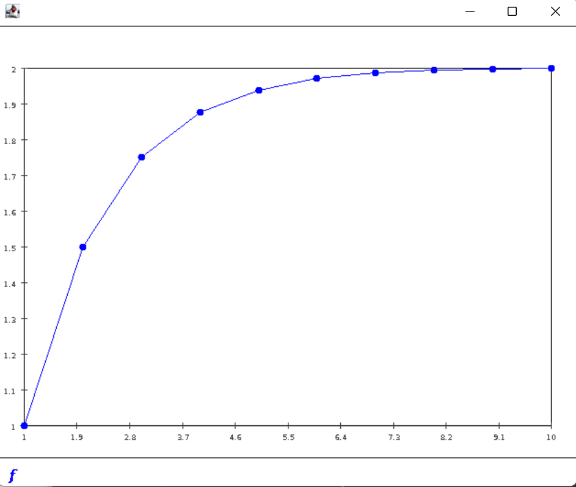
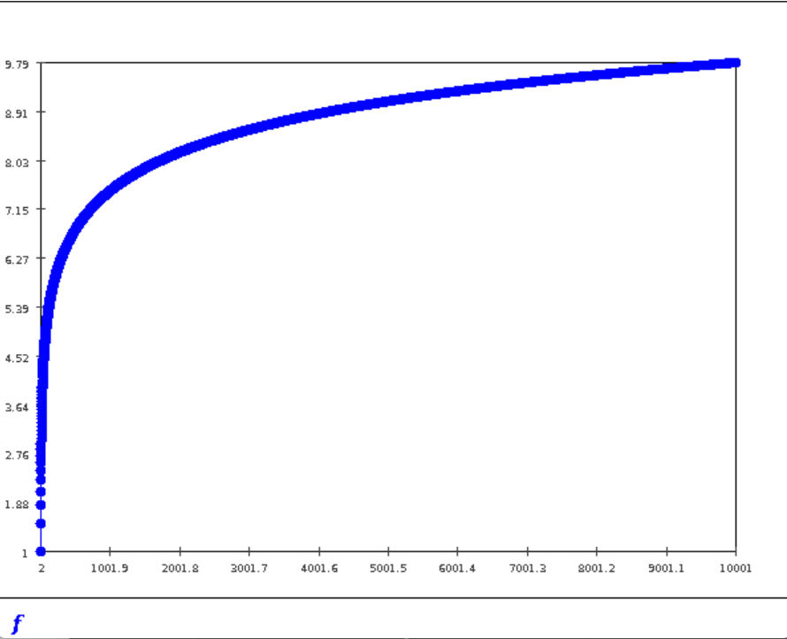

### **In-Class Exercise 1:**

-  Are integers also real numbers? 
  - Yes
- What are rational numbers and how are they different from integers or reals?
  - rational number: a number that can be expressed as a ratio of integers 
  - rational number include non-integers.
  - real number also include irrational numbers in addition to rational numbers.

### In-Class Exercise2:

- What about rationals? 
  - Yes
- Is there a rational number between every two rational?
  - Yes, we can multiply both number's divisor and divider by 2 and get their average. It will also be a rational number.

### **In-Class Exercise 3:**

- How do the sizes of the naturals compare with the integers? 
  - They can be seen as same size from set definition
- What about the size of the rational compared to integers?
  - The rational is the same size of integers

### **In-Class Exercise 4:**

- see Bisection.java
- sqrt(3)=1.734375

### **In-Class Exercise 5**

- 1.73205080757
- change Math.abs (f(m)) > 0.0001
  - sqrt(3)=1.7320556640625
- It can be written recursively, But since all the later steps requires previous step. There is no space for parallelization so writing in recursive will only slow down the function by adding function overhead.

### **In-Class Exercise 6:**

- see `Zeno.java`

### **In-Class Exercise 7:**

- see `Zeno.java`
- Plot
- 
- 

### In-Class Exercise 8:

- see `Harmonic.java`
- Plot
  - 

### In-Class Exercise 9:

- see `SequenceExample.java`

- Plot

  - 

    

### In-Class Exercise 10:

- see `SequenceExample2.java`

### In-Class Exercise 11:

- see `randomsequence2.java`
- $U_n$ is random in [0,1] so no limit
- $V_n$ should have limit to 0.5 when n is large enough

### In-Class Exercise 12:

