### **In-Class Exercise 1:**

-  Are integers also real numbers? 
  - Yes
- What are rational numbers and how are they different from integers or reals?
  - rational number: a number that can be expressed as a ratio of integers 
  - rational number include non-integers.
  - real number also include irrational numbers in addition to rational numbers.

### In-Class Exercise2:

- What about rationals? 
  - Yes
- Is there a rational number between every two rational?
  - Yes, we can multiply both number's divisor and divider by 2 and get their average. It will also be a rational number.

### **In-Class Exercise 3:**

- How do the sizes of the naturals compare with the integers? 
  - They can be seen as same size from set definition
- What about the size of the rational compared to integers?
  - The rational is the same size of integers

### **In-Class Exercise 4:**

- see Bisection.java
- sqrt(3)=1.734375

### **In-Class Exercise 5**

- 1.73205080757
- change Math.abs (f(m)) > 0.0001
  - sqrt(3)=1.7320556640625
- It can be written recursively, But since all the later steps requires previous step. There is no space for parallelization so writing in recursive will only slow down the function by adding function overhead.

### **In-Class Exercise 6:**

- see `Zeno.java`

### **In-Class Exercise 7:**

- see `Zeno.java`
- Plot
- 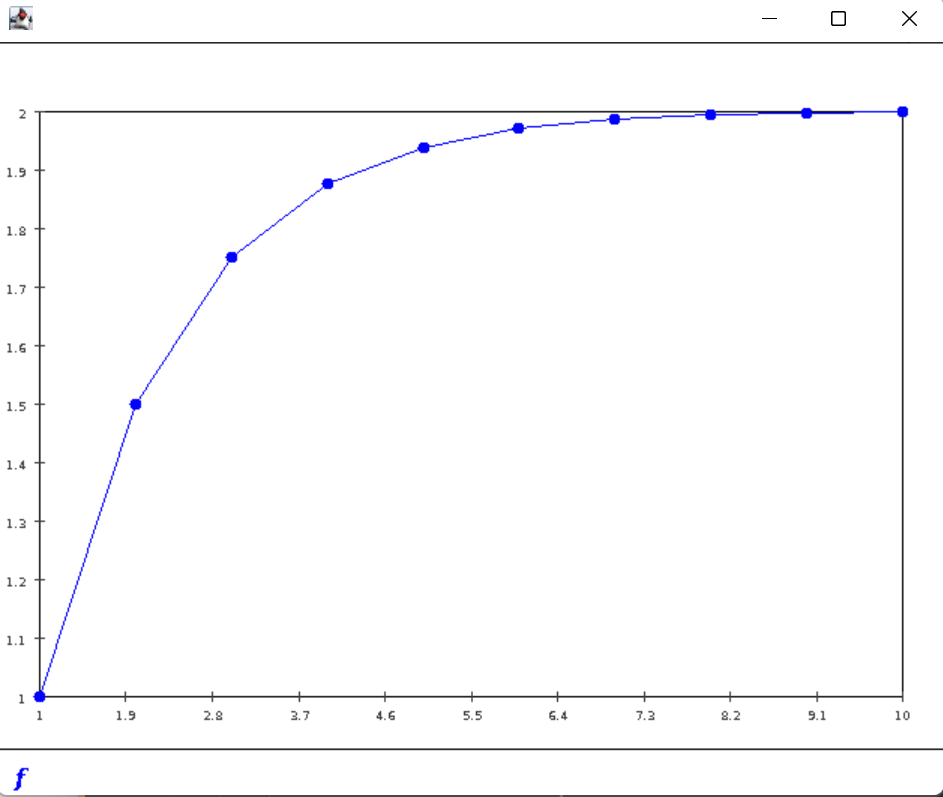
- 

### In-Class Exercise 8:

- see `Harmonic.java`
- Plot
  - 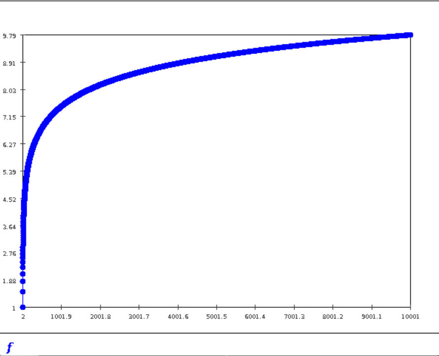

### In-Class Exercise 9:

- see `SequenceExample.java`

- Plot

  - 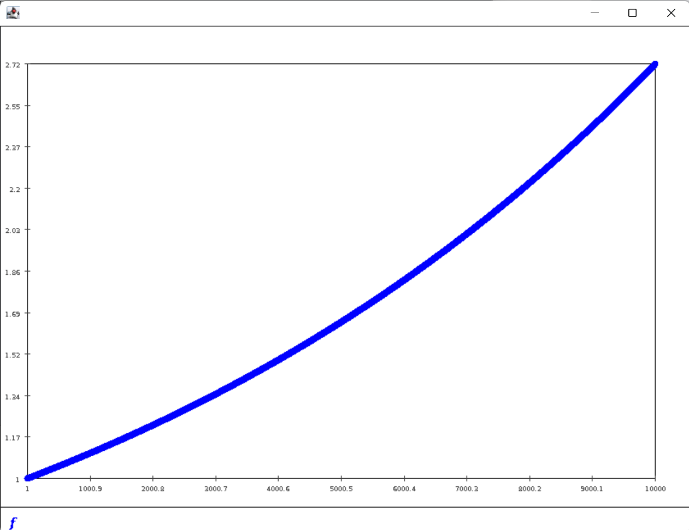

    

### In-Class Exercise 10:

- see `SequenceExample2.java`

### In-Class Exercise 11:

- see `randomsequence2.java`
- $U_n$ is random in [0,1] so no limit
- $V_n$ should have limit to 0.5 when n is large enough

### In-Class Exercise 12:

- See `histogram.java`
- histogram become more flat with increased samples
- It is intuitive
- histogram of U is the same in $U_{493}$ than $U_5$ for n is not passed into the function

### In-Class Exercise 13:

- The Histogram of $V_{493}$ is more sharp than $V_5$

- ```
  Histogram for V
    b=   0: [0.490, 0.492]     18
    b=   1: [0.492, 0.494]    177
    b=   2: [0.494, 0.496]    865
    b=   3: [0.496, 0.499]   2204
    b=   4: [0.499, 0.501]   3024
    b=   5: [0.501, 0.503]   2343
    b=   6: [0.503, 0.505]   1083
    b=   7: [0.505, 0.508]    250
    b=   8: [0.508, 0.510]     33
    b=   9: [0.510, 0.512]      2
  ```

### In-Class Exercise 14:

- $W_5$ is similar to $W_{493}$

- ```
  Histogram for W_10000
    b=   0: [-1.112, -0.897]     14
    b=   1: [-0.897, -0.681]     73
    b=   2: [-0.681, -0.466]    448
    b=   3: [-0.466, -0.250]   1382
    b=   4: [-0.250, -0.035]   2603
    b=   5: [-0.035, 0.180]   2880
    b=   6: [0.180, 0.396]   1740
    b=   7: [0.396, 0.611]    702
    b=   8: [0.611, 0.827]    140
    b=   9: [0.827, 1.042]     17
  ```

- 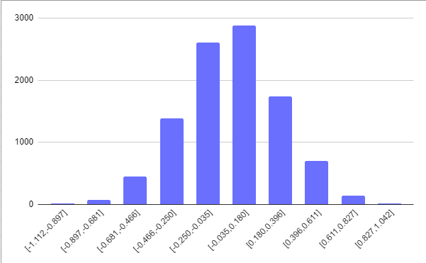

- $W^{'}_5$
- 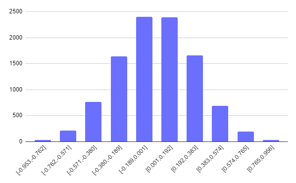
- $W^{'}_{493}$
- 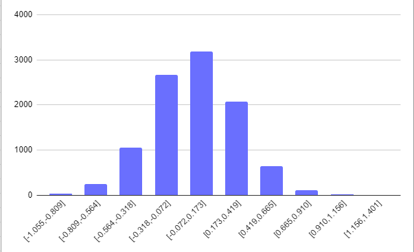

### Exercise 15:

- Like timestamp, if an application uses int as timestamp, then after year 2038 it will overflow
- 2 is a bad input for any Binary function

### Exercise 16:

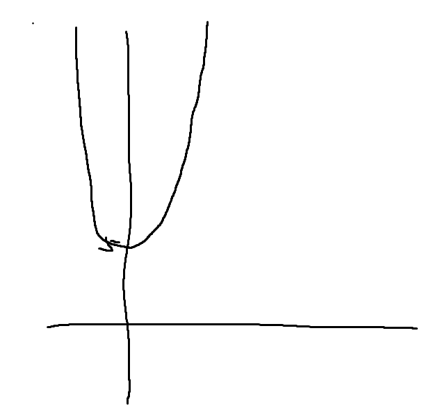

- Domain  $\in[-\inf,+\inf]$
- Range $\in[3,+\inf]$

### Exercise 17:

- Yes, it's the same as I expected in 16

### Exercise 18:

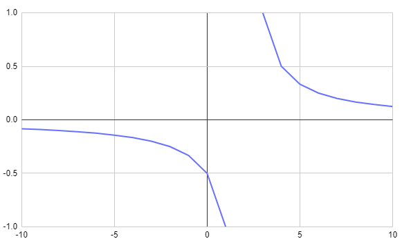

### Exercise 19:

```
 x   f(x)
---------
-10.0  -0.08333333333333333
-9.0  -0.09090909090909091
-8.0  -0.1
-7.0  -0.1111111111111111
-6.0  -0.125
-5.0  -0.14285714285714285
-4.0  -0.16666666666666666
-3.0  -0.2
-2.0  -0.25
-1.0  -0.3333333333333333
0.0  -0.5
1.0  -1.0
```

### Exercise 20:

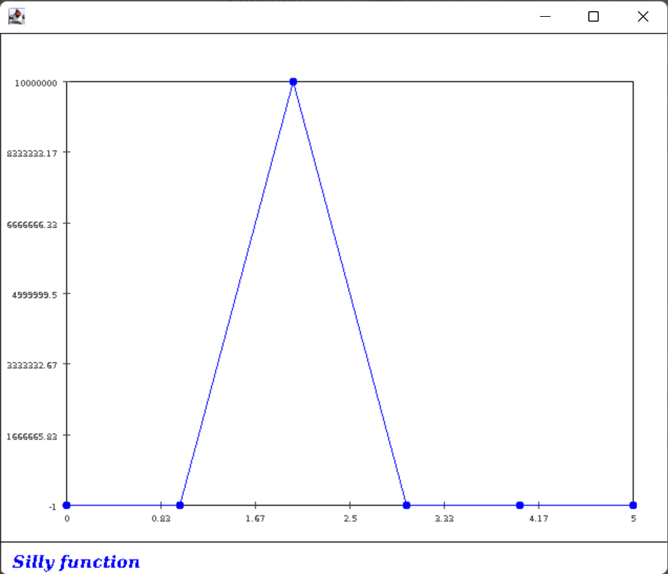

### Exercise 21:

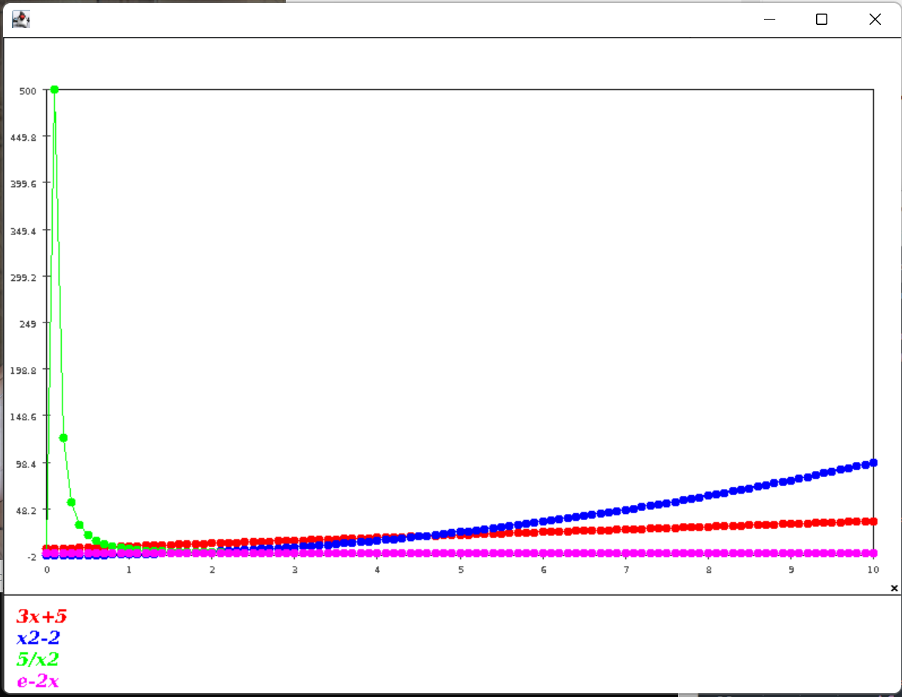

### Exercise 22:

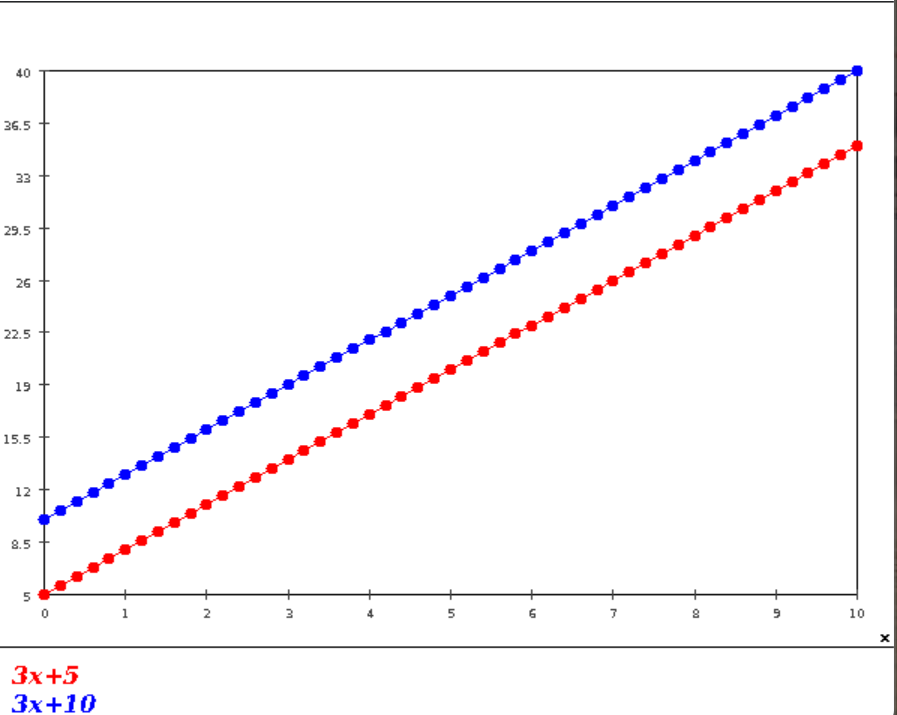

### Exercise 23:

- it doesn't matter for value. but if we want to know the position of two function then it matters for the sign of distance.
- f-h vs h-f has same value with different sign

### Exercise 24:

see `FunctionComparison2.java`

### Exercise 25:

The value become larger, this means the distance method will change with samples we are taking

### Exercise 26:

- The value doesn't change with samples we are taking
- Distance f to g: 5.05
- Distance f to g: 7.5750000000000055, It some how tells us the average difference between function but not very useful

### Exercise 27:

- Distance f to g: 25.5
- No, it's not severely affected

### Exercise 28:

Interval is applied to every measurement instead of sum so it functions the same as above

### Exercise 29:

Result become 0 for 10 and 50 are all int, 10/50 = 0

### Exercise 30:

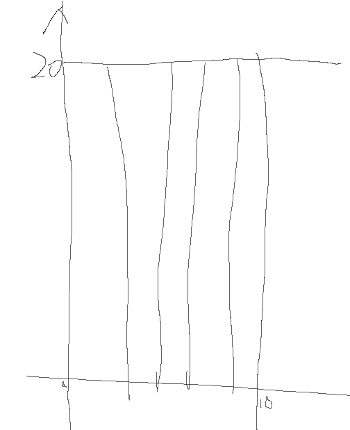

sum = 4* 20* (10) /4

the sum is the actual area

### Exercise 31:

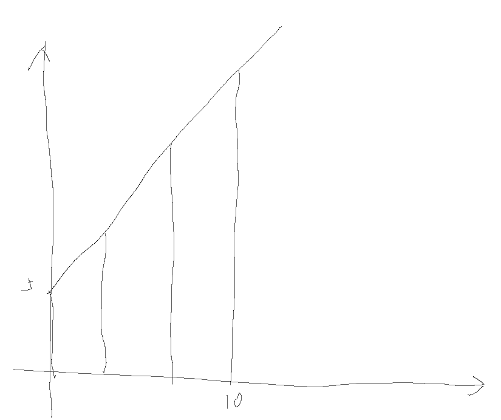

- if we increase the interval then the sum is more accurate to the area.
- Sum = (5+35)/2 *10 = 200

### Exercise 32:

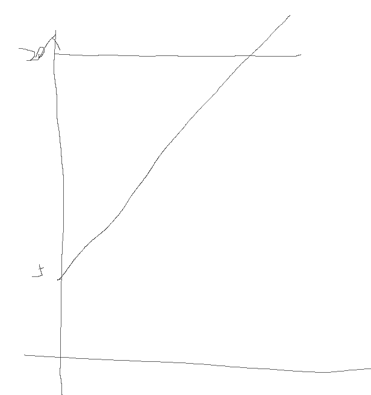

This Distance measure is identical to area if measurement is large enough

 ### Exercise 33:

Because a is fixed and x^y = 90 degree so the new triangle is just doubled by the original triangle. So x and y are also doubled with r.

### Exercise 34:

sin(4pi/3)=-0.8660254037844384

- Because the sin function range $\in [-1,1]$
- This means the angle is below the x axis so sin produces a negative number
- $\frac {4\pi}{3} = 240 \degree$
- The result is the same.Because $2\pi = 360\degree$ so it could be ignored for sin.

### Exercise 35:

- Because they are using sin and cos as function
- the period is $2\pi$

### Exercise 36:

Max value -0.9991351502732795 occurred at x=3.1000000000000014

We can make search interval smaller or relate to pi to make result more accurate.

### Exercise 37:

The rules are abstraction of data (aka information) We can save a lot space and calculation by discovering rules rather than use data directly

### Exercise 38:

f(x)=3.1415*x + 2.717

### Exercise 39:

Same as above

### Exercise 40:

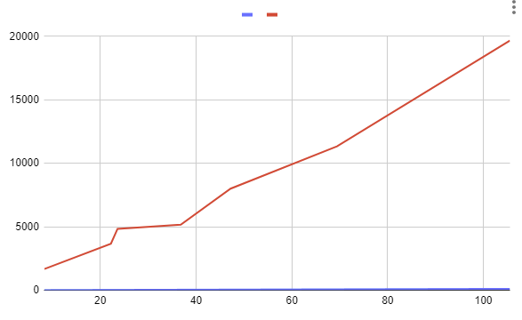

It's non-linear

### Exercise 41

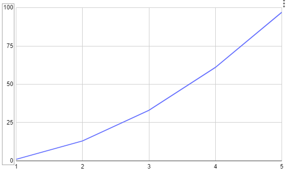

Non-lenear

### Exercise 42:

use Excel `=A168*A168+B168*B168`

```
		x2+(f(x))2.
0.5	4.97	24.9509
1.5	4.77	25.0029
2.5	4.33	24.9989
3.5	3.57	24.9949
4.5	2.18	25.0024
```

### Exercise 43:

Yes, g is the derivative of f

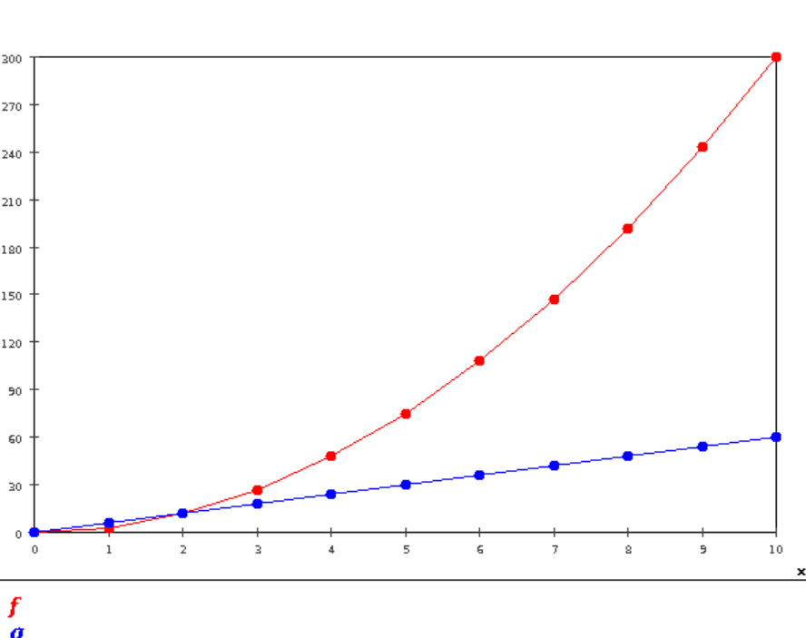

### Exercise 44:

- The G(x) is the same with the old function
- g(x) = 0.03 + 6*x
- With smaller d, the g(x) is more accurate to the real derivative of f(x)


### Exercise 45:

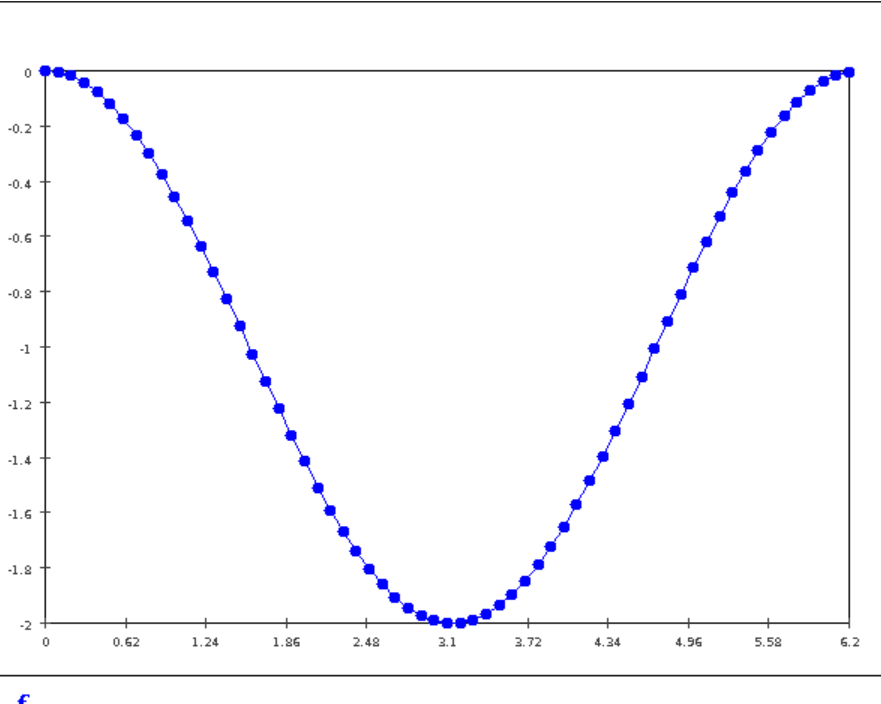

### Exercise 46:

Should be $g(x)=x^2$

### Exercise 47:

Change the calculation in double s to a for loop to generate next element using the previous result.

```
for (double i =1;i<=7;i=i+2){
	s += current;
	current = current*x*x/((i+1)*(i+2))
}
```

Math.sin, it's accuracy is higher

### Exercise 48:

- see `MyController.java`
- Good accel function should be maximum accel and then max deaccel to stop at the end
- we can use binary search to search for the point to change from accel to deaccel

### Exercise 49:

$ f_n(x) = x^2 + n$

