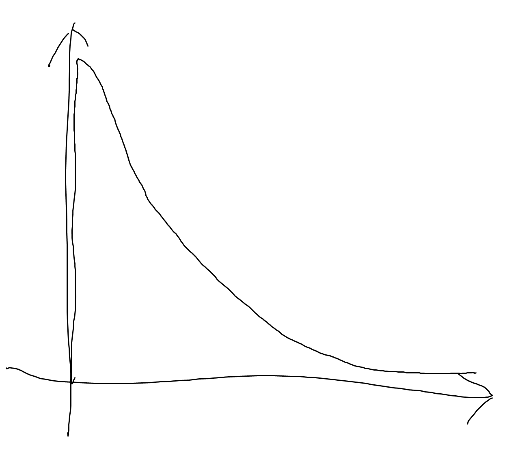
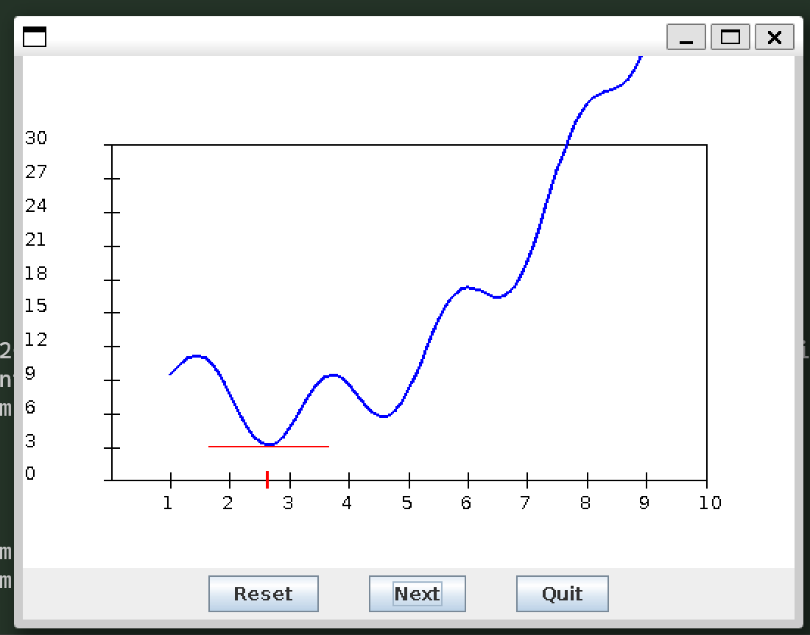

## Exercise 6

- O(MN)
- best M=6, N=4
  - result = 2.5003

## Exercise 7



### Exercise 8

M*N evaluations

## Exercise 9

## Exercise 10

Bracketing search: x1=4.691358024691359 x2=3.2098765432098757 numFuncEvals=138

## Exercise 16:

- around 100 iters

- step become smaller

- ```
  X:2.484 ,afx:-1.484
  X:3.3744 ,afx:-0.8904000000000001
  X:3.90864 ,afx:-0.5342399999999999
  X:4.229184 ,afx:-0.32054399999999994
  X:4.4215104 ,afx:-0.19232639999999998
  X:4.5369062399999995 ,afx:-0.11539584000000006
  X:4.606143744 ,afx:-0.06923750400000017
  X:4.6476862464 ,afx:-0.041542502400000104
  X:4.67261174784 ,afx:-0.02492550143999992
  X:4.687567048704 ,afx:-0.01495530086399981
  X:4.6965402292224 ,afx:-0.008973180518399815
  X:4.70192413753344 ,afx:-0.005383908311040031
  X:4.705154482520064 ,afx:-0.0032303449866240897
  ```

- The function doesn't converge at $\alpha$=1, it overshoots over the optimal

- The program can't normally function at $\alpha$=10

## Exercise 17:



- Yes, it converge at 2.6
- It is also 0.

## Exercise 18

Yes, simply f(x)=sin(x)

## Exercise 19:

If s is too large, then the derivative is not very precises and can cause over shoot problem or even miss the global minimum.  

## Exercise 20:

This won't work because it will force x1 and x2 both to move even if the x1 or x2 is already at it's optimal value.


## Exercise 21:

$f_1^{'}=2*(x_1-4.71)+4(x_1-4.71)*(x_2-3.2)^2$

$f_2^{'}=2*(x_2-3.2)+4(x_1-4.71)^2*(x_2-3.2)$

## Exercise 22:

$f_1^{'} = \frac{1}{\mu_1}$

$f_2^{'} = \frac{1}{\mu_2}$

## Exercise 23:

We will be calculating the gradient based on the new x1, which is not the correct gradient at the moment.

## Exercise 24:

```
Gradient descent: after n=542 iterations: x1=4.704951324783355 x2=3.1949999982061064
```

## Exercise 25:

X around 0.3 provides best performance

## Exercise 26:

