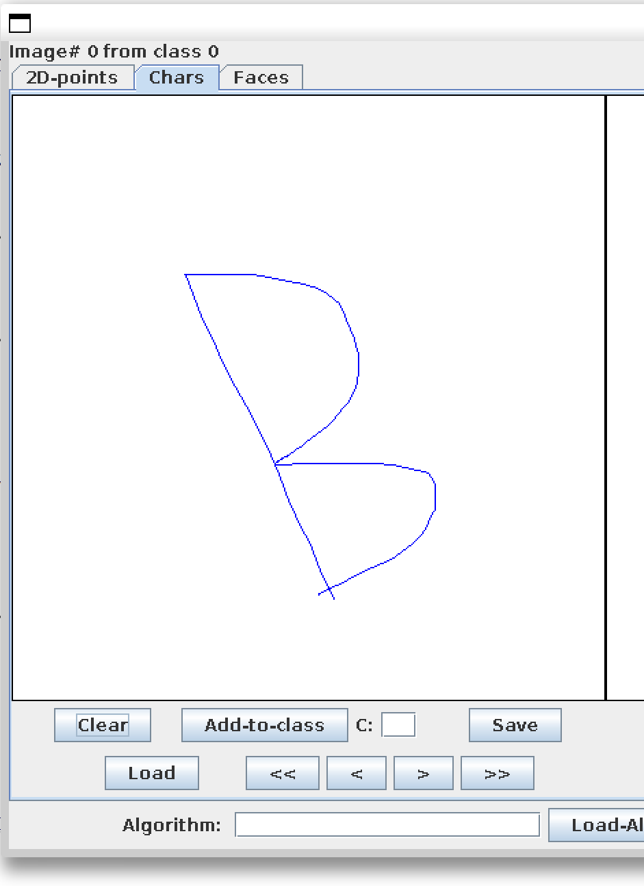
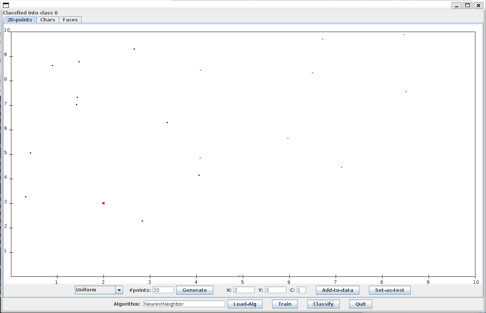
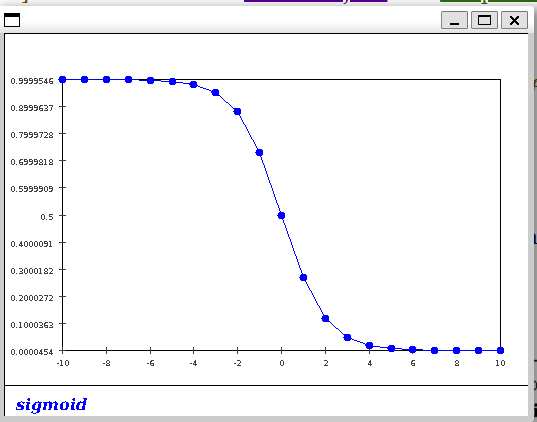

### Exercise 1

Yes, google

### Exercise 2

- It's harder because the split-uniform dataset overlaps
- 

- The first guy have more varitey

### Exercise 3

The screen output has 5 point in each class corresponding to the train set

### Exercise 4

- We can use either pixel of the char or vector(start end point of a line segment) of the char
- g.drawLine (x1,y1, x2,y2);
-  The char with more curves will create more line segments. Like B or C.

### Exercise 5

- The size of the image by the color depth.
- No, they are not the same. it depends on the image size.

### Exercise 6

The arm problem

### Exercise 7

- The third input dimension
- The first value of third input dimension
- The label corresponding to the third input dimension

### Exercise 8

- If I create a point with different class near a wrong class point, the classifier will go wrong.
- Distance is meaningless in char problem

### Exercise 9

train time: M*M

run time: M

A priority queue is best for storing nearest neighbor.

A 2d hash map representing approx location of each point is best for calculation.

### Exercise 10

1,000,000 * 0.1 M = 100G Calculations

MSE between two images can represent it's distance

### Exercise 11

0.24

After change, Pr[Error]=0.135

Maybe there are a lot of class 0 samples to be tested. So changing answer to class 0 when distance is equal will increase the correctness.

### Exercise 12

class0: 0.397

class1: 0.603

### Exercise 13

Pr[X=3|C=0]= 0.091

Pr[X=3|C=1]= 0.609

- because this two number is the value of  prob X3 in C=0. All prob value of X in C=0 add up to 1
- More likely to come from class1

### Exercise 14:

     Pr[X=0|C=1]=0
     Pr[X=1|C=1]=0.05
     Pr[X=2|C=1]=0.1
     Pr[X=3|C=1]=0.6
     Pr[X=4|C=1]=0.1
     Pr[X=5|C=1]=0.15

## Exercise 15:

Pr[E]=0.13099

## Exercise 16:

Pr[E3]=0.09967510726420475

After change to 0.9

Pr[E3]=0.5937170010559663

## Exercise 17:

- PR =0.4

Pr[X=x|C=0]Pr[C=0] =  0.04

Pr[X=x|C=1]Pr[C=1] = 0.36

- Pr = 0.9

Pr[X=x|C=0]Pr[C=0] =  0.09

Pr[X=x|C=1]Pr[C=1] = 0.06

## Exercise 18:

When data is not 1d, like class 0 are in  a circle. And outside the circle are all class 1

## Exercise 19:

It is decided by different wi but not a single wi

## Exercise 20:

We can apply derivative on each wi so it's differentiable

## Exercise 21:

- Result doens't changes much

## Exercise 22:

To check if the new trained parameter is better or worse than the previous ones.

## Exercise 23:

We can compress the x axies of the sigmoid to something like $f(s)=\frac{1}{1+e^{-10s}}$

## Exercise 25:

x1+x2<2

x1+x2>0

| x1\x2 | 0    | 1    |
| ----- | ---- | ---- |
| 0     | 0    | 1    |
| 1     | 1    | 0    |

## Exercise 26:

If the points are generated by x axies, then y axies could be ignored.

