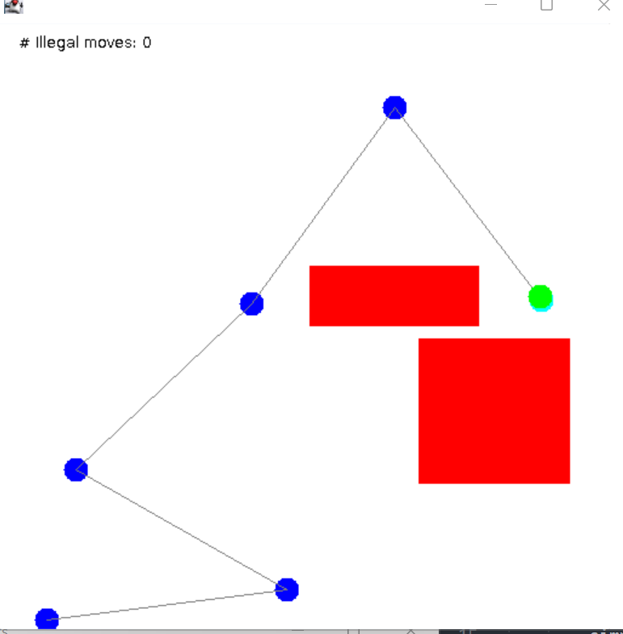
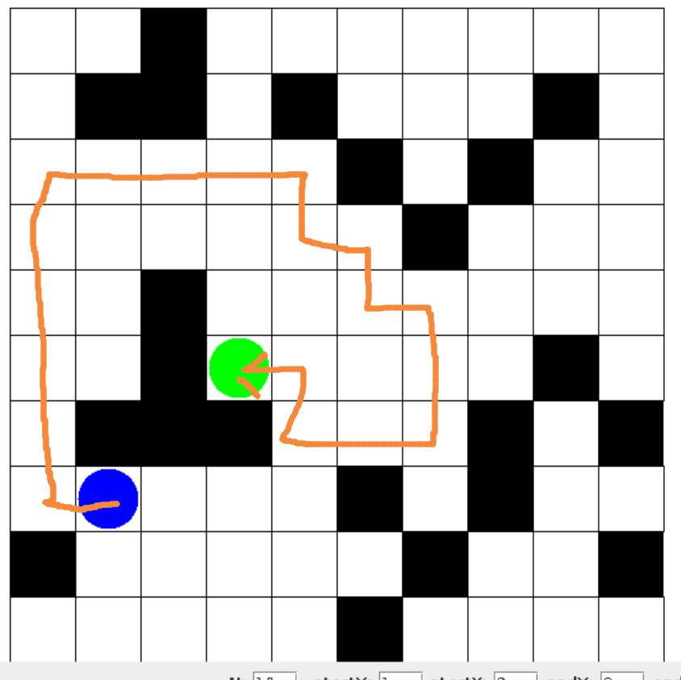
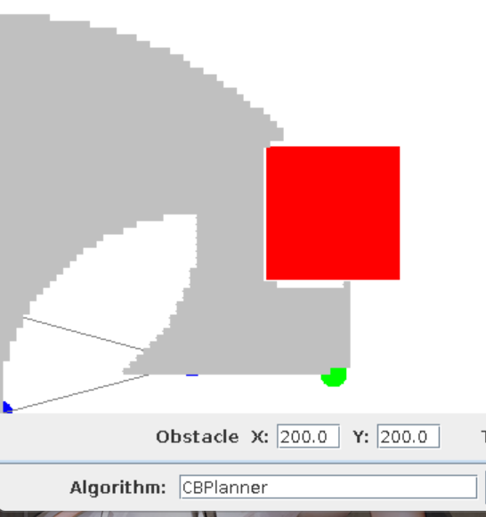
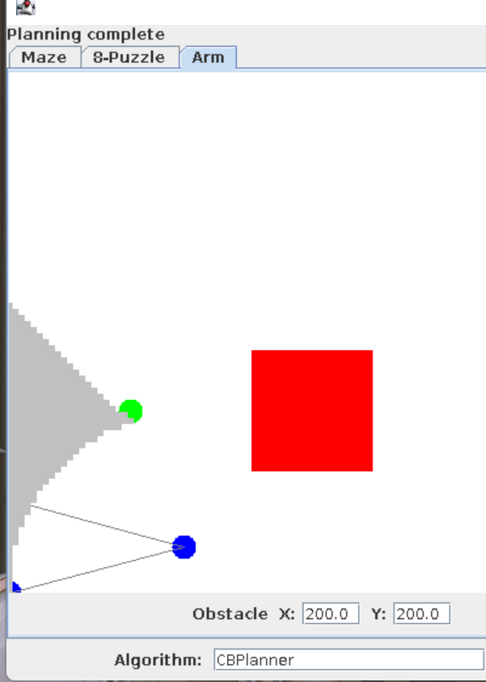
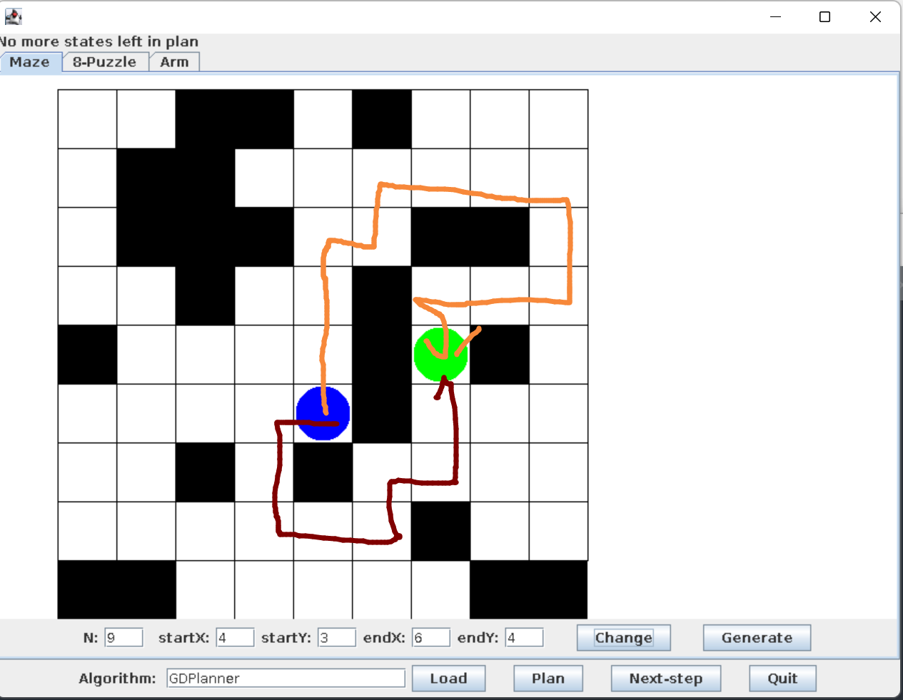

### Exercise 1:

- initial configuration can be described by the the coordinates of joints in the Arm, as j1,j2,....jn
- 
- We can still use coordinates of joints where the final joint is at the goal
- Intermediate configuration could be the whole arm expanded vertically

### Exercise 2:

- With more obstacles the configuration is harder
- With longer distance to goal, the configuration is harder

### Exercise 3:

- The goal state should be the arm tip touching goal and no arm segment has crossed obstacles. 
- The complete description of this state should be all the coordinates of the arm joints

### Exercise 4:

- Maze 
  - O(N^2)
- N-puzzle 
  - O(N!)
- Arm
  - continuous

### Exercise 5:

- Maze
  - 4
- N-puzzle
  - 2-4
- Arm
  - inf

### Exercise 6:

| 1    | 2    | 3    |
| ---- | ---- | ---- |
| 4    | 5    | 6    |
| 7    | 8    |      |

- Neighbor 1

  - 

  - | 1    | 2    | 3    |
    | ---- | ---- | ---- |
    | 4    | 5    | 6    |
    | 7    |      | 8    |

  - 1-1

    - | 1    | 2    | 3    |
      | ---- | ---- | ---- |
      | 4    | 5    | 6    |
      |      | 7    | 8    |

  - 1-2

    - | 1    | 2    | 3    |
      | ---- | ---- | ---- |
      | 4    |      | 6    |
      | 7    | 5    | 8    |

  - 1-3

    - | 1    | 2    | 3    |
      | ---- | ---- | ---- |
      | 4    | 5    | 6    |
      | 7    | 8    |      |

- Neighbor 2

  - | 1    | 2    | 3    |
    | ---- | ---- | ---- |
    | 4    | 5    |      |
    | 7    | 8    | 6    |

  - 2-1

    - | 1    | 2    |      |
      | ---- | ---- | ---- |
      | 4    | 5    | 3    |
      | 7    | 8    | 6    |

  - 2-2

    - | 1    | 2    | 3    |
      | ---- | ---- | ---- |
      | 4    |      | 5    |
      | 7    | 8    | 6    |

  - 2-3

    - | 1    | 2    | 3    |
      | ---- | ---- | ---- |
      | 4    | 5    | 6    |
      | 7    | 8    |      |

### Exercise 7 :

See `PlanningGUI`

### Exercise 8:

All are Correct

### Exercise 9:

```
Starting plan generation ...
BFS: Solution of length=7 found with cost=6.0 after 26 moves
Starting plan generation ...
DFS: Solution of length=17 found with cost=16.0 after 20 moves
```

- The DFS tend to give a solution with less effort but with more cost

```
def recur(node){
	for (s:neighbor){
		if (s == goal):
			return s;
		s = recur(s);
		if （s!=0){
			return s;
		}
	}
	return 0;
}
```

- Disadvantage
  - Recursive DFS need a more complicated way to store a visited nodes for they function in different level. 
  - Recursive DFS need more overhead in function.
- Advantage
  - Recursive DFS can use multithread to enhance it's performance

### Exercise 10:

- BFS will need more memory than DFS for it will need to expand every node and save them into frontier nodes.

- DFS:
  - all the nodes and their neighbor on the route to goal are stored in memory
  - If DFS finds a goal with 20 moves and 4 neighbor each node, then it will need to store about 80 nodes
- BFS:
  - All level of nodes and their neighbor are stored before finally reach the goal. 
  - If BFS finds a goal with 6 depth and 4 neighbor each node, then it will need to store about  4^6 = 4096 nodes

### Exercise 11:

- We used `not in` in both cases, it's O(n) regarding to list size.
- We can use a hash map and a array to store the nodes so that operation `not in` can be done in O(1) 

### Exercise 12:

- See `CPBlanner.java`

### Exercise 13:

- CBP has a better performance than BFS

### Exercise 14:

- The removeBest need O(N) time on each operation. We can use a priority queue or max heap to achieve the same goal using O(logN) time.

### Exercise 15:

- We can use the distance between current position to goal as cost-to-goal for maze problem
  - it can fail if there are dead end in the maze. Then by cost-to-goal, the algorithm will explore the dead end and waste more time
- We can use how many block are same with the final goal as the cost-to-goal for puzzle problem
  - it can fail when the problem is not achievable even multiple block are the same as the goal status.

### Exercise 16:

see `CBPlannerAStar.java`

### Exercise 17:

| scenario | CB move | CB cost | AS move | AS step |
| -------- | ------- | ------- | ------- | ------- |
| 1        | 16      | 4       | 8       | 4       |
| 2        | 7       | 4       | 4       | 4       |
| 3        | 32      | 10      | 20      | 10      |
| 4        | 52      | 10      | 27      | 10      |
| 5        | 37      | 8       | 18      | 8       |

Both CB and AS get the best path, but AS tend to use less moves when finding the best path.

### Exercise 18:

- maze
  - Distance to goal
- puzzle
  - Distance to goal where distance is the differ of numbers between two configuration
- A possible alternative distance for the puzzle could be the numbers that are more than 1 move from the goal position. This can reduce some redundancy in search progress

### Exercise 19:



Although DFS finds the goal but it takes much longer than it can.

### Exercise 20:

see `BFSPlanner.java,CBPlanner.java,BSFPlannerAStar.java`

### Exercise 21:

- original 8 direction



- 4 direction



### Exercise 22:

- We can know the visited state by storing points that the arm tip has been before. Can compare new state to it.
- This differs for the space is continuous so we need an estimate function to see if two points are close enough to be seen as the same point visited before.

### Exercise 23:

- $L_0cos(\theta_0)$ is the x of L0, $L_1cos(\theta_0+\theta_1)$ is the x of L1. So their sum is the x of the tip
- $L_0sin(\theta_0)$ is the y of L0, $L_1sin(\theta_0+\theta_1)$ is the y of L1. So their sum is the y of the tip

### Exercise 24:

- straightening
  - $\Delta\theta_0$ is positive
  -  $\Delta\theta_1$ is negative
- move down
  - $\Delta\theta_0$ is 0
  -  $\Delta\theta_1$ is negative
- 3 rd phase:
  - $\Delta\theta_0$ is negative
  - $\Delta\theta_1$ is positive

### Exercise 25:

See `twolinkexamplezip/TwoLinkController.java`

### Exercise 26:



In this case, `GDPlanner` choses the yellow path(13 step) instead the optimal red path(9 step)

