### Exercise 1:

1 second 29.22

2 second 114.43

3 second 242.55

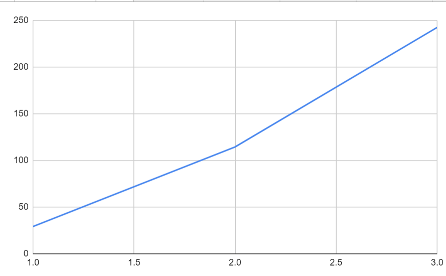

- velocity around 40 between 1 and 2 second
- velocity around 65 between 2 and 3 second
- How do these graphs change if you double the mass?
  - Shouldn't change
- How do these graphs change if you double the angle?
  - The angle in the graph should also double.

### Exercise 2:

Distance increases exponentially with time.

### Exercise 3:

The derivative increases linearly with time.

Using 0.0001 gets a very similar result as using 0.01 as time delta.

### Exercise 4:

The rate-of-change stay the same at x=1,x=2,x=3. And doesn't change as well when changing delta t from 0.1 to 0.01

### Exercise 5:

The slope should be $y=4.9x$

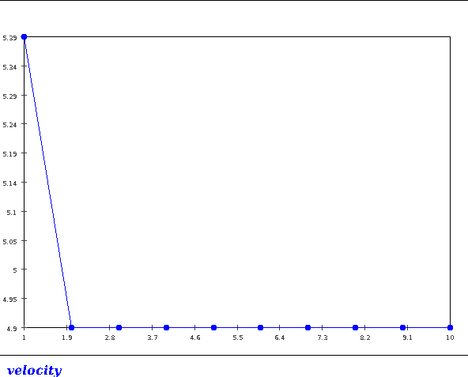

The derivative of v is at 4.9

### Exercise 6:

- Acceleration is not affected by mass
- Acceleration is increasing as the angle increases
- We can form a formula that takes all related variables and describe the status of the object with these variables.

### Exercise 7:

see `BallDropSimulatorExample.java`

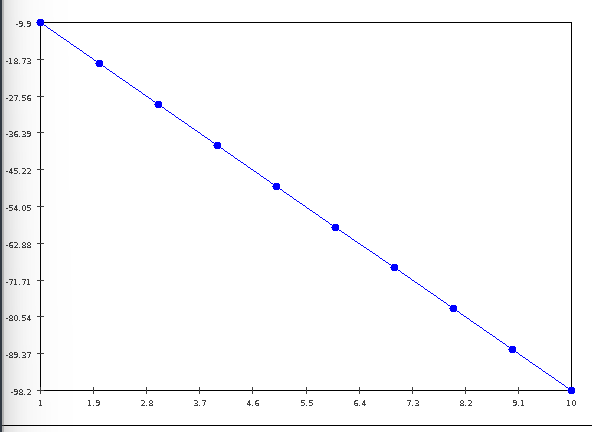

- slope = (-98.2-9.9)/9 = -9.81

- I think I can use some substitution to get the velocity of an object falling from certain altitude. Like dropping balls from a certain height and measure the height of splash when the object hits water. 
- Clock tech isn't advanced enough to give a small enough delta T.

### Exercise 8:

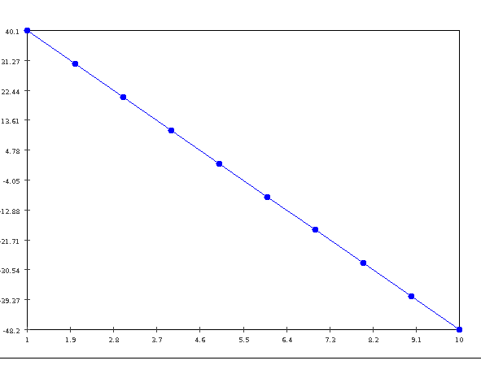

The change of speed is constant in all scenarios above.

### Exercise 9:

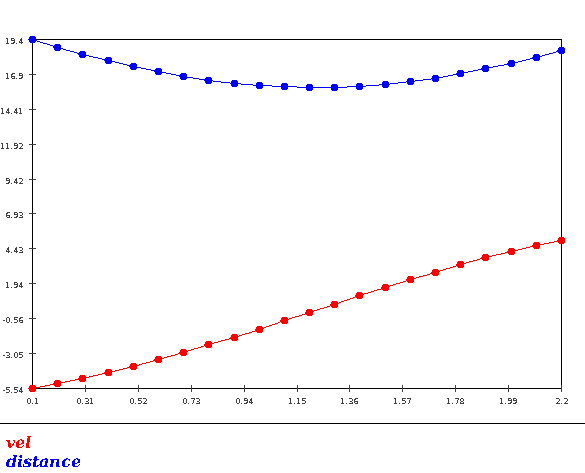

- The velocity is constantly increasing from negative to positive.
- Angle=70 makes change of velocity sharper.

### Exercise 10:

- 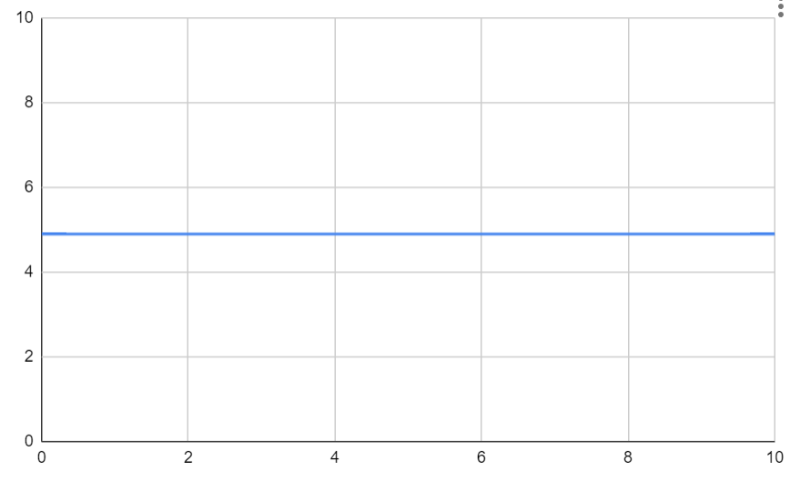
- - $v(0.1) = a*0.1 = 0.49$
  - $v(0.2)=a*0.2 = 0.98$
  - $v(0.3)=a*0.3 = 1.47$
  - $v(0.4)=a*0.4 = 1.96$
  - $v(0.5)=a*0.5 = 2.45$
- initial speed is 0 and acc is 4.9, for half a second the speed should be 2.45
- The line is the constant acceleration and it's the slope of the increment of velocity.
  - v(t)=at

### Exercise 11:

- velocity is re-calculated each time the `computeFinalVelocity` is called. It can be reused in the while loop which will reduce the computational complexity from O($n^2$) to O(n)
- Increasing the interval size will cause the approximate speed to be higher than it should be at a certain moment in this example.

### Exercise 12:

I will setup different test scenarios and compare their error to the real final distances. The one with smaller error should be better.

### Exercise 13:

- Should be Euler-Cromer, for velocity is updated first.
- No, acceleration is only relevant to `angleRadians`

### Exercise 14:

Yes, it should, for the slope if constant. And the objects' shadow should also follow the "universal law"

### Exercise 15:

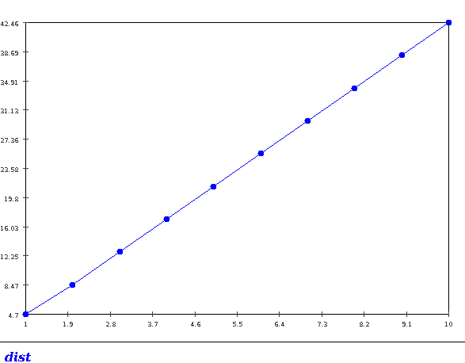

The velocity of x-axis shadow is also increasing constantly.

### Exercise 16:

The distance plot has a fixed slope, which means it's velocity should be constant.

The plot for velocity is indeed constant.

### Exercise 17:

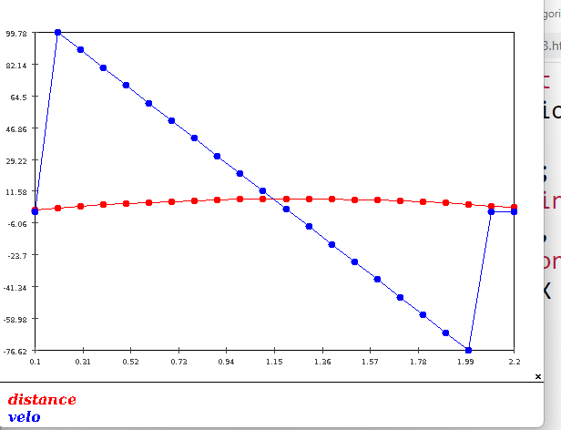

Yes, they both satisfy our universal law.

### Exercise 18:

- $d(t) = \frac{x(t)}{cos(\theta)}$
- $\theta = arctan\frac{x(t))}{y(t)}$
- So with these equations, it's easy to show that the previous two statements are true and equivalent.

### Exercise 19:

The distance is calculated with current point(x,y) and the next point(nextX,nextY). So we need nextX and nextY for the information of next point.

### Exercise 20:

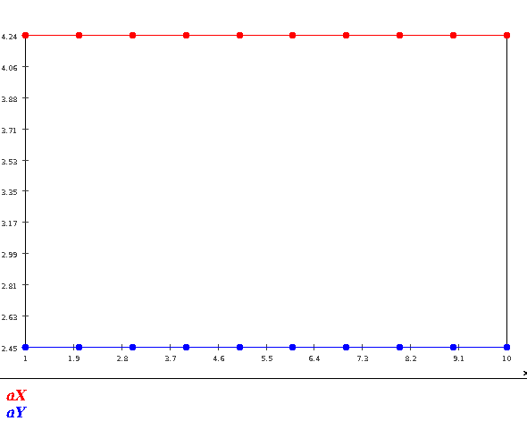

We can see that aX and aY are all constants.

### Exercise 21:

Acceleration on x-axis is not yet addressed.

### Exercise 22:

The acceleration in the x-direction should be caused by the slope and g together.

the g has a effect on the x-direction so it's not simply g.

### Exercise 23:

it will take around 2000 loops to get the result.

We can use binary search on finding the height to make it much more efficient.

### Exercise 24:

Height required: 250.0 time requried 7.14300000000072

code see `BallDropSimulatorExercise2.java`

### Exercise 37:

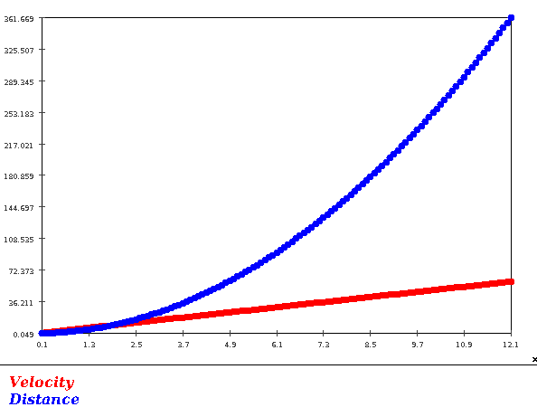

### Exercise 38:

see `MovingObjectBasic.java`

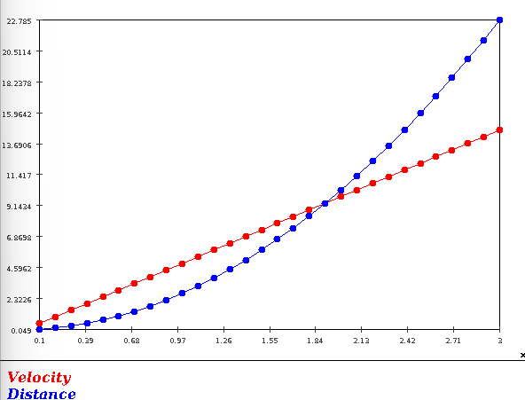

### Exercise 39:

The size of all rectangle  are 0.1*4.9 = 0.49

### Exercise 40:

See `MovingObjectIntegration.java`

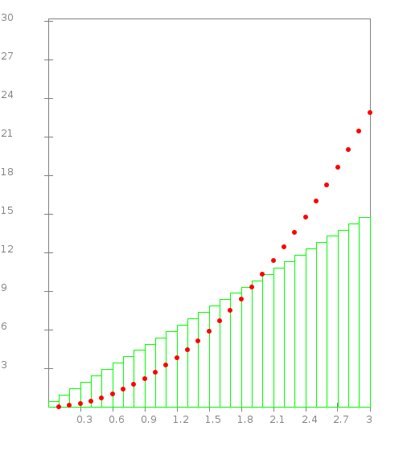

