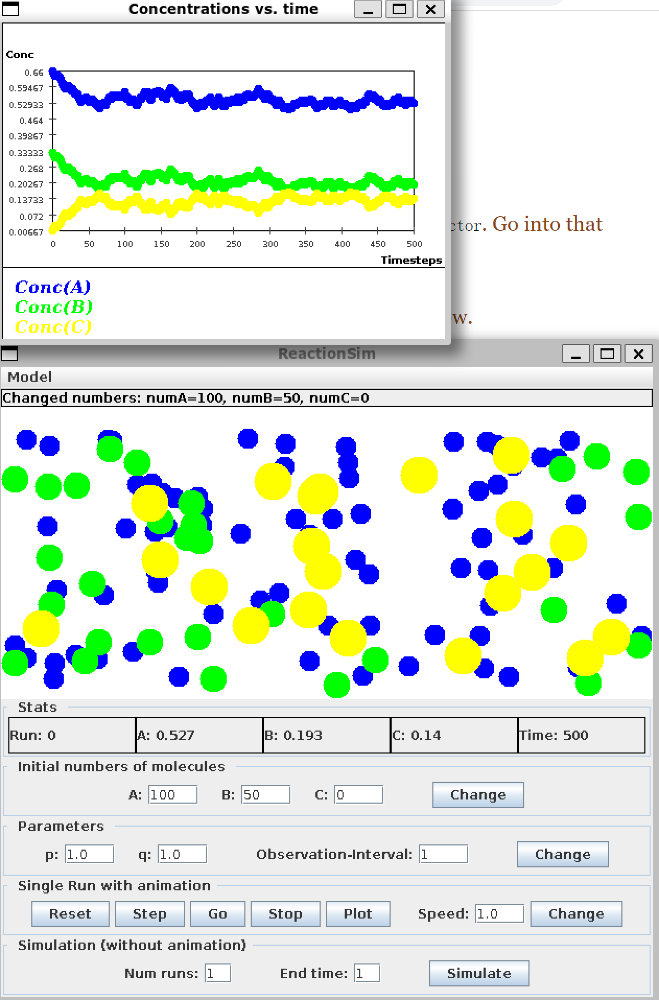
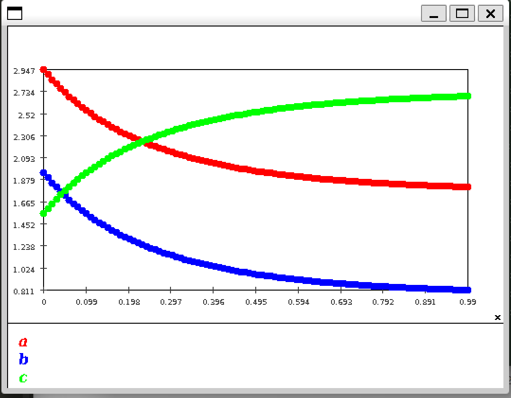
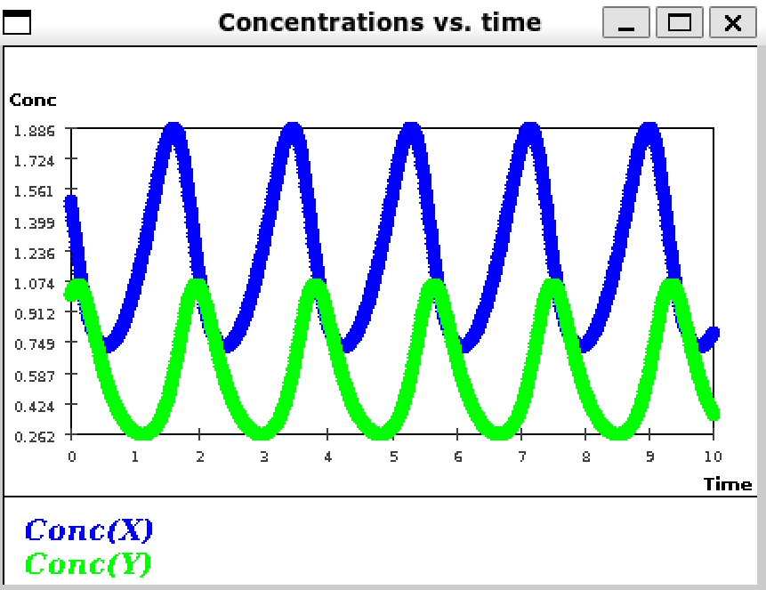
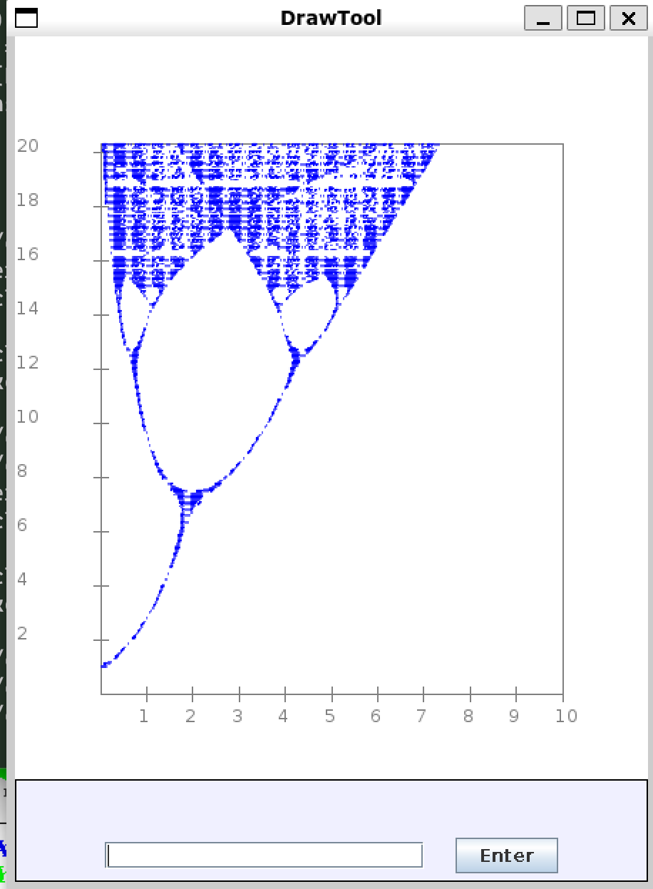

### Exercise 1:

- Simulating 10000 particles seems to take three times than 100 particles to reach Time 100.

### Exercise 2:

$N_A = 10$

$N_B = 5$

$V_{total} = 10 + 5 = 15$

$E_A = \frac{N_A}{V_{total}}=0.67$

$E_B = \frac{N_B}{V_{total}} = 0.33$

- Second reaction happed at time 1

- At time1:
  - $N_A = 8$
  - $N_B=3$
  - $N_C = 2$
  - $V_{total} = 8+3+2*2 = 15$
  - $E_A = \frac{8}{15}$
  - $E_B = \frac{3}{15}$
  - $E_C = \frac{2}{15}$
  - 

### Exercise 3:

- It settles after time 100, but small fluctuation still happening

- No they are still changing a little bit for there are in the state of dynamic balance

- $E_A \approx 0.55$

- $E_B \approx 0.25$

- $E_C \approx 0.13$

  

### Exercise 4:

- uniform generate a random number between [0,1], if it's larger than the prob of A, then B will happen. or A will happen. So this functions well as appropriate probabilities
- It just use the distance to choose which pair of A,B particles to remove when generation a particle C

### Exercise 5:

- I see that the concentration of C is higher than the non-spatial model, more fluctuation maybe caused by more randomness introduced by the spatial information.

- The curve become more smooth
- It become much more smooth
- In standard simulation, increasing num runs also make the curve smoother

### Exercise 6:

55.667

### Exercise 7:

- the concentration is actually the distance between particles, so it works just fine using this setup
- `closenessDistance` is set for the spatial model. Doubling this parameter functions the same as doubling the concentration of particle A and B.

### Exercise 8:

- A(0.01) = 2.947 B(0.01)=1.948 C(0.01) = 1.552
- A(0.02) = 2.898 B(0.02)=1.898 C(0.02) = 1.602
- A(0.03) = 2.851 B(0.03)=1.851 C(0.03) = 1.649

### Exercise 9:

- final concentration
  - A(1) = 1.811
  - B(1) = 0.811
  - C(1) = 2.689
- 

### Exercise 10:

### Exercise 11:

- Angular momentum makes ball goes a little east wards
- Coriolis force makes the ball goes a little south( AS it happens in the northern part of the earth)
- So it should be south-east

### Exercise 12:

### Exercise 13:

### Exercise 14:

- TragetX = 10
- $M_x^{'} = vy = 20$
- $M_y^{'} = MissileAY = 3$

- TargetVx
- MissileVx
- MissileAy

### Exercise 21:

- `angularAcc = (torque - m*g*R) / (m*R*R + mw*R*R);`
- No there isn't, any positive torque will cause the load to collide with the winch.

### Exercise 22:

The load were frictionless so any positive torque will be able to pull the load.