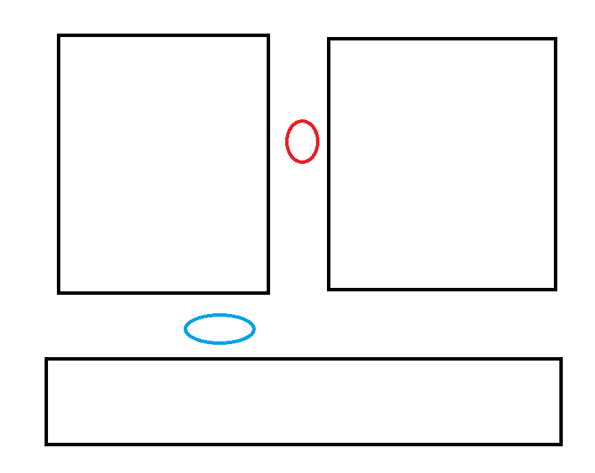

### Exercise 1

The elevator keeps speeding up and hit the winch

### Exercise 2

- The winch will go up and down using this method
- If we use $V(t) = k_p(y_{Max}+y(t))$ The speed of the elevator will continue to rise and will not stop.

 ### Exercise 3

- The elevator now will stop at a certain point

### Exercise 4

The Winch still moves up and down after we apply different kp

### Exercise 5

After Applying the PID, the elevator will stop.

### Exercise 8 

The Unicycle will stuck while it's turning

### Exercise 9 

Yes It does, its not stuck anymore

### Exercise 11

The Unicycle can turn smoothly now.

See `carSimJar/RogerC.java`

Adding a filter like `do not turn when dNE >= 40` Will solve the problem for very large dNE noise for turning

### Exercise 16

See `carSimJar/MySimpleCarController3.java`

### Exercise 17

We can compare the target theta and current theta to determine which way of turning is closer.

### Exercise 18

If the left size is too close, then `open-to-goal` won't trigger, result in missing the target

we can add if the goal is not on left size then we can ignore the distance from left sensors. For better trigger `open-to-goal`

### Exercise 19

- The algorithm will still fail on this scenario. For following the left hand obstacle will never come to a case where distance to obstacle is less than distance to goal. So open-to-goal will never be triggered.

- We can improve the algorithm in the way that to check if there's on obstacles between car and goal. instead of distance.

