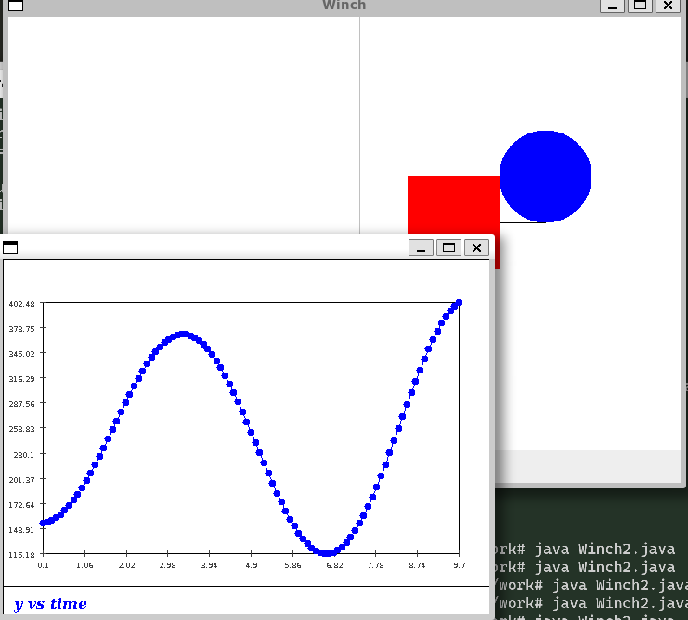
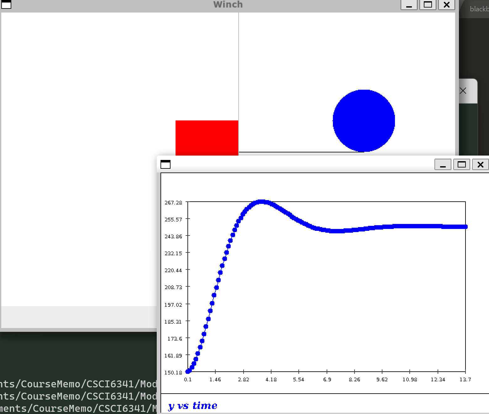
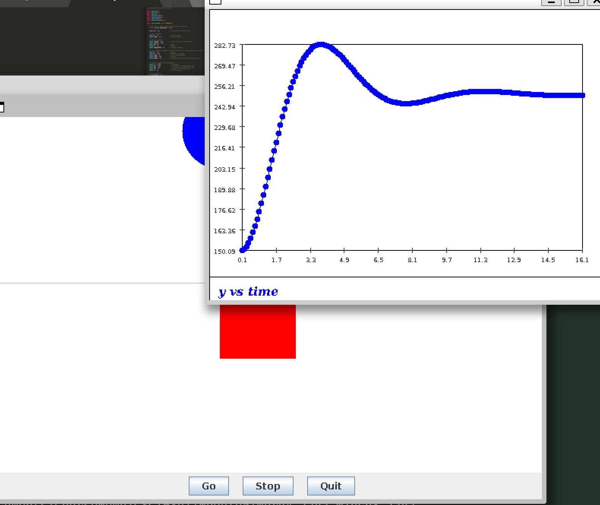
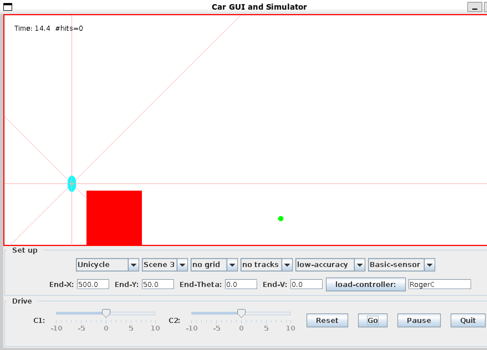

### Exercise 1

The elevator keeps speeding up and hit the winch

### Exercise 2

- The winch will go up and down using this method
- If we use $V(t) = k_p(y_{Max}+y(t))$ The speed of the elevator will continue to rise and will not stop.

 ### Exercise 3

- The elevator now will stop at a certain point

### Exercise 4

The Winch still moves up and down after we apply different kp

### Exercise 5

After Applying the PID, the elevator will stop.

### Exercise 8 

The Unicycle will stuck while it's turning

### Exercise 9 

Yes It does, its not stuck anymore

### Exercise 10

The Unicycle can turn smoothly now.

See `RogerC.java`

Adding a filter like `do not turn when dNE >= 40` Will solve the problem for very large dNE noise for turning

Control theory

### Exercise 11

Do at home

### Exercise 16

### Exercise 17

### Exercise 18

### Exercise 19

