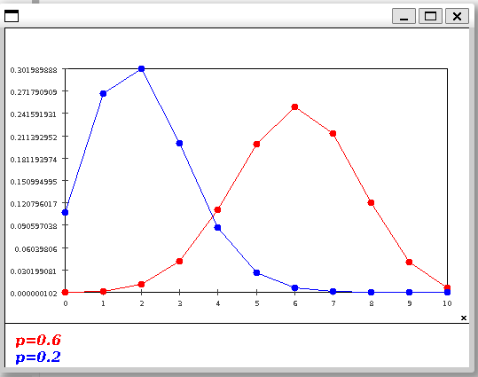
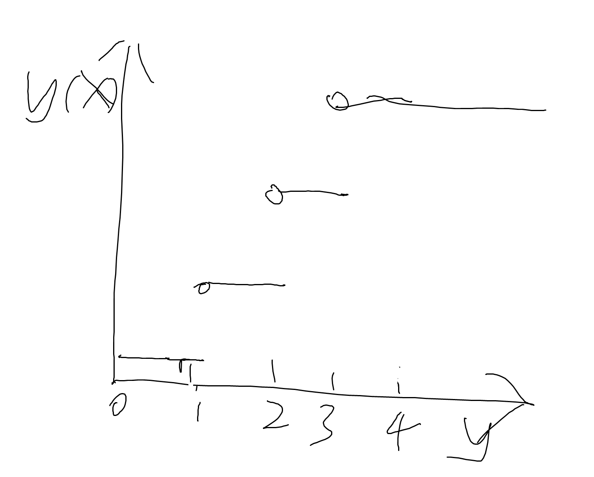
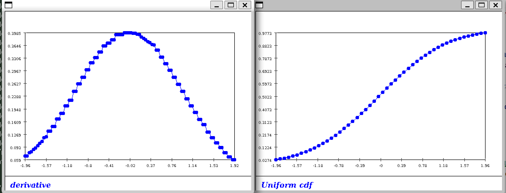
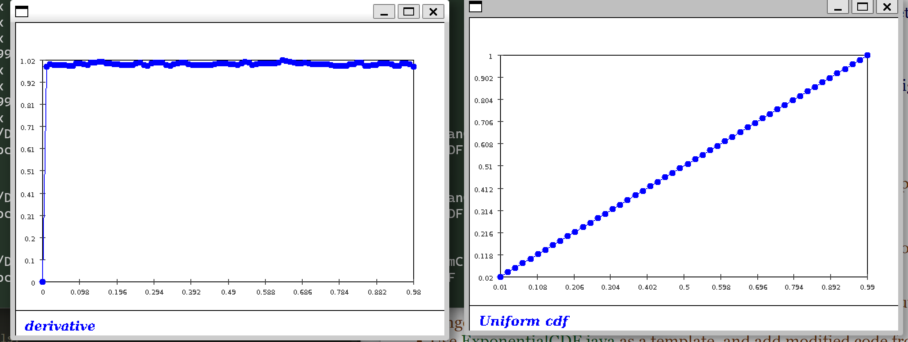
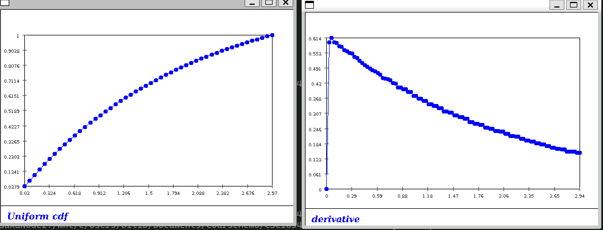
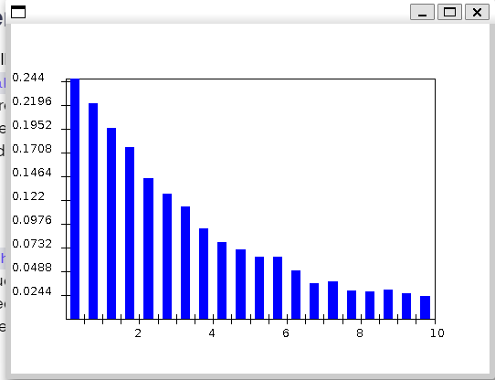
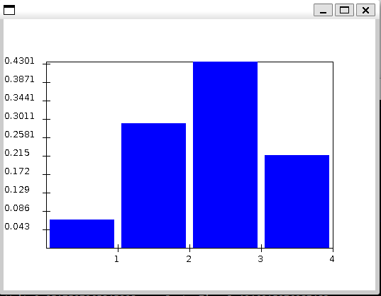
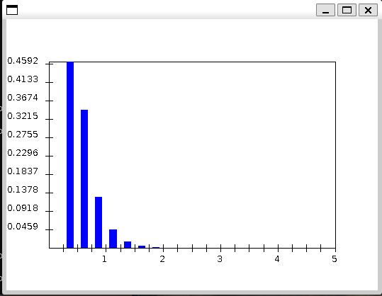

### Exercise 1:

- After 7430000 departures: avgWait=5.530658049364452  avgSystemTime=7.0307692633769765
- The customer just choose a random queue
- After 9211000 departures: avgWait=1.9952709836764186  avgSystemTime=3.4667403493575204


phase transition

5, 8-11, 13-14, 19, 23, 25-29, 31-34, 40, 44, 46, 48.

$$C_k^n = \frac{n!}{(n-k)!k!}$$

### Exercise 5:

- Pr[X≤2] = 0.784
- Pr[X≤3] = 1
- Pr[X≤0] = 0.064
- Pr[X≤1] = 0.352
- Pr[X=0] = $(1-p)^3$
- Pr[X=1] = $C_3^2(1-p)^2*p$
- Pr[X=2] = $C_3^2(1-p)*p^2$
- Pr[X=3] = $p^3$

### Exercise 8:

Pr = (1-p-p\*(1-p))\*p = 0.096

`Pr[1st h appears on 3rd flip]=0.095991`

### Exercise 9:

Pr[X=3] for p = 0.6 will be higher

Pr[X=3] = (1-p)^2*p

Pr = 0.096 for p = 0.6

Pr = 0.032 for p = 0.8

### Exercise 10:

$Pr[X>k] = (1-p)^k$

### Exercise 11:

`Pr[X=3] = 0.042467328000000006`



`Pr[3 H in 10 flips]=0.042469`

### Exercise 13:

$$\sum \frac{\gamma^k}{k!} = e^{\gamma}$$

$e^{\gamma}*e^{-\gamma} = 1$

### Exercise 14:

Prob: 0.1813

This value is very approx to the P[X=3] in Poisson (2)

### Exercise 19:



### Exercise 25

```
Pr[0<X≤2]:0.462294
Pr[X>0]:0.462294
```

### Exercise 26

- Gussian
  - 
- Uniform
  - 

### Exercise 27



### Exercise 28:

E[X] = 1.8

For Pr[H]=0.5, E[X] = 1.5

### Exercise 29:

The calculation is exactly the same as in the 3-coin-flip example above

### Exercise 31:

Becomes the probability of k heads

### Exercise 32:

`E= 1.8000819999999997`

result is accurate comparing to the earlier results

### Exercise 33:

`E= 10.00`

### Exercise 34:

See java files, the accuracy doesn't improve much when using more intervals in expectation computation.

### Exercise 40:




### Exercise 44:

$F^{-1}(y) = \frac{log(\frac{y}{\gamma})}{-\gamma}$

### Exercise 46:



### Exercise 48:

### 

### 

### 

### 
