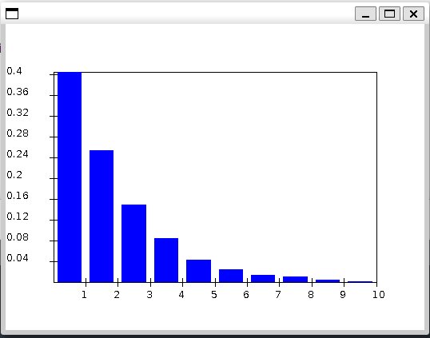
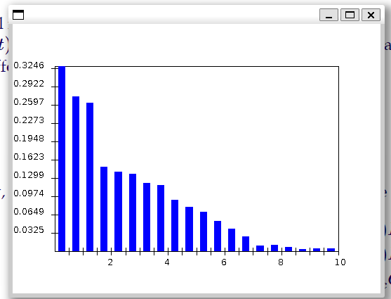
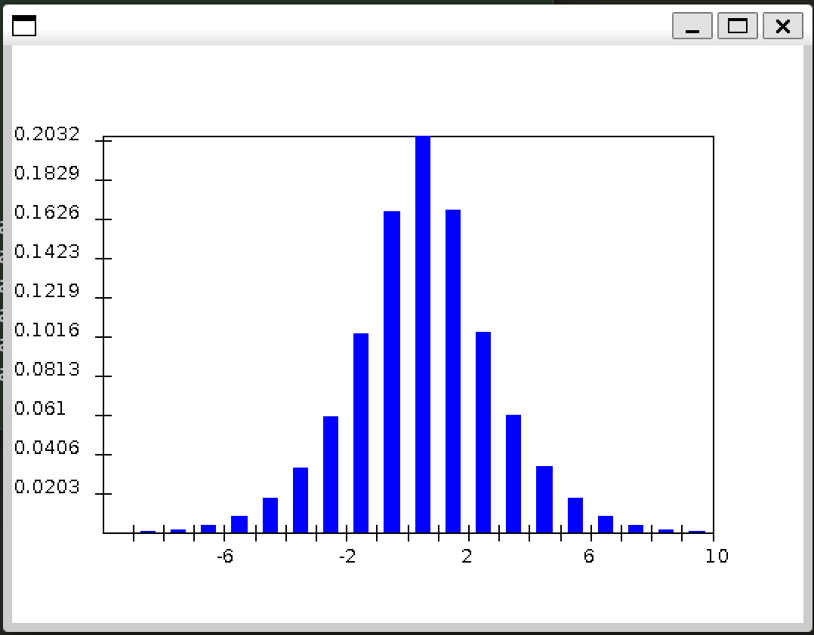
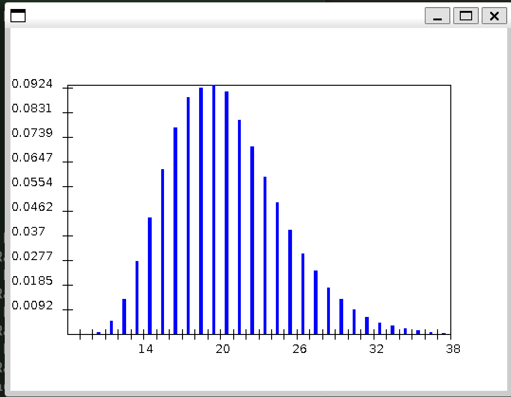

Exercises for module 8: 2-3, 6-8, 10-12, 14-16, 19-20

### Exercise 2

```
Simulation results:
  numArrivals:     1000
  numDepartures:   998
  avg Wait:        1.8906618446580803
  avg System Time: 2.814388534740915
```

- A linked list and a priority queue is used
- In `randomInterarrivalTime` , from an exponential distribution
- In `randomServiceTime` , from an exponential distribution

### Exercise 3

- `avg arrival time= 1.3558307457972822`
- it seemed that $avgArrivalTime=\frac{1}{arrivalRate}$

### Exercise 6

- Yes, in `Event e = eventList.poll ();`
- Yes, `scheduleArrival` provides the first event in the queue. Then `scheduleArrival` is called in `handleArrival` like a recursive program

### Exercise 7

`avg System Time: 2.814388534740915`

### Exercise 8

`avg Wait:        1.890661844658080`

- 2.814388534740915-1.8906618446580803= 0.92372
- This is the time spent at the server. This rate is near the 1/serviceRate so is in my expectation.

### Exercise 10:

`avg service rate= 1.0825712959645295`

This value is approximate equal to the stated rate in the program.

### Exercise 11:

There's a significant delay in wait and system time. a congestion might have happened

### Exercise 12

use $\lambda=0.01$, the avg wait time is very small

### Exercise 14:

` M= 1.944
 M/d= 0.6907361851440171`

### Exercise 15:

| $\lambda$ | no wait prob |
| --------- | ------------ |
| 0.5       | 0.483        |
| 0.6       | 0.4          |
| 0.75      | 0.312        |

### Exercise 16:

- M is discrete. D is continuous. The range of M and D is not absolute, it changes with the $\lambda\ and\ \mu$

- M
  - 
  - Seemed to be exponential distribution
- D
  - 
  - Seemed to be exponential distribution as well.

### Exercise 19:

No it doesn't work, only one boid is moving at a same time.

### Exercise 20:

molecular simulation in `Molecule` uses a single thread, so it's synchronous.

21-25

### Exercise 21:

Game of life is a synchronous simulation.

### Exercise 22:

X



T



- h is the lower bound of E(T)

### Exercise 23

- X is a typical gaussian distribution
- T is a Poisson distribution

### Exercise 24:

The size of the the event list in single queue is all arrival and departure events.(before they are removed)

### Exercise 25:

Log(N) time needed for each operation