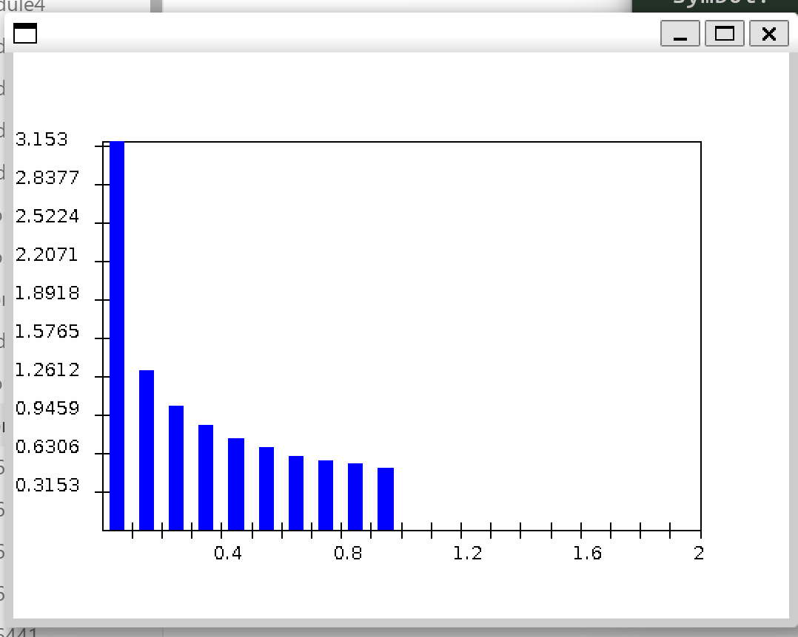
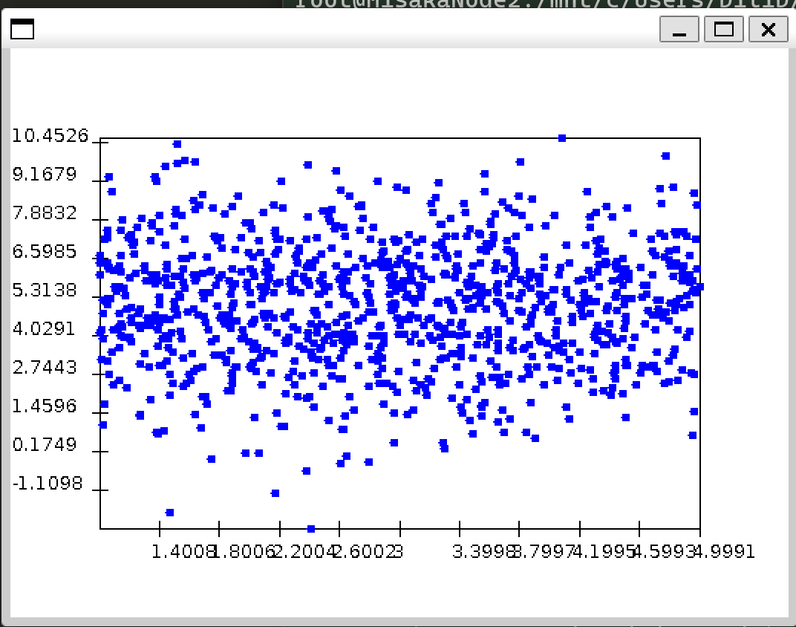
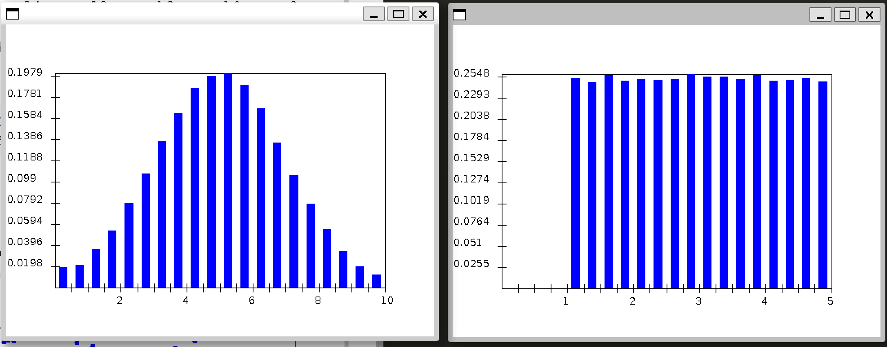

Module 8 21-25 are in module 8 works.

### Exercise 3:

```
Avg x^2: 0.33308660577988347
Avg x: 0.5000630164767703
```



### Exercise 6:

```
Avg x^2: 0.08302358930311014
Avg x: 0.5000630164767703
```

### Exercise 7

### Exercise 8:



### Exercise 9:



x is in uniform distribution

y is in gussian distribution

### Exercise 10:

```
Pr[Y in [5,7]]: 0.34286
Pr[Y in [5,7] | X in [3,4]]: 0.3409396503994305
```

The distribution of Y doesn't change given the different portion of  X. So these two event should be independent.


do 13-16 next week

### Exercise 24:

```
Mean estimate: 0.5216167255358847
Std-dev estimate: 0.28058637197873465
```


### Exercise 26:

n>1350.5

1351 sample needed

### Exercise 27:

f=0.493

### Exercise 28:

$\delta=\frac{1.96*\sigma^{'}}{\sqrt{n}}$

### Exercise 29:

- Estimate the mean interarrival time.

```
Statistics
  Number of samples: 1591.0
  Sample mean:       1.3676168959512727
  Sample variance:   1.9358505275137488
  95% confidence: +- 0.06836863231527843
    as % of mean:    4.9991070246118365
```

- Estimate the mean time in system

```
Statistics
  Number of samples: 1500.0
  Sample mean:       2.6990992380790724
  Sample variance:   7.109879413793224
  95% confidence: +- 0.1349402651942161
    as % of mean:    4.99945549576206
```

It's inappropriate that the system time is combined with two independent distributions. As the combined result will not be a normal distribution.
