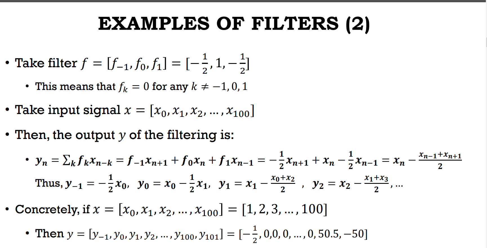

## linear filter

$ y = f\otimes x$

use a filter on a certain singal to produce equal signal

- causal filter -> $f_k$ are only k>=0 (only depend on previous input)

- low pass filter -> keep the overall trend
- high pass filter -> edge discover(only keep high frequency)

## Subband coding

up sampling, replace missing value by 0

perfect reconstruction 

