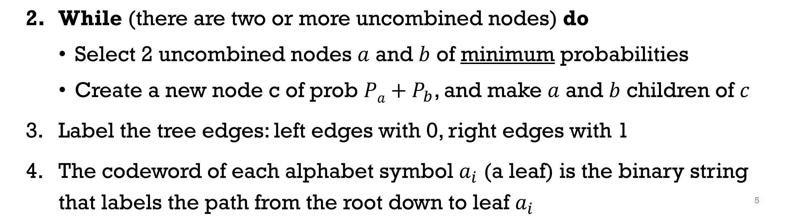

## Huffman coding

- Build the tree
  - 

- how to cal entropy
  - 
- how to cal stream bitrate
  - char_prob * char_bit_lenght
- If all char_prob are power of 2, H=BR, or BR>H
- Huffman Table
  - header
  - pre-define
- Prefix property
  - no word is prefix of another

## Block Huffman

pack bits to higher length and build tree

## Run-Length encoding(RLE)

Need a protocol aaaabbb->(a,4),(b,3)

- 1: Fix length
  - Redundancy
- 2: Split Run length
- Huffman the symbols
- 

## Golomb -> implement of RLE

