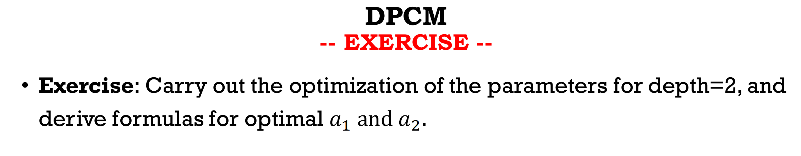

DIFFERENTIAL PULSE-CODE MODULATION (DPCM)

## DPCM

derivate E`(a_i)

- find best a in 1 step

- Longer window
- before first (x_0), take x_i as 0
- partial derivative
- check out 

## DPCM 2D

pixel outside of boundary is 0

partial derivative of a,b,c set all these d to 0

## DPCM Predictive

$ prediction \ \hat{x}$

choose e_i for different predict methods

finally code the residuals(error) to prediction with other lossless codec

decode with error + prediction again

## bitplane coding

- Grey coding
  - code binary to be differ by only one bit for successive strings.
- XOR for encoding/decoding
- 