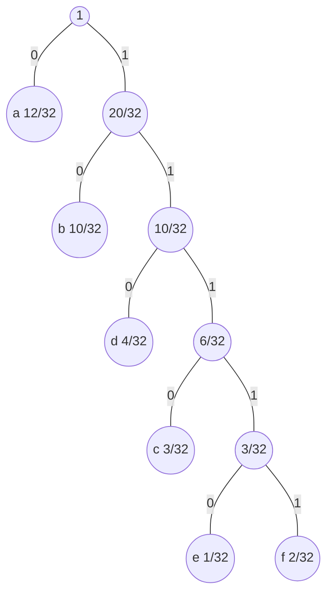
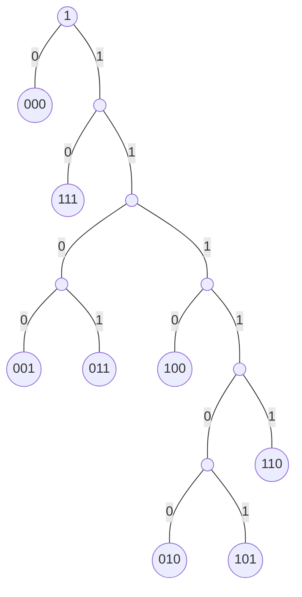

# HW1

## Problem 1

### a

$$
\begin{align*}
H(S) &= - \sum^n_{i=1}p_i\log p_i \\
&=-(\frac{12}{32}\log(\frac{12}{32})+\frac{10}{32}\log(\frac{10}{32})+\frac{3}{32}\log(\frac{3}{32})+\frac{4}{32}\log(\frac{4}{32})+\frac{1}{32}\log(\frac{1}{32})+\frac{2}{32}\log(\frac{2}{32}))\\
&\approx 2.156
\end{align*}
$$

### b



a: 0

b: 10

c: 1110

d: 110

e: 11110

f:  11111

### c 

$$
\begin{align*}
BR &= \sum^n_{i=1}p_i |codeword(a_i)|\\
&= 1\frac{12}{32}+2\frac{10}{32}+3\frac{4}{32}+4\frac{3}{32}+5\frac{1}{32}+5\frac{2}{32}\\
&=\frac{71}{32}\\
&\approx2.219
\end{align*}
$$


### d

```
aaaaabbbdddbdebaaaaccbaf
0000010101011011011010110111011000001110111010011111
```

$$ BR = \frac{52}{24} \approx 2.167 $$

## problem 2

### a

Firstly we need to know the probability of the binary sequence
$$
\begin{align*}
P[000111] &= P[1^{st}bit=0]P[0|0]P[0|0]P[0|1]P[1|1]P[1|1]\\
&\approx 0.019342
\end{align*}
$$

| L                              | R                              | Split                          | $\Delta$                      | curr_symbol | action         |
| ------------------------------ | ------------------------------ | ------------------------------ | ----------------------------- | ----------- | -------------- |
| 0                              | 1                              | $\frac{1}{2}$                  | 1                             | 0           | choose left    |
| 0                              | $\frac{64}{128}$               | $\frac{61}{128}$               | $\frac{64}{128}$              | 0           | choose left    |
| 0                              | $\frac{3904}{8192}$            | $\frac{3721}{8192}$            | $\frac{3904}{8192}$           | 0           | choose left    |
| 0                              | $\frac{238144}{524288}$        | $\frac{226981}{524288}$        | $\frac{238144}{524288}$       | 1           | choose right   |
| $\frac{14526784}{33554432}$    | $\frac{15241216}{33554432}$    | $\frac{14560273}{33554432}$    | $\frac{714432}{33554432}$     | 1           | choose right   |
| $\frac{931857472}{2147483648}$ | $\frac{975437824}{2147483648}$ | $\frac{933900301}{2147483648}$ | $\frac{43580352}{2147483648}$ | 1           | choose right   |
| $\frac{933900301}{2147483648}$ | $\frac{975437824}{2147483648}$ |                                | $\frac{41537523}{2147483648}$ | end         | final interval |

So finally, L = $\frac{933900301}{2147483648}$,R= $\frac{975437824}{2147483648}$,$\Delta=\frac{41537523}{2147483648}\approx0.019342 $

$ t= \lceil-log\Delta\rceil=$6

$ \frac{L+R}{2}=\frac{1909338125}{4294967296}=b0.01110001110011100011000000001101$

Take the first 6 bits after point

Then the coded bitstream is 011100

The length hasn't changed so the BR = 1

### b

| symbol | Cal                        | Probability         |
| ------ | -------------------------- | ------------------- |
| 000    | $P[1^{st}bit=0]P[00]P[00]$ | $\frac{3721}{8192}$ |
| 001    | $P[1^{st}bit=0]P[00]P[01]$ | $\frac{183}{8192}$  |
| 010    | $P[1^{st}bit=0]P[01]P[10]$ | $\frac{9}{8192}$    |
| 011    | $P[1^{st}bit=0]P[01]P[11]$ | $\frac{183}{8192}$  |
| 100    | $P[1^{st}bit=1]P[10]P[00]$ | $\frac{183}{8192}$  |
| 101    | $P[1^{st}bit=1]P[10]P[01]$ | $\frac{9}{8192}$    |
| 110    | $P[1^{st}bit=1]P[11]P[10]$ | $\frac{183}{8192}$  |
| 111    | $P[1^{st}bit=1]P[11]P[11]$ | $\frac{3721}{8192}$ |



| symbol | CodeWord |
| ------ | -------- |
| 000    | 0        |
| 001    | 1100     |
| 010    | 111100   |
| 011    | 1101     |
| 100    | 1110     |
| 101    | 111101   |
| 110    | 11111    |
| 111    | 01       |

So 000111 -> 001

BR = 3/6 = 0.5

This bitrate is lower compared to BR = 1 in part a. So block-Huffman has achieved a better compression comparing to arithmetic coding in this scenario.

## Problem 3

### a

 $x=0^{15} 1^{11} 0^{10} 1^{13} 0^{14} 1^9$

4 bit for each length so we can support at most 15 in length.

so x can be coded as x= (0,15)(1,11)(0,10)(1,13)(0,14)(1,9)

or in binary `x = (0,1111)(1,1011)(0,1010)(1,1101)(0,1110)(1,1001)`

word_length = 30

### b

In x, $P(0)= \frac{11}{24}$,$P(1)=\frac{13}{24}$

MPB(x) is 1

$p*\frac{Ln2}{1-p}\approx0.82$

The nearest power of 2 is $2^0=1$, so m=1

rewrite x as $0^x1$

x=$0^{15}1(0^01)^{10}0^{10}1(0^01)^{12}0^{14}1(0^01)^{8}1$

code $0^{15}1$: q=15 so code ($0^{15}1$)=$1^{15}0$

code $0^01$: q=0 so code ($0^01$)=0

code $0^{10}1$: q=10 so code ($0^{10}1$)=$1^{10}0$

code $0^{14}1$: q=14 so code ($0^{14}1$)=$1^{14}0$

With head and tail, the coded word should be

$1,0^{15}1,0^{10},1^{10}0,0^{12},1^{14}0,0^8,1$

word_length = 74

### c

With differential GOLOMB, the original x can be transformed into $0^{15}1,0^{10}1,0^{9}1, 0^{12}1,0^{13}1,0^8(1)$

$P(1)=\frac{5}{72}, P(0)=\frac{67}{72}$

So MPB is 0

$p*\frac{Ln2}{1-p}\approx9.24$

The nearest power of 2 is $2^3 = 8$ so m=8, log(m)=3

length of r is 3

code $0^{15}1$: 15=1*8+7, q=1,r=111 so code ($0^{15}1$)=$10111$

code $0^{10}1$: 10=1*8+2, q=1,r=010 so code ($0^{15}1$)=$10010$

code $0^{9}1$: 9=1*8+1, q=1,r=001 so code ($0^{15}1$)=$10001$

code $0^{12}1$: 12=1*8+4, q=1,r=100 so code ($0^{15}1$)=$10100$

code $0^{13}1$: 13=1*8+5, q=1,r=101 so code ($0^{15}1$)=$10101$

code $0^{8}1$: 15=1*8+0, q=1,r=000 so code ($0^{15}1$)=$10000$

So with head and tail, x is coded as

`0,10111,10010,10001,10100,10101,10000,0`

word_length=32

### d

So we can see for this particular x

- run-length achieved word_length=30
- Golomb achieved word_length=74
- Differential Golomb  achieved word_length=32

So the best technique for this x is ren-length

## Problem 4

### a

 $x=0^{15} 1^{11} 0^{10} 1^{13} 0^{14} 1^9$

| i    | $\lceil\log i\rceil$ | J        | W      | a     | Dict[i] |
| ---- | -------------------- | -------- | ------ | ----- | ------- |
| 1    | 0                    | empty    | empty  | 0     | 0       |
| 2    | 1                    | 1=1      | 0      | 0     | 00      |
| 3    | 2                    | 10=2     | 00     | 0     | 000     |
| 4    | 2                    | 11=3     | 000    | 0     | 0000    |
| 5    | 3                    | 100=4    | 0000   | 0     | 00000   |
| 6    | 3                    | 000=0    | empty  | 1     | 1       |
| 7    | 3                    | 110=6    | 1      | 1     | 11      |
| 8    | 3                    | 111=7    | 11     | 1     | 111     |
| 9    | 4                    | 1000=8   | 111    | 1     | 1111    |
| 10   | 4                    | 0110=6   | 1      | 0     | 10      |
| 11   | 4                    | 0101=5   | 00000  | 0     | 000000  |
| 12   | 4                    | 0011=3   | 000    | 1     | 0001    |
| 13   | 4                    | 1001=9   | 1111   | 1     | 11111   |
| 14   | 4                    | 1101=13  | 11111  | 1     | 111111  |
| 15   | 4                    | 1010=10  | 10     | 0     | 100     |
| 16   | 5                    | 01011=11 | 000000 | 0     | 0000000 |
| 17   | 5                    | 00101=5  | 00000  | 1     | 000001  |
| 18   | 5                    | 01110=14 | 111111 | 1     | 1111111 |
| 19   | 5                    | 00110=6  | 1      | empty | 1       |

So we need to extract J and a from the dict

(-,0)(1,0)(10,0)(11,0)(100,0)(000,1)(110,1)(111,1)(1000,1)(0110,0)(0101,0)(0011,1)(1001,1)(1101,1)(1010,0)(01011,0)(00101,1)(01110,1)(00110,-)

word length = 84, $BR = 83/72 \approx 1.15$

This result is not as good as techniques in problem3

### b

y = aaaabbbbabbbabaabaabbaaa

if we have more than 2 characters then we might need huffman code the string. 

But for only two characters, we can assume a:0, b:1


so that y = 000011110111010|010|011000

| i    | $\lceil\log i\rceil$ | J      | W     | a     | Dict[i] |
| ---- | -------------------- | ------ | ----- | ----- | ------- |
| 1    | 0                    | empty  | empty | 0     | 0       |
| 2    | 1                    | 1=1    | 0     | 0     | 00      |
| 3    | 2                    | 01=1   | 0     | 1     | 01      |
| 4    | 2                    | 00=0   | empty | 1     | 1       |
| 5    | 3                    | 100=4  | 1     | 1     | 11      |
| 6    | 3                    | 011=3  | 01    | 1     | 011     |
| 7    | 3                    | 100=4  | 1     | 0     | 10      |
| 8    | 3                    | 011=3  | 01    | 0     | 010     |
| 9    | 4                    | 0110=6 | 011   | 0     | 0110    |
| 10   | 4                    | 0010=2 | 00    | empty | 00      |

So the coded string is (-,0)(1,0)(01,1)(00,1)(100,1)(011,1)(100,0)(011,0)(0110,0)(0010,-)

WordLength =34

If we don't need to add mapping(a:0,b:1) to the code word then

$BR=34/24\approx1.42$

If we need to add mapping to the coded string, then coded word length will need to increase and so will the BR

## Problem 5

- The approach I'm to generalize the AC is:
  - Instead of splitting the interval into two, we can split the interval into three.
  - The characteristic of the AC doesn't change with this change.
    - The final interval's length is still the probability of the given string.
    - The Final interval is included in all the intervals in the path, so the coded word can be decoded with a similar decoding approach
- **The pseudo compress code goes as below**
- Let I = [L,R) where initially L=0, R=1;
- For i=1 to n do
  - Let $P_{ai} = Pr[a/x_1x_2...x_{(i-1)}]$ ,Let $P_{ci} = Pr[c/x_1x_2...x_{(i-1)}]$ 
  - Let $\Delta = R - L; $
  - Divide interval I into 3 subintervals: [L, L+$P_{ai}\Delta$),[L+$P_{ai}\Delta$,R -$P_{ci}\Delta$),[R -$P_{ci}\Delta$,R)
  - If x_i == a, reduce I to [L, L+$P_{ai}\Delta$)
  - If x_i == b, reduce I to [L+$P_{ai}\Delta$,R -$P_{ci}\Delta$)
  - if x_i == c, reduce I to [R -$P_{ci}\Delta$,R)
- Let t = $\lceil-log(R-L)\rceil$, and exprss $\frac{L+R}{2}$ in binary as $0.r_1r_2...r_t$
- Output := $r_1r_2...r_t$

- **For Decompress**
  - The decompress process remains mostly the same.
  - The only difference is we need to reproduce the 3 intervals our encoder generated. And pick the interval where our coded string value is in.
  - Following the decoding step, when T>=t, the original string will be completely decompressed.