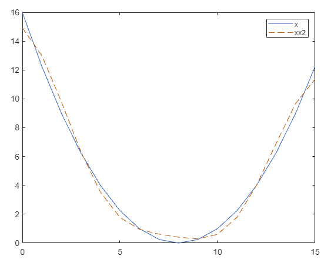

## Problem 1

### a:

```
octave:5> A = ["a" "b" "a" "b" "b" "c" "c" "a" "b";"b" "a" "b" "b" "c" "c" "a" "b" "a"; "a" "b" "b" "c" "c" "a" "b" "a" "b"; "b" "b" "c" "c" "a" "b" "a" "b" "a"; "b" "c" "c" "a" "b" "a" "b" "a" "b" ;"c" "c" "a" "b" "a" "b" "a" "b" "b"; "c" "a" "b" "a" "b" "a" "b" "b" "c"; "a" "b" "a" "b" "a" "b" "b" "c" "c"; "b" "a" "b" "a" "b" "b" "c" "c" "a"]
A =

ababbccab
babbccaba
abbccabab
bbccababa
bccababab
ccabababb
cabababbc
abababbcc
bababbcca

octave:6> B = sortrows(A)
B =

abababbcc
ababbccab
abbccabab
bababbcca
babbccaba
bbccababa
bccababab
cabababbc
ccabababb

(y,L) = (cbbaaabcb, 2)
===========================================
the dog in the fog

B = 
 dog in the fogthe
 fogthe dog in the
 in the fogthe dog
 the fogthe dog in
dog in the fogthe 
e dog in the fogth
e fogthe dog in th
fogthe dog in the 
g in the fogthe do
gthe dog in the fo
he dog in the fogt
he fogthe dog in t
in the fogthe dog 
n the fogthe dog i
og in the fogthe d
ogthe dog in the f
the dog in the fog
the fogthe dog in 

(y,L)= (eegn hh oott idfg, 17)
```

### b:

```
temp_B = new [][]string;
for still remain unknown column:
	 put f in front of each row of temp_B and store back into temp_B;
	 lex sort temp_B;
reconstructed_B = temp_B;
```

### c:

```
func Reconstrct_BWT(y,L) 
begin
	temp_B = new [][]string;
    for int i=0;i<len(y);i++{
        temp_B[i] = y[i]+temp_B[i];
        lex_sort(temp_B);
    }
    //now the B is reconstructed
    return temp_B[L];
end Reconstrct_BWT
```

### d:

```
B =

abababbcc
ababbccab
abbccabab
bababbcca
babbccaba
bbccababa
bccababab
cabababbc
ccabababb

(y,L) = (cbbaaabcb,2)

iter 1:
tmp_b is empty, just lex sort y into tmp_b

a
a
a
b
b
b
b
c
c

iter 2:
put y infront of all tmp_b,
ca
ba
ba
ab
ab
ab
bb
cc
bc

lex sort into new tmp_b
ab
ab
ab
ba
ba
bb
bc
ca
ca

iter 3:
put y infront of all tmp_b, lex sort into new tmp_b
aba
aba
abb
bab
bab
bbc
bcc
cab
cca

iter 4:
put y infront of all tmp_b, lex sort into new tmp_b
abab
abab
abbc
baba
babb
bbcc
bcca
caba
ccab

iter 5:
put y infront of all tmp_b, lex sort into new tmp_b
ababa
ababb
abbcc
babab
babbc
bbcca
bccab
cabab
ccaba

iter6:
put y infront of all tmp_b, lex sort into new tmp_b
ababab
ababbc
abbcca
bababb
babbcc
bbccab
bccaba
cababa
ccabab

iter7:
put y infront of all tmp_b, lex sort into new tmp_b
abababb
ababbcc
abbccab
bababbc
babbcca
bbccaba
bccabab
cababab
ccababa

iter8:
put y infront of all tmp_b, lex sort into new tmp_b
abababbc
ababbcca
abbccaba
bababbcc
babbccab
bbccabab
bccababa
cabababb
ccababab

iter 9:
put y infront of all tmp_b, lex sort into new tmp_b
tmp_b = 
abababbcc
ababbccab
abbccabab
bababbcca
babbccaba
bbccababa
bccababab
cabababbc
ccabababb

now all columns known, B is reconstructed, exit loop
x= B[2] = ababbccab
```

## Problem 2:

### a

- First table [$X,|X|,\hat{X}$]

```
octave:24> h=[k;X;X2;X3]
h =

 Columns 1 through 8:

         0    1.0000    2.0000    3.0000    4.0000    5.0000    6.0000    7.0000
   86.0000   52.5483   13.6569    6.4797    4.0000    2.8929    2.3431    2.0791
   86.0000   52.5483   13.6569    6.4797    4.0000    2.8929    2.3431    2.0791
   86.0000   52.5483   13.6569         0         0         0         0         0

 Columns 9 through 16:

    8.0000    9.0000   10.0000   11.0000   12.0000   13.0000   14.0000   15.0000
    2.0000    2.0791    2.3431    2.8929    4.0000    6.4797   13.6569   52.5483
    2.0000    2.0791    2.3431    2.8929    4.0000    6.4797   13.6569   52.5483
         0         0         0         0         0         0   13.6569   52.5483   
```

-  [$Y,|Y|,\hat{Y}$]

```
octave:44> h=[k;Y;Y2;Y3]
h =

 Columns 1 through 3:

         0 +       0i    1.0000 +       0i    2.0000 +       0i
   -8.0033 +       0i    4.9858 - 11.4797i    1.1401 -  1.3960i
    8.0033 +       0i   12.5157 +       0i    1.8024 +       0i
    8.0033 +       0i   12.5157 +       0i    1.8024 +       0i

 Columns 4 through 6:

    3.0000 +       0i    4.0000 +       0i    5.0000 +       0i
    0.8148 -  0.8346i    0.7077 -  0.5509i    0.6607 -  0.3661i
    1.1664 +       0i    0.8968 +       0i    0.7554 +       0i
         0 +       0i         0 +       0i         0 +       0i

 Columns 7 through 9:

    6.0000 +       0i    7.0000 +       0i    8.0000 +       0i
    0.6376 -  0.2263i    0.6265 -  0.1086i    0.6232 +       0i
    0.6765 +       0i    0.6358 +       0i    0.6232 +       0i
         0 +       0i         0 +       0i         0 +       0i

 Columns 10 through 12:

    9.0000 +       0i   10.0000 +       0i   11.0000 +       0i
    0.6265 +  0.1086i    0.6376 +  0.2263i    0.6607 +  0.3661i
    0.6358 +       0i    0.6765 +       0i    0.7554 +       0i
         0 +       0i         0 +       0i         0 +       0i

 Columns 13 through 15:

   12.0000 +       0i   13.0000 +       0i   14.0000 +       0i
    0.7077 +  0.5509i    0.8148 +  0.8346i    1.1401 +  1.3960i
    0.8968 +       0i    1.1664 +       0i    1.8024 +       0i
         0 +       0i         0 +       0i    1.8024 +       0i

 Column 16:

   15.0000 +       0i
    4.9858 + 11.4797i
   12.5157 +       0i
   12.5157 +       0i
```

- [$x,\hat{x}$]

```
octave:47> h = [x;x2]
h =

 Columns 1 through 8:

   16.0000   12.2500    9.0000    6.2500    4.0000    2.2500    1.0000    0.2500
   13.6506   12.6506   10.0197    6.6816    3.6679    1.6542    0.7303    0.5136

 Columns 9 through 16:

         0    0.2500    1.0000    2.2500    4.0000    6.2500    9.0000   12.2500
    0.5136    0.5136    0.7303    1.6542    3.6679    6.6816   10.0197   12.6506
```

- [$y,\hat{y}$]

```
h = [y;y2]
h =

 Columns 1 through 7:

   0.735393   0.921328   1.008627   0.962534   0.767827   0.431988  -0.015083
   2.289972   2.104895   1.606449   0.939588   0.274904  -0.257801  -0.606037

 Columns 8 through 14:

  -0.524804  -1.036561  -1.486280  -1.815652  -1.980619  -1.957847  -1.748211
  -0.785858  -0.838957  -0.785858  -0.606037  -0.257801   0.274904   0.939588

 Columns 15 and 16:

  -1.376761  -0.889174
   1.606449   2.104895
```

### b


### c

```
octave:58> immse(x,x2)
ans = 0.6107
octave:59> immse(y,y2)
ans = 2.5216
```

### d

```
snr(x,x2)

ans =

    0.0508

snr(y,y2)

ans =

    0.0850
```

## Problem 3

### a

[$X,\hat{X}$]

```
h = [k;XX;XX2]

h =

  column 1 to 8

         0    1.0000    2.0000    3.0000    4.0000    5.0000    6.0000    7.0000
   21.5000    4.5779   18.2216    0.5019    4.4609    0.1754    1.9048    0.0849
   21.5000    4.5779   18.2216    0.5019    4.4609         0         0         0

  column 9 to 16

    8.0000    9.0000   10.0000   11.0000   12.0000   13.0000   14.0000   15.0000
    1.0000    0.0469    0.5682    0.0268    0.3170    0.0140    0.1434    0.0044
         0         0         0         0         0         0         0         0
   
```

[$Y,\hat{Y}$]

```
h = [k;YY;YY2]

h =

  column 1 to 8

         0    1.0000    2.0000    3.0000    4.0000    5.0000    6.0000    7.0000
   -2.0008    4.1666    0.9371   -1.4285    0.1835   -0.3303    0.0756   -0.1463
   -2.0008    4.1666    0.9371   -1.4285    0.1835         0         0         0

  column 9 to 16

    8.0000    9.0000   10.0000   11.0000   12.0000   13.0000   14.0000   15.0000
    0.0392   -0.0782    0.0222   -0.0440    0.0123   -0.0228    0.0056   -0.0071
         0         0         0         0         0         0         0         0
```

[$x,\hat{x}$]

```
h = [k;x;xx2]

h =

  column 1 to 8

         0    1.0000    2.0000    3.0000    4.0000    5.0000    6.0000    7.0000
   16.0000   12.2500    9.0000    6.2500    4.0000    2.2500    1.0000    0.2500
   14.9312   12.9966    9.7954    6.3422    3.5314    1.7787    0.9546    0.6207

  column 9 to 16

    8.0000    9.0000   10.0000   11.0000   12.0000   13.0000   14.0000   15.0000
         0    0.2500    1.0000    2.2500    4.0000    6.2500    9.0000   12.2500
    0.4064    0.2893    0.6059    1.7908    4.0072    6.9058    9.6737   11.3701
```

[$y,\hat{y}$]

```
h = [k;y;yy2]

h =

  column 1 to 8

         0    1.0000    2.0000    3.0000    4.0000    5.0000    6.0000    7.0000
    0.7354    0.9213    1.0086    0.9625    0.7678    0.4320   -0.0151   -0.5248
    0.8674    0.8894    0.9087    0.8813    0.7552    0.4880    0.0672   -0.4742

  column 9 to 16

    8.0000    9.0000   10.0000   11.0000   12.0000   13.0000   14.0000   15.0000
   -1.0366   -1.4863   -1.8157   -1.9806   -1.9578   -1.7482   -1.3768   -0.8892
   -1.0562   -1.5689   -1.9062   -2.0048   -1.8724   -1.5907   -1.2892   -1.0980
```

### b




### c

```
>> immse(x,xx2)

ans =

    0.3196

>> immse(y,yy2)

ans =

    0.0092
   
```

### d

```
>> snr(x,xx2)

ans =

    0.0265

>> snr(y,yy2)

ans =

    0.0262
```

## Problem 4

-  [$X,|X|,\hat{X}$]

```
h = [k;XXX;XXX2;XXX3]

h =

  column 1 to 8

         0   1.0000   2.0000   3.0000   4.0000   5.0000   6.0000   7.0000
   21.5000   0.5000   1.0000   1.0000   2.0000   2.0000   4.0000        0
   21.5000   0.5000   1.0000   1.0000   2.0000   2.0000   4.0000        0
   21.5000        0        0        0        0        0        0        0

  column 9 to 16

    8.0000   9.0000  10.0000  11.0000  12.0000  13.0000  14.0000  15.0000
    4.0000   4.0000   8.0000        0  16.0000        0        0        0
    4.0000   4.0000   8.0000        0  16.0000        0        0        0
    4.0000   4.0000   8.0000        0  16.0000        0        0        0

```

- [$Y,|Y|,\hat{Y}$]

```
h = [k;YYY;YYY2;YYY3]

h =

  column 1 to 8

         0   1.0000   2.0000   3.0000   4.0000   5.0000   6.0000   7.0000
   -2.0008   0.1558   0.3146   0.0392   0.6552   0.0816   0.1649  -0.0128
    2.0008   0.1558   0.3146   0.0392   0.6552   0.0816   0.1649   0.0128
    2.0008        0        0        0   0.6552        0        0        0

  column 9 to 16

    8.0000   9.0000  10.0000  11.0000  12.0000  13.0000  14.0000  15.0000
    4.1447   0.1971   0.3980  -0.2422   0.8288  -0.5743  -1.1919  -0.0162
    4.1447   0.1971   0.3980   0.2422   0.8288   0.5743   1.1919   0.0162
    4.1447        0        0        0   0.8288        0   1.1919        0
```

- [$x,\hat{x}$]

```
h = [k;x;xxx2]

h =

  column 1 to 8

         0   1.0000   2.0000   3.0000   4.0000   5.0000   6.0000   7.0000
   16.0000  12.2500   9.0000   6.2500   4.0000   2.2500   1.0000   0.2500
   13.3750  11.3750   9.3750   7.3750   5.3750   3.3750   1.3750  -0.6250

  column 9 to 16

    8.0000   9.0000  10.0000  11.0000  12.0000  13.0000  14.0000  15.0000
         0   0.2500   1.0000   2.2500   4.0000   6.2500   9.0000  12.2500
   -2.6250  -0.6250   1.3750   3.3750   5.3750   7.3750   9.3750  11.3750
```

- [$y,\hat{y}$]

```
h = [k;y;yyy2]

h =

  column 1 to 8

         0   1.0000   2.0000   3.0000   4.0000   5.0000   6.0000   7.0000
    0.7354   0.9213   1.0086   0.9625   0.7678   0.4320  -0.0151  -0.5248
    2.2054   2.2054   1.6094   1.6094   0.8674   0.8674   1.4634   1.4634

  column 9 to 16

    8.0000   9.0000  10.0000  11.0000  12.0000  13.0000  14.0000  15.0000
   -1.0366  -1.4863  -1.8157  -1.9806  -1.9578  -1.7482  -1.3768  -0.8892
   -0.8773  -0.8773  -0.2814  -0.2814  -0.1946  -0.1946  -0.7906  -0.7906
```

### b

```
>> immse(x,xxx2)

ans =

    1.6406

>> immse(y,yyy2)

ans =

    1.4025
```

### c


### d

|       | FFT    | DCT    | Hadamard |
| ----- | ------ | ------ | -------- |
| MSE-x | 0.6107 | 0.0265 | 1.6406   |
| MSE-y | 2.5216 | 0.0262 | 1.4025   |

The DCT transform gives best mse for x and for y in these three transforms.

### Problem 5

### a

```matlab
n2 = 15;
result = [];
for j =1:n2
	X5X = dct(x);
	X5X(17-j:16) = 0;
	x5x = idct(X5X);
	result(j) = immse(x5x,x);
end
plot(1:n2,result);
```


### b

The trend I observed is the MSE increases at an exponential rate with the increase of N. 

The MSE firstly remains slightly above 0 when n<11, and it suddenly increase to around 20 when n increased from 13 to 14.

### c

```matlab
>> H=0.25*hadamard(16);
result = [];
X5c = x* H;
for j =1:n2
	X5cX = X5c;
	for i=1:j
	  	[val(i),idx] = min(X5cX);
	  	X5cX(idx) = 10000;
	end
	for i=1:j
	  	[val(i),idx] = max(X5cX);
	  	X5cX(idx) = 0;
	end
	x5cx = X5cX * H';
	result(j) = immse(x5cx,x);
end
plot(1:n2,result);
```


