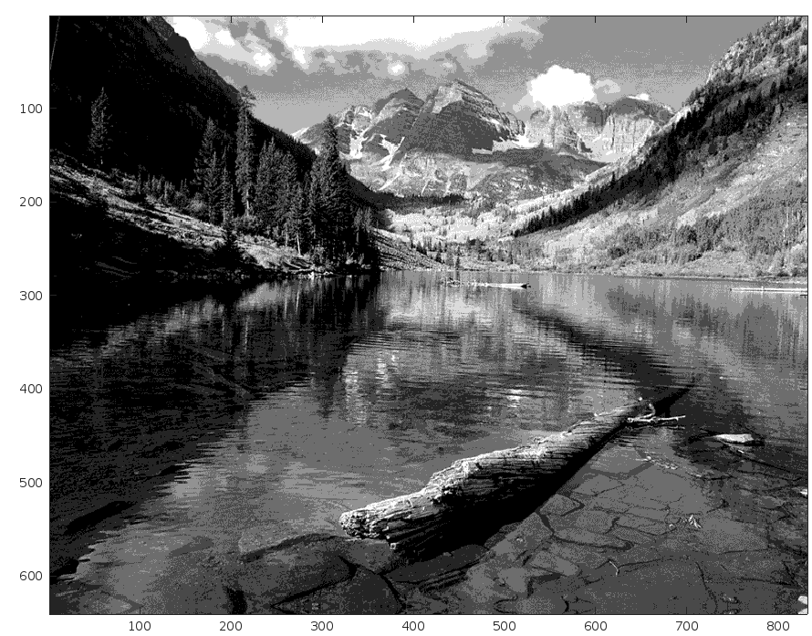

## Problem1

### a

- n=5

  - ```
    d= [0.00000, 0.79925, 1.54979, 2.30071, 3.18268, 4.00000]
    r= [0.43750, 1.16100, 1.93857, 2.66286, 3.70250]
    ```

- n=6

  - ```
    d= [0.00000, 0.78208, 1.44333, 2.09667, 2.63667, 3.27125, 4.00000]
    r= [0.43750, 1.12667, 1.76000, 2.43333, 2.84000, 3.70250]
    ```

- n= 8

  - ```
    d= [0.00000, 0.38083, 1.00869, 1.53686, 2.08525, 2.51500, 2.93625, 3.50083, 4.00000]
    r = [0.00000, 0.76167, 1.25571, 1.81800, 2.35250, 2.67750, 3.19500, 3.80667]
    ```

### b

- n=5

  - Q = [0, 0, 0, 0, 1, 1, 1, 1, 1, 1, 1, 1, 1, 1, 2, 2, 2, 2, 2, 2, 2, 3, 3, 3, 3, 3, 3, 3, 4, 4, 4, 4]
  - $\hat{X}$ = [0.43750, 0.43750, 0.43750, 0.43750, 1.16100, 1.16100, 1.16100, 1.16100, 1.16100, 1.16100, 1.16100, 1.16100, 1.16100, 1.16100, 1.93857, 1.93857, 1.93857, 1.93857, 1.93857, 1.93857, 1.93857, 2.66286, 2.66286, 2.66286, 2.66286, 2.66286, 2.66286, 2.66286, 3.70250, 3.70250, 3.70250, 3.70250]
  - MSE = 0.04650

- n=6

  - Q = [0, 0, 0, 0, 1, 1, 1, 1, 1, 1, 1, 1, 1, 2, 2, 2, 2, 2, 2, 3, 3, 3, 3, 3, 3, 4, 4, 4, 5, 5, 5, 5]
  - $\hat{X}$ = [0.43750, 0.43750, 0.43750, 0.43750, 1.12667, 1.12667, 1.12667, 1.12667, 1.12667, 1.12667, 1.12667, 1.12667, 1.12667, 1.76000, 1.76000, 1.76000, 1.76000, 1.76000, 1.76000, 2.43333, 2.43333, 2.43333, 2.43333, 2.43333, 2.43333, 2.84000, 2.84000, 2.84000, 3.70250, 3.70250, 3.70250, 3.70250]

  - MSE = 0.03674

- n=8
  - Q = [0, 1, 1, 1, 1, 1, 1, 2, 2, 2, 2, 2, 2, 2, 3, 3, 3, 3, 3, 4, 4, 4, 4, 5, 5, 5, 5, 6, 6, 7, 7, 7]
  - $\hat{X}$ = [0.00000, 0.76167, 0.76167, 0.76167, 0.76167, 0.76167, 0.76167, 1.25571, 1.25571, 1.25571, 1.25571, 1.25571, 1.25571, 1.25571, 1.81800, 1.81800, 1.81800, 1.81800, 1.81800, 2.35250, 2.35250, 2.35250, 2.35250, 2.67750, 2.67750, 2.67750, 2.67750, 3.19500, 3.19500, 3.80667, 3.80667, 3.80667]
  - MSE = 0.02386

### c

- n=5
  - Q = [0, 0, 0, 0, 1, 1, 1, 1, 1, 1, 1, 1, 1, 1, 2, 2, 2, 2, 2, 2, 2, 3, 3, 3, 3, 3, 3, 3, 4, 4, 4, 4]
  - $\hat{X}$ = [0.40, 0.40, 0.40, 0.40, 1.20, 1.20, 1.20, 1.20, 1.20, 1.20, 1.20, 1.20, 1.20, 1.20, 2.00, 2.00, 2.00, 2.00, 2.00, 2.00, 2.00, 2.80, 2.80, 2.80, 2.80, 2.80, 2.80, 2.80, 3.60, 3.60, 3.60, 3.60]
  - MSE = 0.05340
- n=6
  - Q = [0, 0, 0, 1, 1, 1, 1, 1, 1, 1, 1, 2, 2, 2, 2, 2, 2, 2, 2, 3, 3, 3, 3, 3, 3, 4, 4, 4, 5, 5, 5, 5]
  - $\hat{X}$ = [0.33, 0.33, 0.33, 1.00, 1.00, 1.00, 1.00, 1.00, 1.00, 1.00, 1.00, 1.67, 1.67, 1.67, 1.67, 1.67, 1.67, 1.67, 1.67, 2.33, 2.33, 2.33, 2.33, 2.33, 2.33, 3.00, 3.00, 3.00, 3.67, 3.67, 3.67, 3.67]
  - MSE = 0.04465
- n=8
  - Q = [0, 1, 1, 1, 1, 1, 1, 2, 2, 2, 2, 2, 2, 2, 3, 3, 3, 3, 3, 4, 4, 4, 4, 5, 5, 5, 5, 6, 6, 7, 7, 7]
  - $\hat{X}$ = [0.25, 0.75, 0.75, 0.75, 0.75, 0.75, 0.75, 1.25, 1.25, 1.25, 1.25, 1.25, 1.25, 1.25, 1.75, 1.75, 1.75, 1.75, 1.75, 2.25, 2.25, 2.25, 2.25, 2.75, 2.75, 2.75, 2.75, 3.25, 3.25, 3.75, 3.75, 3.75]
  - MSE = 0.02903

### d

- n=5
  - Q = [0, 0, 0, 0, 1, 1, 1, 1, 1, 1, 1, 1, 1, 1, 2, 2, 2, 2, 2, 2, 2, 3, 3, 3, 3, 3, 3, 3, 4, 4, 4, 4]
  - $\hat{X}$ = [0.43750, 0.43750, 0.43750, 0.43750, 1.16100, 1.16100, 1.16100, 1.16100, 1.16100, 1.16100, 1.16100, 1.16100, 1.16100, 1.16100, 1.93857, 1.93857, 1.93857, 1.93857, 1.93857, 1.93857, 1.93857, 2.66286, 2.66286, 2.66286, 2.66286, 2.66286, 2.66286, 2.66286, 3.70250, 3.70250, 3.70250, 3.70250]
  - MSE = 0.04650
- n=6
  - Q = [0, 0, 0, 1, 1, 1, 1, 1, 1, 1, 1, 2, 2, 2, 2, 2, 2, 2, 2, 3, 3, 3, 3, 3, 3, 4, 4, 4, 5, 5, 5, 5]
  - $\hat{X}$ = [0.35667, 0.35667, 0.35667, 1.00875, 1.00875, 1.00875, 1.00875, 1.00875, 1.00875, 1.00875, 1.00875, 1.66375, 1.66375, 1.66375, 1.66375, 1.66375, 1.66375, 1.66375, 1.66375, 2.43333, 2.43333, 2.43333, 2.43333, 2.43333, 2.43333, 2.84000, 2.84000, 2.84000, 3.70250, 3.70250, 3.70250, 3.70250]
  - MSE = 0.04014
- n=8
  - Q = [0, 1, 1, 1, 1, 1, 1, 2, 2, 2, 2, 2, 2, 2, 3, 3, 3, 3, 3, 4, 4, 4, 4, 5, 5, 5, 5, 6, 6, 7, 7, 7]
  - $\hat{X}$ = [0.00000, 0.76167, 0.76167, 0.76167, 0.76167, 0.76167, 0.76167, 1.25571, 1.25571, 1.25571, 1.25571, 1.25571, 1.25571, 1.25571, 1.81800, 1.81800, 1.81800, 1.81800, 1.81800, 2.35250, 2.35250, 2.35250, 2.35250, 2.67750, 2.67750, 2.67750, 2.67750, 3.19500, 3.19500, 3.80667, 3.80667, 3.80667]
  - MSE = 0.02386

### e

| n       | 5       | 6       | 8       |
| ------- | ------- | ------- | ------- |
| $ML_n$  | 0.04650 | 0.03674 | 0.02386 |
| $UQ_n$  | 0.05340 | 0.04465 | 0.02903 |
| $SUQ_n$ | 0.04650 | 0.04014 | 0.02386 |

Max-Lloyd quantizer has the best MSE among these quantizers

## Problem2

### a

entropy(G) = 6.5977

### b

- entropy($G_u^{'}$) = 0.6916

- dispaly $\hat{G_u^{'}}$
  - 
- $SNR(G,\hat{G_{u}})$ = 21.6257

### c

- entropy($G_{su}^{'}$) = 0.6916

- display $\hat{G_{su}^{'}}$
  - 
- $SNR(G,\hat{G_{su}^{'}})$ = 21.7712

### d

- entropy($G_{op}^{'}$) = 0.6735

- display $\hat{G_{op}}$
  - 
- $SNR(G,\hat{G_{op}})$ = 21.9496

### e

- $SNR(G,\hat{G_{u}})$ = 21.6257
- $SNR(G,\hat{G_{su}^{'}})$ = 21.7712
- $SNR(G,\hat{G_{op}})$ = 21.9496
- In these three quantizers, the max-lloyd quantizer has the best SNR, and the uniform quantizer has the worst snr.

### Problem 3

### a

- n = 5

  - r = [2.6629,1.9386,0.4375,3.7025,1.1610]

- n = 6

  - r = [0.4375,0.9780,1.3867,1.9380,2.6150,3.7025]

- n = 8

  - r= [0,0.8300,1.4314,2.0540,2.5580,2.9250,3.4800,3.9250]

- | X    | n=5    | n=6    | n=8    |
  | ---- | ------ | ------ | ------ |
  | 0    | 0.4375 | 0.6529 | 0      |
  | 0.52 | 0.4375 | 0.6529 | 0.83   |
  | 0.55 | 0.4375 | 0.6529 | 0.83   |
  | 0.68 | 0.4375 | 0.6529 | 0.83   |
  | 0.91 | 1.161  | 0.6529 | 0.83   |
  | 0.94 | 1.161  | 0.6529 | 0.83   |
  | 0.97 | 1.161  | 0.6529 | 0.83   |
  | 1.03 | 1.161  | 1.2988 | 0.83   |
  | 1.04 | 1.161  | 1.2988 | 0.83   |
  | 1.2  | 1.161  | 1.2988 | 1.4314 |
  | 1.3  | 1.161  | 1.2988 | 1.4314 |
  | 1.35 | 1.161  | 1.2988 | 1.4314 |
  | 1.4  | 1.161  | 1.2988 | 1.4314 |
  | 1.47 | 1.161  | 1.2988 | 1.4314 |
  | 1.6  | 1.9386 | 1.2988 | 1.4314 |
  | 1.7  | 1.9386 | 1.995  | 1.4314 |
  | 1.85 | 1.9386 | 1.995  | 2.054  |
  | 1.95 | 1.9386 | 1.995  | 2.054  |
  | 1.99 | 1.9386 | 1.995  | 2.054  |
  | 2.2  | 1.9386 | 1.995  | 2.054  |
  | 2.28 | 1.9386 | 1.995  | 2.054  |
  | 2.45 | 2.6629 | 2.6629 | 2.558  |
  | 2.48 | 2.6629 | 2.6629 | 2.558  |
  | 2.56 | 2.6629 | 2.6629 | 2.558  |
  | 2.63 | 2.6629 | 2.6629 | 2.558  |
  | 2.67 | 2.6629 | 2.6629 | 2.558  |
  | 2.85 | 2.6629 | 2.6629 | 2.925  |
  | 3    | 2.6629 | 2.6629 | 2.925  |
  | 3.39 | 3.7025 | 3.48   | 3.48   |
  | 3.57 | 3.7025 | 3.48   | 3.48   |
  | 3.86 | 3.7025 | 3.925  | 3.925  |
  | 3.99 | 3.7025 | 3.925  | 3.925  |

### b

MSE

- n=5
  -  mse = 0.0603
- n=6
  - mse = 0.0464
- n=8
  - mse = 0.0219

### c


- ml for Max-Lloyd
- km for K-means

## Problem 4

### a

- Compute the resulting bitrate 
  - For a 640\*832 image, the bit needed to store is $(3*1+2*14)*80*104 = 257920$ 
  - bitrate = $\frac{257920}{640*832}= $ 0.4843
- and the compression ratio
  - bit needed before is $8*640*832 = 4259840$
  - compression ratio is 16.51

### b

- Display image
  - 
- SNR = 7.6859

### c

- Compute the resulting bitrate 
  - For a 640\*832 image, the bit needed to store is $(3*1+2*9)*80*104 = 174720$ 
  - bitrate = $\frac{257920}{640*832}= $ 0.3281
- and the compression ratio
  - compression ratio is 24.38
- Display the image
  - 
- SNR = 9.4027

### d

- Compute the resulting bitrate 
  - For a 640\*832 image, the bit needed to store is $(3*1+2*5)*80*104 = 108160$ 
  - bitrate = $\frac{257920}{640*832}= $ 0.2031
- and the compression ratio
  - compression ratio is 39.38
- Display the image
  - 
- SNR = 11.3568

### e

- Compute the resulting bitrate 
  - For a 640\*832 image, the bit needed to store is $(3*1)*80*104 = 24960$ 
  - bitrate = $\frac{257920}{640*832}= $ 0.0469
- and the compression ratio
  - compression ratio is 170.67
- Dispaly the image
  - 
- SNR = 14.3281

###  f

|                | $\hat{G_{15}}$ | $\hat{G_{10}}$ | $\hat{G_{6}}$ | $\hat{G_{1}}$ |
| -------------- | -------------- | -------------- | ------------- | ------------- |
| bitrate        | 0.4843         | 0.3281         | 0.2031        | 0.0469        |
| SNR            | 7.6859         | 9.4027         | 11.3568       | 14.3281       |
| visual quality | fine           | fine           | bad           | worst         |

- We can see that with the drop of bitrate, the visual quality gets worse, but the SNR has increased. Maybe this is increase of SNR is caused by the edges between blocks.

