## River

- n=4
  - `[Ghat,dGhat,dG] = compress("river.gif",4);`
  - img_snr =9.2600
  - compress_ratio =9.1429
  - imageA
    - 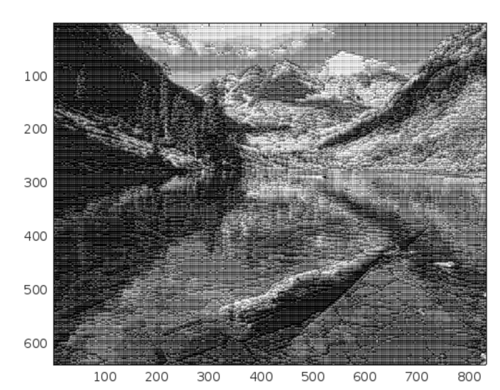
- n=8
  - `[Ghat,dGhat,dG] = compress("river.gif",8);`
  - img_snr =5.8522
  - compress_ratio =11.6364
  - image
    - 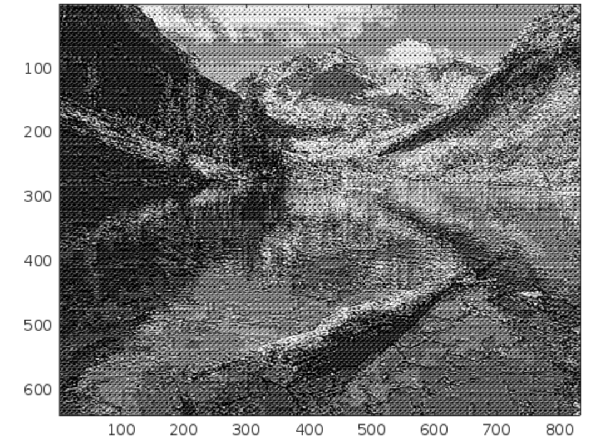
- n=16
  - `[Ghat,dGhat,dG] = compress("river.gif",16);`
  - img_snr =4.5679
  - compress_ratio =12.9620
  - image
    - 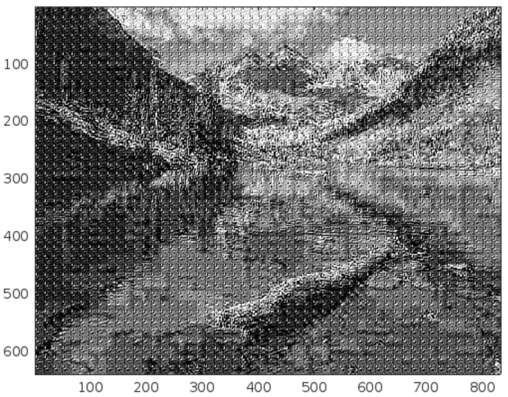
- n=32
  - `[Ghat,dGhat,dG] = compress("river.gif",32);`
  - img_snr =2.9817
  - compress_ratio =13.2129
  - image
    - 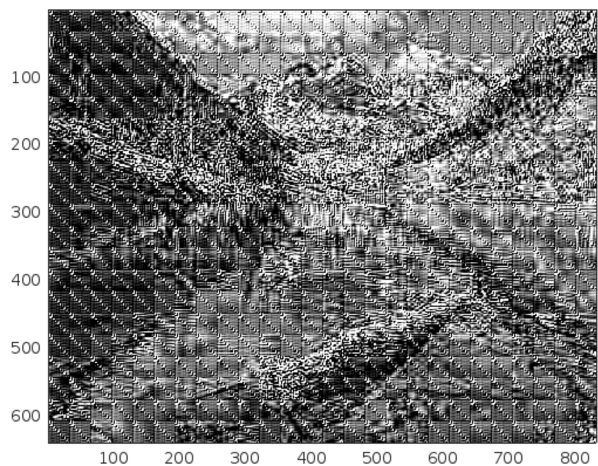
- n=64
  - `[Ghat,dGhat,dG] = compress("river.gif",64);`
  - img_snr =5.3376
  - compress_ratio =13.3095
  - image
    - 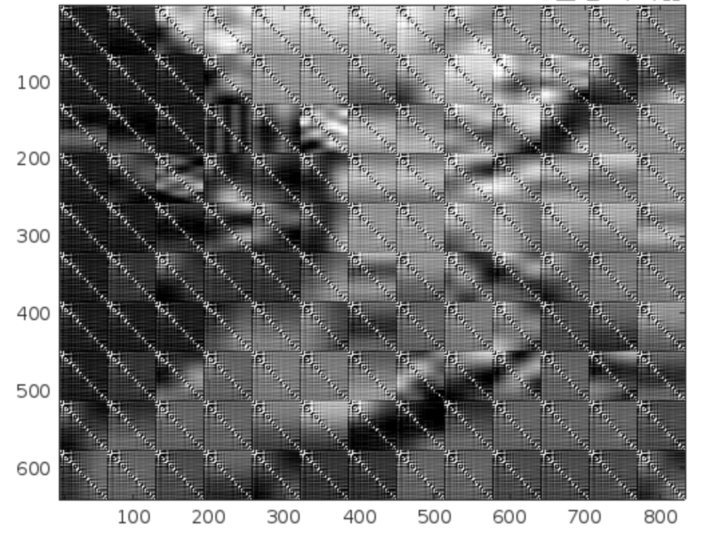
- Plot SNR
  - 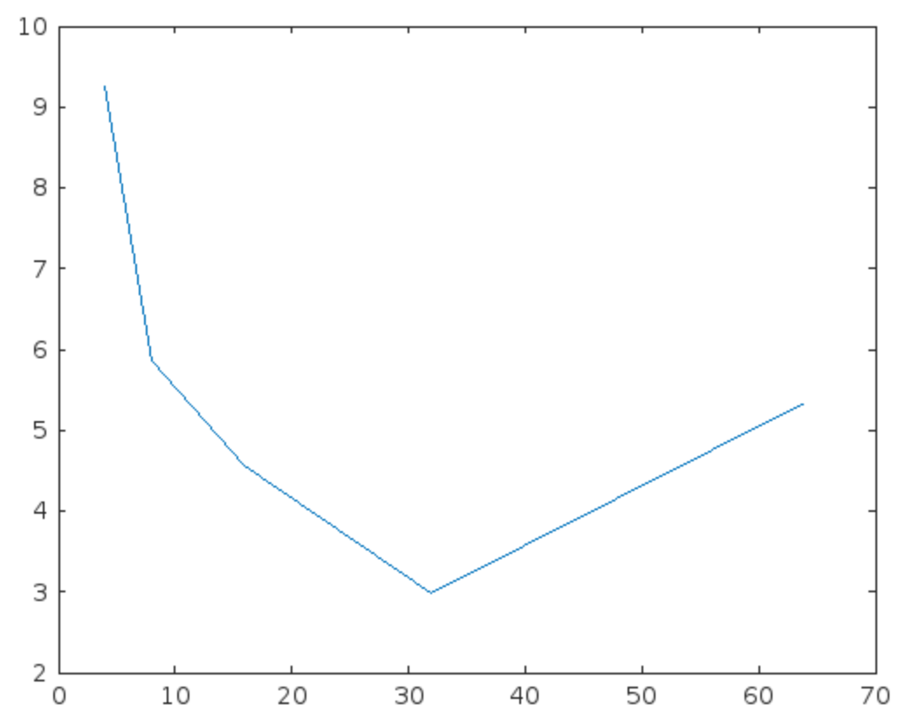
  - block size n = 4 gives the best snr of 9.26

## Lake

- n = 4
  - `[Ghat,dGhat,dG] = compress("lake.gif",4);`
  - img_snr =10.6388
  - compress_ratio =9.1429
  - image
    - 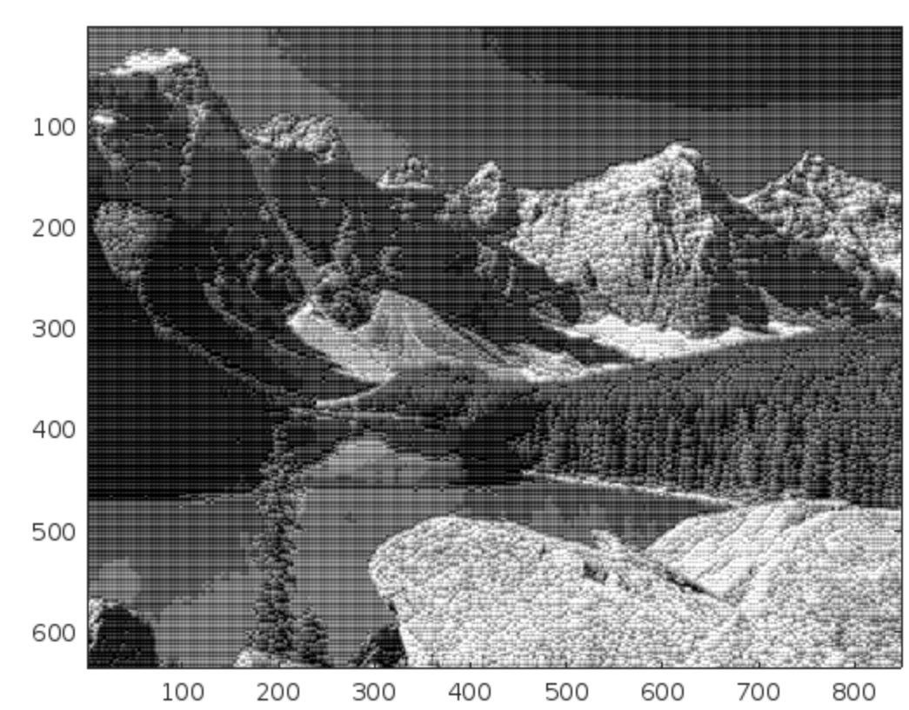
- n = 8
  - `[Ghat,dGhat,dG] = compress("lake.gif",8);`
  - img_snr =4.1789
  - compress_ratio =11.6364
  - image
    - 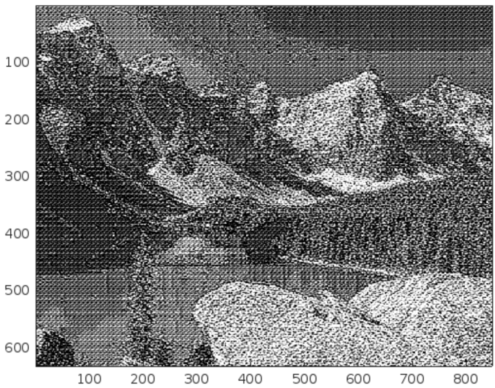
- n = 16
  - `[Ghat,dGhat,dG] = compress("lake.gif",16);`
  - img_snr =4.6347
  - compress_ratio =12.9620
  - image
    - 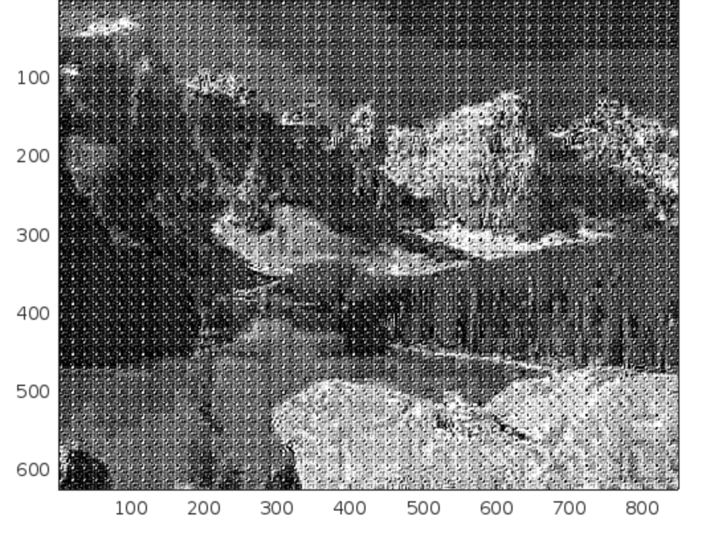
- n = 32
  - `[Ghat,dGhat,dG] = compress("lake.gif",32);`
  - img_snr =4.1733
  - compress_ratio =13.2129
  - image
    - 
- n = 64
  - `[Ghat,dGhat,dG] = compress("lake.gif",64);`
  - img_snr =4.3307
  - compress_ratio =13.3095
  - image
    - 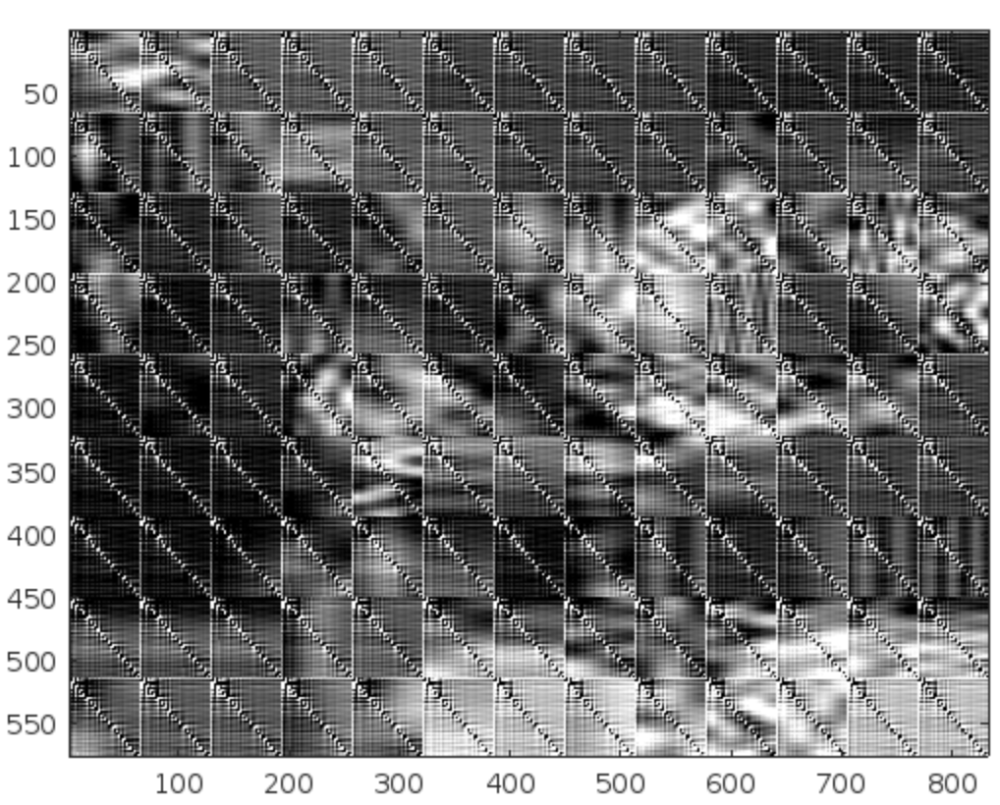
- Plot snr
  - 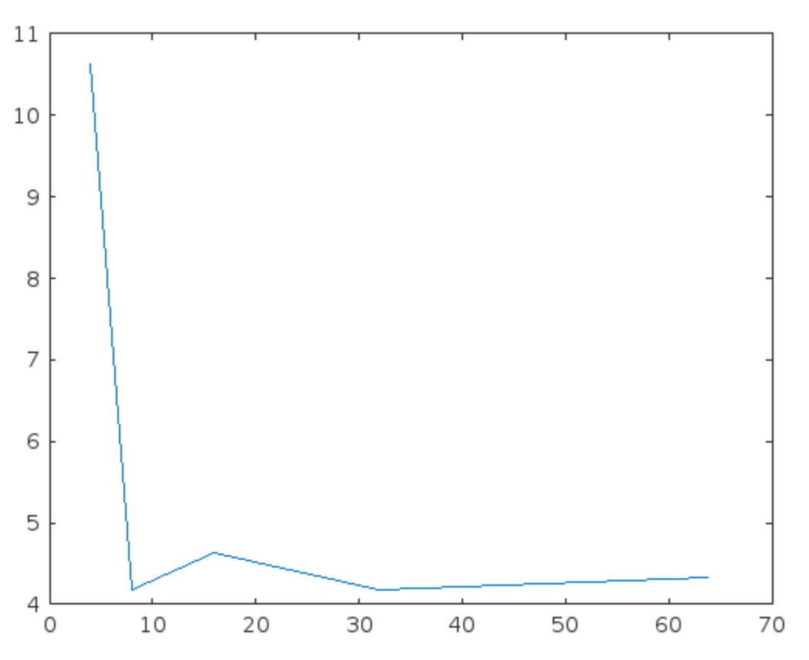
  - block size n=4 gives the best snr, which is 10.6388

## Codes

- compress.m
  - the main function that does all the job required in homework
  - input
    - image
      - file name of image
    - N
      - block size
  - Output
    - Ghat, dGhat, dG

```matlab
function [Ghat,dGhat,dG,G] = compress(image,N)
    % resize
    G = preprocess(image,N);
    G = double(G);
    % apply dct
    dG = blockproc(G,[N N],@(blkStruct) dct2(blkStruct.data));
    % split each term
    dterm = blockproc(dG,[N N],@(blkStruct) (getsplit(blkStruct.data,N,0)));
    ac1 = blockproc(dG,[N N],@(blkStruct) (getsplit(blkStruct.data,N,1)));
    ac2 = blockproc(dG,[N N],@(blkStruct) (getsplit(blkStruct.data,N,2)));
    
    % get min,max dc term
    dc_min = floor(min(min(dterm)));
    dc_max = ceil(max(max(dterm)));

    % get min,max ac term
    ac_only = blockproc(dG,[N N],@(blkStruct) removedc(blkStruct.data));
    ac_min = floor(min(min(ac_only)));
    ac_max = ceil(max(max(ac_only)));

    % quantize each term
    dterm_hat = quant(dterm,double(dc_min),double(dc_max),8);
    ac1_hat = quant(ac1,double(ac_min),double(ac_max),4);
    ac2_hat = quant(ac2,double(ac_min),double(ac_max),2);
   

    % reconstruct
    dGhat = reconstruct(dterm_hat,ac1_hat,ac2_hat,N);
    Ghat = blockproc(dGhat,[N N],@(blkStruct) idct2(blkStruct.data));
    % remove the out of boundary values by convertting Ghat to uint8
    Ghat = uint8(Ghat);
    %show image
    imagesc(Ghat); colormap(gray);
    % calc snr
    img_snr = snr(G,G-double(Ghat))

    % calc compress_ratio
    size_before = size(G,1)*size(G,2)*8;
    split_size = floor((N^2-1)/10);
    blocks = size(G,1)/N*size(G,2)/N;
    size_now = blocks * (8+split_size*4+split_size*2);
    compress_ratio = size_before/size_now
    % show img
    
end
```

- preprocess.m
  - does image read, convert and resize with block size

```matlab
function out = preprocess(file,N)
[I,map]=imread(file); % or imread('image', 'format'); % format can be gif, tiff, etc.
G=ind2gray(I,map);
out = resize(G,N);
end
```

- getsplit.m
  - split dc term, ac term

```matlab
function out = getsplit(in,N,part)
%GETSPLIT Summary of this function goes here
%   Detailed explanation goes here
split = floor((N^2-1)/10);
z = zigzag(in);
dterm = z(1);
ac1 = z(2:split+1);
ac2 = z(split+2:split*2+1);
switch part
    case 0
        out=dterm;
    case 1
        out=ac1;
    case 2
        out =ac2;
end
```

- zigzag.m
  - convert matrix to zigzag vector

```matlab
function output = zigzag(in)
% initializing the variables
%----------------------------------
h = 1;
v = 1;
vmin = 1;
hmin = 1;
vmax = size(in, 1);
hmax = size(in, 2);
i = 1;
output = zeros(1, vmax * hmax);
%----------------------------------
while ((v <= vmax) & (h <= hmax))
    
    if (mod(h + v, 2) == 0)                 % going up
        if (v == vmin)       
            output(i) = in(v, h);        % if we got to the first line
            if (h == hmax)
	      v = v + 1;
	    else
              h = h + 1;
            end;
            i = i + 1;
        elseif ((h == hmax) & (v < vmax))   % if we got to the last column
            output(i) = in(v, h);
            v = v + 1;
            i = i + 1;
        elseif ((v > vmin) & (h < hmax))    % all other cases
            output(i) = in(v, h);
            v = v - 1;
            h = h + 1;
            i = i + 1;
     end;
        
    else                                    % going down
       if ((v == vmax) & (h <= hmax))       % if we got to the last line
            output(i) = in(v, h);
            h = h + 1;
            i = i + 1;
        
       elseif (h == hmin)                   % if we got to the first column
            output(i) = in(v, h);
            if (v == vmax)
	      h = h + 1;
	    else
              v = v + 1;
            end;
            i = i + 1;
       elseif ((v < vmax) & (h > hmin))     % all other cases
            output(i) = in(v, h);
            v = v + 1;
            h = h - 1;
            i = i + 1;
        end;
    end;
    if ((v == vmax) & (h == hmax))          % bottom right element
        output(i) = in(v, h);
        break
    end;
end;
```

- removedc.m
  - remove dc term, only keep ac terms

```matlab
function out = removedc(in)
  out = in;
  out(1,1) = 0;
end
```

- quant.m
  - use given matrix, min, max, level to perform uniform quantizer on input.
  - output quantized matrix

```matlab
function inhat = quant(in,min,max,level)
%QUANT Summary of this function goes here
%   Detailed explanation goes here
vsize = size(in,1);
hsize = size(in,2);

sep = [min:(max-min)/level:max-1];
codebook = sep + (max - min)/level/2;
sep = sep(2:level)
tmp = reshape(in, 1, []);
[index,quantized] = quantiz(tmp,sep,codebook);
inhat = reshape(quantized,vsize,hsize);
end
```

- reconstruct.m
  - use dcTerm, acTerm to inverse zigzag and reconstruct image matrix

```matlab
function dhat = reconstruct(dterm,ac1,ac2,N)
%RECONSTRUCT Summary of this function goes here
%   Detailed explanation goes here
    split = floor((N^2-1)/10);
    rdterm = blockproc(dterm,[1 1],@(blkStruct) [normalize(blkStruct.data,N,0)]);
    rac1 = blockproc(ac1,[1 split],@(blkStruct) [normalize(blkStruct.data,N,1)]);
    rac2 = blockproc(ac2,[1 split],@(blkStruct) [normalize(blkStruct.data,N,2)]);
    combine = rdterm + rac1+ rac2;
    dhat = blockproc(combine,[1 N^2],@(blkStruct) [izigzag(blkStruct.data,N,N)]);
end
```

- normalize.m
  - used in reconstruct.m, to convert ac,dc term to it's position in the original zigzag vector.

```matlab
function out = normalize(in,N,part)
%NORMALIZE Summary of this function goes here
%   Detailed explanation goes here
    split = floor((N^2-1)/10);
    out = zeros(1,N^2);
switch part
    case 0
        out(1)=in;
    case 1
        out(2:split+1)=in;
    case 2
        out(split+2:2*split+1) = in;
end
```

- izigzag.m
  - inverse zigzag to output the original matrix

```matlab
function output = izigzag(in, vmax, hmax)
% initializing the variables
%----------------------------------
h = 1;
v = 1;
vmin = 1;
hmin = 1;
output = zeros(vmax, hmax);
i = 1;
%----------------------------------
while ((v <= vmax) & (h <= hmax))
    if (mod(h + v, 2) == 0)                % going up
        if (v == vmin)
            output(v, h) = in(i);
            if (h == hmax)
	      v = v + 1;
	    else
              h = h + 1;
            end;
            i = i + 1;
        elseif ((h == hmax) & (v < vmax))
            output(v, h) = in(i);
            i;
            v = v + 1;
            i = i + 1;
        elseif ((v > vmin) & (h < hmax))
            output(v, h) = in(i);
            v = v - 1;
            h = h + 1;
            i = i + 1;
        end;
        
    else                                   % going down
       if ((v == vmax) & (h <= hmax))
            output(v, h) = in(i);
            h = h + 1;
            i = i + 1;
        
       elseif (h == hmin)
            output(v, h) = in(i);
            if (v == vmax)
	      h = h + 1;
	    else
              v = v + 1;
            end;
            i = i + 1;
       elseif ((v < vmax) & (h > hmin))
            output(v, h) = in(i);
            v = v + 1;
            h = h - 1;
            i = i + 1;
        end;
    end;
    if ((v == vmax) & (h == hmax))
        output(v, h) = in(i);
        break
    end;
end;
```

