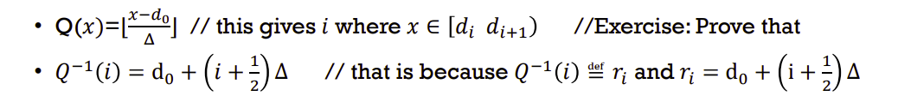
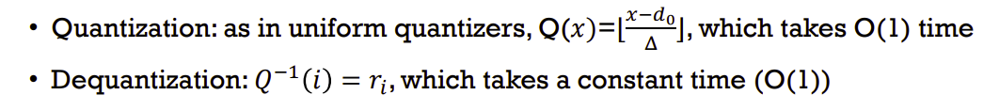

- Quantizer
  - n-level -> split into n intervals
- Uniform
  - 
- Non-uniform
  - q: binary search
  - deq: use r_i
- Semi uniform
  - 

- Max LLOYD
  - NON-UNIFORM
  - Initial the value as uniform q
  - loop
    - ri= average in [di,di+1)
    - di = (ri-1+ri)/2
  - until di doesn't change much
  - 

