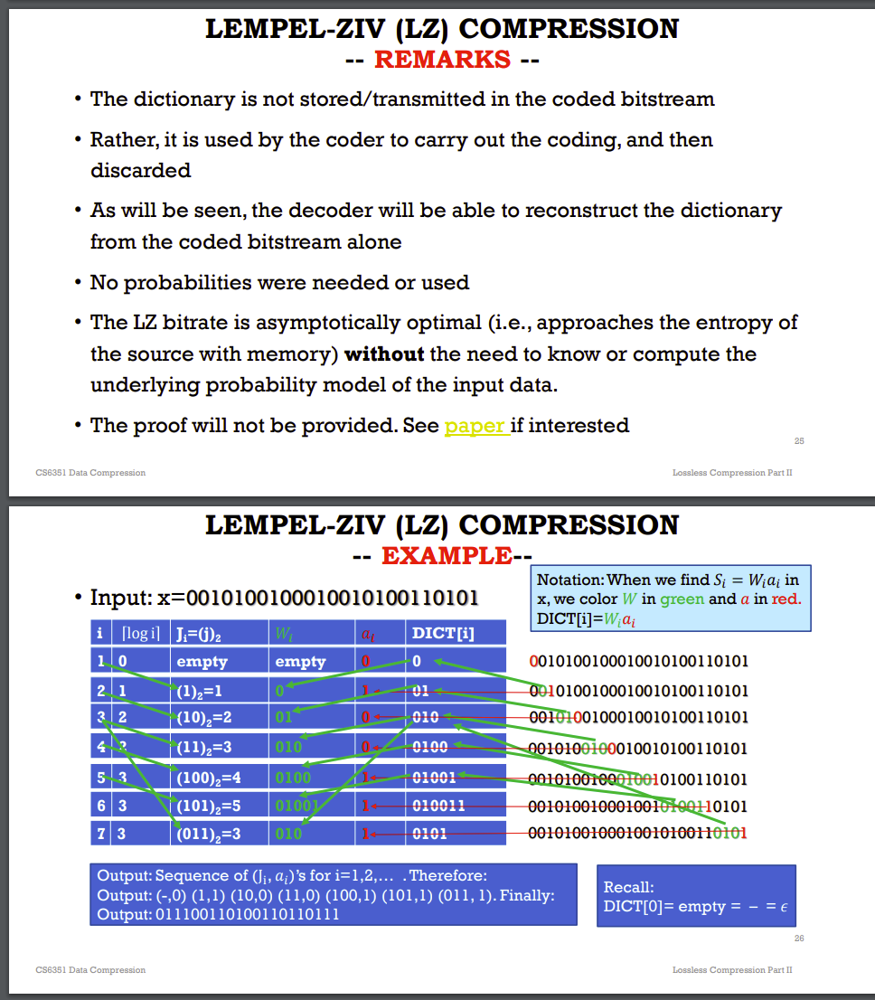
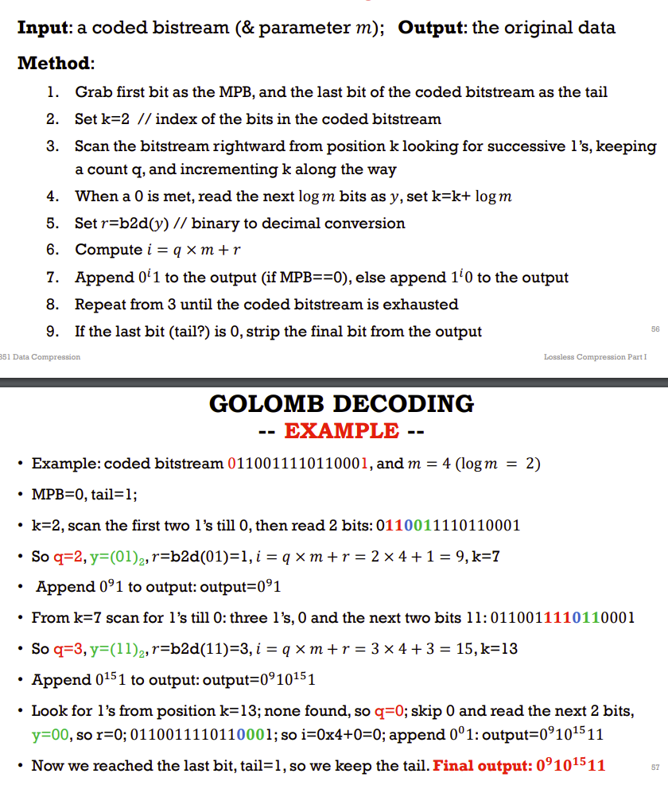

- Quantizer
  - n-level -> split into n intervals
- Uniform
  - 
- Non-uniform
  - q: binary search
  - deq: use r_i
- Semi uniform
  - 

- Max LLOYD
  - NON-UNIFORM
  - Initial the value as uniform q
  - loop
    - ri= average in [di,di+1)
    - di = (ri-1+ri)/2
  - until di doesn't change much
- Transform
  - 
  - decorrelated data: less blurring, less loss of patterns.

- 
- 
- 
- 
- Lossless
  - DPCM
    - 
    - 
    - 

  - Gray codes
    - make adjacent binary only change 1 number
    - 
    - 
    - 

- decode-> stop at ceil(-log delta) = t
- LZ compression
- 
- 
- 

