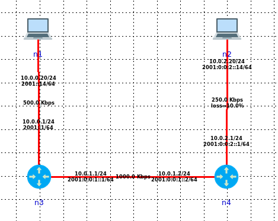
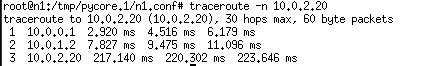

## Part 1: Setting up a TCP client and server (2 points)

### 1)   Run the CORE scenario 

### 2)   Open a terminal on node n2. Run a server on port 8080: 

- a:
- `-s` means run in server mode
- `-i 1` means 1 second between periodic bandwidth reports
- `-p 8080` means server listens on port 8080

### 3) Open another terminal on node n2. Use the command netstat to list servers

- 
- Proto/Recv-Q/Send-Q/Local Address/Foreign Address/State/PID

### 4) Now run a client on node n1 connecting to node n2

- 
- `-c `means run in client mode and connect to 10.0.2.20 
- `-t 120` means set transmit time to 120 senconds

### 5）  Open another terminal on node n1.

- 
- The `recv-Q` and `send-Q on node 2 is always 0, the recv-Q on node1 is always 0, the send-Q increase first and drops in the last(takes 240 seconds to clear the send-Q, which is exactly 2 times of 120 seconds)
- 

- The Send-Q is the Queue for packet sending, the Recv-Q is the Queue for packet receiving.

## Part 2: Benchmarking (4 points)

### 1)   Test 1, throughput:

1. Run the CORE scenario 
2. How does iperf measure throughput? 
   1. iperf should be counting packet during certain time period to calculate the average throughput
3.    Which link in this scenario is the bottleneck link? 
   1. The n4->n2 link should be the bottleneck link for 
4. Run iperf server on node n2 as shown in part 1
5. Run iperf client on node n1 as shown on part 1
6. The server will report instantaneous throughput per second
7.  When the server stops reporting, the last line is the average throughput. What is the average throughput? 
   1. 
   2. 226 Kbits/sec
8. In your opinion, why is the average throughput smaller than the bottleneck bandwidth?
   1. The bottleneck is just the upper limit of average throughput, there might be packet loss/retry/wait time included to result this smaller average value.
9. Stop the scenario
10. Change rate of link n2-n4 to 750kbps? Repeat starting from (a) to (i)
    1. 
    2. The Average increased to 436Kbits/s, Now the bottleNeck Link changed to n1->n3

### 2) Test2,loss

- Reload the scenario (to reset rate of link n2-n4)

- Add a 10% loss on the link n2-n4
  - 
-  Run the CORE scenario 
-  Run a ping test from n1- n4 for 1 minute (till you see icmp_seq=60)

​                               i.   Ping 10.0.2.20

​                               ii.   Control-c to stop

- When you stop ping, it will report statistics. What is the packet loss reported by ping? Can you justify the results (are the results 10% or more? If more, why?)
  - 
  - The loss is about 22.72% and is a lot higher than 10%, the main reason behind this is the loss is applied both to inbound traffic and outbound traffic, resulting a double loss rate in round trip.

- Stop the scenario

### 3) Test3, end to end delay

- a.   Read on RTT: https://developer.mozilla.org/en-US/docs/Glossary/Round_Trip_Time_(RTT)

- b.   Reload the scenario (to reset loss on link n2-n4)

- c.    Add a 100ms delay on the link n2-n4
  - 

- d.   Run the CORE scenario 

- e.   Run a ping test from n1-n4 for 1 minute (till you see icmp_seq=60)
  - 

- f.    When you stop ping, it will report statistics. What is the RTT (round trip time) reported by ping? Can you justify the results (is delay 100ms or more? If more, why?)
  - The ping's RTT is around 211 ms, is a lot more than 100ms. Because the ping reports RTT which consist outbound time and inbound time. So this 100ms latency is applied twice on the result RTT.

- g.   Stop the scenario

### 4）Test4, per link latency

- a.   Rerun last scenario (keep 100ms delay on the link n2-n4)

- b.   Run a traceroute from n1-n4:
  -   traceroute -n 10.0.2.20
  - 

- c.    Compare the latency results from ping to traceroute. What information does each provide?
  - Ping mainly provide packet loss and overall RTT
  - Traceroute provides RTT for each node in it's path.
  - Describe a situation when you would want to use ping to measure end to end latency
    - When I want to check if there is packet loss in the link or I'm only interested in overall RTT
  - Describe a situation when you would want to use traceroute to measure per link latency
    - When I want to check latency for each link to my destination