## Part 1: Analyzing UDP traffic in Wireshark (2 points)

### Run the CORE scenario 

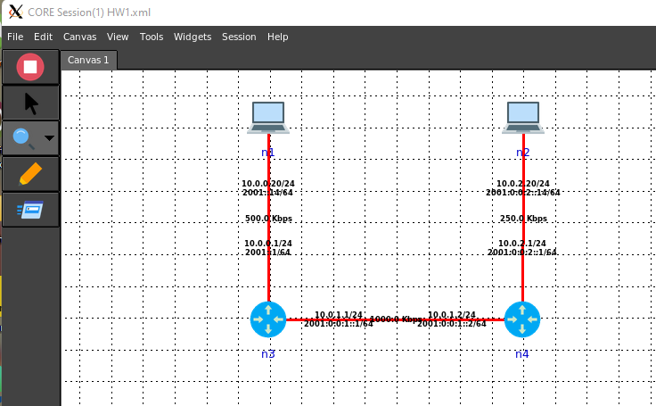

### Open a terminal on node n2. Run a UDP server on port 8080 using netcat: 

- a.   nc –u -l 8080
  - 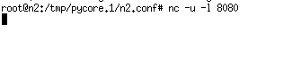

- b.   What does “-u’ mean?
  - UDP mode

- c.    What does “-l” mean?
  - Listen mode, for inbound connects

### Open another terminal on node n2. Run a UDP client on port 8080 using netcat: 

- a.   Show the output of: nc –u 10.0.0.20 8080
  - 10.0.0.20 8080 should be on n1, it doesn't provide any output
  - Assuming step1 runs nc on n1
  - 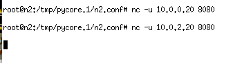

### You can now start typing text on either the server or the client and you should see it appear on the other end.

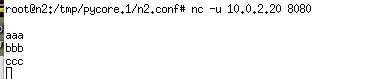

### Open Wireshark from the Ubuntu host

- a.   Open a terminal on Ubuntu

- b.   Run: sudo wireshark 

- c.    Select the interface corresponding to the link between n1 and n3
  - 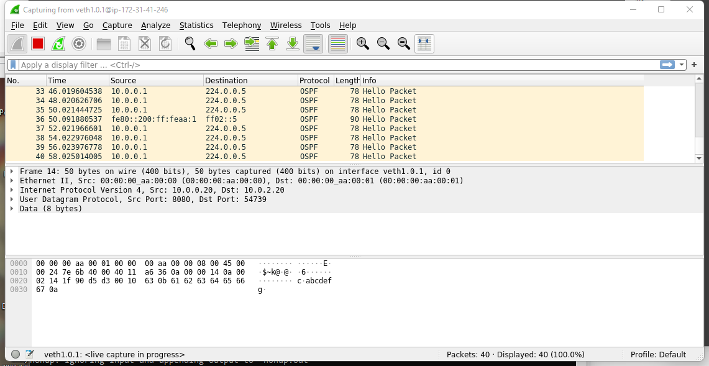

- d.   Set the filter to capture UDP traffic only
  - ​	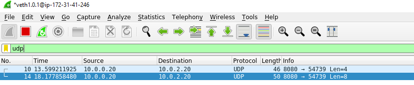

- e.   Now type a message at the server: hello my name is {add your name} and I am a server

- f.    Now type a message at the client: hello my name is {add your name} and I am a client

- g.   Show the raw text of the two messages displayed in Wireshark (UDP payload content)

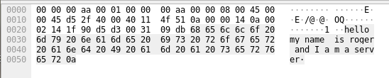

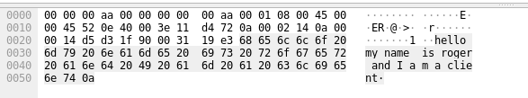

- h.   What port number was the server using? 
  - 8080

- i.    What port number was the client using?
  - 54739

- j.    Stop the client and the server then start them again

- k.   Answer (h) and (i) again. The answer to one of them should be different. 
  - server: port 8080
  - client: port 59775
  - Which one? Why do you think the answer changed?
    - The Client port has changed, for we have defined the port of server to be 8080. But client is just using a random available port
- l.   Stop the scenario

## Part 2: UDP, the unreliable transport (2 points)

1) Start the scenario again

2) This time we will run TCP client and TCP server. To do that, remove the –u option from both commands

   a.   Server: nc –l 8080 

   b.   Client: nc 10.0.0.20 8080

3) Run the client only and no server. Describe what happens if you try to send a message from the client to the stopped server.
   - The Client send a TCP SYN packet to the server but got an port rejected return.

5) Stop the scenario

6) Add a 25% loss to the link from n1 to n3
   1) 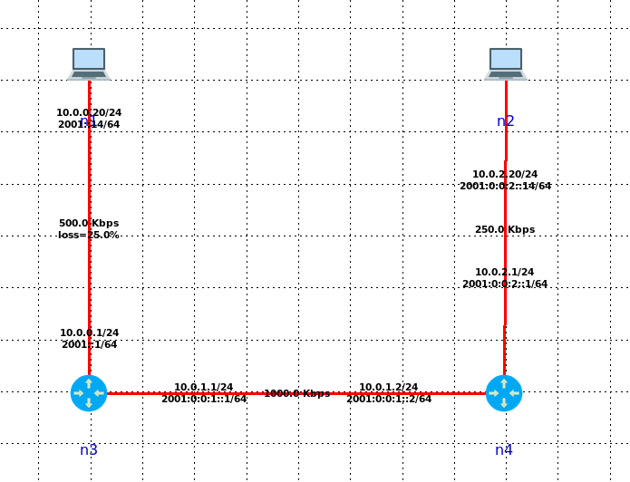

7) Run the nc server and client again

8) Send 10 messages from client to server as shown below

9) How many of these messages did you get? 
   1) 6
10) Are some messages lost? 
    1) Yes, 4 messages are lost
11) If so, is the loss close to 25%? 
    1) It's 40% percent. But maybe it's just certain randomness.
12) Show a screenshot of the messages delivered at the server. Remember TCP is a reliable transport. It will guarantee delivery.
    1) 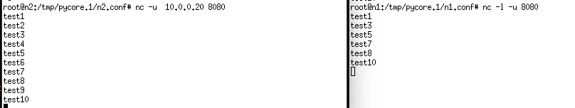

## TCP, the unreliable transport (2 points)

1) Start the scenario again

2) Run the client only and no server. Describe what happens if you try to send a message from the client to the stopped server.

- The Client send a UDP packet to the server but got an ICMP port rejected return.

3) Stop the scenario

4) Add a 25% loss to the link from n1 to n3

1) 

5) Run the nc server and client again

6) Send 10 messages from client to server as shown below

7) How many of these messages did you get? 

1) All messages are delivered

9) Are some messages lost? 
   1) No
10) If so, is the loss close to 25%? 
    1) No
11) Show a screenshot of the messages delivered at the server. Remember TCP is a reliable transport. It will guarantee delivery.
    1) 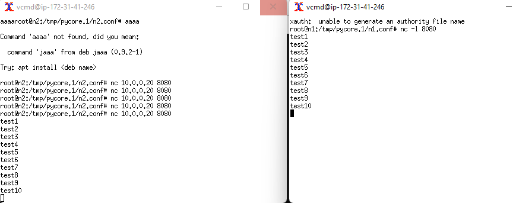

