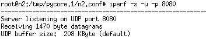
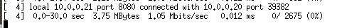
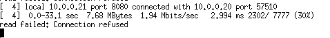
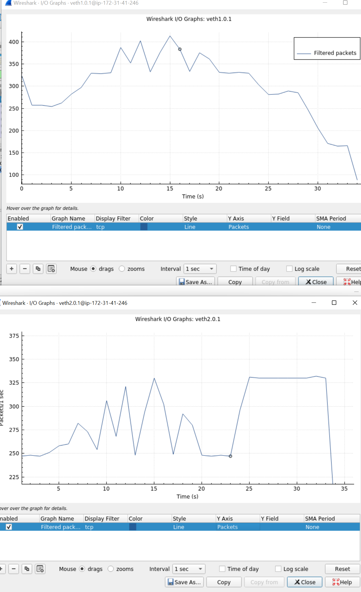

## Setup


## Part 1: Analyzing UDP client and server views (2.5 points)

- **a.   Use iperf to run a UDP server on port 8080 (0.25 pt) What command did you use?** 

  - 

  - ```
    root@n2:/tmp/pycore.1/n2.conf# iperf -s -u -p 8080
    ------------------------------------------------------------
    Server listening on UDP port 8080
    Receiving 1470 byte datagrams
    UDP buffer size:  208 KByte (default)
    ```

- **Use iperf to run a UDP client connecting ---- What command did you use?**

  - 

  - ```
    root@n1:/tmp/pycore.1/n1.conf#  iperf -u -c 10.0.0.21 -p 8080 -l 1470 -b 1048576 -t 30                  
    ------------------------------------------------------------
    Client connecting to 10.0.0.21, UDP port 8080
    Sending 1470 byte datagrams, IPG target: 11215.21 us (kalman adjust)
    UDP buffer size:  208 KByte (default)
    ------------------------------------------------------------
    [  3] local 10.0.0.20 port 39382 connected with 10.0.0.21 port 8080
    ```

- 5. **Now let’s analyze the UDP traffic**

  - **(0.5 pt) What is the one difference in the UDP headers of both packets?** 
    - The checksum is different in the UDP headers of both packets.
  - **Show a screenshot of the iperf server summary after the flow ends. Did the iperf server at n2 report any packet loss? If so, how much?** 
    - 
    - No loss is reported by server(0%)
  -  **Use the Wireshark I/O graph to show two screenshots of the UDP activity at sender and receiver as shown below**
    - sender
      - 
    - recevier
      - 
    - a.   (0.5 pt) Do the sender and receiver views align in terms of data rate?
      - Yes, their view are aligned in terms of data rate.

- **6  Repeat (3) and (4) but this time in (4) use a sending data rate of 3Mbps**

  - **a.   (0.5 pt) Compare the source and destination ports of the packets to the one observed in 5d. What changed? Why?**
    - The source port changed. Because we set the server to listen on 8080 so that port won't change. But we haven't manually assigned a port for the source. So it just random picked an available port and changed from 39382 to 57510
  - **Did the iperf server at n2 report any packet loss? Show a screenshot of the iperf server summary after the flow ends.**
    - Yes, there are about 30% packet loss reported
    - 
  -  **(0.5 pt) Use the Wireshark I/O graph to show a screenshot of the UDP activity at both sender and receiver.** 
    - sender
      - 
    - receiver
      - 
  - Does the answer to (5e) and (5h) change? Does that align with our discussion in class about sender and receiver blinded from one another?
    - Yes, the answer to 5e changed. Now 30% packet are lost.
    - Yes, the answer to 5h also changed, the graph is no longer aligned.
    - The graph's alignment shows that there is no communication between sender and receiver. The reason behind sender's send rate's drop is that the sender got a "port not available" error at around 24 second(possibly the result of congestion) and can't send the data anymore.

## Part 2: Analyzing TCP client and server views (3.5 points)

- **1  Use iperf to run a TCP server on port 8080** 

  - 

  - ```
    root@n2:/tmp/pycore.1/n2.conf# iperf -s -p 8080   
    ------------------------------------------------------------
    Server listening on TCP port 8080
    TCP window size:  128 KByte (default)
    ------------------------------------------------------------
    
    ```

- **3 Use iperf to run a TDP client connecting to node n2 on port 8080**

  - 

  - ```
    root@n1:/tmp/pycore.1/n1.conf# iperf -c 10.0.0.21 -p 8080  -b 3145782 -t 30
    ```

- **5  Show a screenshot of the TCP handshake highlighting the following**

  - 
  - a.   (0.25) The initial sequence number at n1 and n2
    - n1: Sequence number: 3668951277
    - n2: Sequence number: 1304906173
  - a.   (0.25) The window size at both n1 and n2
    - n1: Window size value: 64240
    - n2: Window size value: 65160

- **6 Do the sender and receiver I/O graphs align?** 

  - They are somehow aligned in time, though the send/receive value are not the same.
  - 

- Does the iperf client or server report any loss

  - No, none of them reported any loss.

- **7 Let’s look at the TCP RTT estimation.** 

  - (0.5 pt) Show a screenshot of the graph. Comment on the distribution of the samples. Do you see why a moving average is probably a good thing for RTT calculation?
    - 
    - The delay for sender increases steadily with time. And ranges from 0.6s to 1.2s afterwards.
    -  moving average is good because single packet RTT is trivial but the average RTT for a time period is more important.

- **9  (0.5 pt) Load the Wireshark capture called “Capture1_client.pcapng” provided with the homework. Run the Time Sequence Graph from 10.0.0.20 to 10.0.0.21. Explain what happened from the capturer’s perspective after the 28.09th second. Compare the sequence number of the packets sent to the ones Ack’d**
  - We can see around 28.09 second, a FIN ACK is sent from n1(the node where  capture occurs) to n2. But the receiver is still receiving until 40 second. So it's most possible that the transmission speed is not fast enough. And the FIN ACK from n1 held for about 12 second for n2 to ack. 
  - From the sequence number perspective, at 28.09 the n1 is sending the Sequence number: 2630154262, but the next packet from server is acking 2630110822. So there are about 40k data being buffered between the sender and the receiver.
- **10   (0.5 pt) Load the Wireshark capture called “Capture1_server.pcapng” provided with the homework. Run the Time Sequence Graph from 10.0.0.20 to 10.0.0.21. Examine the TCP Trace Explain what happened from the capturer’s perspective after between the 14.95th second and 17.94th second.**
  - We can see that the sequence number stalled for a moment. And looking into the detail shows that the client has sent duplicate ack to the server. Indicating a server's packet to the client might have lost. So the server stops sending new packets and retransmit the missing old packet start from the ack's location.
- **11  (1 pt) Load the Wireshark capture called “Capture2_server.pcapng”.** 
  - a.   Run the Time Sequence Graph from 10.0.0.20 to 10.0.0.21. Explain what is happening to the TCP connection.
    - There are several stall between 144s - 235s, 254s - 350s, 369s - 435s. Looking into details shows that the receiver is sending TCP Zero Window to the sender to make sender slow down for receiver to process all it's data in the buffer.
  - b.   Switch the type of graph to Throughput. Does that make sense given your answer to part a?
    - 
    - Yes, we can see that during the time when TCP sequence stall, there are no throughput happening as well.