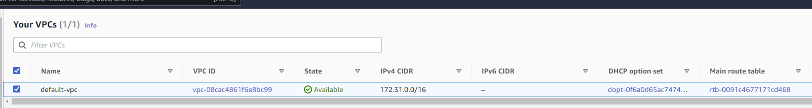
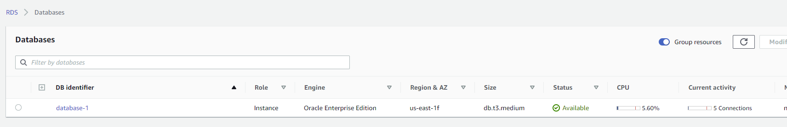
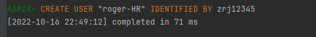
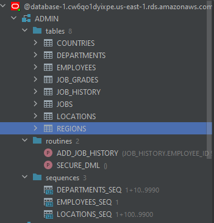
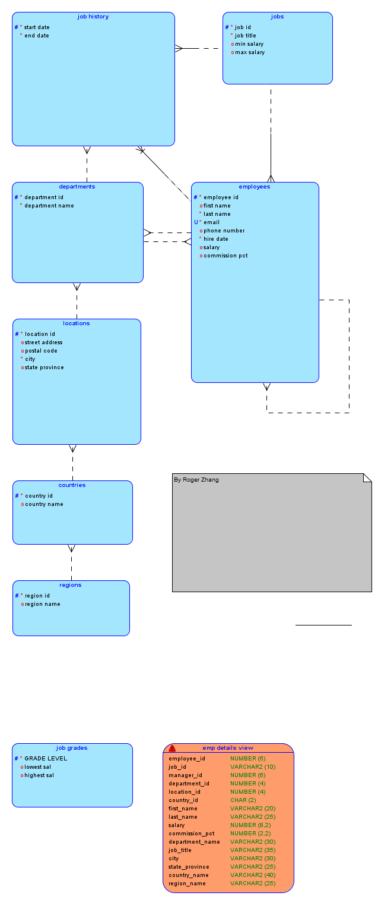
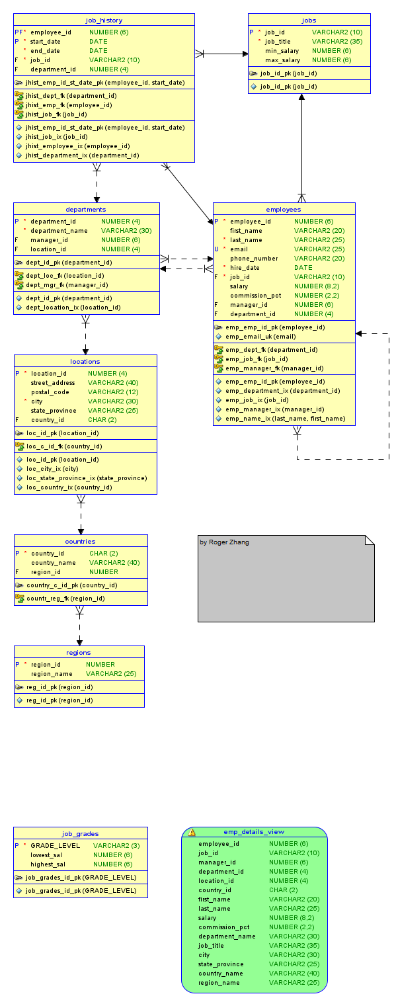

### a.      Setting Up the Default VPC

### b.      Create an RDS Oracle Database

### c.      Create an Oracle userid “<your initials>-HR”

### d.      Load the HR Database Schema

###  e.      Connect with the Oracle SQL Developer and load the HR Database schema

### f.       Connect to the HR Database Schema using the Oracle SQL Developer

### g.      Use the Oracle Data Modeler to reverse engineer your Oracle Database Schema into and ER Diagram (Logical)

### h.      Reverse Engineer the ER into a Relational Diagram

### i.       All the diagrams must have a LEGENT in the graph

See above diagrams