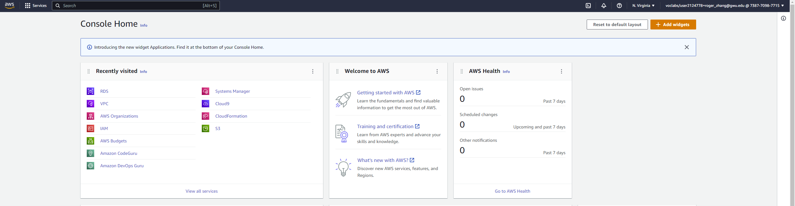
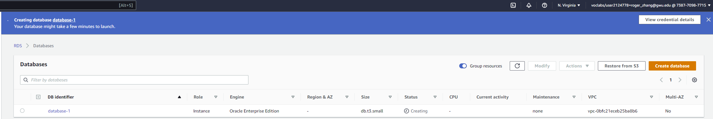

### a.      Setting Up the Default VPC

- First login
  - 
- make sure the REGION is set to **N. Virginia
  - 
-  enter the name **Default VPC**, then click on **Save**
  - 
- **Setting the Name tags for the default subnets.**
  - 
- Subnet Association
  - 
- ACL Association
  - 
- SG update
  - 
- Lesson learned
  - we saw in detail how to create an on-demand EC2 instance in this tutorial. Because it is an on-demand server, you can keep it running when in use and ‘Stop’ it when it’s unused to save on your costs.
  - I can provision a Linux or Windows EC2 instance or from any of the available AMIs in AWS Marketplace based on your choice of OS platform.
  - If my application is in production and you have to use it for years to come, you should consider provisioning a reserved instance to drastically save on your CAPEX.
  - Here, we saw how to create a Spot Instance request successfully by determining our bid price.
  - Spot instances are a great way to save on costs for instances which are not application critical. A common example would be to create a fleet of spot instances for a task such as image processing or video encoding. In such cases, you can keep a cluster of instances under a load balancer.
  - If the bid price exceeds the spot price and your instance is terminated from AWS’s side, you can have other instances doing the processing job for you. You can leverage Auto scaling for this scenario. Avoid using Spot instances for business critical applications like databases etc.

### b.      Create an RDS Oracle Database

- Create rds first step
  - 

- RDS creating
  - 
- RDS created
  - 
  - 

### c.      Create an Oracle userid “<your initials>-HR"

- Connect to RDS
  - 
- create user
  - 

### d.      Load the HR Database Schema

###  e.      Connect with the Oracle SQL Developer and load the HR Database schema

### f.       Connect to the HR Database Schema using the Oracle SQL Developer

### g.      Use the Oracle Data Modeler to reverse engineer your Oracle Database Schema into and ER Diagram (Logical)

### h.      Reverse Engineer the ER into a Relational Diagram

### i.       All the diagrams must have a LEGENT in the graph

See above diagrams