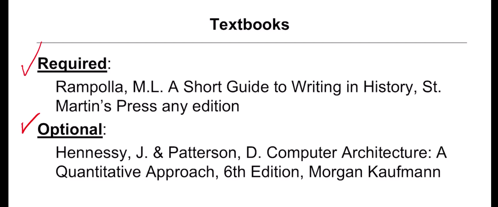
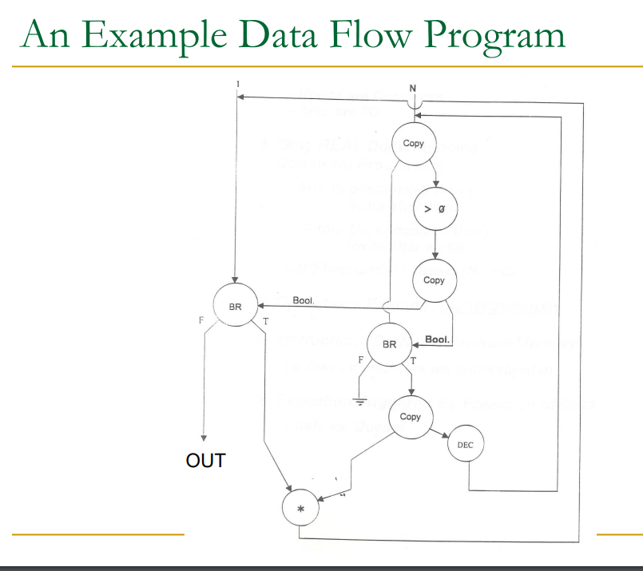
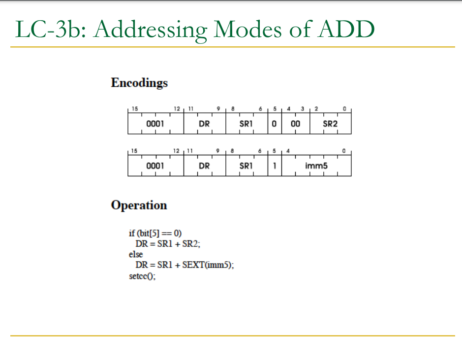
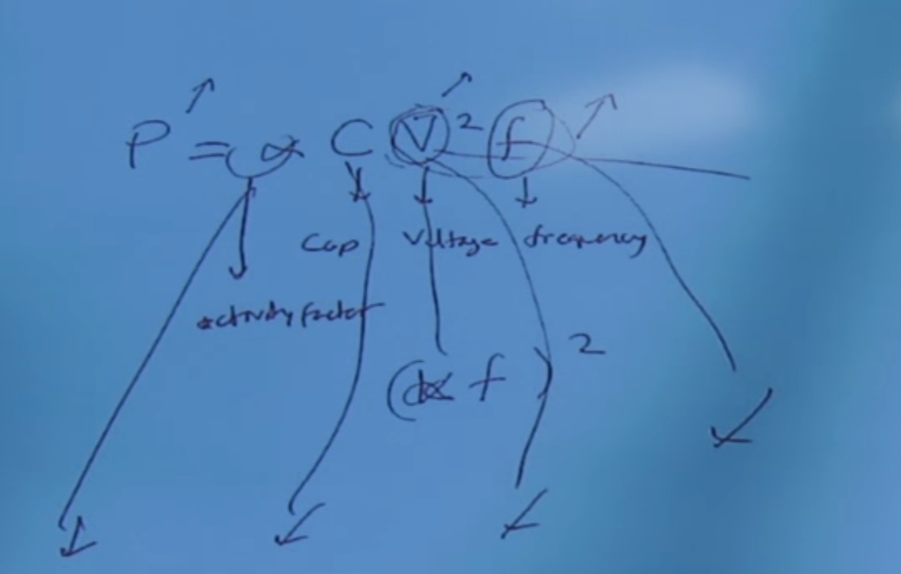

# section 10

Bloom Filters to determine which row needed to be refreshed.

Barrier sync.

# Lecture 2

Von neumann

factorial program

## RISC vs CISC

complex with simplified instruction set

Risc

- simple ins
- fix length
- uniform decode
- few addressing mode

CISC

- complex ins
- variable length
- non-uniform decode
- many addr mode

## Single cycle machine vs Multi-cycle

Each instruction takes a single clock cycle

  All state updates made at the end of an instruction’s execution 

 Big disadvantage: The slowest instruction determines cycle time 

 long clock cycle time

Multi:

- Instruction processing broken into multiple cycles/stages 
-  State updates can be made during an instruction’s execution  
- Architectural state updates made only at the end of an instruction’s execution  
- Advantage over single-cycle: The slowest “stage” determines cycle time  
- Both single-cycle and multi-cycle machines literally follow the von Neumann model at the microarchitecture level

# Pipelines?

## Handling Resource Contention

1: Eliminate the cause of contention

2: dectet the resource contention and stall one of the contending stages

## Data Dependences

1: Flow dependence -> (read after write)RAW

- detect and wait
- detect and forward/bypass
- detect and elimiate the dependence in software level
- do something else?(multithreading)
- Predict the needed values, execute "speculatively" and verify.

2: Output depend (write after write)WAR

3: Anti dependence (write after read)WAW

Interlocking?

destination register ID

compare source register ID to dr ID, if match, stall the command

## data forwarding

forward result of alu to the next instruction needed.
