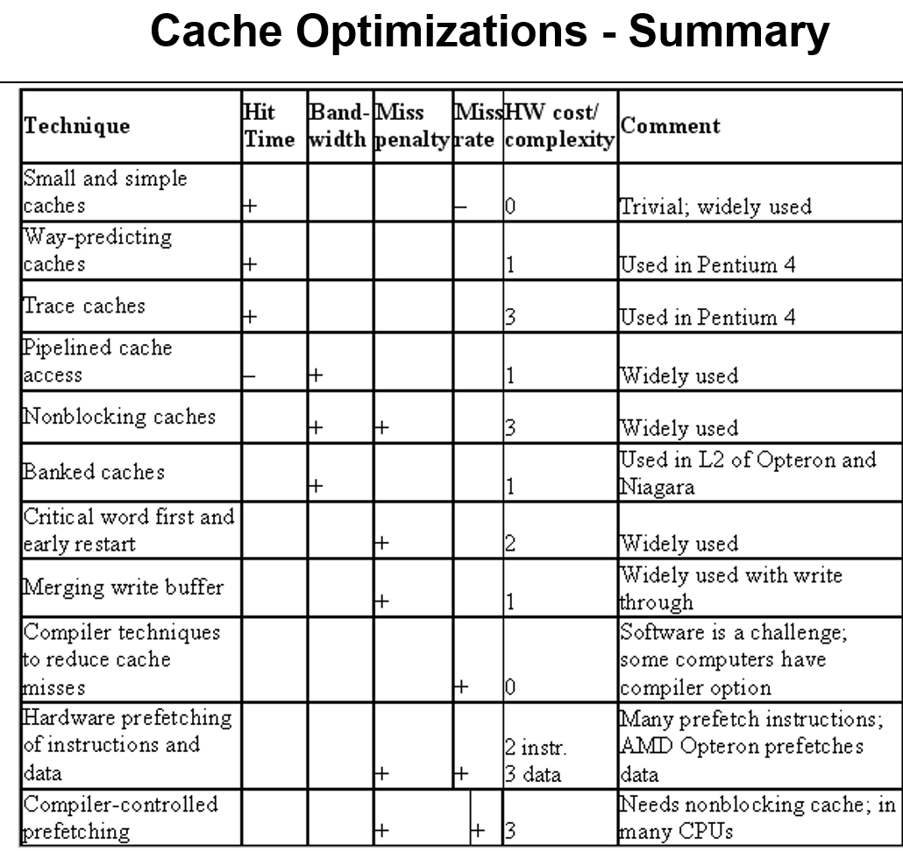
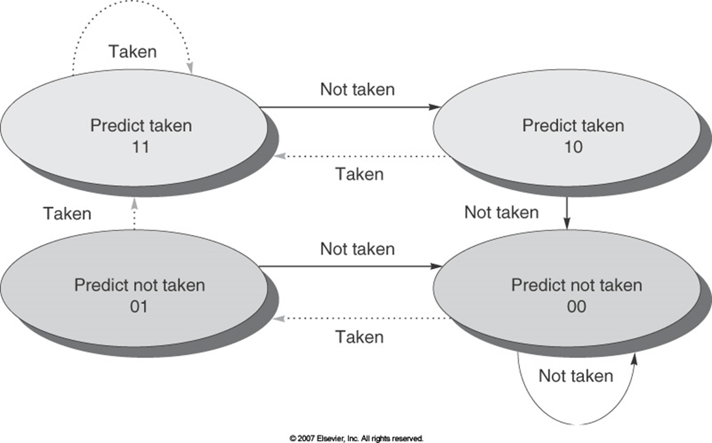

- Tomasulo algorithm for exam

  - –Op – The operation to perform on source operands S1 and S2

    –Qj, Qk – The reservation stations that will produce the corresponding source operand ( a value of 0 indicates that the operand is already available in Vj or Vk or is unnecessary)

    –Vj, Vk – The value of the source operands. Only one of the V field or the Q field is valid for each operand. For loads, the Vk field is used to hold the offset field

    –A – Used to hold information for the memory address calculation for a load or store – immediate field initially stored here, then EA

    –Busy – Indicates that this reservation station and its accompanying functional unit are occupied

- How does the Tomasulo algorithm accomplish register renaming
  - Use reservation stations to hold instructions and operands for instruction to execute 
  - decouple register from operands
  - create dependency chain between reservation stations.

- Explain how the Tomasulo hardware makes maximum use of execution unit hardware, that is, keeps the functional units busy.
  - maintains a set of instructions that have been issued and marks the reservation as having all need operands. Function units execute any of the instructions that are ready.

- How does a reorder buffer preserve exception behavior?
  - reorder buffer instructions can be executed out of order, but they are committed in order if an instruction causes an exception, the exception is raised when the instruction is committed.

- register renaming

•Register renaming is provided by *reservation stations*

– **Buffer operands of instructions waiting to issue**

– **Fetches and buffers an operand as soon as it is available, eliminating need to get it from a register**

– **Pending instructions designate the reservation station that will provide their input. As instructions are issued, the register specifiers for pending operands are renamed to the names of the reservation station**

– **When successive writes to a register overlap in execution, only the last one is used to update the register**

– **There can be more reservation stations than real registers**

- What type of cache coherency is used in massively parallel architectures and why?

  - Directory based, these scales better as all memory accesses does not compete on the same bus.

- b) In a snooping protocol, why are write misses always put on the bus?

  - let other processor determinate if they have a copy and can invalidate their copy.

- Explain why vector processors are much more efficient than compiler optimizations of loops and dynamic scheduling in scalar architectures.

  - A single vector instruction (SIMD) operates an multiple data elements, in pipelined method.
  - One instruction fetch acts as a loop

- Briefly explain how vector units can accomplish forwarding? 

  - Vector unites can be chained so that results from previous vector instructions are provoked directly to the subsequent instructions in parallel with filling in contents of result vectors

- How does a branch target buffer eliminate invalid stage executions in pipeline?

  - It provides, for a branch instruction, the next predicted pc value at the end of the if cycle of the branch instruction. 
  - branch prediction buffer
  - branch target buffer

- Why does a 4 state (2 bit) branch predictor do much better than a 2 state (1) branch predictor?

  - Need two consecutive prediction
  - tobe more correct than single step prediction.
  - It takes two consecutive mis predicts to change the prediction.

- What penalties do we pay for incorrect predictions with a reorder buffer?

  - We need to flush the instruction loaded(loaded and executed) below the incorrect prediction happens.
  - flush computational unites
  - restart from the correct branch target

- Loop unroll -> standard five stage mips architecture

  - loop:  ld r6, 0(r1)

    ld r2, 0(r8)

    add r6, r6, r2

    st r6, 0(r1)

    daddui r1,r1, #-8

    bne r5,r1, loop

  - firstly expand the loop before daddui

  - reorder the loop

  - calculate the cycle in five stage mips

- a. What basic concept or concepts throughout the memory hierarchy dictate where copies of memory should be kept?

  - temporal and spatial locality with respect to the current instuctions that are being executed

- b. What happens to cache performance when the number of blocks in a direct mapped cache are reduced?

  - conflict miss increases

- c. For b above, how does this affect other optimizations in instruction scheduling and execution units?

  - more cache miss means more stalls to wait for cache load.

- Why are directory protocols dominant in machines with large numbers of processors?

  - scale better
    memory traffic is distributed across direct transfer
    directory protocols work with distributed memory and an interconnect they can provide multiple connections and transfers to directorys.

| arch                             | pro                                                          | con                                                          |
| -------------------------------- | ------------------------------------------------------------ | ------------------------------------------------------------ |
| stack                            | Good code density (implicit operand addressing top of stack) Low hardware requirements Easy to write a simple compiler for stack architectures | Stack becomes the bottleneck Little ability for parallelism or pipelining Data is not always at the top of stack when needed, so additional instructions are needed Difficult to write an optimizing compiler |
| **Accumulator**                  | Very low hardware requirements Easy to design and understand | Accumulator becomes the bottleneck Little ability for parallelism or pipelining High memory traffic |
| **Memory-Memory**                | Requires fewer instructions (especially if 3 operands) Easy to write compilers for | Very high memory traffic (especially if 3 operands) Variable number of clocks per instruction (especially if 2 operands) and indexing and indirect access and … With two operands, more data movements are required |
| **Register-Memory**              | Some data can be accessed without loading first Instruction format easy to encode Good code density | Operands are not equivalent (poor orthogonality) Variable number of clocks per instruction (w/ indexing and indirect access and …) May limit number of registers |
| **Load-Store/Register-Register** | Simple, fixed length instruction encoding Instructions take similar number of cycles Relatively easy to pipeline | Higher instruction count  Not all instructions need three operands Dependent on good compiler |

Cache

•Advantages of unified caches:

–Balance the load between instruction and data fetches depending on the dynamics of the program execution;

–Design and implementation are cheaper.

•Advantages of split caches (Harvard Architectures)

–Competition for the cache between instruction processing (which fetches from instruction cache) and execution functional units (which fetch from data cache) is eliminated 

–Instruction fetch can proceed in parallel with memory access from the execution unit.

Branch Prediction

1bit scheme

2bit(2 wrong before changing state)

reorder buffer

lecture 5

Loop Unrolling** 

lecture7

data harzard

•*Wait for the result to be available by freezing earlier pipeline stages è interlocks*

 *Route data as soon as possible after it is calculated to the earlier pipeline stage* *à* *bypass*

 *Speculate on the dependence. Two cases:*

 *Guessed correctly* *è* *do nothing*

 *Guessed incorrectly* *è* *kill and restart*

On mispredict:

–No speculative state may commit (see speculative execution later)

•Squash instructions in the pipeline

•Must not allow stores in the pipeline to occur

•Cannot allow stores which would not have happened to commit

•Need to handle exceptions appropriately

•**Crossbar Switch:**

butterfly network

hypercube

- speculative execution:
  - key arch features
    - reorder buffer
      - –**Requires changes to the sequence and additional set of hardware buffers that hold the results of instructions that have finished but not committed.**
    - commit phase in pipeline
      - •**Instruction reaches the head of the** **ROB** **and its result is present in the buffer, at this point the processor updates the register with the result and removes the instruction from the ROB**
    - branch target buffer
      - keep speculative processor branches going
- 2bit branch prediction
  - when: two consecutive prediction and then changes
  - why: keeps tracking previous 2 predictions to decide next
  - 
- 3: Vector processor
  - A single vector instruction (SIMD) operates an multiple data elements, in pipelined method.
  - One instruction fetch acts as a loop
- 7:Caches:
  - conflict: increase cache block size result less blocks, which will increase conflict miss
  - compulsory: increase cache block size will load more data with each compulsory miss, so there will be less compulsory miss.
- 8: coherency:
  - broadcast the write on bus each time a cpu does a write to its own copy
  - all cache stays shared, no need for exclusive
  - only one cpu can use the bus at one time
  - lower latency between write and read
- 9: branch prediction
  - branch prediction buffer
    - the pipeline finds out whether the branch is taken and what the target of the branch is at roughly the same time as the branch predictor information would have been use 
  - branch target buffer
    - All predicted pc are stored with previously taken branch
    - the machine will lookup pc in this buffer when encountering branch,  get the predicted pc and immediately begin at that address
    - so if this prediction is correct, it saves time before the actual operands are calculated.  and is one clock faster than branch prediction buffer
- 5: Static scheduling:
  - loop unrolling breaks the dependency chain and reduce the number of block cycle, which causes less stall in execution and runs faster
  - eliminates the branch and allow different instructions from different iteration to be scheduled together

- 1: software pipling

  - –Finding sequences of unrelated instructions that can be overlapped in the pipeline

    –Separation of a dependent instruction from a source instruction by a distance in clock cycles equal to the pipeline latency of the source instruction. (Avoid the stall)

  - unrolling will cause some issues

    - –As we unroll more, each unroll yields a decreased amount of improvement of distribution of overhead

      –Growth in code size

      •**Large code size may increase cache miss rate**

      –Shortfall in available registers (register pressure)