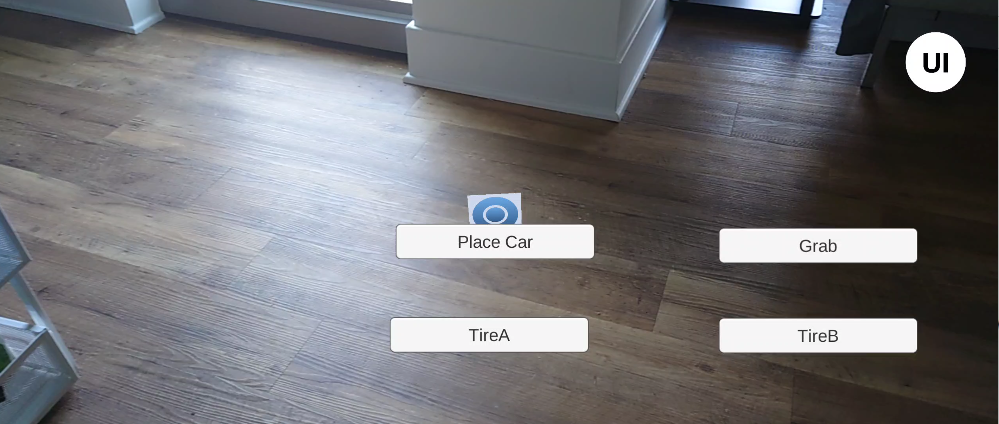

# F1 crew userguide

- Upon opening, you'll see the interface like this after a few seconds, (please allow camera access)
  - if the interface failed to show up, please change to a more flat place with decent environment lightening.
- 

- After this, please select a appropriate location to place the car.
- 

- Then, press grab against the wheels to remove them
- 
- Lastly please choose the type of wheel you want to fix the car.
- 