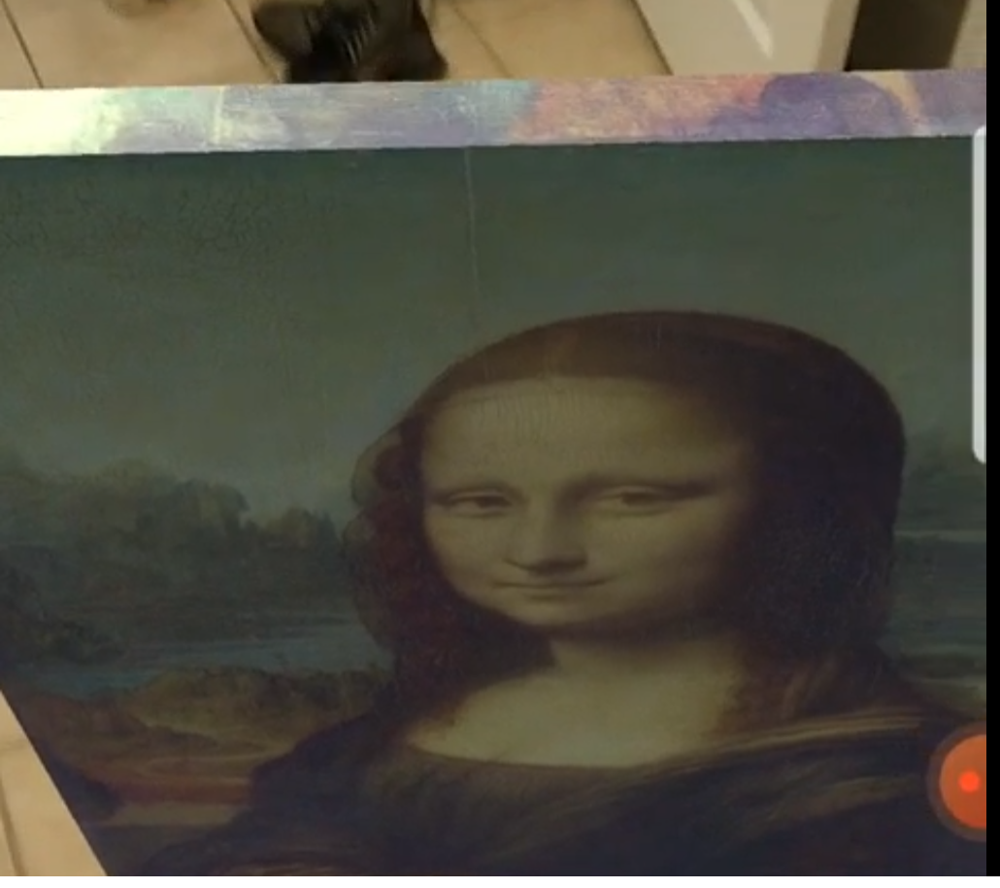

# 1 [NoahChinitz-AR-T](https://gwu.app.box.com/folder/161390791986)

| item                                                         | review                                                       |
| ------------------------------------------------------------ | ------------------------------------------------------------ |
| Combines real and virtual                                    | Yes, this AR app provides virtual painting exhibition in AR  |
| Interactive in real-time                                     | Yes, I can put and interact with the painting                |
| Image Registered in 3D                                       | Yes, the painting is image registered in 3D                  |
| Include virtual objects and digital content (images, text, video) | Yes, virtual image is included                               |
| Include narration, music, or sound effects as appropriate    | Yes, if you are near the painting, I can hear the narration of the description of the project |

# 2 ConnorBurnett-ARTestDrive

| item                                                         | review                                                       |
| ------------------------------------------------------------ | ------------------------------------------------------------ |
| Combines real and virtual                                    | Yes, I can test drive the model car in AR environment, and occlusion is applied to the AR environment |
| Interactive in real-time                                     | Yes, I can self drive the car and the car response in real time |
| Image Registered in 3D                                       | Yes, the model car is 3D                                     |
| Include virtual objects and digital content (images, text, video) | yes, there are virtual car model in this game                |
| Include narration, music, or sound effects as appropriate    | yes, there's engine sound as the virtual car drives          |

# 3 Riva Wang-KittenHome

| item                                                         | review                                                       |
| ------------------------------------------------------------ | ------------------------------------------------------------ |
| Combines real and virtual                                    | Yes, there are virtual object in this app that is projected into argumented world |
| Interactive in real-time                                     | Yes, user can place the object in Realtime                   |
| Image Registered in 3D                                       | Yes, image in 3d                                             |
| Include virtual objects and digital content (images, text, video) | Yes, there are instruction in the beginning.                 |
| Include narration, music, or sound effects as appropriate    | no sound effect is noticed                                   |

# 4 Zongyao Li-LaunchTest

| item                                                         | review                                                       |
| ------------------------------------------------------------ | ------------------------------------------------------------ |
| Combines real and virtual                                    | Yes, I can place the rocket launch platform on to the argumented space |
| Interactive in real-time                                     | Yes, I can change the color of rocket and the launchpad. And I can assemble the rocket by selecting the stage myself |
| Image Registered in 3D                                       | Yes, the rocket launch platform is a 3D object               |
| Include virtual objects and digital content (images, text, video) | Yes, Launch pad and rocket is virtual and digital content.   |
| Include narration, music, or sound effects as appropriate    | No sound effect, music is noticed.                           |

