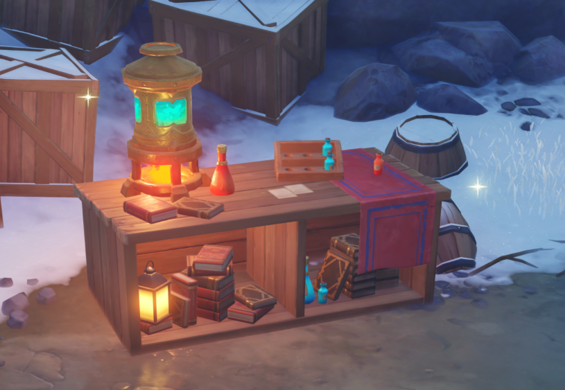
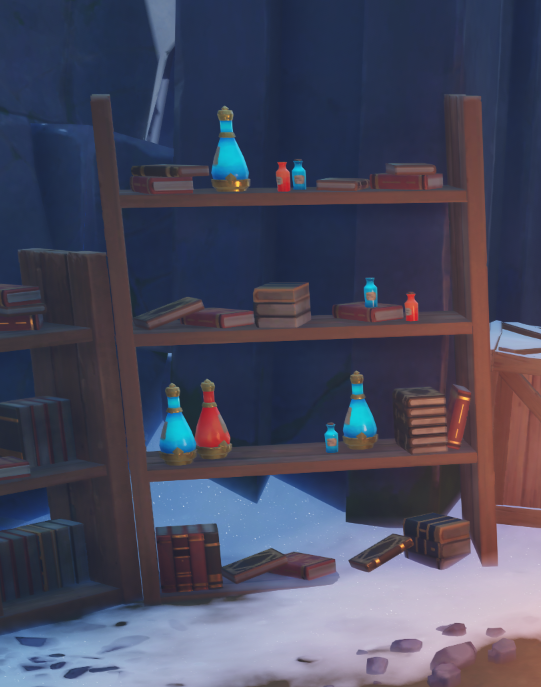

# Environment

# storyline

- phase1

  - 农田开始-》进入树林，找到工坊
  - 找到魔法书，根据配方修复
  - -----基本可以交差-----

- phase2

  - 修复工坊，解锁设备

- phase3

  - 更多的配方

  

# phase1

1: main map->树林，农田，河，etc，10种左右的可采集物品（实现导航到某种物品）

2: 工坊，炼金设备，etc

3：炼金流程

2月5号

2月7日晚上对一下

2月10号 status update

- 地图大致轮廓（zongyao）
  - 采集物品-》物品栏（尽量）
  - 采集物品集成
  - 寻路
- 工坊（树）
  - 大致轮廓
  - 寻路
- 核心逻辑
  - 合成 -> 合成表
  - 物品栏
  - scoreboard

- 宣传视频
- 

# 参考图片

