# VR Project Final Report 2022 Spring

**Course:** [**202201_Augmented and Virtual Reality_CSCI_6907_80**](https://blackboard.gwu.edu/webapps/blackboard/execute/courseMain?course_id=_367190_1) 

# *Alchemy Simulator*

**Chengshu Gao, Zhongyao Li, Ruojia Zhang** 

# Introduction

 This VR project development is developed using Unity which version is 2020.3.28f1 under the Windows11 platform. Our project uses Oculus Quest 2 as the development platform, it also uses unity to package the application to the development platform.

This is a 3D unity project with VR. This project is a 3D unity game project that was released as a VR app. In this game, we play as an alchemy apprentice. A boy/girl who accidentally found an ancient alchemy tome, full of ancient and mysterious alchemy recipes, in an abandoned atelier. Our journey to become the arch-alchemist begins here.

In this project, we use VRTK as a VR operation guide plug-in.

# VR Application Design

There are some factors that we need to consider as developers. 

The first thing is that the user who uses our project should be sitting/standing or they need some physical movement in the real world while they are playing. And finally, we think that playing in place is a better idea because the requirements for physical space are more relaxed and safer.

After we define the playing mode, in order for the user not to experience discomfort such as vertigo, it is a good choice to use teleportation as a way of moving. Moving by teleport to the pointer’s location can reduce the unwell feeling.

Having a wayfinding function is also an important factor for us to consider. The wayfinding function makes the user know what they may do and lead them to the destination. At the same time, the user should need to see the guideline to the destination.

As developers, we refer to traditional game genres to determine how our VR project is different from them, and whether it can use existing game genres for game design. It should be noted that some VR games, like Beat Saber, are not in the traditional genre. 

Compared with traditional projects, how to fully reflect the characteristics of VR games is the key to application design. So, our project should not be so complex, it should be easy and clear for the user to understand how they can experience our project.

For this project, the background story setting of the game should also be considered. As well as the goals of the game, and the settings of the basic environment. 

# Integration

## World map

**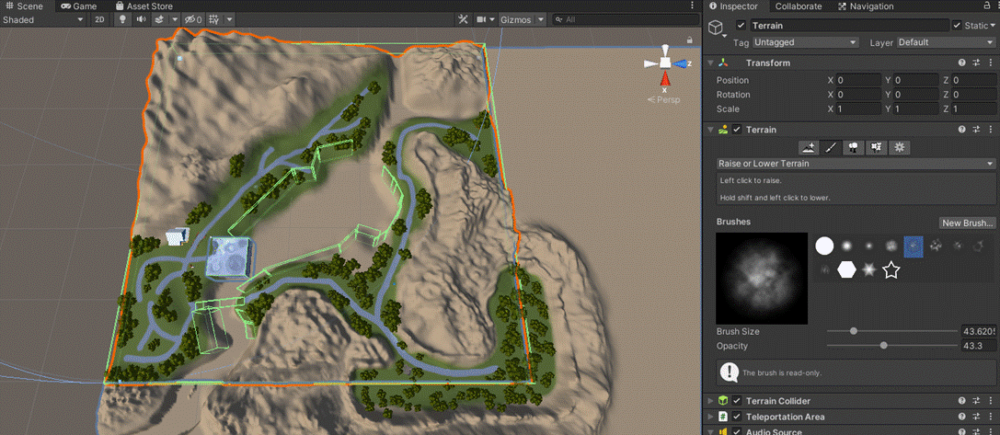**

Design the game terrain Design the size of the game field according to the needs. This range needs to be determined according to the type of game and the context of the game. It is important to note that this step does not require adding additional third-party assets. It can be done completely by using the functions that come with Unity.

The game land can be drawn manually through the built-in function of Unity. If a water surface needs to be placed, the entire surface needs to be raised upwards. In this project, the initial height of the game plane is set to 20.

Tutorial (https://blog.csdn.net/weixin_43411111/article/details/89068810)

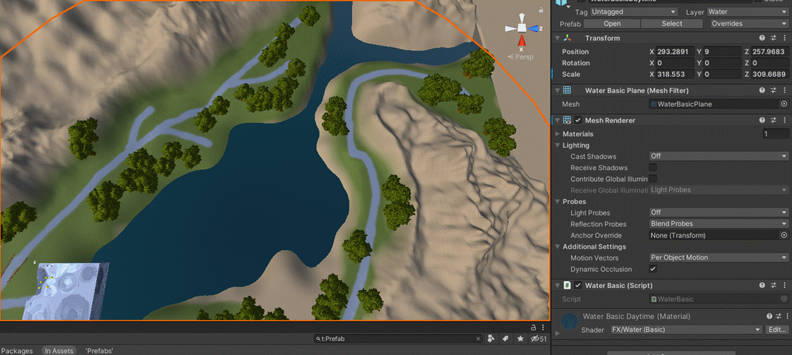

Add water to the game. This step uses the imported resource bundle. Water surfaces in most games are constructed using a textured surface, even large games. This is due to the fact that the computation of fluids is very resource intensive and almost impossible to apply in games.

Tutorial (https://m.html.cn/tools/photoshop/113132705300025.html)

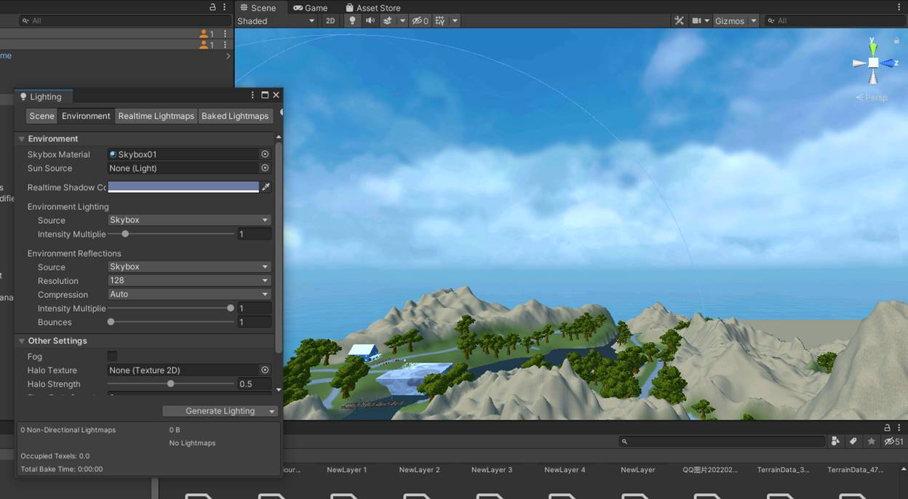

Design the game's skybox, the game's sky and can change the game's lighting angle and color. Types of sunlight can also be added via preset assets.

 

## VRTK

   VRTK (Link: https://www.vrtk.io/) is a collection of useful scripts and concepts to aid building VR solutions rapidly and easily in Unity3d 5+. It covers a number of common solutions such as:

●    Locomotion within virtual space.

●    Interactions like touching, grabbing and using objects

●    Interacting with Unity3d UI elements through pointers or touch.

●    Body physics within virtual space.

●    2D and 3D controls like buttons, levers, doors, drawers, etc.

●    And much more…

​    

​    Use the vrtk component to complete the VR operation settings. VRTK provides character movement and camera control functions. It can support the operation of Oculus Quest2 very well.

​    In this project, we use VRTK Tilia, a collection of packages providing useful features for the development of spatial solutions. By adding the TiliaPrefabs to our project, we can easily implement the operation needed. 

For example, we can use the UnityXRPluginFramework in TiliaPrefabs as our player, which includes the main function of player control. When the user opens this project, he/she will be located at the same position of CaremaOffset->HeadCarema and can use the controller as their hands in game. 

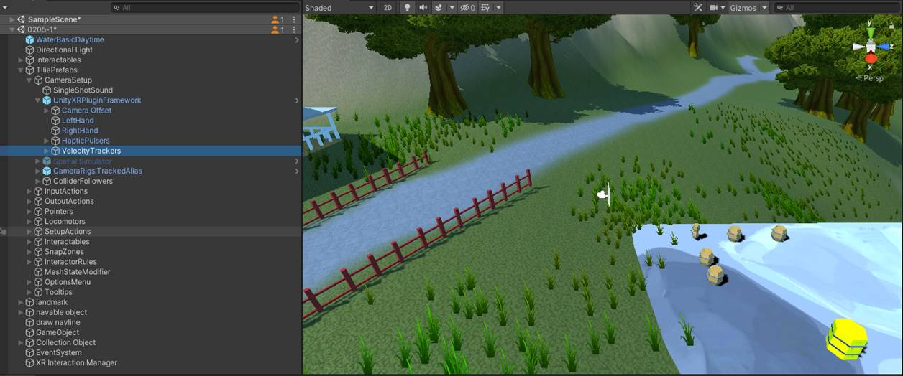

 

## Wayfinding

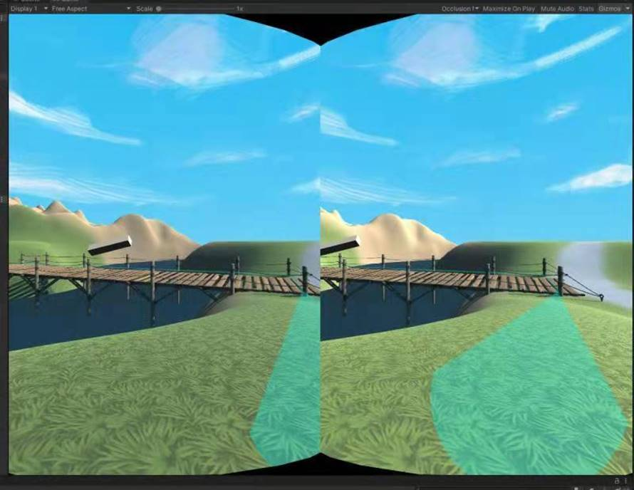

The wayfinding function is one feature of this project. 

Usually, the "NavMesh'' area consists of several terrains which generate navmesh from unity. Within the NavMesh, unity can automatically generate the optimal path from target to player. However, we also need to show the path to our user as the “guideline”.

So, in this project, we use a “line renderer” to record the optimal path, and then we use an object with the “draw navline” script to show the path.

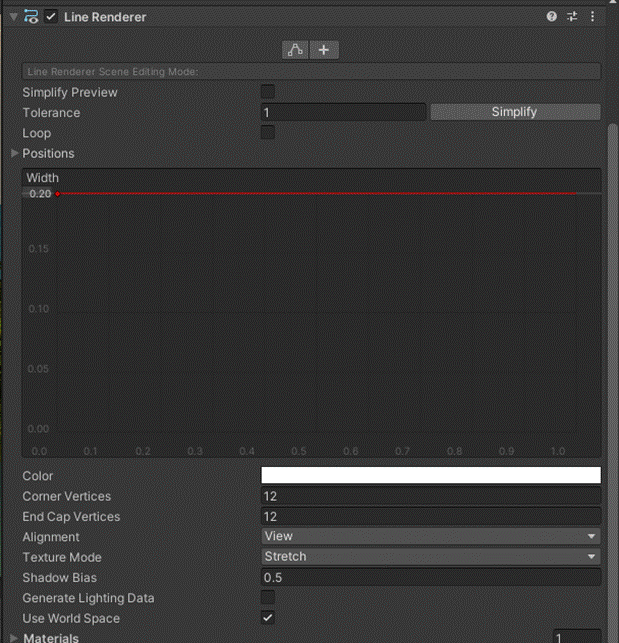

Tutorial (https://docs.unity3d.com/ScriptReference/AI.NavMesh.CalculatePath.html)

### Core C# code for navigation

```C#
elapsed += Time.deltaTime;
if (elapsed > 1.0f)
{
    elapsed -= 1.0f;
    NavMesh.CalculatePath(Player.position, target.position, NavMesh.AllAreas, path);
    Path.positionCount = path.corners.Length;

    for (int i = 0; i < path.corners.Length; i++)
    {
        Path.SetPosition(i, path.corners[i] + Vector3.up * PathHeightOffset);
    }
}
```


 

## Minimap

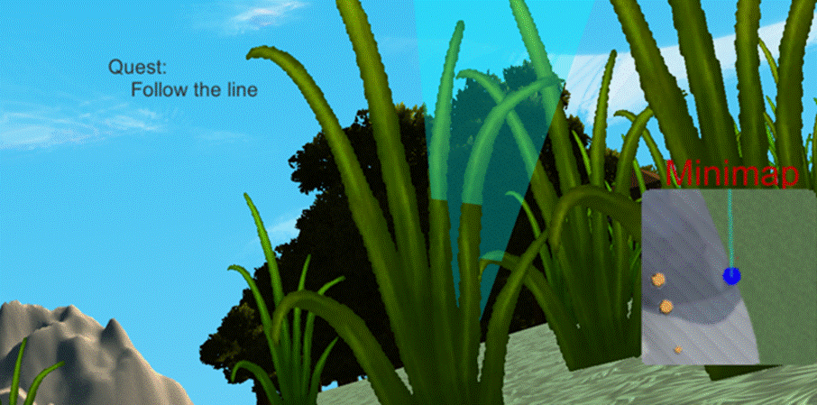

In a game world with exploration elements, sometimes users will need minimap to help them determine where they are now. The minimap can display the real-time location of the character and other things nearby the user.

To build the minimap, we need an extra camera that can follow the user when the character is moving in the game world. And use script to update the location of the carema to keep the user character always in the center of the minimap.

### Core C# code for minimap rotation

```C#
void LateUpdate()
    {
        Vector3 playerPosition = Player.position;

        playerPosition.y = transform.position.y;
        transform.position = playerPosition;
        float yRotation = Player.eulerAngles.y;
        transform.eulerAngles = new Vector3( transform.eulerAngles.x, yRotation, transform.eulerAngles.z );
    }
```

## Book

The magic book is one of the core systems in this project. It will be a guilder to tell how our user can move to the next stage of this project. The book will lead our user to destinations like different places in the game world. 

The magic book will be the “bag” of users in this project too. The book has the script to record some user’s interactions to implement the bag function. When the player's mission is collecting some required items, the book will be able to interact with the player such as count the number of mushrooms that the user has already collected.

When the player completes the mission in the current stage successfully, the game will move to the next stage that is implemented by our customized script.

The Book will change location with the game proceed and play audio guidance to the user.

### Core C# code for book logic

```C#
if (Score.stage == 0){
            stage0Elapsed+= Time.deltaTime;
            if (stage0Elapsed > 10.0f){
                audioSource.PlayOneShot(findMe,1.0f);
                stage0Elapsed = -20.0f;
            }
        }
        if (Score.stage == 1){
            if (stage1Elapsed == 0.0f){
                audioSource.PlayOneShot(foundMe,1.0f);
            }
            stage1Elapsed+= Time.deltaTime;
            
            if (stage1Elapsed > 15.0f){
                transform.position = alteriaPoint;
            }
        }
        if (Score.stage == 2){
            if (stage2Elapsed == 0.0f){
                audioSource.PlayOneShot(youAgain,1.0f);
            }
            stage2Elapsed+= Time.deltaTime;
            if (stage2Elapsed > 15.0f){
                transform.position = flowerPoint;
                if (stage2Elapsed > 45.0f){
                    audioSource.PlayOneShot(pickFlower,1.0f);
                    stage2Elapsed = 16.0f;
                }
            }
        }
        if (Score.stage == 3){
            stage3Elapsed+= Time.deltaTime;
            transform.position = mushroomPoint;
            if (stage3Elapsed > 15.0f){
                if (stage3Elapsed > 45.0f){
                    audioSource.PlayOneShot(pickMushroom,1.0f);
                    stage2Elapsed = 16.0f;
                }
            }
        }
```


 

## User experience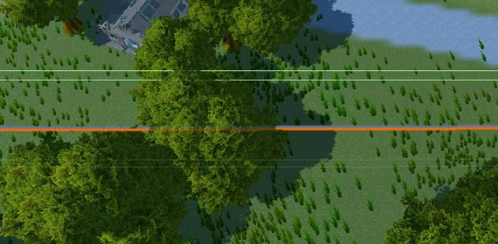

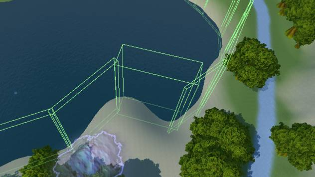

 

### Basics

By setting up hidden walls, make sure that characters don't get into places they shouldn't. For example, to ensure that the characters do not fall to the outside of the map, and to ensure that the characters do not move to the bottom of the lake.

### Audio Guidance

Music is also an important part of games, and music has been around since the simplest games decades ago. Choosing the right music can make players more engaged in the game. Added the game's background music to ensure that the game music is consistent with the game theme.

### Locomotion

The user can move through the handle transmission, ensuring that the user can play the game in one place, and the player does not need to physically move during the game.

This project uses Teleportation Based as the Locomotion method. This is a discontinuous movement method. The character will be teleported to the location specified by the controller. By modifying the teleportation of the character's movement to a parabola, it is ensured that the character is teleported to a position far away.

### Minimap

Since VR games are first-person games, it is difficult for players to confirm their position. So we added a minimap to show the player's location.

### Scoreboard

We also provided a scoreboard to record different types of user activities. 

Such as

- distance traveled
- total jumps
- time spent
- different  object collected

And the object collected is also a key trigger to proceed into later part of the story.

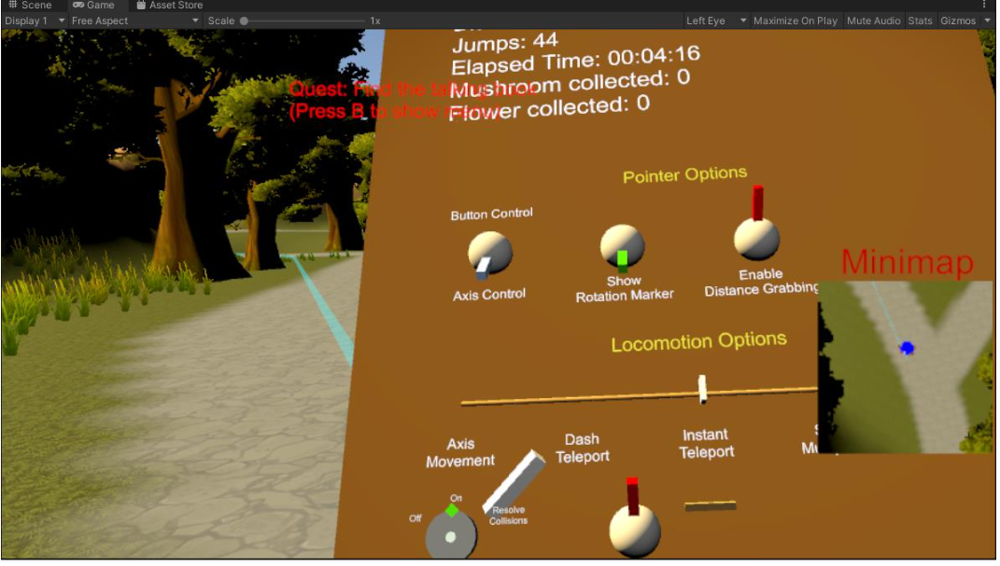

#### Core C# code for score board

```C#
TimeSpan interval = DateTime.Now - startTime;
string msg = String.Format("Elapsed Time: {0:hh\\:mm\\:ss}",interval);
textDisplay.text = "Distance Traveled: " + Score.distance + "\n" + "Jumps: " + Score.jumps +"\n" + msg +"\n" +"Mushroom collected: " + Score.mushroom +"\nFlower collected: "+Score.flower;
```

We basicly just defined all the varibles needed for the scoreboard here and they are updated seperatly in the other script and triggers.

### 6Ds movement

This is achieved by adding tracking information to the main camera.

### Interactive

The interaction to the real world object is achieved by VRTK, It has several different predifined method to convert a simple mesh into interactable object.

And We'll need to add a rigidbody and a collision mesh to it.

For collectable items. A collision box is setted around the magic book as a tirgger. As the objects with certain tags hits the trigger box, the trigger will add point to the scoreboard and distory the original object.

#### Core C# code for item collection

```c#
if(other.gameObject.CompareTag("flower")){
    audioSource.PlayOneShot(impact,0.7f);
    Score.flower++;
    other.gameObject.SetActive(false);
}
if(other.gameObject.CompareTag("mushroom")){
    audioSource.PlayOneShot(impact,0.7f);
    Score.mushroom++;
    other.gameObject.SetActive(false);
}
```


## User Guideline

After Build in Unity, an apk file will be generated. Then we need to install it to the Oculus Quest 2 device.

The SideQuest software is required to install the self-made apk file. Download and set the side quest software. Use a USB cable to connect your VR headset to the computer and there will show an OQ2 device in the SideQuest.

****

 

In SideQuest on your computer, you should now see a green dot in the upper left corner. This means your VR headset is connected.

**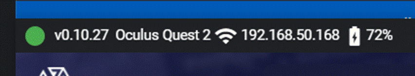**

In the upper right corner of SideQuest, you'll find the "Install APK file from a folder on your computer" button. Click this button.

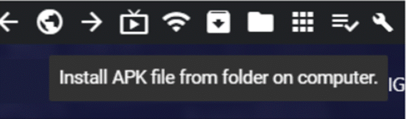

 

Tutorial (https://vr-junkies.com/en/install-apk-files-on-oculus-quest-2/)

## Conclusions

Drawing the navigation lines successfully was one of the hardest parts of this project. Navigation in most games is the AI that guides the movement of objects. After selecting the destination, the object can be moved to the specified location. The Navigation in this project only shows a guide path, and the moving part needs to be operated by the player. This requires writing Script to modify the function.

Navmesh is automatically baked in Unity, It can only be automatically generated according to the terrain and cannot be modified manually. So it's hard to limit the movement of characters to places where they shouldn't move, such as in the water. In this regard, we use the invisible wall method to plan the movement area of the characters. At the same time, our project also has a minimap to show our user’s location, which can help our user to find where he/she is.

The backpack system is a system that needs improvement. Backpacking in VR is harder than you think. The backpack is a virtual space in traditional games, and the deposit and withdrawal of items are more similar to generating or disappearing in the hand. But a backpack in a VR game is more like a panel for storing items. Putting in and taking out items needs to set up a special grid and interact through the handle. The current backpack system is not perfect for this project.

​    Currently, the backpack system of this project will be undertaken by our Magic Book, and the player will complete the collection of the corresponding items by putting items into the Magic Book through the controller. When our user presses the “B” button on the controller, the scoreboard will show the items that user has collected.

The ability to interact between items has not yet been implemented, such as placing items in pots for refining, and the manipulation of related equipment and test tubes. Because the construction of related projects takes a lot of time to make the detection and interaction of the model. So far we do not have time to complete so much work at the moment. But it is still available in the future.

## Suggestions for further improvements

​	The character model needed to be added in this project in the future. The current VR character does not have a model, which could make our user feel strange. Adding a model can make the character more visual for VR games and give players a better gaming experience. It will also be convenient to set the height and position of the camera. 

​	In the beginning of the project, I have an ambitious plan of building an entire alchemy system in the game. But after I tried out some effects using particles system and tirggers, I found that the interactions I can achieve with my current level of unity is not fun enough. So this part is being delayed and not being integrated in the end. If we had more time and more workforce. This part will definatly be a game system of great fun.

## Appendix I: Lessons Learned

- The first thing I've learnt is the unity development, I have a huge curiosity towards game development in the past. And as I'm learning to develop in unity, I found the way that game engine is designed is quite smart. I can use some simple C# code to control the whole game progress and add different effects using the particle system.
- The second thing I've lerant is that the trigger system is the key part of game control. I have setup the entire game progress using trigger system and it works really well.
- The third thing is that VR design is really quiet different comparing to conventional games, like we don't use in game GUI menu, rather, we are suggested to use the real world object to create the GUI for user.


## Appendix 2: Feedback to the instructor

-  It's a great oppptunity for me to learn VR in GWU, I have a great time designing and developing my game. And the result is quiet satisfying. 
- Basic Roles in game development
  - Roger Zhang: Game system, Audio, Navigation, Promo video.
  - Chengshu Gao: Mini map, Aterlia.
  - Zhongyao Li: Map Development, Navmesh baking.

