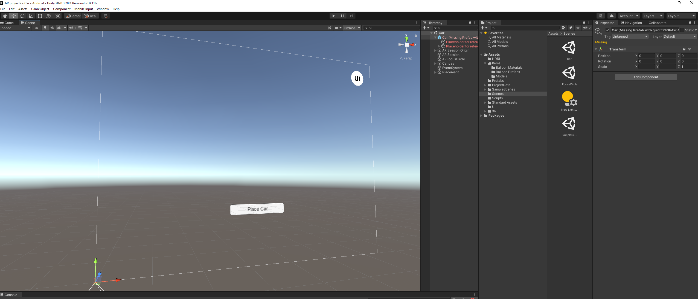

# “F1 crew” by “Ruojia Zhang”

- G30524507

- CS6907 2022 Spring

- April 14th 2022

# Design Overview

- Detailed final AR app features once it is completed.
  - The basic concept of this app is to simulate the crew member in a formula 1 racing event. 
  - When game starts, player will place the track onto the ground, then cars will come into service area and request tire changing or basic part replacement.
  - Player will need to move around and use touching to remove the old tire and assemble the new ones, and can also pick the color of tire upon exchange.
- What has changed in your AR design goals, based on the feedback you received, or the experience you had so far? 
  - Simplified the whole concept so it could be finished in less than two weeks.

# **Implementation Status:**

1. Screenshots from your development environment showing implementation progress. Provide a brief explanation on what is achieved.

   1. Currently I've setup the environment and the placement of the AR virtual environment, the game logic is still in development
   2. 

2. Screenshots and/or video capture from your mobile AR app showing implementation progress. Provide short comments on what is working, what is a mock-up, and what you are trying to resolve. 

   1. mobile app is not currently available for game logic and code are still in development
   2. Working on Car automatic driving logic, item substitution logic and auto-highlight the target item
   3. I'm trying to solve some issue when user has not enough space for walking around to fix the car.

3. Code/script you developed or included (specify source) with a short description of its purpose. *Provide code/script in text format, not a screenshot.*

   ```c#
   public class ARObject : MonoBehaviour
   {
       public ARSessionOrigin ar_session_origin;
       public List<ARRaycastHit> raycastHits = new List<ARRaycastHit>();
       public GameObject cube;
       GameObject instantiatedCube;
       // Start is called before the first frame update
       void Start()
       {
           
       }
   
       // Update is called once per frame
       void Update()
       {
           // detect user touch
           if(Input.GetMouseButton(0)){
               bool collision = ar_session_origin.GetComponent<ARRaycastManager>().Raycast(Input.mousePosition, raycastHits, UnityEngine.XR.ARSubsystems.TrackableType.PlaneWithinPolygon);
               if(collision){
                   if (instantiatedCube == null){
                       instantiatedCube = Instantiate(cube);
                       foreach(var plane in ar_session_origin.GetComponent<ARPlaneManager>().trackables){
                           plane.gameObject.SetActive(false);
                       }
                       ar_session_origin.GetComponent<ARPlaneManager>().enabled = false;
                   }
                   
                   instantiatedCube.transform.position = raycastHits[0].pose.position;
               }
           }
           // project a ray cast
           // instantiate a virtual cube 
       }
   }
   ```

   The code above is for generating the virtual environment using the raycast from the screen center to the ground.

