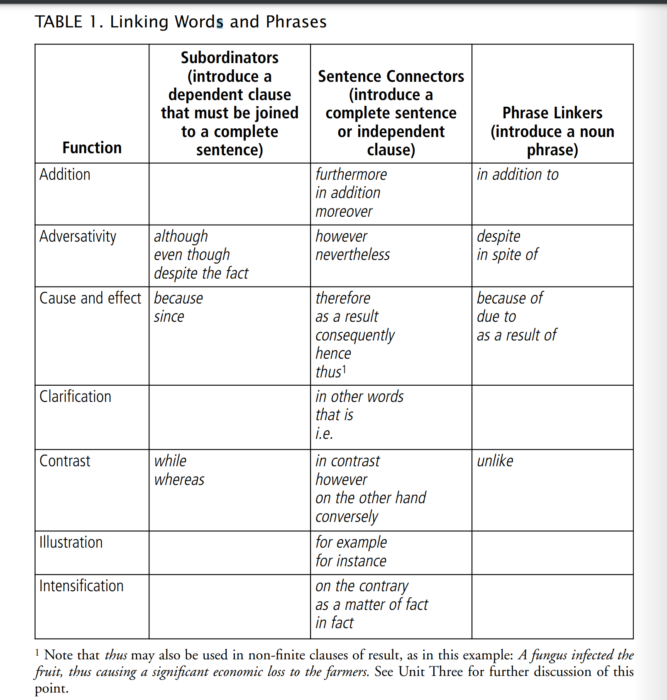

## Task 16

- subject of each sentence
  - it
  - the worker
- theory
  - begin sentence with old info/theme/topic and bring up new info/rheme/comment

## writing  paragraphs

- decide what is the old information
- make rheme of old sentence the theme of new sentence(use syn words)
  - ​	EXERCISE7
    - not maintaining -> cost more
    - a study ->cost
    - not fixing -> cost live
    - not maintain -> stall out
    - safe car -> maintain 
  - better one
    - not maintain -> cost much
    - not maintain -> cost ++
    - not maintain -> death,
    - not maintain -> xx
    - save life -> maintain

## see linking word chart at page 38

## Write Exercise on paragraph 2,3

